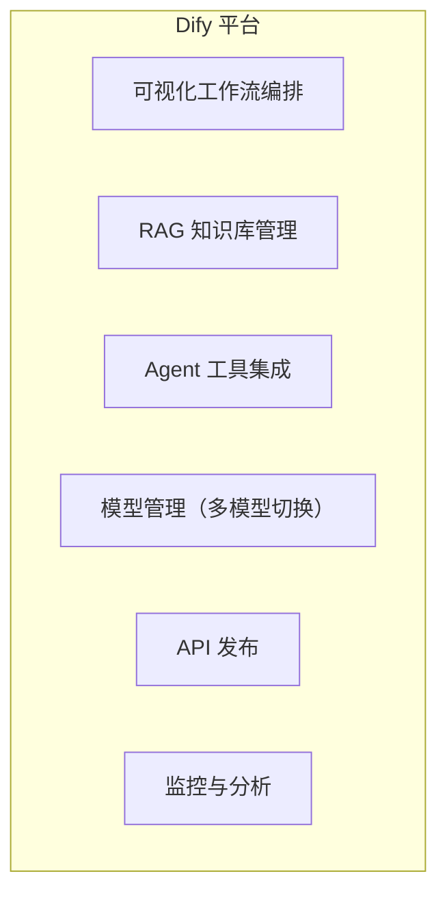

# AI 低代码平台对比

> **创建日期：** 2026-06-06
> **前置知识：** RAG、Agent、Prompt Engineering

---

## 一、三大低代码平台定位

| 平台 | 定位 | 核心用户 | 开源 |
|------|------|----------|------|
| **Dify** | 企业级 AI 应用开发平台 | 开发者/企业 | ✅ 开源 |
| **Coze（扣子）** | 字节跳动 AI Bot 开发平台 | 个人/企业 | ❌ 闭源 |
| **FastGPT** | 知识库问答平台 | 中小企业 | ✅ 开源 |

---

## 二、Dify 详解

### 核心能力

| 特性 | 说明 |
|------|------|
| **工作流** | 可视化编排 Chain/Agent，支持条件分支、循环 |
| **知识库** | 文档上传 → 自动分块 → Embedding → 向量检索 |
| **模型管理** | 支持 OpenAI、Claude、本地模型等 |
| **插件市场** | 丰富的工具和插件 |
| **API 发布** | 一键发布为 REST API |
| **私有化部署** | Docker Compose 一键部署 |

### 适用场景

- 企业内部知识库问答
- 客服机器人
- 数据分析助手
- 快速 AI 原型验证

---

## 三、Coze（扣子）详解

| 特性 | 说明 |
|------|------|
| **Bot 商店** | 丰富的预置 Bot 模板 |
| **插件生态** | 字节系深度集成（飞书、抖音） |
| **工作流** | 可视化编排 |
| **知识库** | 支持文档上传和检索 |
| **多平台发布** | 飞书、微信、Web 等 |

### 适用场景

- 飞书/抖音生态内的 AI 应用
- 个人 AI 助手快速搭建
- 社交媒体自动化

---

## 四、三平台对比

| 维度 | Dify | Coze（扣子） | FastGPT |
|------|------|-------------|---------|
| **开源性** | ✅ 开源 | ❌ 闭源 | ✅ 开源 |
| **私有化部署** | ✅ 支持 | ❌ 不支持 | ✅ 支持 |
| **工作流编排** | ⭐⭐⭐⭐⭐ | ⭐⭐⭐⭐ | ⭐⭐⭐ |
| **知识库管理** | ⭐⭐⭐⭐⭐ | ⭐⭐⭐ | ⭐⭐⭐⭐ |
| **插件生态** | ⭐⭐⭐⭐ | ⭐⭐⭐⭐⭐ | ⭐⭐⭐ |
| **企业级功能** | ⭐⭐⭐⭐⭐ | ⭐⭐⭐ | ⭐⭐⭐ |
| **价格** | 社区版免费 | 基础免费 | 开源免费 |
| **学习曲线** | 中等 | 低 | 低 |

---

## 五、选型建议

| 场景 | 推荐 |
|------|------|
| 企业内部应用、数据安全优先 | **Dify**（私有化部署） |
| 飞书/抖音生态、快速原型 | **Coze（扣子）** |
| 纯知识库问答、简单需求 | **FastGPT**（轻量级） |
| 需要深度定制 | **自研**（LangChain/LangGraph） |

---

## 面试高频题

### Q1: Dify、Coze、FastGPT 的核心区别是什么？如何根据需求选型？
**详细答案：** 三者的核心差异在于定位、开放性和生态。Dify 定位为"企业级 AI 应用开发平台"，核心优势是开源 + 私有化部署 + 强大的工作流编排，适合有数据安全要求、需要深度定制的企业场景。Coze（扣子）定位为"AI Bot 开发平台"，优势在于字节跳动生态深度集成（飞书、抖音、豆包等）和丰富的插件市场，适合个人开发者快速搭建和字节生态内的企业。FastGPT 定位为"知识库问答平台"，核心专注 RAG 知识库场景，在文档解析、向量检索、知识库管理方面做得细致，但工作流和 Agent 能力相对较弱。

选型决策可以从三个维度考量：(1) **数据安全**：如果需要私有化部署、数据不出企业内网，Dify 和 FastGPT 是仅有的选择（两者都开源），Coze 是纯 SaaS 服务，数据存储在字节云端。(2) **功能复杂度**：如果需要复杂的多步骤工作流、条件分支、多 Agent 协作、多模型切换，Dify 的能力最强；如果只是"上传文档 + 问答"的简单知识库场景，FastGPT 更轻量易用；如果目标是快速接入飞书/抖音生态，Coze 是不二之选。(3) **技术团队**：有开发团队且需要深度定制 → Dify（通过 API + 插件 + 二次开发）；无开发团队或需要极低门槛 → Coze 或 FastGPT。

一个常见的误区是认为低代码平台能解决所有问题。实际上，三者都有明确的能力边界：当需求超出平台预设的模板和组件时，定制成本会急剧上升，此时自研（LangChain/LangGraph）可能是更合理的选择。建议在选型前先用最小可行产品（MVP）验证核心需求是否在平台能力范围内。

### Q2: AI 低代码平台适合什么场景？什么时候应该选择自研而不是低代码？
**详细答案：** AI 低代码平台最适合三类场景：(1) **标准化 AI 应用**：知识库问答、客服机器人、数据分析助手等需求模式固定的场景，平台提供了成熟的模板和组件，可以在一小时内从零搭建出可用原型。(2) **快速验证阶段**：在项目早期，需要快速验证 AI 方案是否可行、用户是否接受，低代码平台可以在极短时间内产出可交互的 MVP，大幅降低试错成本。(3) **非技术团队主导**：业务团队（运营、产品、市场）有 AI 应用需求但无开发资源，低代码平台的可视化界面让非技术人员也能搭建 AI 应用。

然而，以下场景应果断选择自研：(1) **高度定制的工作流**：当业务流程涉及复杂的条件判断、循环、多步骤状态管理、与内部系统深度集成时，低代码平台的可视化编排可能成为瓶颈，而代码（LangChain/LangGraph）可以精确控制每一步逻辑。(2) **性能敏感场景**：低代码平台在编排层有额外的抽象开销，对于高并发、低延迟的生产环境，自研可以更精细地优化性能。(3) **核心业务逻辑**：如果 AI 能力是产品的核心竞争力，长期依赖低代码平台会带来供应商锁定风险，且平台的功能迭代节奏不一定与业务需求同步。(4) **多模态复杂处理**：涉及图像识别、语音合成、视频分析等非纯文本场景，当前低代码平台的支持还比较有限，自研更灵活。

最佳实践是"渐进式"策略：初期用低代码平台快速验证，验证通过后，对核心模块逐步用自研替代，非核心模块（如内部知识库）保留在低代码平台。这样既享受了快速验证的红利，又避免了长期被平台锁定的风险。

### Q3: Dify 的工作流编排能力如何？和 LangChain/LangGraph 的区别是什么？
**详细答案：** Dify 的工作流编排采用可视化 DSL（领域特定语言），通过拖拽节点和连线来定义 AI 应用的处理流程。它支持多种节点类型：LLM 调用节点、知识库检索节点、代码执行节点（Python/JS）、HTTP 请求节点、条件分支节点、循环节点、变量赋值节点等。Dify 工作流的优势在于：(1) 可视化编排降低了 AI 应用开发门槛，非开发人员也能参与；(2) 内置了 RAG、Agent、多模型切换等常见模式，开箱即用；(3) 一键发布为 API，自动生成调用文档和 SDK。

但 Dify 工作流与 LangChain/LangGraph 有本质区别。LangChain 是代码层面的框架，提供了 Chain、Agent、Tool 等抽象，开发者通过编写 Python 代码精确控制每一步逻辑，可以实现任意复杂的流程。LangGraph 进一步将 AI 工作流建模为有状态图（StateGraph），支持条件边、循环、人机交互（Human-in-the-Loop）、动态路由等高级模式。相比 Dify 的固定节点类型，LangGraph 的表达能力是图灵完备的——你可以实现任何算法逻辑，而 Dify 受限于其预设的节点类型和编排模型。

从实际选型来看，Dify 工作流适合 80% 的常见 AI 应用场景（知识问答、客服、简单 Agent），LangGraph 适合那 20% 需要高度定制化流程的场景（多 Agent 协作、复杂推理链、需要精细状态管理的场景）。两者的关系类似于"低代码平台 vs 编程框架"——Dify 降低门槛但牺牲灵活性，LangGraph 保持灵活性但需要编码能力。在实际项目中，也可以混合使用：Dify 做快速原型和内部工具，LangGraph 做核心业务逻辑。

### Q4: Dify 的知识库 RAG 实现原理是什么？有哪些优化手段？
**详细答案：** Dify 的知识库 RAG 实现遵循标准的 RAG 管道（Retrieval-Augmented Generation），但在工程化方面做了大量优化。其核心流程为：(1) **文档上传**：支持 PDF、Word、TXT、Markdown、网页等多种格式；(2) **文档解析**：使用多种解析器（如 Unstructured、PyPDF）提取文本，保留段落结构和表格信息；(3) **文本分块**：支持多种分块策略（固定长度、按段落、按语义），并支持自定义分块大小和重叠量；(4) **向量化**：调用 Embedding 模型（如 text-embedding-3-small、bge-large-zh）将文本块转为向量；(5) **向量存储**：支持多种向量数据库（Qdrant、Weaviate、Milvus、PgVector 等）；(6) **检索**：支持混合检索（向量检索 + 关键词检索），通过 Rerank 模型对检索结果重排序，提升相关性。

Dify 的 RAG 优化手段值得关注：(1) **多路召回**：同时使用向量检索和 BM25 关键词检索，融合两种召回结果，弥补向量检索对精确关键词匹配的不足。(2) **Rerank 重排序**：使用专门的 Rerank 模型（如 Cohere Rerank、bge-reranker）对初筛结果重新排序，大幅提升 Top-K 结果的准确性。(3) **分段策略优化**：支持父子分段（Parent-Child Chunk）模式——用小段落做检索（提高召回精度），用大段落做上下文（保留完整语义），在召回率和上下文完整性之间取得平衡。(4) **元数据过滤**：支持按文档来源、上传时间、标签等元数据过滤检索结果，提升精准度。

在实际项目中，优化 Dify 知识库效果的关键是：(1) 选择合适的分块策略——中文内容建议 500-800 tokens 块大小，50-100 tokens 重叠；(2) 使用中文优化的 Embedding 模型（如 bge-large-zh-v1.5）；(3) 开启 Rerank 提升检索精度；(4) 定期评估知识库的召回率和准确率，根据实际问答效果调整参数。

### Q5: Coze（扣子）的插件生态有什么优势？与字节系产品的深度集成意味着什么？
**详细答案：** Coze 的插件生态是其最大的差异化优势。Coze 提供了数百个预置插件，涵盖搜索（必应搜索、Google 搜索）、办公（飞书文档、飞书表格）、内容生成（图片生成、视频生成）、社交媒体（微信公众号、抖音）、工具类（代码执行器、网页抓取）等。相比 Dify 的插件市场，Coze 的插件数量更多、更新更快，且与字节系产品（飞书、抖音、豆包、火山引擎）深度打通，形成了独特的生态壁垒。开发者还可以通过 Coze 的插件开发框架快速创建自定义插件，发布到插件市场供其他用户使用。

与字节系产品的深度集成意味着：(1) **飞书集成**：Coze Bot 可以直接发布到飞书群聊、飞书机器人，自动处理飞书消息、访问飞书文档和表格，实现企业内部 AI 助手与办公协作的无缝融合。(2) **抖音/豆包集成**：Coze Bot 可以发布到抖音私信、豆包 App，实现 AI 客服、内容创作助手等消费者端应用。(3) **火山引擎**：底层模型服务由火山引擎提供，包括豆包系列模型（Doubao-pro）和第三方模型的分发，推理性能有保障。(4) **数据闭环**：通过飞书/抖音的用户反馈数据，可以持续优化 Bot 的对话质量和业务效果。

然而，Coze 的闭源性和字节生态绑定也带来了风险：(1) 代码和数据完全托管在字节云端，无法私有化部署，不适合数据安全要求高的场景；(2) 平台策略调整可能影响功能可用性和定价；(3) 如果未来需要迁移到其他平台，迁移成本较高。因此，选择 Coze 时建议评估：项目是否与字节生态强相关？数据安全要求是否允许云端托管？是否接受供应商锁定风险？