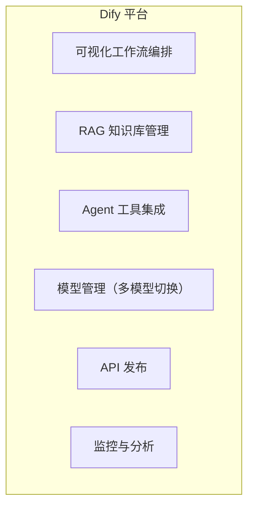

# AI 低代码平台对比

> **创建日期：** 2026-06-06
> **前置知识：** RAG、Agent、Prompt Engineering

---

## 一、三大低代码平台定位

| 平台 | 定位 | 核心用户 | 开源 |
|------|------|----------|------|
| **Dify** | 企业级 AI 应用开发平台 | 开发者/企业 | ✅ 开源 |
| **Coze（扣子）** | 字节跳动 AI Bot 开发平台 | 个人/企业 | ❌ 闭源 |
| **FastGPT** | 知识库问答平台 | 中小企业 | ✅ 开源 |

---

## 二、Dify 详解

### 核心能力

| 特性 | 说明 |
|------|------|
| **工作流** | 可视化编排 Chain/Agent，支持条件分支、循环 |
| **知识库** | 文档上传 → 自动分块 → Embedding → 向量检索 |
| **模型管理** | 支持 OpenAI、Claude、本地模型等 |
| **插件市场** | 丰富的工具和插件 |
| **API 发布** | 一键发布为 REST API |
| **私有化部署** | Docker Compose 一键部署 |

### 适用场景

- 企业内部知识库问答
- 客服机器人
- 数据分析助手
- 快速 AI 原型验证

---

## 三、Coze（扣子）详解

| 特性 | 说明 |
|------|------|
| **Bot 商店** | 丰富的预置 Bot 模板 |
| **插件生态** | 字节系深度集成（飞书、抖音） |
| **工作流** | 可视化编排 |
| **知识库** | 支持文档上传和检索 |
| **多平台发布** | 飞书、微信、Web 等 |

### 适用场景

- 飞书/抖音生态内的 AI 应用
- 个人 AI 助手快速搭建
- 社交媒体自动化

---

## 四、三平台对比

| 维度 | Dify | Coze（扣子） | FastGPT |
|------|------|-------------|---------|
| **开源性** | ✅ 开源 | ❌ 闭源 | ✅ 开源 |
| **私有化部署** | ✅ 支持 | ❌ 不支持 | ✅ 支持 |
| **工作流编排** | ⭐⭐⭐⭐⭐ | ⭐⭐⭐⭐ | ⭐⭐⭐ |
| **知识库管理** | ⭐⭐⭐⭐⭐ | ⭐⭐⭐ | ⭐⭐⭐⭐ |
| **插件生态** | ⭐⭐⭐⭐ | ⭐⭐⭐⭐⭐ | ⭐⭐⭐ |
| **企业级功能** | ⭐⭐⭐⭐⭐ | ⭐⭐⭐ | ⭐⭐⭐ |
| **价格** | 社区版免费 | 基础免费 | 开源免费 |
| **学习曲线** | 中等 | 低 | 低 |

---

## 五、选型建议

| 场景 | 推荐 |
|------|------|
| 企业内部应用、数据安全优先 | **Dify**（私有化部署） |
| 飞书/抖音生态、快速原型 | **Coze（扣子）** |
| 纯知识库问答、简单需求 | **FastGPT**（轻量级） |
| 需要深度定制 | **自研**（LangChain/LangGraph） |

---

## 面试高频题

### Q1: Dify、Coze、FastGPT 的核心区别是什么？如何根据需求选型？
**详细答案：** 我们项目三个都摸过，说实话定位差别挺大的。Dify 是给开发者用的企业级平台——我们用它搭了一个内部客服知识库，三天从零到上线，工作流拖拽式编排对后端来说学习成本很低。最大的爽点是私有化部署，Docker Compose 一行命令就起来了，数据全在公司服务器上，安全合规没问题。但 Dify 的工作流节点有限制，遇到复杂的条件分支有时候得绕好大一圈才能实现。

Coze 我们在飞书集成场景用过，主要是运营团队在用。它跟飞书的打通确实丝滑——Bot 发布到飞书群聊就几分钟的事，插件市场里直接能搜到飞书文档查询、飞书表格操作的插件。但 Coze 是纯 SaaS，数据在字节云端，我们后来因为有客户数据合规要求没法继续用了。FastGPT 我们只在最早期评估过，它专注知识库问答这一个场景，做得挺扎实，但一旦需求扩展到"知识库+多轮对话+工单系统联动"这种稍微复杂点的场景，FastGPT 就吃力了。选型规律很简单：要私有化+强工作流能力就 Dify；跟飞书/抖音深度绑定的场景才考虑 Coze；纯简单的文档问答用 FastGPT 够用。

### Q2: AI 低代码平台适合什么场景？什么时候应该选择自研而不是低代码？
**详细答案：** 我们项目是典型的"先用低代码，再部分自研"的路子。初期用 Dify 搭了一个客服知识库，两天就上线了，运营那边看到能用的东西很快，反馈也积极。这个阶段是低代码最爽的地方——极速验证。但当用户量从测试的 20 个内部同事涨到正式上线后的 200 个客服同时用，问题就来了：Dify 的工作流调度延迟开始变大，一个复杂查询（先搜知识库、再调 LLM、再走条件分支）P99 飙到了 8 秒，用户体验直接崩了。

后来我们把核心链路（检索 + LLM 推理 + 格式化输出）抽出来用 LangGraph 重写了，延迟压到了 2 秒以内。但非核心模块（内部文档管理后台、Bot 发布配置）还是留着 Dify，团队里不写代码的运营同事能自己更新知识库。所以我的经验是：快速验证用低代码没毛病，但一旦上了生产、有性能要求、或者业务流程低代码平台绕不过去的时候，果断自研。关键是识别边界点——需求超没超过平台预设的模板能力。

### Q3: Dify 的工作流编排能力如何？和 LangChain/LangGraph 的区别是什么？
**详细答案：** Dify 工作流是可视化拖拽式的，节点类型挺全的——LLM 调用、知识库检索、代码执行、HTTP 请求、条件分支、循环都有。我们初期用它搭流程确实快，但有几个痛点。一是节点之间的数据传递只能靠变量引用，复杂场景下一个节点输出要给多个下游用的时候变量名容易搞混，没有 IDE 的自动补全和类型检查，调 bug 全靠肉眼。二是循环节点的迭代次数有限制，我们有个"对搜索结果逐条打分"的需求，Dify 循环节点最多迭代 50 次，数据多了就截断了。

LangGraph 完全是另一个思路——用有状态图建模，你可以用代码精确控制图的每个节点和每条边，支持条件路由、动态路由、Human-in-the-Loop 这些高级能力。我们迁到 LangGraph 后发现表达能力强太多了，但也意味着你得自己处理状态管理、错误恢复、并发这些事。说实话，80% 的常规流程 Dify 够用，但那 20% 的复杂场景——比如多 Agent 互相调用、动态路由根据中间结果选择不同策略——Dify 的表达能力就不够了，LangGraph 才是正解。

### Q4: Dify 的知识库 RAG 实现原理是什么？有哪些优化手段？
**详细答案：** Dify 的 RAG 管道我们实际调过不少参数。标准流程就是文档上传→解析→分块→向量化→存库→检索→Rerank→拼接给 LLM，这个大家都差不多。Dify 做得比较好的地方是支持混合检索（向量 + BM25 关键词），而且内嵌了 Rerank，这点比很多自己搭的 RAG 强。

我们踩过的坑主要在分块策略上。默认的 500 Token 固定切分，遇到我们产品手册里那种有长表格的页面，表格被切到了两个不同块里，检索出来的时候只能拿到半个表，LLM 回答直接崩了。后来开了"父子分段"模式——用小分块（300 Token）做检索提高召回精度，大分块（1000 Token）做上下文送给 LLM，召回准确率从大概 72% 提到了 88%。另一个关键是用中文 Embedding 模型——默认的 text-embedding-3 在英文上很强但中文一般，换成 bge-large-zh-v1.5 之后中文问答的 top-5 命中率提升了将近 15 个点。Rerank 一定要开，不开的情况下前 5 条里混了至少 1 到 2 条不相关的，开了基本都能压到前 3 条全相关。

### Q5: Coze（扣子）的插件生态有什么优势？与字节系产品的深度集成意味着什么？
**详细答案：** Coze 的插件生态是它跟 Dify 拉开差距最大的地方。我们当时评估飞书集成方案时，Coze 一个飞书文档查询插件就可以直接读取飞书知识库里的内容，不用重新导入，这对已经在飞书上沉淀了大量文档的团队来说太方便了。而且它跟抖音私信、豆包 App 的发布通道是原生支持的，你不需要自己搞消息推送和 WebSocket，点几下按钮 Bot 就到抖音上线了。

但说真的，Coze 的绑定风险也不小。我们当时差点把客户面向飞书的客服 Bot 全部用 Coze 搭，临上线前客户提了数据不出境的要求，Coze 完全满足不了——它是纯 SaaS，所有对话数据和知识库数据都存字节云端。最后只能切回 Dify 私有化部署。Coze 适合那种"快速出活 + 不强求数据合规 + 飞书抖音生态内"的场景。另外一个不爽的地方是，Coze 的插件虽然多，但质量参差不齐，有些官方插件更新不及时，API 版本变了也不通知，出事了你只能等字节修。