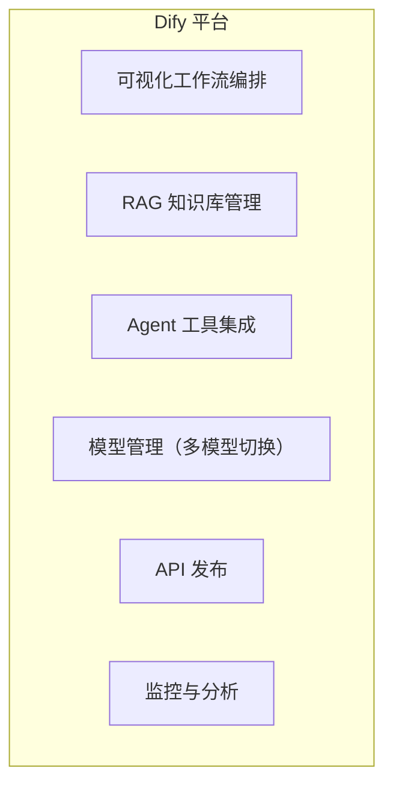

# AI 低代码平台对比

> **创建日期：** 2026-06-06
> **前置知识：** RAG、Agent、Prompt Engineering

---

## 一、三大低代码平台定位

| 平台 | 定位 | 核心用户 | 开源 |
|------|------|----------|------|
| **Dify** | 企业级 AI 应用开发平台 | 开发者/企业 | ✅ 开源 |
| **Coze（扣子）** | 字节跳动 AI Bot 开发平台 | 个人/企业 | ❌ 闭源 |
| **FastGPT** | 知识库问答平台 | 中小企业 | ✅ 开源 |

---

## 二、Dify 详解

### 核心能力

| 特性 | 说明 |
|------|------|
| **工作流** | 可视化编排 Chain/Agent，支持条件分支、循环 |
| **知识库** | 文档上传 → 自动分块 → Embedding → 向量检索 |
| **模型管理** | 支持 OpenAI、Claude、本地模型等 |
| **插件市场** | 丰富的工具和插件 |
| **API 发布** | 一键发布为 REST API |
| **私有化部署** | Docker Compose 一键部署 |

### 适用场景

- 企业内部知识库问答
- 客服机器人
- 数据分析助手
- 快速 AI 原型验证

---

## 三、Coze（扣子）详解

| 特性 | 说明 |
|------|------|
| **Bot 商店** | 丰富的预置 Bot 模板 |
| **插件生态** | 字节系深度集成（飞书、抖音） |
| **工作流** | 可视化编排 |
| **知识库** | 支持文档上传和检索 |
| **多平台发布** | 飞书、微信、Web 等 |

### 适用场景

- 飞书/抖音生态内的 AI 应用
- 个人 AI 助手快速搭建
- 社交媒体自动化

---

## 四、三平台对比

| 维度 | Dify | Coze（扣子） | FastGPT |
|------|------|-------------|---------|
| **开源性** | ✅ 开源 | ❌ 闭源 | ✅ 开源 |
| **私有化部署** | ✅ 支持 | ❌ 不支持 | ✅ 支持 |
| **工作流编排** | ⭐⭐⭐⭐⭐ | ⭐⭐⭐⭐ | ⭐⭐⭐ |
| **知识库管理** | ⭐⭐⭐⭐⭐ | ⭐⭐⭐ | ⭐⭐⭐⭐ |
| **插件生态** | ⭐⭐⭐⭐ | ⭐⭐⭐⭐⭐ | ⭐⭐⭐ |
| **企业级功能** | ⭐⭐⭐⭐⭐ | ⭐⭐⭐ | ⭐⭐⭐ |
| **价格** | 社区版免费 | 基础免费 | 开源免费 |
| **学习曲线** | 中等 | 低 | 低 |

---

## 五、选型建议

| 场景 | 推荐 |
|------|------|
| 企业内部应用、数据安全优先 | **Dify**（私有化部署） |
| 飞书/抖音生态、快速原型 | **Coze（扣子）** |
| 纯知识库问答、简单需求 | **FastGPT**（轻量级） |
| 需要深度定制 | **自研**（LangChain/LangGraph） |

---

## 六、面试重点

::: warning 高频考点
1. **Dify、Coze、FastGPT 的核心区别？** 如何选型？
2. **低代码平台适合什么场景？** 什么时候不适合？
3. **低代码平台 vs 自研框架的边界？** 什么时候该自研？
4. **Dify 的工作流编排能力如何？** 和 LangChain 的区别？
:::