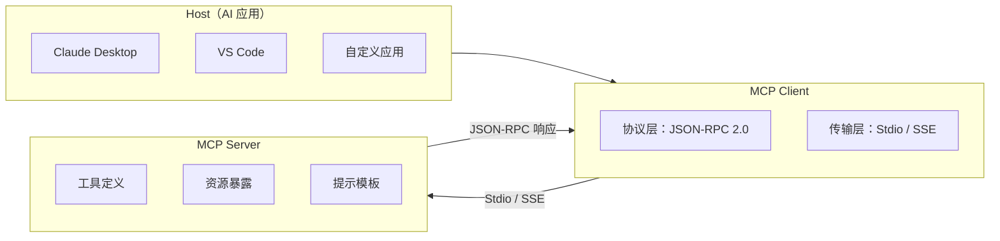

# MCP 协议概述

> **创建日期：** 2026-06-06
> **前置知识：** Agent 架构、Function Calling

---

## 一、什么是 MCP？

MCP（Model Context Protocol）是 Anthropic 提出的**开放标准协议**，定义了 AI 应用与外部工具/数据源之间的标准化交互方式。

::: tip 一句话理解
MCP 之于 AI 工具调用，就像 **USB-C 之于硬件接口**——一个统一标准，让任何 AI 应用都能接入任何工具。
:::

### 为什么需要 MCP？

| 传统方式 | MCP 方式 |
|----------|----------|
| 每个工具需要单独集成 | 一次集成，复用所有工具 |
| 不同工具 API 格式各异 | 统一的 JSON-RPC 2.0 协议 |
| 工具切换成本高 | 即插即用 |
| 生态系统碎片化 | 统一生态 |

---

## 二、协议架构



### 核心角色

| 角色 | 职责 | 示例 |
|------|------|------|
| **Host** | 发起请求的 AI 应用 | Claude Desktop、自定义 ChatBot |
| **Client** | 协议客户端，管理连接 | 内嵌在 Host 中 |
| **Server** | 提供工具/资源的服务端 | 数据库 Server、文件系统 Server |

---

## 三、传输层：Stdio vs SSE

| 传输方式 | 原理 | 优点 | 缺点 | 适用场景 |
|----------|------|------|------|----------|
| **Stdio** | 通过标准输入/输出通信 | 简单、零配置 | 只能本地进程通信 | 本地工具、CLI 工具 |
| **SSE** | 通过 HTTP Server-Sent Events | 支持远程通信 | 需要网络配置 | 远程服务、Web 集成 |

```json
// Stdio 方式配置
{
  "mcpServers": {
    "filesystem": {
      "command": "npx",
      "args": ["-y", "@modelcontextprotocol/server-filesystem", "/path"]
    }
  }
}

// SSE 方式配置
{
  "mcpServers": {
    "remote-db": {
      "url": "https://mcp.example.com/sse"
    }
  }
}
```

---

## 四、与传统 API 集成的区别

| 维度 | 传统 API 集成 | MCP 协议 |
|------|--------------|----------|
| **标准化** | 每家 API 格式不同 | 统一的 JSON-RPC 2.0 |
| **工具发现** | 需要硬编码工具列表 | 自动发现（list_tools） |
| **资源访问** | 需要单独实现 | 统一的 Resources 原语 |
| **Prompt 模板** | 硬编码在代码中 | 服务端提供，动态获取 |
| **生态** | 碎片化 | 统一生态，一次集成到处使用 |

---

## 五、MCP 生态现状（2026）

| 类型 | 示例 |
|------|------|
| **官方 Server** | 文件系统、GitHub、Postgres、Slack、Google Drive |
| **社区 Server** | 数百个社区贡献的 Server（数据库、API、工具） |
| **SDK** | Python SDK、TypeScript SDK、FastMCP（简化版） |
| **支持的应用** | Claude Desktop、VS Code、Cursor、Continue 等 |

---

## 六、面试高频题

### Q1: MCP 协议是什么？解决了什么问题？

**详细答案：** MCP（Model Context Protocol）是由 Anthropic 提出的开放标准协议，它定义了 AI 应用与外部工具、数据源之间的标准化交互方式。其核心思想是：在 AI 应用和外部工具之间建立一个统一的协议层，使得任何 AI 应用（Host）都可以通过 MCP Client 与任何 MCP Server 进行通信，而无需针对每个工具单独编写适配代码。可以用一个类比来理解：MCP 之于 AI 工具调用，就像 USB-C 之于硬件接口 -- 一个统一标准，让任何设备都能互联互通。

MCP 解决的核心问题是 AI 工具调用生态的碎片化。在 MCP 出现之前，每个 AI 应用需要为每个外部工具（数据库、文件系统、API 等）编写独立的集成代码，不同工具的 API 格式各异，工具切换成本极高。MCP 通过统一的 JSON-RPC 2.0 协议、标准的工具发现机制（list_tools）和自动化的资源暴露（list_resources），实现了"一次集成，复用所有工具"的效果。开发者只需实现一个 MCP Server，就可以被任何支持 MCP 的 AI 应用使用。

从行业趋势来看，MCP 正在成为 AI 工具调用的基础设施标准。2025-2026 年，Claude Desktop、VS Code、Cursor、Continue 等主流 AI 应用都已支持 MCP，社区贡献了数百个 MCP Server（涵盖数据库、云服务、办公工具等）。MCP 的出现使得"AI 工具生态"从封闭走向开放，类似于 HTTP 协议统一了 Web 服务通信一样，MCP 正在统一 AI 与外部世界的交互方式。

### Q2: MCP 的架构是怎样的？Host/Client/Server 各有什么职责？

**详细答案：** MCP 的架构分为三层，分别是 Host（宿主应用）、Client（协议客户端）和 Server（服务端）。Host 是发起请求的 AI 应用，例如 Claude Desktop、VS Code 编辑器或自定义的 ChatBot，它负责理解用户意图并决定调用哪些工具。Client 是内嵌在 Host 中的协议层，负责管理与 Server 的连接、序列化/反序列化 JSON-RPC 消息、处理传输层通信（Stdio 或 SSE），它封装了协议细节，让 Host 无需关心底层通信方式。Server 是实际提供工具和资源的服务端进程，例如一个数据库查询 Server 或文件系统 Server，它暴露工具定义（Tools）、资源（Resources）和提示模板（Prompts）供 Host 调用。

这三层之间的协作流程是：Host 通过 Client 与 Server 建立连接后，Client 自动调用 `list_tools` 和 `list_resources` 获取 Server 的能力清单，然后 Host 根据用户意图选择调用合适的工具，由 Client 将调用请求封装为 JSON-RPC 消息发送给 Server，Server 执行后返回结果。这种分层设计的好处是关注点分离：Host 专注于用户体验和 AI 决策，Client 专注于协议实现和传输管理，Server 专注于工具逻辑和数据访问。

在实际开发中，一个 Host 可以同时连接多个 MCP Server（例如同时连接文件系统 Server 和数据库 Server），每个 Server 独立运行在不同的进程中。Client 负责管理这些并发连接，确保消息路由正确。这种架构使得 AI 应用可以像"插件系统"一样动态扩展能力，新增一个工具只需要启动一个新的 MCP Server 并注册到配置中即可，无需修改 Host 代码。

### Q3: Stdio 和 SSE 传输方式有什么区别？各适用什么场景？

**详细答案：** Stdio（标准输入输出）和 SSE（Server-Sent Events）是 MCP 协议支持的两种传输方式，它们的核心区别在于通信范围和部署方式。Stdio 方式通过操作系统的标准输入/输出流进行通信，MCP Client 以子进程方式启动 MCP Server，通过 stdin 发送请求、通过 stdout 接收响应。这种方式的最大优势是简单、零配置，不需要任何网络配置，但缺点也很明显：只能在同一台机器上进行本地进程间通信，无法支持远程访问。

SSE 方式通过 HTTP 协议的 Server-Sent Events 机制进行通信，MCP Server 作为一个 HTTP 服务运行，Client 通过 HTTP 连接与其通信。SSE 支持远程通信，MCP Server 可以部署在远程服务器上，多个 Client 可以共享同一个 Server。SSE 的缺点是需要网络配置（端口、防火墙、TLS 等），部署复杂度更高。但在生产环境中，SSE 方式更加灵活，适合微服务架构和云端部署。

选择建议：本地开发工具（如文件系统操作、本地 CLI 工具）优先使用 Stdio，简单高效；需要远程访问的服务（如企业数据库查询、云 API 网关）使用 SSE。此外，在配置层面，Stdio 方式需要指定 `command` 和 `args`（如 `npx -y @modelcontextprotocol/server-filesystem`），而 SSE 方式需要指定 `url`（如 `https://mcp.example.com/sse`）。两者的消息格式和协议语义完全一致，只是传输通道不同，因此同一个 MCP Server 可以同时支持两种传输方式。

### Q4: MCP 和传统 API 集成有什么不同？为什么需要标准化？

**详细答案：** MCP 和传统 API 集成的核心区别在于五个维度：标准化、工具发现、资源访问、Prompt 模板和生态兼容性。传统 API 集成中，每家服务商的 API 格式各不相同（RESTful、GraphQL、gRPC 等），开发者需要阅读各自的文档、编写专门的适配代码；而 MCP 使用统一的 JSON-RPC 2.0 协议，所有 Server 遵循相同的消息格式和调用规范。在工具发现上，传统方式需要硬编码工具列表，新增工具需要修改代码并重新部署；MCP 通过 `list_tools` 实现自动发现，Server 启动后 Client 即可自动获取所有可用工具。

资源访问方面，传统 API 集成通常需要单独实现文件读取、数据库查询等逻辑，且缺乏统一的资源标识方式；MCP 提供了统一的 Resources 原语，使用 URI 标识资源（如 `file:///docs/readme.md`），并支持资源模板实现动态资源访问。Prompt 模板方面，传统方式将 Prompt 硬编码在应用代码中，修改 Prompt 需要重新部署；MCP 允许 Server 端提供 Prompt 模板，Client 动态获取，使得 Prompt 的迭代和共享更加灵活。

标准化带来的最大价值是生态效应。有了 MCP 标准后，工具开发者只需实现一次 MCP Server，就能被所有支持 MCP 的 AI 应用使用；AI 应用开发者只需集成 MCP Client，就能访问所有 MCP Server。这种"一次编写，到处运行"的模式，大幅降低了 AI 工具集成的成本，推动了 AI 工具生态的繁荣。同时，标准化也降低了厂商锁定的风险，开发者可以自由选择和替换工具提供商。

### Q5: MCP 有哪些核心原语？Tools/Resources/Prompts 各是什么？

**详细答案：** MCP 定义了三个核心原语：Tools（工具）、Resources（资源）和 Prompts（提示模板），它们分别解决 AI 应用中的三类不同需求。Tools 原语让 AI 能够执行操作，例如查询数据库、调用 API、发送邮件等，它是"写"操作的原语。每个 Tool 通过 `name`、`description` 和 `inputSchema`（JSON Schema 格式）定义，AI 根据 description 判断何时调用该工具，根据 inputSchema 生成正确的参数。Tools 的设计原则是单一职责、描述清晰、参数约束严格、错误友好和只读优先。

Resources 原语让 AI 能够读取数据，它类似于一个"只读的文件系统"，通过 URI 标识资源。例如 `file:///docs/employee-handbook.md` 表示一个文件资源，`db://employees/{id}` 表示一个动态资源模板。Resources 与 Tools 的核心区别在于：Resources 是只读的，AI 可以主动订阅或读取；Tools 是读写型的，AI 通过调用执行操作。实际开发中，读取配置文件、浏览文档内容等场景使用 Resources；查询数据库、操作文件、发送通知等场景使用 Tools。

Prompts 原语提供了标准化的提示模板，让用户或 AI 可以快速使用经过验证的最佳实践 Prompt。例如一个代码审查的 Prompt 模板，定义了 `language` 和 `code` 两个参数，用户只需填充参数即可获得结构化的审查提示。此外，MCP 还支持 Sampling（采样）原语，允许 MCP Server 反向请求 AI 模型生成内容，适用于 Server 需要 AI 帮助处理数据的场景（如自动摘要、分类等）。这个反向调用的能力是 MCP 区别于传统 API 集成的重要特性之一。

### Q6: MCP 协议在 2026 年的生态现状如何？未来发展趋势是什么？

**详细答案：** 截至 2026 年，MCP 生态已经形成了较为完整的体系。官方提供了多个参考 Server 实现（文件系统、GitHub、Postgres、Slack、Google Drive 等），社区贡献了数百个第三方 Server，覆盖了数据库、API 网关、云服务、办公工具等主流场景。SDK 方面，Python SDK 和 TypeScript SDK 都已成熟，FastMCP 简化了 Server 开发的门槛。支持的应用方面，Claude Desktop、VS Code、Cursor、Continue 等主流 AI 开发工具都已集成 MCP 支持。

MCP 的未来发展趋势可以分为几个方向。一是协议本身的完善，包括更丰富的传输方式（如 WebSocket 支持）、更强的安全机制（如 Server 认证与授权）、更好的流式处理支持等。二是生态的扩展，越来越多的云服务商（如 AWS、Azure、GCP）可能直接提供 MCP 兼容的接口，让企业内部的 AI 应用可以直接接入云服务。三是与 Agent 框架的深度整合，LangChain、LangGraph 等框架正在将 MCP 作为标准的工具集成方式，未来 Agent 可能通过 MCP 动态发现和调用工具，实现真正的"即插即用"。

从行业影响来看，MCP 的标准化可能会重塑 AI 工具市场的格局。过去，每家 AI 应用都需要构建自己的工具"插件市场"；有了 MCP 之后，可能会出现一个统一的 MCP Server 市场，类似于手机应用商店，开发者上传 MCP Server，用户一键安装使用。这种模式将大幅降低 AI 工具生态的碎片化，加速 AI 应用在各行业的落地。同时，MCP 协议也有望成为 AI 行业的标准，类似于 HTTP 之于 Web、SQL 之于数据库的地位。