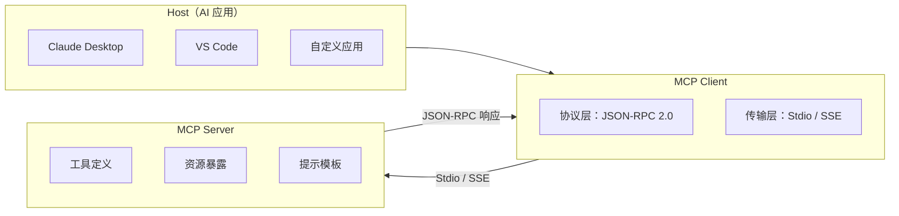

# MCP 协议概述

> **创建日期：** 2026-06-06
> **前置知识：** Agent 架构、Function Calling

---

## 一、什么是 MCP？

MCP（Model Context Protocol）是 Anthropic 提出的**开放标准协议**，定义了 AI 应用与外部工具/数据源之间的标准化交互方式。

::: tip 一句话理解
MCP 之于 AI 工具调用，就像 **USB-C 之于硬件接口**——一个统一标准，让任何 AI 应用都能接入任何工具。
:::

### 为什么需要 MCP？

| 传统方式 | MCP 方式 |
|----------|----------|
| 每个工具需要单独集成 | 一次集成，复用所有工具 |
| 不同工具 API 格式各异 | 统一的 JSON-RPC 2.0 协议 |
| 工具切换成本高 | 即插即用 |
| 生态系统碎片化 | 统一生态 |

---

## 二、协议架构



### 核心角色

| 角色 | 职责 | 示例 |
|------|------|------|
| **Host** | 发起请求的 AI 应用 | Claude Desktop、自定义 ChatBot |
| **Client** | 协议客户端，管理连接 | 内嵌在 Host 中 |
| **Server** | 提供工具/资源的服务端 | 数据库 Server、文件系统 Server |

---

## 三、传输层：Stdio vs SSE

| 传输方式 | 原理 | 优点 | 缺点 | 适用场景 |
|----------|------|------|------|----------|
| **Stdio** | 通过标准输入/输出通信 | 简单、零配置 | 只能本地进程通信 | 本地工具、CLI 工具 |
| **SSE** | 通过 HTTP Server-Sent Events | 支持远程通信 | 需要网络配置 | 远程服务、Web 集成 |

```json
// Stdio 方式配置
{
  "mcpServers": {
    "filesystem": {
      "command": "npx",
      "args": ["-y", "@modelcontextprotocol/server-filesystem", "/path"]
    }
  }
}

// SSE 方式配置
{
  "mcpServers": {
    "remote-db": {
      "url": "https://mcp.example.com/sse"
    }
  }
}
```

---

## 四、与传统 API 集成的区别

| 维度 | 传统 API 集成 | MCP 协议 |
|------|--------------|----------|
| **标准化** | 每家 API 格式不同 | 统一的 JSON-RPC 2.0 |
| **工具发现** | 需要硬编码工具列表 | 自动发现（list_tools） |
| **资源访问** | 需要单独实现 | 统一的 Resources 原语 |
| **Prompt 模板** | 硬编码在代码中 | 服务端提供，动态获取 |
| **生态** | 碎片化 | 统一生态，一次集成到处使用 |

---

## 五、MCP 生态现状（2026）

| 类型 | 示例 |
|------|------|
| **官方 Server** | 文件系统、GitHub、Postgres、Slack、Google Drive |
| **社区 Server** | 数百个社区贡献的 Server（数据库、API、工具） |
| **SDK** | Python SDK、TypeScript SDK、FastMCP（简化版） |
| **支持的应用** | Claude Desktop、VS Code、Cursor、Continue 等 |

---

## 六、面试重点

::: warning 高频考点
1. **MCP 协议是什么？** 解决了什么问题？
2. **MCP 的架构是怎样的？** Host/Client/Server 各有什么职责？
3. **Stdio 和 SSE 传输方式有什么区别？** 各适用什么场景？
4. **MCP 和传统 API 集成有什么不同？** 为什么需要标准化？
5. **MCP 有哪些核心原语？** Tools/Resources/Prompts 各是什么？
:::