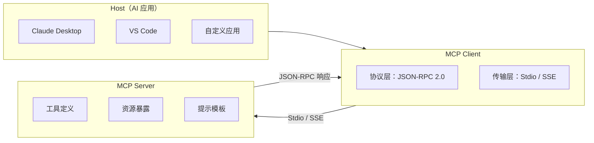

# MCP 协议概述

> **创建日期：** 2026-06-06
> **前置知识：** Agent 架构、Function Calling

---

## 一、什么是 MCP？

MCP（Model Context Protocol）是 Anthropic 提出的**开放标准协议**，定义了 AI 应用与外部工具/数据源之间的标准化交互方式。

::: tip 一句话理解
MCP 之于 AI 工具调用，就像 **USB-C 之于硬件接口**——一个统一标准，让任何 AI 应用都能接入任何工具。
:::

### 为什么需要 MCP？

| 传统方式 | MCP 方式 |
|----------|----------|
| 每个工具需要单独集成 | 一次集成，复用所有工具 |
| 不同工具 API 格式各异 | 统一的 JSON-RPC 2.0 协议 |
| 工具切换成本高 | 即插即用 |
| 生态系统碎片化 | 统一生态 |

---

## 二、协议架构



### 核心角色

| 角色 | 职责 | 示例 |
|------|------|------|
| **Host** | 发起请求的 AI 应用 | Claude Desktop、自定义 ChatBot |
| **Client** | 协议客户端，管理连接 | 内嵌在 Host 中 |
| **Server** | 提供工具/资源的服务端 | 数据库 Server、文件系统 Server |

---

## 三、传输层：Stdio vs SSE

| 传输方式 | 原理 | 优点 | 缺点 | 适用场景 |
|----------|------|------|------|----------|
| **Stdio** | 通过标准输入/输出通信 | 简单、零配置 | 只能本地进程通信 | 本地工具、CLI 工具 |
| **SSE** | 通过 HTTP Server-Sent Events | 支持远程通信 | 需要网络配置 | 远程服务、Web 集成 |

```json
// Stdio 方式配置
{
  "mcpServers": {
    "filesystem": {
      "command": "npx",
      "args": ["-y", "@modelcontextprotocol/server-filesystem", "/path"]
    }
  }
}

// SSE 方式配置
{
  "mcpServers": {
    "remote-db": {
      "url": "https://mcp.example.com/sse"
    }
  }
}
```

---

## 四、与传统 API 集成的区别

| 维度 | 传统 API 集成 | MCP 协议 |
|------|--------------|----------|
| **标准化** | 每家 API 格式不同 | 统一的 JSON-RPC 2.0 |
| **工具发现** | 需要硬编码工具列表 | 自动发现（list_tools） |
| **资源访问** | 需要单独实现 | 统一的 Resources 原语 |
| **Prompt 模板** | 硬编码在代码中 | 服务端提供，动态获取 |
| **生态** | 碎片化 | 统一生态，一次集成到处使用 |

---

## 五、MCP 生态现状（2026）

| 类型 | 示例 |
|------|------|
| **官方 Server** | 文件系统、GitHub、Postgres、Slack、Google Drive |
| **社区 Server** | 数百个社区贡献的 Server（数据库、API、工具） |
| **SDK** | Python SDK、TypeScript SDK、FastMCP（简化版） |
| **支持的应用** | Claude Desktop、VS Code、Cursor、Continue 等 |

---

## 六、面试高频题

### Q1: MCP 协议是什么？解决了什么问题？

**详细答案：** MCP 是 Anthropic 提的一个开放协议，我们最早接入是在做工具调用标准化的时候。之前每个 Agent 框架都有自己的 Tool 接口——LangChain 一个 Tool 类、OpenAI SDK 又是另一个——同一个"查保单"功能要三套实现。MCP 出来后我们只需要写一个 MCP Server，所有支持 MCP 的客户端自动能用。本质就是 JSON-RPC 2.0 统一消息格式，Server 端实现工具，Client 端自动发现并调用。

这个类比放这儿很贴切——就像 USB-C 统一了硬件接口。以前没有 USB-C 的时候你换个设备就要一根新线，现在全主流设备通用。MCP 对 AI 工具调用也是这样：之前换个框架工具要重写一遍，MCP 之后就都走一个协议。我们现在的工具栈全部通过 MCP Server 暴露——数据库查询、文件处理、外部 API 调用，加起来十几个，一次开发一周上线，未来换框架或换模型这套工具层完全不用动。最核心的价值就是解耦了工具实现和工具消费端的绑定。

### Q2: MCP 的架构是怎样的？Host/Client/Server 各有什么职责？

**详细答案：** 我们内部的框架版本里三层是这样分的。Host 就是我们的保险 Agent 主程序——不管你背后是 Claude Desktop 还是自定义 ChatBot，Host 负责理解用户意图和选择调用哪个工具。Client 是我们嵌入在 Host 里的协议层，封装了 JSON-RPC 通信细节，转换消息格式，管理连接。实际跑起来之后 Client 启动了十几个 MCP Server 进程，每个管一块——数据库查询、外部 API 调用、文件处理。Server 是最底层的——每个 Server 就是一个单独的进程，暴露工具列表和能力描述，连接建立之后 Client 调 list_tools 自动拿到所有工具。

我们一个很重要的经验是多 Server 并发管理。Host 可以同时连十几个 MCP Server，Client 负责给他们建立连接、派生消息、处理错误。我们有一套统一的 Server 注册机制——每个新 Server 启动时自动向 Client 注册，Client 汇总全局工具列表，省了好多手动配置。分层的好处就是各管各的——Host 不需要知道底层工具怎么实现的，Client 不需要知道用户想要什么，Server 只负责执行工具逻辑。新加一个功能只需要写一个新的 Server 注册进去就行了。

### Q3: Stdio 和 SSE 传输方式有什么区别？各适用什么场景？

**详细答案：** 我们在本地开发时全用 Stdio——Client 以子进程方式启动 MCP Server，走 stdin/stdout 通信，零配置就能跑，连网络都不用配。我们做本地文件处理工具全走的 Stdio，特别方便。但上了生产就暴露问题了——Stdio 只能本地同一个机器上跑，如果你的 Agent 部署在 K8s 上而 MCP Server 又部署在另一台机器上，Stdio 就用不了。后来我们在远程服务（尤其是微服务架构）全换成 SSE 方式——Server 是长期运行的 HTTP 服务，Client 通过 SSE 连接，支持远程访问和负载均衡。

但 SSE 也有坑——我们第一次部署的时候忘了做 TLS 加密和鉴权，接口裸在外面两天才发现。后来补上了 JWT 认证和 HTTPS。我们还遇到一个实际坑：Stdio Server 进程异常退出后 Client 接收不到信号就会一直等待，我们加了心跳检测 5 秒无响应就 kill 重启。选型很简单——本地开发/DaaS 工具 -> Stdio；远程/生产微服务 -> SSE；两者消息格式和语义完全相同，同一个 Server 可以同时暴露两种传输方式。

### Q4: MCP 和传统 API 集成有什么不同？为什么需要标准化？

**详细答案：** 传统 API 集成最大的问题是碎片化——每个服务有自己的 API 格式，你查数据库是 SQL、调外部 API 是 RESTful、发消息是 gRPC，每个都得写一整套集成代码。而且工具列表是硬编码的，新增一个工具就要修改 Agent 代码加一个 case。MCP 最大的不同点就是**统一 JSON-RPC 2.0**——无论什么工具都走同一个协议，并且通过 list_tools 自动发现，你加一个 MCP Server 不需要改 Agent 代码，我直接注册就能用。

**Resources 原语**是传统 API 没有的概念——传统方式读取文件需要自己封装文件 I/O逻辑，MCP 直接提供 URI 方式访问资源，还支持资源模板做动态查询。**自动发现**我觉得是最关键的区别——传统方式你加个工具要在代码里加 case，我们第一天手工维护十几个工具列表，很快就不堪重负了。上了 MCP 之后 Server 启动自动注册，工具列表动态同步，省了太多维护工作量。标准化最大的价值就是生态——工具开发者写一次 MCP Server，所有 AI 应用都能用，没有标准的话你每切换一个 Agent 框架就重写一遍工具代码。

### Q5: MCP 有哪些核心原语？Tools/Resources/Prompts 各是什么？

**详细答案：** 在我们项目里 Tools 是最常用的原语——让 Agent 可以执行操作。每个 Tool 通过 JSON Schema 定义参数，Agent 根据描述决定调用。比如我们的"查保单"工具就定义了 `policyNumber` 和 `searchType` 两个参数，Agent 填好 JSON 发过来，Server 执行并返回结果。Resources 是只读的数据访问——用 URI 标识，比如 `db://policies/P-2024-00123` 就代表一份保单数据。Resources 和 Tools 的区别就是读和写——Resources 是完全只读的，Agent 可以主动拉取数据；Tools 是读写型的，执行完可能产生副作用。

Prompts 我们现在用得不多，但场景很好理解——Server 端提供经过验证的 Prompt 模板，比如一个代码审查模板定义了 `language` 和 `code_segment` 两个参数，Agent 填入参数就能生成标准的审查指令。我们内部维护了一套保险问答的 Prompt 模板库，Agent 直接通过 MCP 拉取，不需要每次都在代码里硬编码 Prompt。还有一个 Sampling 原语很有意思——允许 Server 反向调用 LLM 生成内容，我们做数据清洗的时候 Server 自动调 Agent 去生成数据摘要，省了一步人工操作。

### Q6: MCP 协议在 2026 年的生态现状如何？未来发展趋势是什么？

**详细答案：** 2026 年上半年我们看到 MCP 生态已经很有规模了——官方提供的 Server 覆盖了文件系统、GitHub、Postgres、Slack 等常用场景，社区贡献了 300+ 第三方 Server。SDK 支持方面 Python 和 TypeScript 都很成熟，FastMCP 把 Server 开发的门槛拉得很低。几乎所有主流开发工具都内置了 MCP 支持。

我的判断是 MCP 会成为 AI 生态的基础设施，就像 HTTP 统一了 Web。具体来说未来几个方向：协议本身会加入更多传输方式（比如 WebSocket 支持双向实时通信）和更强的安全机制（Server 级的认证授权）；云服务商开始提供原生 MCP 兼容接口——让企业内 AI 应用直接接 AWS/Azure 等云服务；最革命性的是可能出现一个 MCP Server 的应用商店——工具开发者上传工具，用户一键安装，整个工具生态真正标准化和可互操作。我们也正在把内部所有工具全部搬迁到 MCP 上，避免后续的迁移成本。