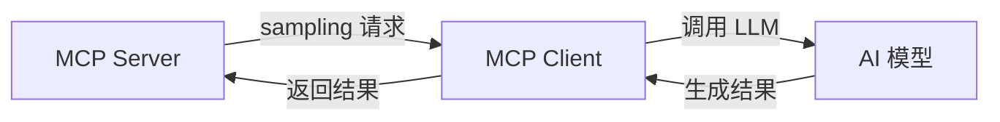

# MCP 核心原语详解

> **创建日期：** 2026-06-06
> **前置知识：** MCP 协议概述

---

## 一、三大核心原语

MCP 定义了三个核心原语，分别解决不同的问题：

| 原语 | 解决的问题 | 类比 |
|------|-----------|------|
| **Tools（工具）** | AI 需要执行操作 | 函数的 API |
| **Resources（资源）** | AI 需要读取数据 | 只读的文件系统 |
| **Prompts（提示模板）** | AI 需要标准化的提示 | 可复用的 Prompt 模板 |

---

## 二、Tools（工具定义）

### 2.1 工具的作用

让 AI 能够**执行操作**：查询数据库、调用 API、操作文件等。

### 2.2 工具定义规范

```python
# MCP 工具定义
{
    "name": "query_database",
    "description": "执行 SQL 查询并返回结果（只读）",
    "inputSchema": {
        "type": "object",
        "properties": {
            "sql": {
                "type": "string",
                "description": "要执行的 SQL 查询语句"
            },
            "limit": {
                "type": "integer",
                "description": "返回结果的最大行数",
                "default": 100
            }
        },
        "required": ["sql"]
    }
}
```

### 2.3 工具设计原则

| 原则 | 说明 |
|------|------|
| **单一职责** | 一个工具只做一件事 |
| **描述清晰** | description 字段必须详细说明用法 |
| **参数约束** | 使用 JSON Schema 约束参数类型和范围 |
| **错误友好** | 返回清晰的错误信息，帮助 AI 理解失败原因 |
| **只读优先** | 优先提供只读工具，写操作需要额外确认 |

---

## 三、Resources（资源暴露）

### 3.1 资源的作用

让 AI 能够**读取数据**：文件内容、数据库记录、API 响应等。

### 3.2 资源定义

```python
# MCP 资源定义
{
    "uri": "file:///docs/employee-handbook.md",
    "name": "员工手册",
    "description": "公司员工手册，包含考勤、请假等制度",
    "mimeType": "text/markdown"
}

# 资源模板（动态资源）
{
    "uriTemplate": "db://employees/{id}",
    "name": "员工信息",
    "description": "根据 ID 查询员工详细信息"
}
```

### 3.3 资源 vs 工具

| 维度 | Resources | Tools |
|------|-----------|-------|
| **操作类型** | 只读 | 读+写 |
| **触发方式** | AI 主动订阅/读取 | AI 调用执行 |
| **典型用途** | 提供上下文信息 | 执行操作 |
| **示例** | 读取文件、查询配置 | 创建工单、发送邮件 |

---

## 四、Prompts（提示模板）

### 4.1 提示模板的作用

提供**标准化的 Prompt 模板**，让用户或 AI 可以快速使用最佳实践的 Prompt。

```python
# MCP Prompt 定义
{
    "name": "code_review",
    "description": "代码审查 Prompt 模板",
    "arguments": [
        {
            "name": "language",
            "description": "编程语言",
            "required": True
        },
        {
            "name": "code",
            "description": "待审查的代码",
            "required": True
        }
    ]
}
```

### 4.2 使用场景

| 场景 | 说明 |
|------|------|
| **标准化操作** | 统一的代码审查、文档生成 Prompt |
| **最佳实践共享** | 将团队验证过的 Prompt 模板化 |
| **多语言支持** | 同一 Prompt 的多语言版本 |

---

## 五、Sampling（采样）

Sampling 允许 MCP Server **反向请求** AI 模型生成内容：



**典型场景：** Server 需要 AI 帮助处理数据时（如摘要生成、分类），可以反向调用 AI。

---

## 六、面试重点

::: warning 高频考点
1. **MCP 的三大原语各解决什么问题？** Tools/Resources/Prompts 的区别？
2. **Resources 和 Tools 的核心区别是什么？** 什么时候用哪个？
3. **如何设计一个好的 MCP 工具？** 有哪些设计原则？
4. **Prompt 模板在 MCP 中的作用？** 什么场景下有用？
5. **Sampling 的作用是什么？** 什么场景下需要 Server 反向调用 AI？
:::