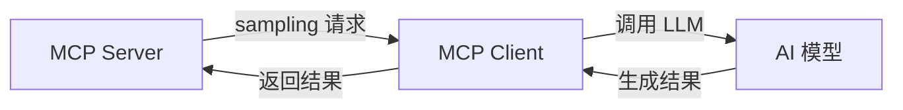

# MCP 核心原语详解

> **创建日期：** 2026-06-06
> **前置知识：** MCP 协议概述

---

## 一、三大核心原语

MCP 定义了三个核心原语，分别解决不同的问题：

| 原语 | 解决的问题 | 类比 |
|------|-----------|------|
| **Tools（工具）** | AI 需要执行操作 | 函数的 API |
| **Resources（资源）** | AI 需要读取数据 | 只读的文件系统 |
| **Prompts（提示模板）** | AI 需要标准化的提示 | 可复用的 Prompt 模板 |

---

## 二、Tools（工具定义）

### 2.1 工具的作用

让 AI 能够**执行操作**：查询数据库、调用 API、操作文件等。

### 2.2 工具定义规范

```python
# MCP 工具定义
{
    "name": "query_database",
    "description": "执行 SQL 查询并返回结果（只读）",
    "inputSchema": {
        "type": "object",
        "properties": {
            "sql": {
                "type": "string",
                "description": "要执行的 SQL 查询语句"
            },
            "limit": {
                "type": "integer",
                "description": "返回结果的最大行数",
                "default": 100
            }
        },
        "required": ["sql"]
    }
}
```

### 2.3 工具设计原则

| 原则 | 说明 |
|------|------|
| **单一职责** | 一个工具只做一件事 |
| **描述清晰** | description 字段必须详细说明用法 |
| **参数约束** | 使用 JSON Schema 约束参数类型和范围 |
| **错误友好** | 返回清晰的错误信息，帮助 AI 理解失败原因 |
| **只读优先** | 优先提供只读工具，写操作需要额外确认 |

---

## 三、Resources（资源暴露）

### 3.1 资源的作用

让 AI 能够**读取数据**：文件内容、数据库记录、API 响应等。

### 3.2 资源定义

```python
# MCP 资源定义
{
    "uri": "file:///docs/employee-handbook.md",
    "name": "员工手册",
    "description": "公司员工手册，包含考勤、请假等制度",
    "mimeType": "text/markdown"
}

# 资源模板（动态资源）
{
    "uriTemplate": "db://employees/{id}",
    "name": "员工信息",
    "description": "根据 ID 查询员工详细信息"
}
```

### 3.3 资源 vs 工具

| 维度 | Resources | Tools |
|------|-----------|-------|
| **操作类型** | 只读 | 读+写 |
| **触发方式** | AI 主动订阅/读取 | AI 调用执行 |
| **典型用途** | 提供上下文信息 | 执行操作 |
| **示例** | 读取文件、查询配置 | 创建工单、发送邮件 |

---

## 四、Prompts（提示模板）

### 4.1 提示模板的作用

提供**标准化的 Prompt 模板**，让用户或 AI 可以快速使用最佳实践的 Prompt。

```python
# MCP Prompt 定义
{
    "name": "code_review",
    "description": "代码审查 Prompt 模板",
    "arguments": [
        {
            "name": "language",
            "description": "编程语言",
            "required": True
        },
        {
            "name": "code",
            "description": "待审查的代码",
            "required": True
        }
    ]
}
```

### 4.2 使用场景

| 场景 | 说明 |
|------|------|
| **标准化操作** | 统一的代码审查、文档生成 Prompt |
| **最佳实践共享** | 将团队验证过的 Prompt 模板化 |
| **多语言支持** | 同一 Prompt 的多语言版本 |

---

## 五、Sampling（采样）

Sampling 允许 MCP Server **反向请求** AI 模型生成内容：



**典型场景：** Server 需要 AI 帮助处理数据时（如摘要生成、分类），可以反向调用 AI。

---

## 六、面试高频题

### Q1: MCP 的三大原语各解决什么问题？Tools/Resources/Prompts 的核心区别是什么？

**详细答案：** MCP 的三大核心原语分别对应 AI 应用与外部世界交互的三类需求：Tools（工具）解决"执行操作"的问题，Resources（资源）解决"读取数据"的问题，Prompts（提示模板）解决"标准化提示"的问题。这三者的设计哲学是"各司其职"：Tools 是写操作的原语，允许 AI 产生副作用（如创建文件、发送邮件、修改数据库）；Resources 是只读原语，AI 只能读取不能修改，天然具有安全性；Prompts 是模板原语，提供经团队验证的最佳实践 Prompt，降低使用门槛。

从技术实现角度看，Tools 通过 `name`、`description` 和 `inputSchema`（JSON Schema）定义，AI 模型根据 description 判断何时调用、根据 inputSchema 生成正确的参数格式；Resources 通过 URI 标识，支持静态资源（`file:///docs/readme.md`）和动态资源模板（`db://employees/{id}`），Server 端负责解析 URI 并返回相应内容；Prompts 通过 `name`、`description` 和 `arguments` 定义，支持参数化模板，用户可以填充参数生成定制化的 Prompt。三者虽然职责不同，但在实际场景中经常协同工作：例如一个代码审查场景，AI 先通过 Resources 读取代码文件，再通过 Prompts 获取审查模板，最后通过 Tools 将审查结果写入评论系统。

常见的理解误区是混淆 Resources 和 Tools 的边界。一个简单判断标准：如果操作只是返回数据、不产生副作用，用 Resources；如果操作会产生副作用（修改状态、发送通知等），用 Tools。另一个误区是认为 Prompts 没什么用，但实际上 Prompts 是团队知识沉淀和标准化的重要手段——将经过验证的 Prompt 模板化后，新成员无需从零摸索，直接使用即可获得高质量输出。

### Q2: Resources 和 Tools 的核心区别是什么？什么时候用哪个？

**详细答案：** Resources 和 Tools 的核心区别在于操作类型和触发方式。Resources 是只读的，AI 通过订阅或主动读取方式获取数据，典型场景包括：读取配置文件、浏览文档内容、查看数据库记录（只读查询）、获取实时信息（如天气、股价）。Tools 是读写型的，AI 通过调用执行操作，典型场景包括：创建/修改文件、发送邮件、创建工单、操作数据库（写操作）、调用外部 API。一个判断标准：操作是否会产生副作用？如果会产生副作用（修改外部状态），必须用 Tools；如果只是读取数据，优先用 Resources。

从安全角度考虑，Resources 的只读特性天然具有安全优势。在 MCP 的设计中，Resources 的 URI 可以作为访问控制的边界：Server 可以只暴露特定路径下的资源，防止 AI 越权访问敏感数据。而 Tools 因为涉及写操作，需要更严格的安全控制：参数校验、权限检查、操作审计等都是必不可少的。实际开发中，对于数据库查询，如果只是 SELECT 操作，可以同时提供 Resources 和 Tools 两种方式；但如果涉及 INSERT/UPDATE/DELETE，只能用 Tools，并且需要额外的安全确认机制。

从使用体验角度，Resources 支持"订阅"模式，AI 可以订阅某个资源的变化通知，当资源内容更新时自动获取最新版本。这在需要实时数据同步的场景中非常有用，例如订阅一个配置文件的变化、订阅实时行情数据等。Tools 则不支持订阅，每次都是"请求-响应"的一次性调用。因此，需要持续监控数据变化的场景优先使用 Resources。

### Q3: 如何设计一个好的 MCP 工具？有哪些设计原则？

**详细答案：** 设计一个好的 MCP 工具需要遵循以下核心原则。第一，单一职责：一个工具只做一件事，避免"万能工具"。例如，不要设计一个 `do_everything` 工具，而是拆分为 `query_database`、`send_email`、`create_ticket` 等独立工具。AI 模型对工具的选择是基于 description 的语义匹配，工具职责越清晰，AI 的选择越准确。第二，描述清晰：description 字段是 AI 判断何时调用工具的唯一依据，必须详细说明工具的用途、适用场景、参数含义和返回值格式。好的 description 应该像"给一个不熟悉该工具的人写的使用说明"，而不是简单的标签。

第三，参数约束严格：使用 JSON Schema 精确定义每个参数的类型、范围、默认值和是否必填。例如，对于数据库查询工具，SQL 参数应该设为必填，limit 参数应该设置默认值（如 100）和最大值（如 1000），以防止 AI 生成不合理的查询。参数校验不仅提高了调用的准确性，也是安全防护的第一道防线。第四，错误友好：当工具执行失败时，返回的错误信息应该清晰说明失败原因，并提供修正建议。AI 模型可以根据错误信息调整参数后重试，因此错误信息越详细，AI 的自愈能力越强。

第五，安全优先：对于写操作工具，必须进行权限校验和操作审计；对于涉及敏感数据的工具，必须进行数据脱敏。一个常见的实践是：所有写操作都需要额外的确认步骤（如 `requires_confirmation: true`），防止 AI 误操作。第六，幂等性设计：尽可能让工具支持幂等调用，即多次调用同一工具产生相同的效果。这在 AI 自动重试场景中尤为重要，避免因重试导致重复创建资源或重复发送通知。

### Q4: Prompt 模板在 MCP 中的作用是什么？什么场景下最有价值？

**详细答案：** Prompt 模板在 MCP 中的核心作用是标准化和复用经过验证的 Prompt。它解决了团队协作中的三个痛点：一是知识沉淀，将团队中优秀成员的 Prompt 技巧模板化，让所有人都能受益；二是一致性，确保同一类任务（如代码审查、文档生成）使用相同的 Prompt 结构和质量标准；三是降低门槛，新成员无需从零摸索 Prompt 设计，直接使用模板即可获得高质量结果。

Prompt 模板最有价值的场景包括：代码审查（定义统一的审查维度和输出格式）、技术文档生成（定义统一的文档结构）、Bug 分析（定义统一的排查步骤和输出模板）、需求分析（定义统一的分析维度）等需要标准化输出的场景。在这些场景中，Prompt 模板不仅提高了效率，更重要的是保证了输出质量的一致性。例如，一个代码审查模板可以定义：必须检查的维度（安全性、性能、可维护性）、输出格式（问题描述、严重程度、修复建议）、评分标准等，确保每次审查都覆盖相同的质量标准。

从技术实现角度，MCP 的 Prompt 模板支持参数化，用户可以通过填充参数来定制输出。Server 端定义模板的 `name`、`description` 和 `arguments`，Client 端获取模板列表后，用户可以选择模板并填充参数。这种设计使得 Prompt 模板可以适应不同的上下文，同时保持核心结构不变。需要注意的是，Prompt 模板不是"万能钥匙"，它应该针对特定场景设计，避免过于泛化导致输出质量下降。

### Q5: Sampling 的作用是什么？什么场景下需要 Server 反向调用 AI？

**详细答案：** Sampling 是 MCP 协议中一个独特的能力，它允许 MCP Server 反向请求 AI 模型生成内容。传统的 Client-Server 模式中，Server 只能被动响应 Client 的请求；而 Sampling 打破了这一限制，让 Server 可以主动发起 AI 调用。这个能力的核心场景是：Server 在处理数据时，需要 AI 帮助完成一些智能任务，例如对查询结果进行摘要、对文本进行分类、对数据进行语义分析等。

典型的应用场景包括：数据库查询 Server 返回大量数据后，请求 AI 对结果进行自然语言摘要；文件系统 Server 读取长文档后，请求 AI 提取关键信息；日志分析 Server 获取日志后，请求 AI 识别异常模式。在这些场景中，如果没有 Sampling，Server 只能返回原始数据，由 Client 端的 AI 再进行处理；有了 Sampling，Server 可以在返回数据之前就完成智能处理，减少了 Client 端的处理负担和网络传输量。

Sampling 的工作流程是：Server 向 Client 发送 Sampling 请求（包含 Prompt 和参数），Client 调用 AI 模型生成内容，然后将结果返回给 Server。这个过程中，Client 仍然保持对 AI 调用的控制权，可以设置 Token 限制、温度参数等。从安全角度，Sampling 需要在 Client 端进行权限控制，确保 Server 不能滥用 AI 调用能力。当前 Sampling 还处于较早期阶段，但随着 MCP 协议的成熟，它可能在"智能中间件"场景中发挥越来越重要的作用。

### Q6: MCP 工具的错误处理策略有哪些？如何让 AI 更好地从错误中恢复？

**详细答案：** MCP 工具的错误处理策略直接影响 AI 的自主纠错能力。最佳实践包括以下几个层面。第一，返回结构化的错误信息，不仅要说明错误原因，还要提供修正建议。例如，数据库查询失败时，错误信息应该包含：具体的 SQL 错误描述、可能的原因（如语法错误、权限不足、表不存在）、建议的修正方法。AI 模型可以根据这些信息自动调整参数并重试，大幅提高成功率。

第二，区分不同类型的错误，采用不同的处理策略。对于可恢复的错误（如参数格式错误、超时），返回清晰的错误信息让 AI 自动重试；对于不可恢复的错误（如权限不足、资源不存在），返回明确的终止信息，避免 AI 陷入无限重试循环。第三，设置合理的超时和重试限制，防止工具调用耗时过长影响用户体验。例如，为数据库查询设置 30 秒超时，为网络请求设置 10 秒超时，并为每个工具设置最大重试次数（如 3 次）。

第四，使用错误码体系，让 AI 可以基于错误码做精确判断。例如，`INVALID_PARAM` 表示参数错误需要修正，`PERMISSION_DENIED` 表示权限不足无法继续，`RATE_LIMITED` 表示需要等待后重试。结构化的错误码比纯文本错误信息更容易被 AI 理解和处理。第五，在工具定义中预设常见错误的处理说明，在 description 中告知 AI 遇到特定错误时应该如何应对，这样可以进一步引导 AI 做出正确的决策。