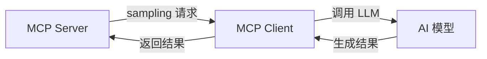

# MCP 核心原语详解

> **创建日期：** 2026-06-06
> **前置知识：** MCP 协议概述

---

## 一、三大核心原语

MCP 定义了三个核心原语，分别解决不同的问题：

| 原语 | 解决的问题 | 类比 |
|------|-----------|------|
| **Tools（工具）** | AI 需要执行操作 | 函数的 API |
| **Resources（资源）** | AI 需要读取数据 | 只读的文件系统 |
| **Prompts（提示模板）** | AI 需要标准化的提示 | 可复用的 Prompt 模板 |

---

## 二、Tools（工具定义）

### 2.1 工具的作用

让 AI 能够**执行操作**：查询数据库、调用 API、操作文件等。

### 2.2 工具定义规范

```python
# MCP 工具定义
{
    "name": "query_database",
    "description": "执行 SQL 查询并返回结果（只读）",
    "inputSchema": {
        "type": "object",
        "properties": {
            "sql": {
                "type": "string",
                "description": "要执行的 SQL 查询语句"
            },
            "limit": {
                "type": "integer",
                "description": "返回结果的最大行数",
                "default": 100
            }
        },
        "required": ["sql"]
    }
}
```

### 2.3 工具设计原则

| 原则 | 说明 |
|------|------|
| **单一职责** | 一个工具只做一件事 |
| **描述清晰** | description 字段必须详细说明用法 |
| **参数约束** | 使用 JSON Schema 约束参数类型和范围 |
| **错误友好** | 返回清晰的错误信息，帮助 AI 理解失败原因 |
| **只读优先** | 优先提供只读工具，写操作需要额外确认 |

---

## 三、Resources（资源暴露）

### 3.1 资源的作用

让 AI 能够**读取数据**：文件内容、数据库记录、API 响应等。

### 3.2 资源定义

```python
# MCP 资源定义
{
    "uri": "file:///docs/employee-handbook.md",
    "name": "员工手册",
    "description": "公司员工手册，包含考勤、请假等制度",
    "mimeType": "text/markdown"
}

# 资源模板（动态资源）
{
    "uriTemplate": "db://employees/{id}",
    "name": "员工信息",
    "description": "根据 ID 查询员工详细信息"
}
```

### 3.3 资源 vs 工具

| 维度 | Resources | Tools |
|------|-----------|-------|
| **操作类型** | 只读 | 读+写 |
| **触发方式** | AI 主动订阅/读取 | AI 调用执行 |
| **典型用途** | 提供上下文信息 | 执行操作 |
| **示例** | 读取文件、查询配置 | 创建工单、发送邮件 |

---

## 四、Prompts（提示模板）

### 4.1 提示模板的作用

提供**标准化的 Prompt 模板**，让用户或 AI 可以快速使用最佳实践的 Prompt。

```python
# MCP Prompt 定义
{
    "name": "code_review",
    "description": "代码审查 Prompt 模板",
    "arguments": [
        {
            "name": "language",
            "description": "编程语言",
            "required": True
        },
        {
            "name": "code",
            "description": "待审查的代码",
            "required": True
        }
    ]
}
```

### 4.2 使用场景

| 场景 | 说明 |
|------|------|
| **标准化操作** | 统一的代码审查、文档生成 Prompt |
| **最佳实践共享** | 将团队验证过的 Prompt 模板化 |
| **多语言支持** | 同一 Prompt 的多语言版本 |

---

## 五、Sampling（采样）

Sampling 允许 MCP Server **反向请求** AI 模型生成内容：



**典型场景：** Server 需要 AI 帮助处理数据时（如摘要生成、分类），可以反向调用 AI。

---

## 六、面试高频题

### Q1: MCP 的三大原语各解决什么问题？Tools/Resources/Prompts 的核心区别是什么？

**详细答案：** 我们项目的所有内部工具全走这三原语。Tools 就是让 Agent 执行操作，比如查保单、计算保费——有副作用的动作必须通过 Tools，我们在 Server 端做了参数校验和安全检查，运行 powertools SQL 注入检测和只读语句白名单。Resources 是只读数据读取——比如条款文档、配置文件，直接用 URI 标识匹配，我们主要用它做 Agent 初始化时加载上下文信息，读取速度快且天然安全。Prompts 我们用来做团队级复用——代码审查模板、保险术语解释模板这些封装成 Prompts 由 MCP Server 动态提供，Agent 要用的时候拉就行了。三者的关系其实很简单：Resources 读、Tools 写和执行、Prompts 标准化指令模板。实际中经常协同——比如用户问保单理赔额，Agent 先用 Resources 拉条款文档，再用 Prompts 获取理赔分析的模板，最后用 Tools 执行保费计算和生成结果。

### Q2: Resources 和 Tools 的核心区别是什么？什么时候用哪个？

**详细答案：** 我们线上最直接的区别就是：有副作用的用 Tools，没副作用的用 Resources。比如 Agent 要查一份保单条款，纯粹只读操作直接走 Resources，用 `db://policies/P-2024-00123` URI 就能拉到内容，安全天然有保障——因为 Resources 只读，Agent 怎么调用也不会意外改数据。但如果 Agent 要创建一个理赔工单，那就必须用 Tools——有 INSERT 和外部服务调用副作用的，只能在 Tools 里严格控制。

安全方面的收益在 Resources 上很直接——你通过 URI 就能建立访问边界，Server 端只暴露特定路径下的资源文件，避免 Agent 越权访问。工具类操作则非常敏感，我们所有写操作的 Tools 全加了一道参数校验和权限检查，$important$操作还要人工二次确认。实际应用里对于数据库查询场景，我们的处理是：纯 SELECT 的话同时提供 Resources 和 Tools，简单读走 Resources；如果有复杂的参数拼接和筛选还是走 Tools。INSERT/UPDATE/DELETE 永远只用 Tools，且挂了审计日志。还有一个容易忽略的点——Resources 支持订阅，比如订阅一个新版条款更新通知，更新后 Agent 自动拉取最新内容，这在条款频繁修订的保险行业真的很实用。

### Q3: 如何设计一个好的 MCP 工具？有哪些设计原则？

**详细答案：** 我们写过的 12 个 MCP 工具总结下来六条铁律。第一单一职责——一个工具只干一件事，死命令。我们最惨的就是最开始做了一个 `insurance_all_in_one` 工具，查保单+算保费+条款摘要全塞里面，Agent 根本不知道该传什么参数、什么时候调用，错误率居高不下，后来拆成三个独立工具后才正常。第二 description 就是工具的全部——AI 只看 description 判断要不要调用这个工具，所以里面必须说清楚"什么时候用、什么时候不要用、参数是什么类型、出什么返回"。我们描述里直接写死"当且仅当用户询问保单详情时调用此工具，不要用于理赔金额计算"，效果比模糊的"查询保险信息"高太多了。第三参数约束严格——用 JSON Schema 把每个参数的类型、可选值、默认值全锁死。我们查数据库的工具加了 `max_limit=100` 和只读 SELECT 检查，用户换了模型后从来没有过越权查询的问题。

第四错误信息要友好——返回清晰的错误代码和修正建议。我们格式是 `"错误: 保单号格式不正确，应为P-YYYY-NNNNN格式，如P-2024-00123"`，Agent 读完直接就知道改什么，自愈率在 90% 以上。第五安全优先——所有写操作要人工确认，我们做的是 `requires_confirmation=true` 再挂审计日志。第六幂等性——同参数多次调用结果一样，防止 Agent 重试时不小心重复创建资源或发重复通知。

### Q4: Prompt 模板在 MCP 中的作用是什么？什么场景下最有价值？

**详细答案：** Prompt 模板在我们团队用起来很实在——就是把老手的经验固化成可复用的东西。比如我们保险客服团队有一个代码审查模板，定义了必须检查的维度（安全性、性能、可维护性）和输出格式（问题描述+严重程度+修复建议），新成员直接用这个模板审查代码，质量立刻对齐老手水平。最有价值的场景就是标准化输出——代码审查、技术文档生成、Bug 分析报告，这些如果每个人写风格不一样，团队评审就全是时间浪费。

技术实现上 MCP 的 Prompt 模板通过 `name`、`description` 和 `arguments` 参数化—— `code_review` 模板定义了 language 和 code 两个参数，Agent 填好参数就能生成标准审查指令。我们服务器端维护了 20+ 经过验证的 Prompt 模板，Agent 通过 MCP 动态拉取，不需要在代码里硬编码，修 Prompt 也是改 Server 端不碰 Agent 代码。但模板也不是万能的——太泛化会导致输出质量下降，必须针对特定场景精细设计。我们一直坚持每个模板最多 3 个参数，再多就直接拆成两个独立模板。

### Q5: Sampling 的作用是什么？什么场景下需要 Server 反向调用 AI？

**详细答案：** Sampling 我们在数据清洗和异常检测两个环节用得非常顺手。它的想法就是让 Server 反过来调 LLM——传统的 Client-Server 里 Server 只能等通知，Sampling 打破了这种被动模式。最典型场景是数据库查完返回大量数据时 Server 自动请求 AI 把结果摘要成一段话，Client 端收到的就是已经处理好的结果而不是一大坨原数据，体验和带宽都节省了。我们的文档处理 Server 也是这样的——每次导入新条款 PDF，Server 自动 Sampling 让 AI 提取关键字段（保险公司名称、保单类型、保单号、生效日期），写入数据库之前就处理好了。

实现上 Server 向 Client 发 sampling 请求（带 Prompt），Client 调 LLM 生成内容后返回。这里关键是权限——Server 不能滥用 AI 调用胡乱消耗 token，我们限制了每个 Server 单日最多 sampling 1000 次，超过直接拒绝。而且现在 sampling 还算比较早期阶段，我们用的是 FastMCP 的 sampling 支持，功能基本够用但一旦出现错误排查比较麻烦。不过可以预见未来会变成"智能中间件"的标准模式。

### Q6: MCP 工具的错误处理策略有哪些？如何让 AI 更好地从错误中恢复？

**详细答案：** 我们的工具错误处理分四层。第一返回结构化错误——不是简单返回"失败了"就完事，而是 `"错误: 保单号格式不正确，应为P-YYYY-NNNNN格式"` 带上具体原因和建议。Agent 读完直接知道改什么，自愈率在 90% 以上。之前有一次 Agent 调了参数错误，错误信息带上了示例值后 Agent 下一轮调用就传对了。第二错误分类型——可恢复错误返回建议（参数格式错、超时），不可恢复错误返回终止信息（权限不足、资源不存在），不然 Agent 会在不可恢复错误上无限重试。我们有一次 Agent 因为参数错误而重复调了 5 次同一个工具，token 浪费得心疼，后来加了 max_retries=3。

第三超时限制做得很严——数据库查询 30 秒超时、网络请求 10 秒超时、重试最多 3 次，防止长等待影响体验。真正保底的大招是第四点——工具 description 里直接写常见错误应对方式："如果返回'保单号未找到'，请提示用户确认保单号格式后重试"，Agent 不需要猜直接按指令执行。结构化的错误码（`INVALID_PARAM`、`PERMISSION_DENIED`、`RATE_LIMITED`）让 Agent 可以做精确判断，比纯文本错误信息更容易解析和处理。