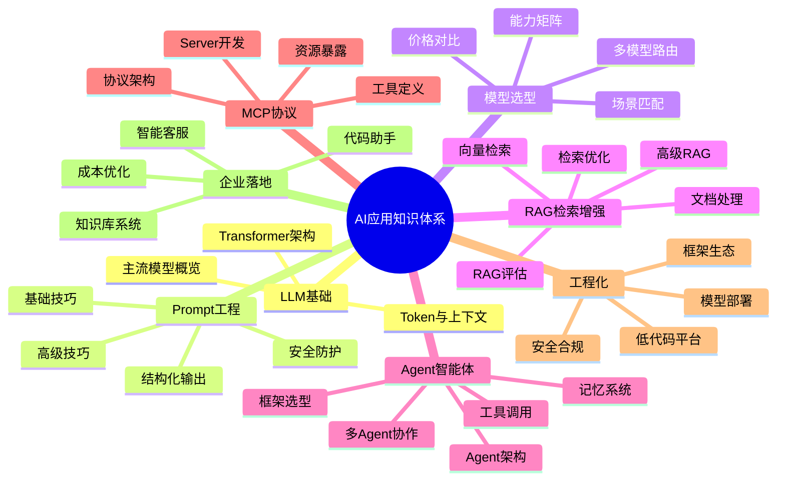
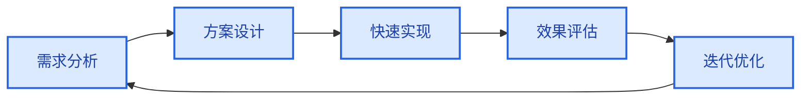
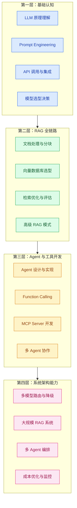
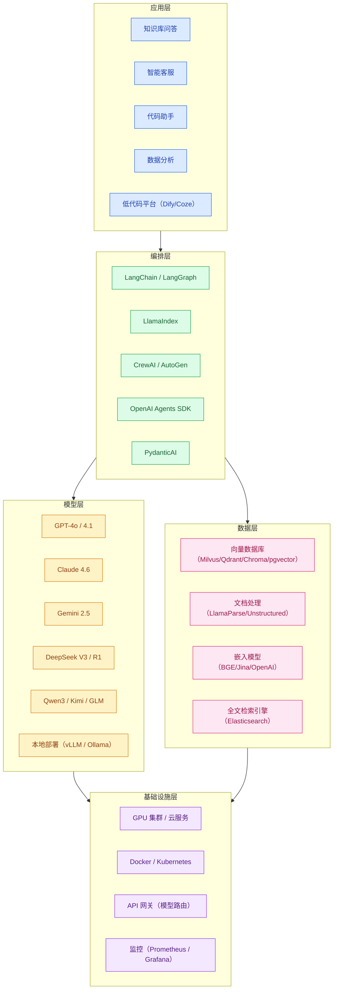

# AI 应用方法论与知识图谱

> **创建日期：** 2026-06-06
> **适用人群：** 后端开发者转型 AI 应用工程师

---

## 一、AI 应用知识图谱总览

---

## 二、AI 应用开发方法论

### 2.1 五步开发循环

| 步骤 | 核心问题 | 典型产出 | 关键原则 |
|------|----------|----------|----------|
| **需求分析** | 用户的真实痛点是什么？AI 是不是最佳方案？ | 需求文档、场景定义 | 不要为了用 AI 而用 AI，传统方案能解决的不要上大模型 |
| **方案设计** | 用什么架构？选什么模型？数据怎么来？ | 架构图、技术选型文档 | 简单场景用 RAG，复杂场景考虑 Agent；先选最便宜的模型 |
| **快速实现** | 先把端到端链路跑通，不要过早优化 | 可运行的 Demo | 一个能工作的丑陋 RAG，胜过一个漂亮但没接入检索的方案 |
| **效果评估** | 怎么衡量好坏？用户满意吗？ | 评估指标、用户反馈 | 从第一天开始建立评估集（20-50 个 QA 对），每次改动都打分 |
| **迭代优化** | 哪里是瓶颈？怎么提升？ | 优化方案、A/B 测试报告 | 瓶颈通常在检索环节，优先优化检索质量 |

### 2.2 核心设计原则

::: tip 原则一：先搭管道，再优化
端到端的链路比任何单一环节的优化都重要。先确保"用户提问 → 模型回答"完整可用，再逐一优化分块、检索、生成等环节。
:::

::: tip 原则二：用评估驱动迭代
没有评估的优化是盲目的。每次改动前记录当前指标，改动后对比变化。如果指标没提升，回退改动。
:::

::: tip 原则三：简单优于复杂
- 能用 Prompt 解决就不上 RAG
- 能用单 Agent 解决就不上多 Agent
- 能用 API 调用就不自己部署模型
- 能用 Chroma 就不上 Milvus
:::

::: tip 原则四：成本意识贯穿始终
每个设计决策都要考虑成本。Token 消耗、GPU 资源、API 调用次数都是钱。建立成本模型，在性能和成本之间找到平衡点。
:::

---

## 三、AI 应用工程师能力模型

### 3.1 能力分层

### 3.2 各阶段学习路径

| 阶段 | 周期 | 目标 | 核心产出 | 关键里程碑 |
|------|------|------|----------|------------|
| **基础认知** | 2-4 周 | 理解 AI 能做什么、不能做什么 | 一个可运行的 ChatBot Demo | 能独立调用 API 完成对话 |
| **RAG 实战** | 3-4 周 | 掌握生产中最常用的 AI 技术 | 一个本地知识库问答系统 | RAGAS 评估得分 > 0.7 |
| **Agent 进阶** | 3-4 周 | 让 AI 从"回答问题"到"执行任务" | 一个带工具调用的 Agent 应用 | Agent 能自主完成 3 步以上任务 |
| **生产落地** | 2-4 周 | 将 Demo 变成可上线的产品 | 可部署的企业级 AI 应用 | 通过安全审查和性能测试 |

---

## 四、技术栈全景图

---

## 五、软件工程师转型 AI 的关键原则

### 5.1 你不需要从头训练模型

AI 应用工程师的工作不是训练模型，而是将 **Transformers、检索、Agent** 三个原语组合成产品。就像后端工程师不需要自己写数据库，AI 应用工程师不需要自己训练模型。

### 5.2 评估是唯一的导航仪

从第一天开始建立评估集。没有评估，你无法知道：
- 改动是否有效？
- 新模型是否更好？
- 系统是否在退化？

### 5.3 不要过早引入多 Agent

绝大多数项目应该从单 Agent 起步。先明确工具边界，再局部引入多 Agent。多 Agent 增加了复杂度，但不一定提升效果。

### 5.4 成本是设计约束，不是事后考虑

每个 API 调用都花钱。从设计阶段就考虑：
- 这个场景真的需要最贵的模型吗？
- 能用缓存减少调用吗？
- 能否用更便宜的模型处理简单任务？

---

## 六、推荐学习资源

| 类型 | 资源 | 说明 |
|------|------|------|
| 课程 | DeepLearning.AI Short Courses | LLM/RAG/Agent 短期课程，免费 |
| 文档 | LangChain 官方文档 | Agent 编排框架权威参考 |
| 文档 | LlamaIndex 官方文档 | RAG 和文档智能权威参考 |
| 协议 | MCP 官方规范（modelcontextprotocol.io） | AI 工具标准化协议 |
| 书籍 | 《Building LLM Apps》— Valentina Alto | AI 应用开发入门 |
| 实践 | OpenAI Cookbook | 官方最佳实践代码示例 |
| 社区 | GitHub Trending（LangChain/AutoGPT 等） | 跟踪 AI 应用最新动态 |
| 博客 | 各大厂技术博客（美团/字节/阿里） | 企业 AI 落地实战案例 |

---

## 面试高频题

### Q1: AI 应用开发与传统软件开发的核心区别是什么？

**详细答案：** 最大的区别就一个词：不确定性。传统开发你写 `if (balance < amount) throw Exception`，一万次都一样。但 LLM 你给我同一个 Prompt 发两次，返回结果措辞可能完全不同，有时候甚至结论不一样。我们第一次上线客服 Bot 的时候，测试集里的 50 个问题都答对了，结果上线第二天同一个"如何退货"的问题，模型偶尔说"7 天无理由退货"，偶尔说"14 天内可以退"——Prompt 一模一样，只是换了种表达。这件事直接逼我们建立了 Eval Set 机制，每次改 Prompt 或切模型，先跑一遍 50 道标准题的评估集，准确率掉 5% 就不让上线。

另一个区别是排 bug 的思路。传统开发你打个断点就能看到变量值，AI 应用排 bug 是在问"模型为什么这么说"——可能是检索回来的文档不对，可能是 Prompt 没约束好，也可能是分块把关键信息切断了。我们后来养成了一个习惯，每次排查先看三件事：检索返回的 top-3 文档对不对、Prompt 模板有没有被污染、Chunk 大小合不合理。80% 的问题在这三步里就能定位。

### Q2: 五步开发循环中，为什么将"效果评估"放在"快速实现"之后？

**详细答案：** 我们踩过"过早优化"的坑。在搭知识库问答系统的时候，还没把检索链路跑通，我就花了两天调 Chunk 大小和 Embedding 模型，自认为调到了最优。结果把检索接上 LLM 之后发现，输出格式全是乱的——Prompt 里少写了一个关键约束，之前调的那些参数全白干了，因为链路没跑通根本没法验证。

后来学乖了，先拿最默认的配置把端到端链路跑通——Chunk 500、Embedding 用 text-embedding-3-small、Prompt 最简单的"根据以下内容回答问题"。虽然第一个版本准确率只有大概 65%，但链路是通的。然后拿这个基线版本跑 30 道测试题，人工标注了标准答案，才正式开始迭代。每改一次分块策略或 Prompt 模板，跑一遍评估集出分数，有效的留着，没效果的退回去。这种"基线→评估→迭代"的节奏让我少走了很多冤枉路。

### Q3: 在 AI 应用开发中，为什么说"简单优于复杂"是一个核心设计原则？

**详细答案：** 这是我们血的教训换来的原则。早期做了一个"智能客服 + 工单系统联动"的需求，技术选型时觉得多 Agent 听起来高级——一个 Agent 负责意图识别，一个负责知识检索，一个负责工单操作，三个 Agent 互相通信。结果实际效果还不如一个精心写的单 Agent + 工具调用。三个 Agent 之间消息经常断——Agent A 说"用户想退货"，Agent B 理解成"用户想换货"，Agent C 收到的工单类型就错了。用户看到的是客服机器人答非所问，我们后台看到的是三个 Agent 状态对不齐，整整调了两周才勉强能用。

后来把这个场景简化成单 Agent + 两个工具函数（search_knowledge_base、create_ticket），准确率从大概 78% 提到了 91%，响应时间从平均 6 秒降到了 2 秒。所以我现在判断要不要加复杂度的标准就两条：一是现有方案是不是真的解决不了了，二是加复杂度带来的提升能不能量化。如果加一个 Agent 只提升 2% 但复杂度翻倍，不值得。

### Q4: 从后端工程师转型 AI 应用工程师，哪些能力可以复用？哪些需要从零学习？

**详细答案：** 我自己就是后端转过来的，体感是大概 60% 的经验能直接复用。API 设计、缓存策略、数据库选型这些完全能用上——你设计一个 RAG 服务的对外 API，本质上还是 RESTful 那一套，鉴权、限流、监控一个都不能少。我们 RAG 项目的 API 网关、日志收集、CI/CD 全部是我用后端经验搭的，这部分转换成本几乎为零。

需要从零啃的主要是三块。一是 LLM 的工作原理——你得理解 Token 是什么、上下文窗口怎么限制、Temperature 怎么影响输出、为什么模型有时候会"胡说八道"。这块我花了大概两周，把 Andrej Karpathy 的讲座和 OpenAI 的 Cookbook 全啃了一遍。二是 AI 特有的架构模式——RAG、Agent、Function Calling，这些跟传统的 CRUD 逻辑完全不同，得建立新的思维模型。我建议先做一个小项目——比如给自己搭个代码知识库问答工具，从分块、向量化到检索、生成全部走一遍，比看 100 篇博客都有用。三是评估体系——传统开发的测试就是 pass/fail，AI 的评估是连续的、多维度的，得学 RAGAS 这类工具。总体来说两个月脱产学习 + 一个实战项目，应该够用了。

### Q5: 在 AI 应用开发中，为什么需要建立成本模型？如何平衡性能与成本？

**详细答案：** 成本模型是 AI 应用上线前必须算的一笔账。我们项目的客服 Bot 上线第一周没做成本监控，觉得 GPT-4o-mini 那么便宜问题不大。结果周末回来一看，七天烧了将近 900 刀——日均 2000 次调用，每次平均 600 Token 输入 + 200 Token 输出，按 $0.15/百万输入 Token 算下来每天就是将近 30 刀。如果用户量翻十倍，一个月 API 费就过万了。

我们的分层策略很简单：给请求按复杂度打分。简单的 FAQ（"退货政策是什么"）走 DeepSeek V3，每百万 Token 才 $0.3，成本是 GPT-4o 的十分之一；中等复杂度的（需要多步推理的产品对比）走 GPT-4o-mini；真正需要强推理的（理解用户拐弯抹角的投诉意图）才用 GPT-4o。加上语义缓存——同一个问题 24 小时内有人问过就直接返回缓存——缓存命中率大概 35%，又省了一截。现在日均 Token 消耗从 400 万降到了 180 万，月成本控制在 2000 元以内。关键是做了成本监控面板，每天推送 API 费用，超过了阈值自动告警。

### Q6: 什么是"AI 应用知识图谱"？它对 AI 应用工程师有什么价值？

**详细答案：** 知识图谱就是把 AI 应用开发要学的所有东西画成了一张地图，告诉你什么在什么地方、先学啥后学啥。我当时从后端转过来最痛苦的就是不知道学什么——Transformer 要看吗？RAG 和 Agent 先学哪个？MCP 是什么要不要马上去看？这张图帮我解决的就是"信息焦虑"。

对我个人来说，知识图谱最大的价值是帮我看清依赖关系。比如你想学 Agent，得先搞定 RAG 和 Prompt 工程——因为 Agent 本质上就是在 RAG 基础上加了工具调用和决策循环。你没搞懂 RAG 就去做 Agent，就像没学数组就去写链表，底子没打好后面肯定翻车。还有一个实际好处是面试导航——面 AI 应用工程师，面试官问的问题基本不出这张图的范围。你可以对着图逐块 check：LLM 基础 ok 了没、RAG 评估做了没、Agent 多模态碰过没、安全注入防范了解过没。哪些块还是空白，就说明面试到那里可能答不上来。

---

## 参考资料

- [DeepLearning.AI Short Courses](https://www.deeplearning.ai/short-courses/)
- [LangChain 官方文档](https://docs.langchain.com)
- [OpenAI Cookbook](https://cookbook.openai.com)