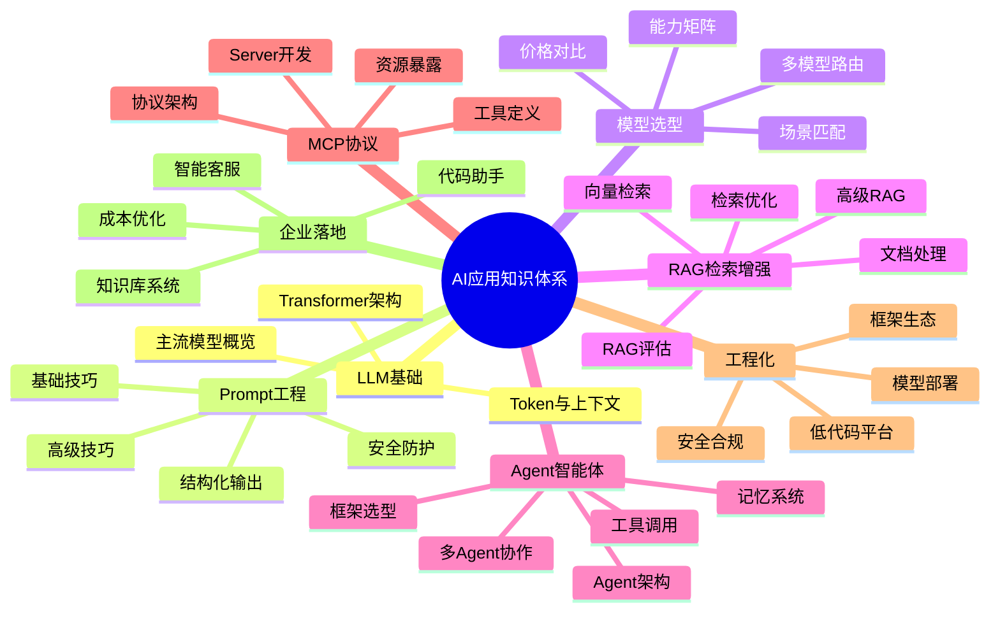
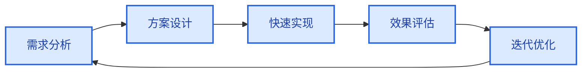
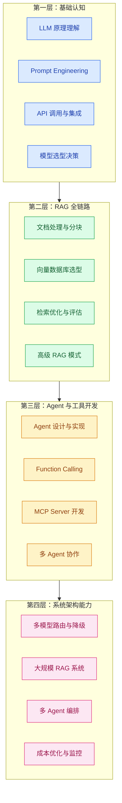
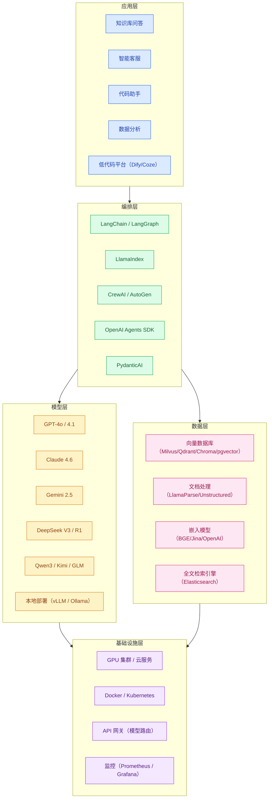

# AI 应用方法论与知识图谱

> **创建日期：** 2026-06-06
> **适用人群：** 后端开发者转型 AI 应用工程师

---

## 一、AI 应用知识图谱总览

---

## 二、AI 应用开发方法论

### 2.1 五步开发循环

| 步骤 | 核心问题 | 典型产出 | 关键原则 |
|------|----------|----------|----------|
| **需求分析** | 用户的真实痛点是什么？AI 是不是最佳方案？ | 需求文档、场景定义 | 不要为了用 AI 而用 AI，传统方案能解决的不要上大模型 |
| **方案设计** | 用什么架构？选什么模型？数据怎么来？ | 架构图、技术选型文档 | 简单场景用 RAG，复杂场景考虑 Agent；先选最便宜的模型 |
| **快速实现** | 先把端到端链路跑通，不要过早优化 | 可运行的 Demo | 一个能工作的丑陋 RAG，胜过一个漂亮但没接入检索的方案 |
| **效果评估** | 怎么衡量好坏？用户满意吗？ | 评估指标、用户反馈 | 从第一天开始建立评估集（20-50 个 QA 对），每次改动都打分 |
| **迭代优化** | 哪里是瓶颈？怎么提升？ | 优化方案、A/B 测试报告 | 瓶颈通常在检索环节，优先优化检索质量 |

### 2.2 核心设计原则

::: tip 原则一：先搭管道，再优化
端到端的链路比任何单一环节的优化都重要。先确保"用户提问 → 模型回答"完整可用，再逐一优化分块、检索、生成等环节。
:::

::: tip 原则二：用评估驱动迭代
没有评估的优化是盲目的。每次改动前记录当前指标，改动后对比变化。如果指标没提升，回退改动。
:::

::: tip 原则三：简单优于复杂
- 能用 Prompt 解决就不上 RAG
- 能用单 Agent 解决就不上多 Agent
- 能用 API 调用就不自己部署模型
- 能用 Chroma 就不上 Milvus
:::

::: tip 原则四：成本意识贯穿始终
每个设计决策都要考虑成本。Token 消耗、GPU 资源、API 调用次数都是钱。建立成本模型，在性能和成本之间找到平衡点。
:::

---

## 三、AI 应用工程师能力模型

### 3.1 能力分层

### 3.2 各阶段学习路径

| 阶段 | 周期 | 目标 | 核心产出 | 关键里程碑 |
|------|------|------|----------|------------|
| **基础认知** | 2-4 周 | 理解 AI 能做什么、不能做什么 | 一个可运行的 ChatBot Demo | 能独立调用 API 完成对话 |
| **RAG 实战** | 3-4 周 | 掌握生产中最常用的 AI 技术 | 一个本地知识库问答系统 | RAGAS 评估得分 > 0.7 |
| **Agent 进阶** | 3-4 周 | 让 AI 从"回答问题"到"执行任务" | 一个带工具调用的 Agent 应用 | Agent 能自主完成 3 步以上任务 |
| **生产落地** | 2-4 周 | 将 Demo 变成可上线的产品 | 可部署的企业级 AI 应用 | 通过安全审查和性能测试 |

---

## 四、技术栈全景图

---

## 五、软件工程师转型 AI 的关键原则

### 5.1 你不需要从头训练模型

AI 应用工程师的工作不是训练模型，而是将 **Transformers、检索、Agent** 三个原语组合成产品。就像后端工程师不需要自己写数据库，AI 应用工程师不需要自己训练模型。

### 5.2 评估是唯一的导航仪

从第一天开始建立评估集。没有评估，你无法知道：
- 改动是否有效？
- 新模型是否更好？
- 系统是否在退化？

### 5.3 不要过早引入多 Agent

绝大多数项目应该从单 Agent 起步。先明确工具边界，再局部引入多 Agent。多 Agent 增加了复杂度，但不一定提升效果。

### 5.4 成本是设计约束，不是事后考虑

每个 API 调用都花钱。从设计阶段就考虑：
- 这个场景真的需要最贵的模型吗？
- 能用缓存减少调用吗？
- 能否用更便宜的模型处理简单任务？

---

## 六、推荐学习资源

| 类型 | 资源 | 说明 |
|------|------|------|
| 课程 | DeepLearning.AI Short Courses | LLM/RAG/Agent 短期课程，免费 |
| 文档 | LangChain 官方文档 | Agent 编排框架权威参考 |
| 文档 | LlamaIndex 官方文档 | RAG 和文档智能权威参考 |
| 协议 | MCP 官方规范（modelcontextprotocol.io） | AI 工具标准化协议 |
| 书籍 | 《Building LLM Apps》— Valentina Alto | AI 应用开发入门 |
| 实践 | OpenAI Cookbook | 官方最佳实践代码示例 |
| 社区 | GitHub Trending（LangChain/AutoGPT 等） | 跟踪 AI 应用最新动态 |
| 博客 | 各大厂技术博客（美团/字节/阿里） | 企业 AI 落地实战案例 |

---

## 面试高频题

### Q1: AI 应用开发与传统软件开发的核心区别是什么？

**详细答案：** AI 应用开发与传统软件开发有本质区别。传统软件开发的输入是确定的规则（if-else、循环、数据库查询），输出是确定性的结果——同样的输入永远产生同样的输出。而 AI 应用开发的核心是"概率性系统"：LLM 面对同样的 Prompt，每次可能产生不同的输出，这带来了传统开发中很少遇到的"非确定性"挑战。因此，AI 应用工程师需要建立一套全新的质量保障体系——评估集（Eval Set），用 20-50 个标准 QA 对来量化评估每次改动的效果，而不是依赖传统的单元测试来验证行为。

另一个关键区别在于瓶颈定位方式。传统软件开发中，性能瓶颈通常可以通过 Profiler 明确追踪到某个函数或数据库查询。但在 AI 应用中，效果瓶颈可能出现在任何一个环节：Prompt 设计不够好、检索到的文档不相关、Chunk 大小不合适、Embedding 模型选择不当，甚至 LLM 自身的能力限制。这要求 AI 应用工程师具备"端到端思维"——从用户提问到模型回答的完整链路中，系统性地排查每个环节。此外，AI 应用开发中成本意识是贯穿始终的设计约束，每个 Token 消耗都是真金白银，这与传统软件"计算资源相对廉价"的假设完全不同。

### Q2: 五步开发循环中，为什么将"效果评估"放在"快速实现"之后？

**详细答案：** 五步开发循环的顺序设计反映了"先跑通、再优化"的核心哲学。在 AI 应用开发中，一个常见陷阱是过早陷入优化——在端到端链路还没跑通之前，就开始纠结 Chunk 大小的最优值、Embedding 模型的选择、Rerank 策略的配置。然而，这些优化在孤立的环节中往往无法验证其对最终效果的真实影响。把"快速实现"放在"效果评估"之前，意味着先用最朴素的方式（默认参数、最简单的 Prompt）把整个链路跑通，让系统能够"用户提问 → 返回答案"。只有在这个基础上，评估才有意义——你需要一个可运行的基线系统来作为对比参照。

此外，"效果评估"的建立需要真实的系统输出来构建评估集。在快速实现阶段产出的结果，可以用于与业务方一起确认"什么是好的答案"，从而建立标注标准。如果一开始就试图建立完美的评估集，往往会陷入"理想化假设"——没有实际系统输出的参照，评估集的 ground truth 可能与模型实际能产生的结果脱节。因此，先快速实现一个可工作的 Demo，用它来收集用户反馈、建立评估集，再基于评估指标进行迭代优化，这是一个更高效、更务实的路径。

### Q3: 在 AI 应用开发中，为什么说"简单优于复杂"是一个核心设计原则？

**详细答案：** "简单优于复杂"原则在 AI 应用开发中尤为重要，主要基于三个层面的考量。第一，每一层复杂性都会引入新的故障点。多 Agent 系统比单 Agent 多了通信协议、状态同步、任务分配等环节，任何一个环节出问题都可能导致整个系统不可用。而 AI 系统本身具有非确定性，当多个非确定性组件串联时，系统的整体可靠性呈指数级下降。因此，能用 Prompt 解决的问题就不要上 RAG，能用单 Agent 解决的就不上多 Agent——这不是偷懒，而是对系统可靠性的负责。

第二，简单方案的可维护性和可调试性远优于复杂方案。当系统出现"答非所问"时，在一个简单的 Prompt 方案中，你可以直接检查 Prompt 设计和模型输出；而在一个复杂的多 Agent 系统中，你需要排查是哪个 Agent 出了问题、Agent 之间的消息传递是否正确、工具调用是否成功等。调试成本随架构复杂度指数增长。第三，简单方案通常成本更低、迭代更快。一个精巧的 Prompt 调整可以在几分钟内完成并验证效果，而引入一个新的 Agent 框架可能需要数天的开发和测试。在 AI 应用快速迭代的背景下，保持简单意味着更快的实验速度和更低的试错成本。

### Q4: 从后端工程师转型 AI 应用工程师，哪些能力可以复用？哪些需要从零学习？

**详细答案：** 后端工程师转型 AI 应用工程师有大量可复用的能力。首先是系统设计能力——API 设计、缓存策略、数据库选型、分布式架构、容错与降级等后端核心技能在 AI 应用中间样适用。例如，设计一个 RAG 系统的 API 层本质上就是设计一个 Web 服务，涉及请求路由、并发控制、错误处理等传统后端技能。其次是工程化思维——版本管理、CI/CD、监控告警、日志收集等，这些是 AI 应用从 Demo 走向生产的关键支撑。此外，后端工程师对数据管道的理解（ETL、消息队列、批处理）也可以直接迁移到文档处理、向量索引构建等环节。

需要从零学习的主要有三个领域。第一是 LLM 的工作原理——理解 Transformer 架构、Token 概念、上下文窗口限制、模型的能力边界（能做什么、不能做什么），这是 AI 应用的"第一性原理"。第二是 AI 特有的架构模式——RAG、Agent、Function Calling 等，这些模式与传统 CRUD 应用完全不同，需要建立新的思维模型。第三是 AI 质量评估体系——与传统软件"正确/错误"的二元判断不同，AI 应用的评估是连续的、多维度的（准确性、忠实度、相关性、延迟等），需要学习 RAGAS、LangSmith 等评估工具和方法论。学习路径建议按照能力模型四层递进：基础认知（2-4周）→ RAG 实战（3-4周）→ Agent 进阶（3-4周）→ 生产落地（2-4周）。

### Q5: 在 AI 应用开发中，为什么需要建立成本模型？如何平衡性能与成本？

**详细答案：** AI 应用开发与传统软件开发最大的成本差异在于：传统软件的边际成本趋近于零（多处理一个请求不增加费用），而 AI 应用的每次 API 调用都是真金白银的成本。一个简单的 FAQ 问答用 GPT-4o 可能消耗 0.01 美元，看似微不足道，但乘以每天 10 万次调用，就是每天 1000 美元——每月 3 万美元。如果换成 DeepSeek V3（价格约为 GPT-4o 的 1/10），同样的调用量每天只需 100 美元。这就是成本模型的核心价值：在规模化之前，量化每个决策的成本影响，避免"上线即破产"。

平衡性能与成本的最佳实践是分层策略。将用户请求按复杂度分为三个层级：简单任务（如 FAQ 问答、意图识别）使用最便宜的模型（DeepSeek V3 / Gemini Flash，每百万 Token 约 $0.3）；中等任务（如知识库问答、内容生成）使用中等模型（Claude Sonnet / GPT-4o，每百万 Token 约 $2-3）；复杂推理任务（如数学证明、多步调试）使用顶级模型（o3 / Claude Opus，每百万 Token 约 $5-10）。此外，还需要结合缓存策略（相同问题不重复调用 LLM）、批处理（将多个简单请求合并）、语义缓存（相似问题复用结果）等手段进一步降低成本。关键是建立成本监控仪表盘，实时追踪每个 API 的调用次数和费用，将成本指标纳入日常运维。

### Q6: 什么是"AI 应用知识图谱"？它对 AI 应用工程师有什么价值？

**详细答案：** AI 应用知识图谱是一个结构化的知识体系框架，它将 AI 应用开发所需的知识按领域和层级组织成一张"地图"。图谱的核心分支包括：LLM 基础（Transformer 架构、Token 机制）、Prompt 工程（基础/高级技巧、结构化输出）、模型选型（能力矩阵、价格对比、场景匹配）、RAG 检索增强（文档处理、向量检索、评估与优化）、Agent 智能体（架构设计、工具调用、多 Agent 协作）、MCP 协议（协议架构、工具定义、Server 开发）、工程化（模型部署、框架生态、安全合规）以及企业落地（知识库系统、智能客服、成本优化）。

对 AI 应用工程师而言，知识图谱的核心价值在于建立"全局视野"和"知识导航"。AI 领域发展极快，新技术层出不穷，很容易陷入"追新逐热"的焦虑中。知识图谱帮助你理清各知识模块之间的关系和依赖——例如，在学习 Agent 之前，必须先掌握 RAG 和 Prompt 工程；在学习 MCP Server 开发之前，必须先理解 Agent 的工具调用机制。它也是一张"能力地图"：你可以对照图谱评估自己当前处于哪个层级、哪些模块还有欠缺，从而制定有方向的学习计划，而不是随机地浏览碎片化的技术文章。最终，知识图谱帮助 AI 应用工程师从"会用 API"的初级水平，逐步成长为能够设计复杂 AI 系统的架构师。

---

## 参考资料

- [DeepLearning.AI Short Courses](https://www.deeplearning.ai/short-courses/)
- [LangChain 官方文档](https://docs.langchain.com)
- [OpenAI Cookbook](https://cookbook.openai.com)