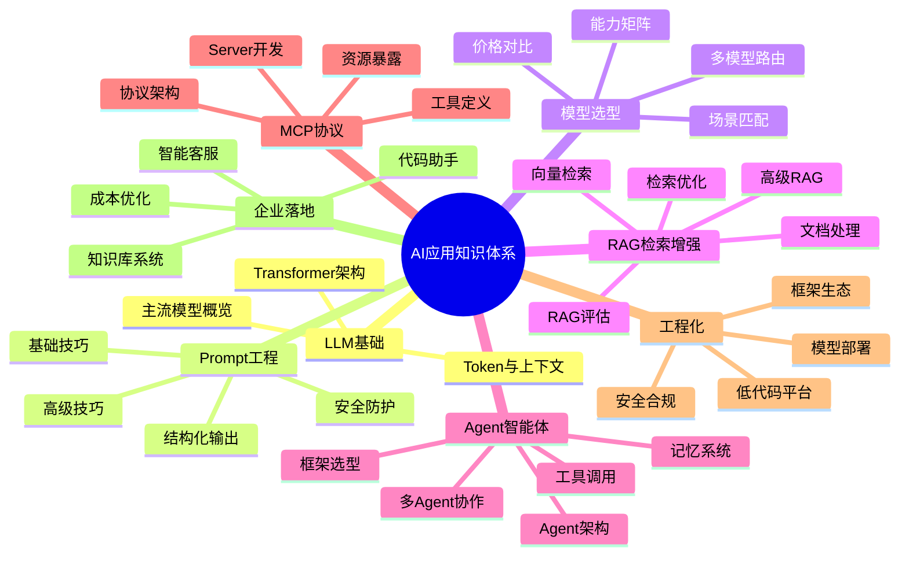
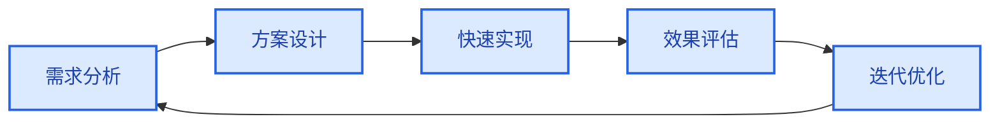
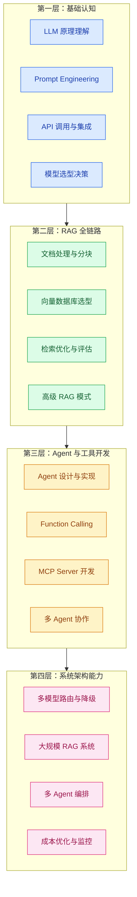
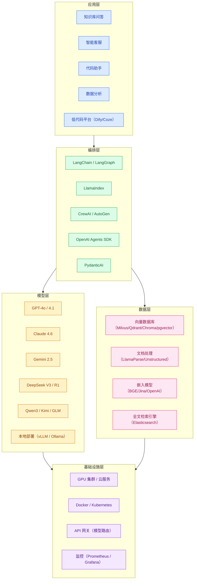

# AI 应用方法论与知识图谱

> **创建日期：** 2026-06-06
> **适用人群：** 后端开发者转型 AI 应用工程师

---

## 一、AI 应用知识图谱总览

---

## 二、AI 应用开发方法论

### 2.1 五步开发循环

| 步骤 | 核心问题 | 典型产出 | 关键原则 |
|------|----------|----------|----------|
| **需求分析** | 用户的真实痛点是什么？AI 是不是最佳方案？ | 需求文档、场景定义 | 不要为了用 AI 而用 AI，传统方案能解决的不要上大模型 |
| **方案设计** | 用什么架构？选什么模型？数据怎么来？ | 架构图、技术选型文档 | 简单场景用 RAG，复杂场景考虑 Agent；先选最便宜的模型 |
| **快速实现** | 先把端到端链路跑通，不要过早优化 | 可运行的 Demo | 一个能工作的丑陋 RAG，胜过一个漂亮但没接入检索的方案 |
| **效果评估** | 怎么衡量好坏？用户满意吗？ | 评估指标、用户反馈 | 从第一天开始建立评估集（20-50 个 QA 对），每次改动都打分 |
| **迭代优化** | 哪里是瓶颈？怎么提升？ | 优化方案、A/B 测试报告 | 瓶颈通常在检索环节，优先优化检索质量 |

### 2.2 核心设计原则

::: tip 原则一：先搭管道，再优化
端到端的链路比任何单一环节的优化都重要。先确保"用户提问 → 模型回答"完整可用，再逐一优化分块、检索、生成等环节。
:::

::: tip 原则二：用评估驱动迭代
没有评估的优化是盲目的。每次改动前记录当前指标，改动后对比变化。如果指标没提升，回退改动。
:::

::: tip 原则三：简单优于复杂
- 能用 Prompt 解决就不上 RAG
- 能用单 Agent 解决就不上多 Agent
- 能用 API 调用就不自己部署模型
- 能用 Chroma 就不上 Milvus
:::

::: tip 原则四：成本意识贯穿始终
每个设计决策都要考虑成本。Token 消耗、GPU 资源、API 调用次数都是钱。建立成本模型，在性能和成本之间找到平衡点。
:::

---

## 三、AI 应用工程师能力模型

### 3.1 能力分层

### 3.2 各阶段学习路径

| 阶段 | 周期 | 目标 | 核心产出 | 关键里程碑 |
|------|------|------|----------|------------|
| **基础认知** | 2-4 周 | 理解 AI 能做什么、不能做什么 | 一个可运行的 ChatBot Demo | 能独立调用 API 完成对话 |
| **RAG 实战** | 3-4 周 | 掌握生产中最常用的 AI 技术 | 一个本地知识库问答系统 | RAGAS 评估得分 > 0.7 |
| **Agent 进阶** | 3-4 周 | 让 AI 从"回答问题"到"执行任务" | 一个带工具调用的 Agent 应用 | Agent 能自主完成 3 步以上任务 |
| **生产落地** | 2-4 周 | 将 Demo 变成可上线的产品 | 可部署的企业级 AI 应用 | 通过安全审查和性能测试 |

---

## 四、技术栈全景图

---

## 五、软件工程师转型 AI 的关键原则

### 5.1 你不需要从头训练模型

AI 应用工程师的工作不是训练模型，而是将 **Transformers、检索、Agent** 三个原语组合成产品。就像后端工程师不需要自己写数据库，AI 应用工程师不需要自己训练模型。

### 5.2 评估是唯一的导航仪

从第一天开始建立评估集。没有评估，你无法知道：
- 改动是否有效？
- 新模型是否更好？
- 系统是否在退化？

### 5.3 不要过早引入多 Agent

绝大多数项目应该从单 Agent 起步。先明确工具边界，再局部引入多 Agent。多 Agent 增加了复杂度，但不一定提升效果。

### 5.4 成本是设计约束，不是事后考虑

每个 API 调用都花钱。从设计阶段就考虑：
- 这个场景真的需要最贵的模型吗？
- 能用缓存减少调用吗？
- 能否用更便宜的模型处理简单任务？

---

## 六、推荐学习资源

| 类型 | 资源 | 说明 |
|------|------|------|
| 课程 | DeepLearning.AI Short Courses | LLM/RAG/Agent 短期课程，免费 |
| 文档 | LangChain 官方文档 | Agent 编排框架权威参考 |
| 文档 | LlamaIndex 官方文档 | RAG 和文档智能权威参考 |
| 协议 | MCP 官方规范（modelcontextprotocol.io） | AI 工具标准化协议 |
| 书籍 | 《Building LLM Apps》— Valentina Alto | AI 应用开发入门 |
| 实践 | OpenAI Cookbook | 官方最佳实践代码示例 |
| 社区 | GitHub Trending（LangChain/AutoGPT 等） | 跟踪 AI 应用最新动态 |
| 博客 | 各大厂技术博客（美团/字节/阿里） | 企业 AI 落地实战案例 |