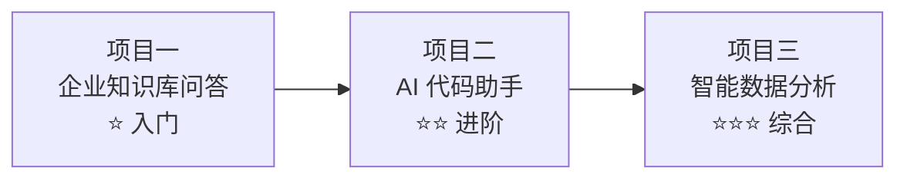

# 综合实战项目总览

> **创建日期：** 2026-06-06
> **前置知识：** 全部 AI 应用技术栈

---

## 一、项目路线图

三个项目由浅入深，覆盖企业 AI 应用的核心场景：



| 项目 | 难度 | 核心技术 | 企业场景 |
|------|------|----------|----------|
| 项目一：企业知识库问答 | ⭐ | RAG + 向量数据库 + FastAPI | 内部知识库、客服系统 |
| 项目二：AI 代码助手 | ⭐⭐ | RAG + Agent + Function Calling | 研发效能、代码审查 |
| 项目三：智能数据分析 | ⭐⭐⭐ | NL2SQL + Agent + 可视化 | BI 分析、数据查询 |

---

## 二、技术栈要求

| 层级 | 技术 | 说明 |
|------|------|------|
| **后端** | Python 3.11+ / FastAPI | Web 框架 |
| **前端** | Vue3 + Vite + Element Plus | UI 框架 |
| **AI 模型** | OpenAI API / Qwen API / Ollama 本地 | 多模型支持 |
| **向量数据库** | Chroma / Milvus Lite | 向量存储 |
| **数据库** | SQLite / PostgreSQL | 业务数据 |
| **部署** | Docker Compose | 一键部署 |

---

## 三、开发环境准备

```bash
# 1. Python 环境
python -m venv venv
source venv/bin/activate  # Windows: venv\Scripts\activate
pip install fastapi uvicorn chromadb openai langchain

# 2. 前端环境
npm create vite@latest frontend -- --template vue-ts
cd frontend
npm install element-plus

# 3. 可选：本地模型
ollama pull qwen2.5:7b
```

---

## 四、项目代码仓库

```
code-projects/ai-projects/
├── project1-knowledge-qa/     # 项目一
├── project2-code-assistant/   # 项目二
└── project3-data-analysis/    # 项目三
```

---

## 五、学习建议

1. **先通读项目方案文档**，理解系统架构和设计思路
2. **按顺序实现**，项目一 → 项目二 → 项目三，难度递进
3. **每个项目先跑通 MVP**，再逐步完善功能
4. **关注架构设计**，代码实现可以后续优化
5. **项目一** 可以直接用 Dify 快速搭建，理解原理后再手写代码

---

## 面试高频题

### Q1: 三个实战项目的难度递进关系是什么？每个项目最核心的技术是什么？

**详细答案：** 三个项目按照"基础 → 进阶 → 综合"的递进关系设计，覆盖了企业 AI 应用的核心技术栈。项目一（企业知识库问答）是入门级，核心挑战在于"如何让 AI 基于知识库回答问题"。它的核心技术在 RAG 全链路——文档解析、分块策略、Embedding、向量检索、混合检索（向量+BM25）、Rerank 重排序、Prompt 拼接。项目一比的是"谁把 RAG 做得更精细"，而不是"谁用了更复杂的架构"。掌握项目一意味着你能够独立交付企业中 80% 的 AI 应用需求。

项目二（AI 代码助手）是进阶级，核心挑战在于"如何让 AI 主动执行任务而非被动回答问题"。它的核心技术在 Agent 架构——任务分析、工具调用（Function Calling）、多 Agent 协作、代码库 RAG 索引。项目二引入了一个关键转变：从"检索→生成"的一步式流程，变为"分析→检索→生成→检查→修复"的循环式流程。这个项目让你理解 Agent 的设计哲学——不是让 LLM 做所有事，而是让 LLM 学会调用工具来完成复杂任务。项目三（智能数据分析）是综合级，核心挑战在于"如何将自然语言转换为精确的结构化查询"。它的核心技术在 NL2SQL——Schema 理解、向量表检索、SQL 生成与校验、多表关联、结果可视化。项目三结合了 RAG（Schema 检索）、Agent（分析决策）和结构化输出（SQL 生成），是最接近企业真实需求的综合项目。

### Q2: 为什么项目一（企业知识库问答）建议先用 Dify 快速搭建，再手写代码？

**详细答案：** 先用 Dify 快速搭建有双重价值。第一是"快速建立全局认知"——Dify 是一个可视化 AI 应用搭建平台，你可以在几小时内拖拽出一个完整的 RAG 系统：上传文档、配置 Embedding 模型、选择向量数据库、设置 LLM、发布 API。这个过程中，你能直观地看到 RAG 系统的每个组件是如何协同工作的，建立一个"上帝视角"的全局理解。很多初学者一上来就手写代码，容易陷入 Chunk 大小、Embedding 模型选择等细节中，而丢失了对整体架构的把握。

第二是"建立效果基线"——Dify 搭出来的系统虽然可能不是最优的，但它是一个"可工作的基线"。你可以用这个基线系统来回答真实问题，观察哪些问题回答得好、哪些回答得差，从而建立评估集和改进方向。然后，当你手写代码重建系统时，就有了一个明确的优化目标——"我写的版本必须比 Dify 版本好"。这种"先山寨、再超越"的学习路径，比你从零手写代码效率更高。此外，Dify 的架构设计（文档处理、向量存储、Prompt 编排、API 发布）本身就体现了 RAG 的最佳实践，手写代码时可以借鉴其设计思路。

### Q3: 在三个项目的技术栈中，为什么选择 FastAPI + Vue3 + Element Plus 这套组合？

**详细答案：** 选择 FastAPI 作为后端框架有明确的工程考量。第一，FastAPI 是 Python 生态中最成熟的异步 Web 框架，与 AI 应用的 Python 技术栈（LangChain、LlamaIndex、OpenAI SDK）天然兼容，不需要跨语言调用。第二，FastAPI 的自动 API 文档生成（Swagger UI）非常适合 AI 应用的快速迭代——每次修改接口后，文档自动更新，前端同学可以直接在文档页面上调试。第三，FastAPI 的异步特性对于 AI 应用至关重要——LLM 调用是典型的 I/O 密集型操作，异步处理可以避免请求阻塞，提高并发性能。

选择 Vue3 + Vite + Element Plus 作为前端框架，是因为这套组合在"开发效率"和"可用性"之间取得了最佳平衡。Vue3 的 Composition API 使得组件逻辑更清晰、更易复用——AI 应用的聊天界面、文档管理、数据可视化等都是典型的组件化场景。Vite 提供了极快的开发体验（热更新秒级响应），对 AI 应用这种需要频繁调试 UI 的项目非常友好。Element Plus 提供了丰富的企业级 UI 组件（表格、表单、对话框、消息提示），可以让开发者专注于业务逻辑而非 UI 细节。这套组合是当前国内前端开发的主流选择，社区活跃、文档完善，降低了学习成本。

### Q4: 从项目一到项目三，技术架构的演进路径是怎样的？

**详细答案：** 三个项目的技术架构演进体现了"从检索到行动、从单步到循环"的 AI 应用复杂度升级。项目一的架构是典型的"请求-响应"模式：用户提问 → 后端 API → RAG 引擎（检索 + 生成）→ 返回答案。这个架构的核心是"检索增强"，所有请求都经过同一条处理链路，没有分支和循环。实现难度在于检索质量的优化，而非架构设计。

项目二的架构升级为"Agent 循环"模式：用户输入 → Agent 分析 → 调用工具（搜索代码库 / 生成代码 / 编译检查 / 代码审查）→ 根据结果决定下一步 → 最终输出。这个架构的核心变化是引入了决策循环——Agent 不再是"一次性生成答案"，而是可以多次调用工具、根据中间结果调整策略。实现难度从"调参优化"变为"架构设计"。项目三的架构进一步升级为"多引擎协作"模式：用户自然语言 → NL2SQL 引擎（生成 SQL）→ 数据库执行 → 分析引擎（解读结果）→ 可视化引擎（生成图表）。这个架构的核心变化是多个专业引擎的协作——每个引擎有自己的职责和输入输出，LLM 扮演"翻译官"和"分析师"两个角色。实现难度在于引擎之间的数据传递和错误处理——如果 SQL 生成错误，如何优雅地反馈和修正。

### Q5: 在项目实战中，Docker Compose 部署方案解决了哪些实际问题？

**详细答案：** Docker Compose 部署方案在 AI 应用项目中解决了三个核心问题。第一是"环境一致性"——AI 应用依赖复杂（Python 版本、CUDA 版本、系统库、向量数据库版本），不同机器上的环境差异很容易导致"在我电脑上能跑，部署后不行"的问题。Docker 将整个运行环境打包成镜像，确保开发、测试、生产环境完全一致。第二是"依赖管理"——AI 应用通常由多个服务组成（后端 API、前端 UI、向量数据库、可选的消息队列），Docker Compose 通过一个 YAML 文件统一编排所有服务的启动顺序、网络配置、数据卷挂载，实现"一键部署"。

第三是"资源隔离和扩展性"——每个服务运行在独立的容器中，Resource（CPU、内存、GPU）可以精确分配。例如，向量数据库容器可以分配更多内存，LLM 推理容器可以挂载 GPU，前端容器只需要少量资源。当某个服务需要扩容时，只需修改 Compose 文件中的副本数即可。此外，对于需要私有化部署的场景（如企业内部使用），Docker Compose 是门槛最低的部署方案——不需要 Kubernetes 集群，只需一台服务器上安装 Docker，一条命令即可启动整个系统。这对中小企业 AI 应用落地非常友好，降低了运维门槛。

---

## 参考资料

- [Dify 官方文档](https://docs.dify.ai)
- [FastAPI 官方文档](https://fastapi.tiangolo.com)
- [Vue3 官方文档](https://vuejs.org)
- [Docker Compose 文档](https://docs.docker.com/compose/)