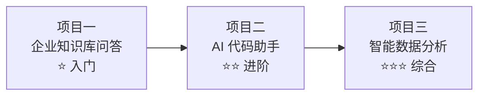

# 综合实战项目总览

> **创建日期：** 2026-06-06
> **前置知识：** 全部 AI 应用技术栈

---

## 一、项目路线图

三个项目由浅入深，覆盖企业 AI 应用的核心场景：



| 项目 | 难度 | 核心技术 | 企业场景 |
|------|------|----------|----------|
| 项目一：企业知识库问答 | ⭐ | RAG + 向量数据库 + FastAPI | 内部知识库、客服系统 |
| 项目二：AI 代码助手 | ⭐⭐ | RAG + Agent + Function Calling | 研发效能、代码审查 |
| 项目三：智能数据分析 | ⭐⭐⭐ | NL2SQL + Agent + 可视化 | BI 分析、数据查询 |

---

## 二、技术栈要求

| 层级 | 技术 | 说明 |
|------|------|------|
| **后端** | Python 3.11+ / FastAPI | Web 框架 |
| **前端** | Vue3 + Vite + Element Plus | UI 框架 |
| **AI 模型** | OpenAI API / Qwen API / Ollama 本地 | 多模型支持 |
| **向量数据库** | Chroma / Milvus Lite | 向量存储 |
| **数据库** | SQLite / PostgreSQL | 业务数据 |
| **部署** | Docker Compose | 一键部署 |

---

## 三、开发环境准备

```bash
# 1. Python 环境
python -m venv venv
source venv/bin/activate  # Windows: venv\Scripts\activate
pip install fastapi uvicorn chromadb openai langchain

# 2. 前端环境
npm create vite@latest frontend -- --template vue-ts
cd frontend
npm install element-plus

# 3. 可选：本地模型
ollama pull qwen2.5:7b
```

---

## 四、项目代码仓库

```
code-projects/ai-projects/
├── project1-knowledge-qa/     # 项目一
├── project2-code-assistant/   # 项目二
└── project3-data-analysis/    # 项目三
```

---

## 五、学习建议

1. **先通读项目方案文档**，理解系统架构和设计思路
2. **按顺序实现**，项目一 → 项目二 → 项目三，难度递进
3. **每个项目先跑通 MVP**，再逐步完善功能
4. **关注架构设计**，代码实现可以后续优化
5. **项目一** 可以直接用 Dify 快速搭建，理解原理后再手写代码