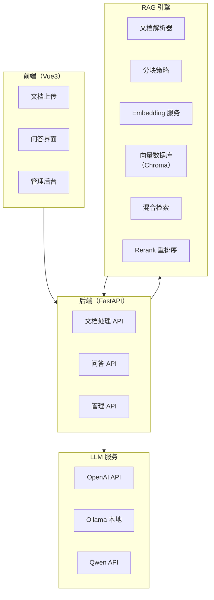

# 项目一：企业知识库问答系统

> **创建日期：** 2026-06-06
> **难度：** ⭐ 入门 | **核心技术：** RAG + 向量数据库 + FastAPI + Vue3

---

## 一、项目概述

构建一个企业级知识库问答系统，支持上传文档、自动构建索引、智能问答，并标注答案来源。

### 核心功能

| 功能 | 说明 |
|------|------|
| 文档上传 | 支持 PDF、Word、Markdown、TXT 格式 |
| 自动索引 | 文档解析 → 分块 → Embedding → 向量存储 |
| 智能问答 | 基于 RAG 的精准问答，标注来源 |
| 对话历史 | 多轮对话，上下文记忆 |
| 管理后台 | 文档管理、问答记录、效果评估 |

---

## 二、系统架构



---

## 三、数据流设计

```
文档上传流程：
  用户上传文件 → 后端接收 → 解析文本 → 分块（512 tokens）
  → 生成 Embedding → 存入 Chroma → 返回成功

问答流程：
  用户提问 → 查询改写 → 混合检索（向量+BM25）
  → Rerank 重排序 → 拼接 Prompt → LLM 生成
  → 返回答案 + 来源标注
```

---

## 四、核心代码实现

### 4.1 后端入口（main.py）

```python
from fastapi import FastAPI, UploadFile, File
from fastapi.middleware.cors import CORSMiddleware
from pydantic import BaseModel
from rag import RAGEngine

app = FastAPI(title="企业知识库问答系统")
app.add_middleware(CORSMiddleware, allow_origins=["*"], ...)

# 初始化 RAG 引擎
rag = RAGEngine(
    embedding_model="text-embedding-3-small",
    vector_db_path="./chroma_db",
    llm_model="gpt-4o-mini"
)

@app.post("/api/documents/upload")
async def upload_document(file: UploadFile = File(...)):
    """上传文档并建立索引"""
    content = await file.read()
    doc_id = rag.index_document(
        content=content,
        filename=file.filename,
        chunk_size=512,
        chunk_overlap=50
    )
    return {"doc_id": doc_id, "status": "indexed"}

class QuestionRequest(BaseModel):
    question: str
    conversation_id: str | None = None

@app.post("/api/qa")
async def ask_question(req: QuestionRequest):
    """问答接口"""
    result = rag.query(
        question=req.question,
        conversation_id=req.conversation_id,
        top_k=5
    )
    return {
        "answer": result["answer"],
        "sources": result["sources"],
        "conversation_id": result["conversation_id"]
    }
```

### 4.2 RAG 引擎（rag/engine.py）

```python
class RAGEngine:
    def __init__(self, embedding_model, vector_db_path, llm_model):
        self.embeddings = OpenAIEmbeddings(model=embedding_model)
        self.vectorstore = Chroma(
            persist_directory=vector_db_path,
            embedding_function=self.embeddings
        )
        self.llm = ChatOpenAI(model=llm_model, temperature=0)
        self.bm25_index = None  # BM25 关键词索引

    def index_document(self, content, filename, chunk_size, chunk_overlap):
        # 1. 文档分块
        splitter = RecursiveCharacterTextSplitter(
            chunk_size=chunk_size,
            chunk_overlap=chunk_overlap
        )
        chunks = splitter.split_text(content)

        # 2. 添加元数据
        metadatas = [{"source": filename, "chunk_id": i} for i in range(len(chunks))]

        # 3. 存入向量数据库
        ids = self.vectorstore.add_texts(chunks, metadatas=metadatas)

        # 4. 更新 BM25 索引
        self._update_bm25_index()

        return ids

    def query(self, question, conversation_id=None, top_k=5):
        # 1. 查询改写（多轮对话）
        rewritten = self._rewrite_query(question, conversation_id)

        # 2. 混合检索
        vector_results = self.vectorstore.similarity_search(rewritten, k=top_k * 2)
        bm25_results = self._bm25_search(rewritten, top_k * 2)

        # 3. RRF 融合
        merged = self._rrf_merge(vector_results, bm25_results, top_k=top_k)

        # 4. Rerank
        reranked = self._rerank(rewritten, merged)

        # 5. 生成答案
        context = "\n\n".join([doc.page_content for doc in reranked])
        answer = self._generate_answer(question, context)

        return {
            "answer": answer,
            "sources": [doc.metadata for doc in reranked],
            "conversation_id": conversation_id
        }
```

### 4.3 前端问答界面（Vue3）

```vue
<template>
  <div class="qa-container">
    <div class="chat-history" ref="chatContainer">
      <div v-for="msg in messages" :key="msg.id" :class="msg.role">
        <div class="content">{{ msg.content }}</div>
        <div v-if="msg.sources" class="sources">
          来源：<span v-for="s in msg.sources">{{ s.source }}</span>
        </div>
      </div>
    </div>
    <div class="input-area">
      <el-input v-model="question" placeholder="请输入问题..."
        @keyup.enter="sendQuestion" />
      <el-button type="primary" @click="sendQuestion">发送</el-button>
    </div>
  </div>
</template>
```

---

## 五、Docker 部署

```yaml
# docker-compose.yml
version: '3.8'
services:
  backend:
    build: ./backend
    ports:
      - "8000:8000"
    volumes:
      - ./chroma_db:/app/chroma_db
    environment:
      - OPENAI_API_KEY=${OPENAI_API_KEY}
      - LLM_MODEL=gpt-4o-mini

  frontend:
    build: ./frontend
    ports:
      - "3000:80"
    depends_on:
      - backend
```

---

## 六、RAGAS 评估

```python
from ragas import evaluate
from ragas.metrics import faithfulness, answer_relevancy

# 评估集
eval_data = {
    "question": ["如何申请年假？", "考勤制度是什么？"],
    "answer": [rag.query(q)["answer"] for q in questions],
    "contexts": [rag.query(q)["contexts"] for q in questions],
    "ground_truth": ["年假需提前3天在OA申请...", "..."],
}

result = evaluate(dataset, metrics=[faithfulness, answer_relevancy])
print(f"忠实度: {result['faithfulness']:.2%}")
print(f"答案相关性: {result['answer_relevancy']:.2%}")
```

---

## 七、扩展方向

- [ ] 多语言支持（中英文混合检索）
- [ ] 权限控制（不同用户看到不同文档）
- [ ] 知识库自动更新（定时同步）
- [ ] 多模态支持（图片+表格问答）