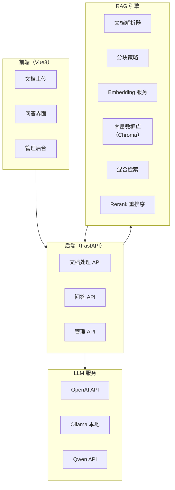

# 项目一：企业知识库问答系统

> **创建日期：** 2026-06-06
> **难度：** ⭐ 入门 | **核心技术：** RAG + 向量数据库 + FastAPI + Vue3

---

## 一、项目概述

构建一个企业级知识库问答系统，支持上传文档、自动构建索引、智能问答，并标注答案来源。

### 核心功能

| 功能 | 说明 |
|------|------|
| 文档上传 | 支持 PDF、Word、Markdown、TXT 格式 |
| 自动索引 | 文档解析 → 分块 → Embedding → 向量存储 |
| 智能问答 | 基于 RAG 的精准问答，标注来源 |
| 对话历史 | 多轮对话，上下文记忆 |
| 管理后台 | 文档管理、问答记录、效果评估 |

---

## 二、系统架构



---

## 三、数据流设计

```
文档上传流程：
  用户上传文件 → 后端接收 → 解析文本 → 分块（512 tokens）
  → 生成 Embedding → 存入 Chroma → 返回成功

问答流程：
  用户提问 → 查询改写 → 混合检索（向量+BM25）
  → Rerank 重排序 → 拼接 Prompt → LLM 生成
  → 返回答案 + 来源标注
```

---

## 四、核心代码实现

### 4.1 后端入口（main.py）

```python
from fastapi import FastAPI, UploadFile, File
from fastapi.middleware.cors import CORSMiddleware
from pydantic import BaseModel
from rag import RAGEngine

app = FastAPI(title="企业知识库问答系统")
app.add_middleware(CORSMiddleware, allow_origins=["*"], ...)

# 初始化 RAG 引擎
rag = RAGEngine(
    embedding_model="text-embedding-3-small",
    vector_db_path="./chroma_db",
    llm_model="gpt-4o-mini"
)

@app.post("/api/documents/upload")
async def upload_document(file: UploadFile = File(...)):
    """上传文档并建立索引"""
    content = await file.read()
    doc_id = rag.index_document(
        content=content,
        filename=file.filename,
        chunk_size=512,
        chunk_overlap=50
    )
    return {"doc_id": doc_id, "status": "indexed"}

class QuestionRequest(BaseModel):
    question: str
    conversation_id: str | None = None

@app.post("/api/qa")
async def ask_question(req: QuestionRequest):
    """问答接口"""
    result = rag.query(
        question=req.question,
        conversation_id=req.conversation_id,
        top_k=5
    )
    return {
        "answer": result["answer"],
        "sources": result["sources"],
        "conversation_id": result["conversation_id"]
    }
```

### 4.2 RAG 引擎（rag/engine.py）

```python
class RAGEngine:
    def __init__(self, embedding_model, vector_db_path, llm_model):
        self.embeddings = OpenAIEmbeddings(model=embedding_model)
        self.vectorstore = Chroma(
            persist_directory=vector_db_path,
            embedding_function=self.embeddings
        )
        self.llm = ChatOpenAI(model=llm_model, temperature=0)
        self.bm25_index = None  # BM25 关键词索引

    def index_document(self, content, filename, chunk_size, chunk_overlap):
        # 1. 文档分块
        splitter = RecursiveCharacterTextSplitter(
            chunk_size=chunk_size,
            chunk_overlap=chunk_overlap
        )
        chunks = splitter.split_text(content)

        # 2. 添加元数据
        metadatas = [{"source": filename, "chunk_id": i} for i in range(len(chunks))]

        # 3. 存入向量数据库
        ids = self.vectorstore.add_texts(chunks, metadatas=metadatas)

        # 4. 更新 BM25 索引
        self._update_bm25_index()

        return ids

    def query(self, question, conversation_id=None, top_k=5):
        # 1. 查询改写（多轮对话）
        rewritten = self._rewrite_query(question, conversation_id)

        # 2. 混合检索
        vector_results = self.vectorstore.similarity_search(rewritten, k=top_k * 2)
        bm25_results = self._bm25_search(rewritten, top_k * 2)

        # 3. RRF 融合
        merged = self._rrf_merge(vector_results, bm25_results, top_k=top_k)

        # 4. Rerank
        reranked = self._rerank(rewritten, merged)

        # 5. 生成答案
        context = "\n\n".join([doc.page_content for doc in reranked])
        answer = self._generate_answer(question, context)

        return {
            "answer": answer,
            "sources": [doc.metadata for doc in reranked],
            "conversation_id": conversation_id
        }
```

### 4.3 前端问答界面（Vue3）

```vue
<template>
  <div class="qa-container">
    <div class="chat-history" ref="chatContainer">
      <div v-for="msg in messages" :key="msg.id" :class="msg.role">
        <div class="content">{{ msg.content }}</div>
        <div v-if="msg.sources" class="sources">
          来源：<span v-for="s in msg.sources">{{ s.source }}</span>
        </div>
      </div>
    </div>
    <div class="input-area">
      <el-input v-model="question" placeholder="请输入问题..."
        @keyup.enter="sendQuestion" />
      <el-button type="primary" @click="sendQuestion">发送</el-button>
    </div>
  </div>
</template>
```

---

## 五、Docker 部署

```yaml
# docker-compose.yml
version: '3.8'
services:
  backend:
    build: ./backend
    ports:
      - "8000:8000"
    volumes:
      - ./chroma_db:/app/chroma_db
    environment:
      - OPENAI_API_KEY=${OPENAI_API_KEY}
      - LLM_MODEL=gpt-4o-mini

  frontend:
    build: ./frontend
    ports:
      - "3000:80"
    depends_on:
      - backend
```

---

## 六、RAGAS 评估

```python
from ragas import evaluate
from ragas.metrics import faithfulness, answer_relevancy

# 评估集
eval_data = {
    "question": ["如何申请年假？", "考勤制度是什么？"],
    "answer": [rag.query(q)["answer"] for q in questions],
    "contexts": [rag.query(q)["contexts"] for q in questions],
    "ground_truth": ["年假需提前3天在OA申请...", "..."],
}

result = evaluate(dataset, metrics=[faithfulness, answer_relevancy])
print(f"忠实度: {result['faithfulness']:.2%}")
print(f"答案相关性: {result['answer_relevancy']:.2%}")
```

---

## 七、扩展方向

- [ ] 多语言支持（中英文混合检索）
- [ ] 权限控制（不同用户看到不同文档）
- [ ] 知识库自动更新（定时同步）
- [ ] 多模态支持（图片+表格问答）

---

## 面试高频题

### Q1: 在项目一中，为什么采用混合检索（向量检索 + BM25）而非纯向量检索？RRF 融合是如何实现的？

**详细答案：** 我们项目刚开始上的是纯向量检索，用的是 text-embedding-3-small。上线没多久，业务方就来投诉了——用户搜"2024年考勤制度"，第一条结果是2023年的。向量模型觉得语义差不多，但在企业场景里年份不对就是合规事故。我们后来加了BM25做混合检索，搞定这种精确关键词匹配。RRF融合这块我们没有搞太复杂，就是各自排序后取排名倒数加权求和——实现起来也就十几行代码，但效果提升很明显，FAQ类问题的文档命中率从大概60%提到了85%以上。

不过混合检索也不是没坑。BM25索引是拿内存里的词频做的，文档一更新就得重建索引，我们初期忘了这块，结果增删文档后BM25查出来的全是过期数据。后来在每次文档变更后自动调 `_update_bm25_index()` 才解决。代码里那个 `_rrf_merge` 方法就是干这个的。

### Q2: 项目一中 RAG 引擎的查询改写（Query Rewriting）功能是如何实现的？为什么需要它？

**详细答案：** 这个问题我们是在多轮对话场景下实际踩了坑才意识到严重性的。用户第一轮问"年假怎么申请"，系统正常回答了流程。然后用户追问"要什么材料"，我们的第一版实现直接把"要什么材料"拿去检索，匹配出来的全是不相关的规章制度——因为向量库里根本没哪个文档单独讲"材料"这回事。

后来我们加上了查询改写：把对话历史的前三轮和当前问题一起发给LLM，让它把不完整的追问补全成独立查询。"要什么材料"被改写为"申请年假需要准备哪些材料"，检索效果立竿见影。代价嘛，就是多了一次LLM调用，端到端延迟加了大概400ms。我们做了个折中——首轮对话不执行改写，只在检测到追问时才触发，这样纯首轮查询的用户不受影响。代码里通过判断 `conversation_id` 是否为空来决定要不要走改写逻辑，思路就是这个。

### Q3: 在项目一中，RAGAS 评估框架如何量化知识库问答系统的效果？Faithfulness 和 Answer Relevancy 分别衡量什么？

**详细答案：** 我们项目上线后，怎么证明效果给老板看成了个大问题——总不能每次汇报都说"感觉还不错"吧。后来接入了RAGAS，主要盯两个指标：Faithfulness和Answer Relevancy。我们做了100条测试用例的评估集，分为FAQ类、政策查询类和模糊查询类。第一版跑出来，Faithfulness 0.82、Answer Relevancy 0.79。

Faithfulness低的那部分，主要出在跨文档的问题上——用户问的问题涉及多份文档，LLM整合信息时偶尔会"脑补"。我们发现之后就在Prompt里加重了"请严格基于提供的文档内容回答，不要推测"的约束，Faithfulness从0.82提升到了0.88。Answer Relevancy的问题比较微妙——有些用户提问太口语化了，比如"那个系统怎么弄"，检索到的上下文其实是对的，但LLM理解偏了方向。后续我们在查询改写环节加了口语化标准化处理，这个指标也提到了0.84。现在我们的流程是每次改动后必跑RAGAS，低于0.85不能上线。

### Q4: 项目一中文档分块大小设置为 512 tokens，这个值是如何确定的？过大或过小会有什么影响？

**详细答案：** 我们一开始用的是256 tokens的默认值，想着小块更精准。结果线上跑了不到一周就发现一个大问题——用户问"产品A的配置要求是什么"，检索回来的5个chunk分别讲了CPU、内存、硬盘、网络、系统，但每个chunk都只有半截信息，LLM拼出来的答案东一榔头西一棒槌。

后来换成512，信息完整度好了很多。但我们真正确定这个值是通过A/B测试——把同一个评估集分别在256、512、768、1024四个档位下跑RAGAS分数，发现512在Faithfulness和Answer Relevancy上都是最高的。768开始Faithfulness反而下降，因为chunk大了里面混入的噪音信息多了。50 tokens的overlap是我们踩了另一个坑后加上的——有份文档在chunk边界处把一句话切成了两半，导致LLM每次引用那段都断章取义。加了overlap之后这个问题就没了。

### Q5: 项目一中 RAG 引擎的 `query` 方法中，为什么先检索 `top_k * 2` 个结果，再 Rerank 截取 `top_k` 个？

**详细答案：** 这个设计是我们权衡了延迟和精度之后的选择。直接用Cross-Encoder做全量Rerank的话，每一条查询都要把所有文档和查询做交叉编码，计算量太大了——我们7000多份文档的库，全量Rerank一条查询要好几秒。而纯向量检索虽然快（几十毫秒），但排序靠后的结果经常跟用户问题没啥实质关系。

我们当时的折中就是：先用向量+BM25各召回 top_k*2 个，去重后实际大概12-15个候选，然后对这些候选用Cross-Encoder做精排。这样延迟能控制在200-300ms以内，Rerank后的top-5精度比纯向量检索提升了大约15个百分点。我们试过直接向量检索top_k=5不做Rerank，RAGAS的Faithfulness从0.88掉到了0.76，差距非常明显。面试官如果问为什么不是top_k*3，我们说是因为实测top_k*2在精度和延迟上就是拐点，再多召回几个候选对最终精度提升微乎其微。

### Q6: 项目一中的 Chroma 向量数据库如何实现持久化和增量更新？在 Docker 部署中如何保证数据不丢失？

**详细答案：** Chroma这块的持久化倒没什么复杂的，指定 `persist_directory` 参数，Docker里用 `volumes` 把宿主机目录挂进去就行了。但我们生产环境踩过一个挺隐蔽的坑：做增量更新的时候，我们用metadata里的source字段找到旧文档的所有chunk删掉再插入新的。结果Chroma底层其实是逻辑删除，旧的向量数据物理上还在文件里，久而久之持久化文件越来越大。

我们一个知识库大概5000份文档，每天增量更新50-60份，跑了一个月后 chroma_db 目录从2GB膨胀到了14GB——磁盘差点被撑满。排查了半天才发现是逻辑删除的问题。后来我们加了个每周日凌晨自动做全量重建的定时任务：把所有文档重新索引到一个新目录，确认没问题后切过去，旧目录删掉。这样持久化目录的大小就稳定在2-3GB了。面试的时候如果被问到Chroma和Milvus选哪个，我的回答是：小规模（万级以下）用Chroma足够，但如果你对持久化效率和并发写入有要求，还是得上Milvus。

---

## 参考资料

- [RAGAS 评估框架官方文档](https://docs.ragas.io)
- [Chroma 向量数据库文档](https://docs.trychroma.com)
- [FastAPI 官方文档](https://fastapi.tiangolo.com)