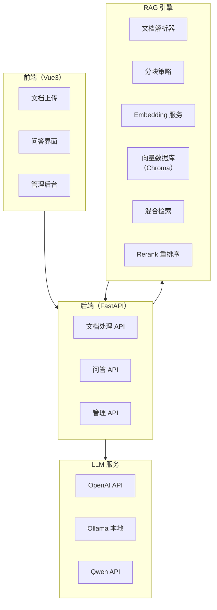

# 项目一：企业知识库问答系统

> **创建日期：** 2026-06-06
> **难度：** ⭐ 入门 | **核心技术：** RAG + 向量数据库 + FastAPI + Vue3

---

## 一、项目概述

构建一个企业级知识库问答系统，支持上传文档、自动构建索引、智能问答，并标注答案来源。

### 核心功能

| 功能 | 说明 |
|------|------|
| 文档上传 | 支持 PDF、Word、Markdown、TXT 格式 |
| 自动索引 | 文档解析 → 分块 → Embedding → 向量存储 |
| 智能问答 | 基于 RAG 的精准问答，标注来源 |
| 对话历史 | 多轮对话，上下文记忆 |
| 管理后台 | 文档管理、问答记录、效果评估 |

---

## 二、系统架构



---

## 三、数据流设计

```
文档上传流程：
  用户上传文件 → 后端接收 → 解析文本 → 分块（512 tokens）
  → 生成 Embedding → 存入 Chroma → 返回成功

问答流程：
  用户提问 → 查询改写 → 混合检索（向量+BM25）
  → Rerank 重排序 → 拼接 Prompt → LLM 生成
  → 返回答案 + 来源标注
```

---

## 四、核心代码实现

### 4.1 后端入口（main.py）

```python
from fastapi import FastAPI, UploadFile, File
from fastapi.middleware.cors import CORSMiddleware
from pydantic import BaseModel
from rag import RAGEngine

app = FastAPI(title="企业知识库问答系统")
app.add_middleware(CORSMiddleware, allow_origins=["*"], ...)

# 初始化 RAG 引擎
rag = RAGEngine(
    embedding_model="text-embedding-3-small",
    vector_db_path="./chroma_db",
    llm_model="gpt-4o-mini"
)

@app.post("/api/documents/upload")
async def upload_document(file: UploadFile = File(...)):
    """上传文档并建立索引"""
    content = await file.read()
    doc_id = rag.index_document(
        content=content,
        filename=file.filename,
        chunk_size=512,
        chunk_overlap=50
    )
    return {"doc_id": doc_id, "status": "indexed"}

class QuestionRequest(BaseModel):
    question: str
    conversation_id: str | None = None

@app.post("/api/qa")
async def ask_question(req: QuestionRequest):
    """问答接口"""
    result = rag.query(
        question=req.question,
        conversation_id=req.conversation_id,
        top_k=5
    )
    return {
        "answer": result["answer"],
        "sources": result["sources"],
        "conversation_id": result["conversation_id"]
    }
```

### 4.2 RAG 引擎（rag/engine.py）

```python
class RAGEngine:
    def __init__(self, embedding_model, vector_db_path, llm_model):
        self.embeddings = OpenAIEmbeddings(model=embedding_model)
        self.vectorstore = Chroma(
            persist_directory=vector_db_path,
            embedding_function=self.embeddings
        )
        self.llm = ChatOpenAI(model=llm_model, temperature=0)
        self.bm25_index = None  # BM25 关键词索引

    def index_document(self, content, filename, chunk_size, chunk_overlap):
        # 1. 文档分块
        splitter = RecursiveCharacterTextSplitter(
            chunk_size=chunk_size,
            chunk_overlap=chunk_overlap
        )
        chunks = splitter.split_text(content)

        # 2. 添加元数据
        metadatas = [{"source": filename, "chunk_id": i} for i in range(len(chunks))]

        # 3. 存入向量数据库
        ids = self.vectorstore.add_texts(chunks, metadatas=metadatas)

        # 4. 更新 BM25 索引
        self._update_bm25_index()

        return ids

    def query(self, question, conversation_id=None, top_k=5):
        # 1. 查询改写（多轮对话）
        rewritten = self._rewrite_query(question, conversation_id)

        # 2. 混合检索
        vector_results = self.vectorstore.similarity_search(rewritten, k=top_k * 2)
        bm25_results = self._bm25_search(rewritten, top_k * 2)

        # 3. RRF 融合
        merged = self._rrf_merge(vector_results, bm25_results, top_k=top_k)

        # 4. Rerank
        reranked = self._rerank(rewritten, merged)

        # 5. 生成答案
        context = "\n\n".join([doc.page_content for doc in reranked])
        answer = self._generate_answer(question, context)

        return {
            "answer": answer,
            "sources": [doc.metadata for doc in reranked],
            "conversation_id": conversation_id
        }
```

### 4.3 前端问答界面（Vue3）

```vue
<template>
  <div class="qa-container">
    <div class="chat-history" ref="chatContainer">
      <div v-for="msg in messages" :key="msg.id" :class="msg.role">
        <div class="content">{{ msg.content }}</div>
        <div v-if="msg.sources" class="sources">
          来源：<span v-for="s in msg.sources">{{ s.source }}</span>
        </div>
      </div>
    </div>
    <div class="input-area">
      <el-input v-model="question" placeholder="请输入问题..."
        @keyup.enter="sendQuestion" />
      <el-button type="primary" @click="sendQuestion">发送</el-button>
    </div>
  </div>
</template>
```

---

## 五、Docker 部署

```yaml
# docker-compose.yml
version: '3.8'
services:
  backend:
    build: ./backend
    ports:
      - "8000:8000"
    volumes:
      - ./chroma_db:/app/chroma_db
    environment:
      - OPENAI_API_KEY=${OPENAI_API_KEY}
      - LLM_MODEL=gpt-4o-mini

  frontend:
    build: ./frontend
    ports:
      - "3000:80"
    depends_on:
      - backend
```

---

## 六、RAGAS 评估

```python
from ragas import evaluate
from ragas.metrics import faithfulness, answer_relevancy

# 评估集
eval_data = {
    "question": ["如何申请年假？", "考勤制度是什么？"],
    "answer": [rag.query(q)["answer"] for q in questions],
    "contexts": [rag.query(q)["contexts"] for q in questions],
    "ground_truth": ["年假需提前3天在OA申请...", "..."],
}

result = evaluate(dataset, metrics=[faithfulness, answer_relevancy])
print(f"忠实度: {result['faithfulness']:.2%}")
print(f"答案相关性: {result['answer_relevancy']:.2%}")
```

---

## 七、扩展方向

- [ ] 多语言支持（中英文混合检索）
- [ ] 权限控制（不同用户看到不同文档）
- [ ] 知识库自动更新（定时同步）
- [ ] 多模态支持（图片+表格问答）

---

## 面试高频题

### Q1: 在项目一中，为什么采用混合检索（向量检索 + BM25）而非纯向量检索？RRF 融合是如何实现的？

**详细答案：** 纯向量检索在企业知识库场景中存在明确的盲区。向量检索基于语义相似度，擅长处理"意思相近但表述不同"的查询——例如用户问"怎么请假"，向量检索能找到"员工休假申请流程"这个语义相关的文档。但向量检索对"精确关键词"不敏感——当用户搜索"2024年考勤制度"时，向量检索可能返回"2023年考勤制度"（语义相似但年份不对），或者返回"考勤制度"的概括性描述而非精确匹配"2024"的文档。这在企业场景中可能造成严重的合规问题——用户需要的是 2024 年版本，看到的却是 2023 年的内容。

BM25 关键词检索恰好弥补了这个缺陷——它基于词频统计，对"2024"这种精确关键词非常敏感。但 BM25 的问题是无法理解语义——"请假"和"休假申请"在 BM25 看来是完全不同的词。因此，混合检索将两者结合：向量检索保证语义覆盖，BM25 保证精确匹配。在项目一中，RRF（Reciprocal Rank Fusion）融合的具体实现是：对每个文档，计算它在向量检索结果中的排名倒数（1/(60+rank_vector)）和 BM25 结果中的排名倒数（1/(60+rank_bm25)），求和作为最终得分。这种方法不需要归一化两种异构分数，只需排名信息，实现简单且鲁棒。项目一中的 `_rrf_merge` 方法就是这一逻辑的代码实现。

### Q2: 项目一中 RAG 引擎的查询改写（Query Rewriting）功能是如何实现的？为什么需要它？

**详细答案：** 查询改写在多轮对话场景中至关重要。当用户在多轮对话中追问时，问题往往是不完整的——例如第一轮问"如何申请年假"，第二轮问"需要什么材料"。如果直接拿"需要什么材料"去检索，向量数据库无法理解这指的是"年假申请需要什么材料"，检索结果会非常差。查询改写的作用就是将不完整的追问改写为独立的、完整的查询语句——"需要什么材料" → "申请年假需要什么材料"。在项目一中，查询改写的实现方式是调用 LLM，将当前问题与对话历史拼接，让 LLM 基于历史上下文补全当前问题。

查询改写还有另一个重要作用——查询扩展。用户的原始查询可能过于简短或使用了领域特有的缩写，导致 Embedding 模型无法准确理解。查询改写可以让 LLM 对查询进行扩展和优化，例如"OA系统怎么用" → "OA办公系统的使用方法和操作指南"。这相当于在检索之前先对查询做了一次"语义增强"，将用户的"口语化简短表达"转化为"正式的、信息密度更高的检索查询"。查询改写本身会增加一次 LLM 调用，带来额外的延迟和成本，但通常能显著提升检索质量。在项目一中，查询改写是可选的——如果 `conversation_id` 为空（新对话），直接使用原始查询；只有在多轮对话时才执行改写。

### Q3: 在项目一中，RAGAS 评估框架如何量化知识库问答系统的效果？Faithfulness 和 Answer Relevancy 分别衡量什么？

**详细答案：** RAGAS 是 RAG 系统评估的专用框架，它通过自动化计算多个指标来量化系统效果，无需大量人工标注。Faithfulness（忠实度）衡量的是"LLM 生成的答案是否完全基于检索到的上下文，有没有编造"。它的计算方式是：将 LLM 生成的答案分解为多个声明（Claims），然后逐一检查每个声明是否能从检索到的上下文中找到依据。如果答案中出现了上下文没有提到的信息，Faithfulness 分数就会降低。这个指标对知识库问答系统至关重要——在企业场景中，编造信息（幻觉）是不可接受的。

Answer Relevancy（答案相关性）衡量的是"答案是否直接回答了用户的问题，有没有跑题"。它的计算方式是：用 LLM 基于候选答案生成若干个"反向问题"（这个答案可能回答哪些问题），然后计算这些反向问题与原始问题的语义相似度。如果答案真的与问题相关，反向问题应该与原始问题高度相似；如果答案跑题了，反向问题会与原始问题偏离。在项目一中，RAGAS 评估的代码示例展示了如何同时对多个问题-答案对进行评估，输出 Faithfulness 和 Answer Relevancy 的百分比分数。一个好的知识库问答系统应该在这两个指标上都达到 0.7 以上，优秀系统可以达到 0.85 以上。

### Q4: 项目一中文档分块大小设置为 512 tokens，这个值是如何确定的？过大或过小会有什么影响？

**详细答案：** 512 tokens 的选择是基于大量实践经验的"黄金中间值"，但这并不意味着它是"最优值"——它只是一个合理的起点。Chunk 大小的影响体现在检索质量和 LLM 理解两个层面。从检索层面看，Chunk 过小（如 128 tokens）会导致"碎片化"——一篇完整的文档被切成太多小块，每个小块包含的信息量不足，检索时虽然可能精确命中某个句子，但 LLM 无法理解这个句子所在的上下文。从 LLM 理解层面看，Chunk 过大（如 2048 tokens）会导致"稀释"——检索到的 Chunk 中包含大量与问题无关的内容，LLM 的注意力被无关信息分散，可能忽略关键信息或产生错误理解。

512 tokens 在实践中被广泛采用，因为它约等于"一个中等长度的段落"，既能包含足够完整的语义信息（一个完整的观点或说明），又不会过于冗长。配合 50 tokens 的 Overlap，可以保证相邻段落之间的语义连续性。然而，512 tokens 不是银弹——对于 FAQ 类文档（每个问题回答很短），128-256 tokens 更合适；对于技术手册（每个章节都很长），768-1024 tokens 可能更好。确定最佳 Chunk 大小的正确方法是：先用 512 tokens 建立基线，然后在评估集上测试不同 Chunk 大小（256、512、768、1024），对比 RAGAS 分数，选择效果最好的值。这种"数据驱动"的调参方式，比"拍脑袋"选择一个值要可靠得多。

### Q5: 项目一中 RAG 引擎的 `query` 方法中，为什么先检索 `top_k * 2` 个结果，再 Rerank 截取 `top_k` 个？

**详细答案：** 这种"先宽后窄"的策略是检索系统中的经典设计，称为"粗排 + 精排"两阶段检索。第一阶段（粗排）使用向量检索和 BM25 检索，目标是"高召回"——尽可能多地召回可能相关的文档，即使其中包含一些不太相关的。因此设置 `top_k * 2`（即如果最终要 5 个结果，先召回 10 个），这个阶段追求的是"不遗漏"，对精度要求不高。第二阶段（精排）使用 Rerank（通常基于 Cross-Encoder 模型），对粗排结果进行重新排序，目标是"高精度"——从 10 个候选中选出最相关的 5 个。

为什么不能直接检索 `top_k` 个结果？因为向量检索和 BM25 的排序精度有限。向量检索基于余弦相似度，但余弦相似度高并不完全等于"真正相关"——一个文档可能在语义上"接近"查询，但实际内容与用户需求不匹配。BM25 基于词频统计，排序精度更低。Rerank 使用 Cross-Encoder 模型，它同时将查询和文档一起输入模型进行深度语义匹配，而不是分别编码后计算距离，因此精度远高于 Bi-Encoder（向量检索用的模型）。但 Cross-Encoder 的计算成本高，不能用于全量检索。因此"粗排（高召回、低成本）+ 精排（高精度、高成本）"的两阶段设计，在召回率和精度之间取得了最优平衡。

### Q6: 项目一中的 Chroma 向量数据库如何实现持久化和增量更新？在 Docker 部署中如何保证数据不丢失？

**详细答案：** Chroma 支持两种存储模式：内存模式（数据仅在进程生命周期内存在）和持久化模式（数据写入磁盘）。在项目一中，通过 `persist_directory="./chroma_db"` 参数指定了持久化目录，Chroma 会将向量数据和元数据写入该目录下的文件中。每次 `add_texts` 调用都会触发自动持久化，不需要手动调用 `persist()`。这意味着服务重启后，之前索引的文档仍然存在，不影响查询。

在 Docker 部署中，保证数据不丢失的关键是数据卷挂载。项目的 `docker-compose.yml` 中配置了 `volumes: - ./chroma_db:/app/chroma_db`，将宿主机上的 `./chroma_db` 目录映射到容器内的 `/app/chroma_db`。这样即使容器被删除重建，向量数据仍然保存在宿主机上。对于增量更新，Chroma 支持通过 ID 进行文档的更新和删除——当你需要更新某份文档时，可以先删除旧文档的所有 Chunk（通过 metadata 中的 source 字段过滤），再插入新文档的 Chunk。这种方式避免了全量重建索引的高昂成本。对于大规模知识库，建议定期（如每周）做一次全量索引重建，以清理碎片和优化索引性能。

---

## 参考资料

- [RAGAS 评估框架官方文档](https://docs.ragas.io)
- [Chroma 向量数据库文档](https://docs.trychroma.com)
- [FastAPI 官方文档](https://fastapi.tiangolo.com)