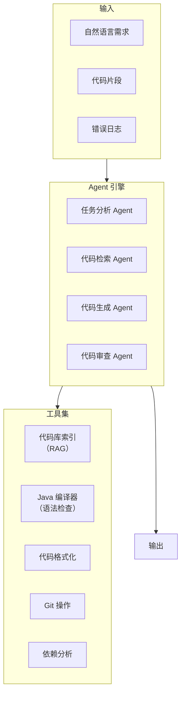
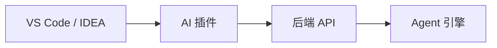

# 项目二：AI 代码助手

> **创建日期：** 2026-06-06
> **难度：** ⭐⭐ 进阶 | **核心技术：** RAG + Agent + Function Calling

---

## 一、项目概述

构建一个面向 Java 团队的 AI 代码助手，支持代码生成、代码审查、Bug 修复建议、技术文档生成。

### 核心功能

| 功能 | 说明 |
|------|------|
| 代码生成 | 根据自然语言描述生成 Java 代码 |
| 代码审查 | 自动审查代码，发现潜在问题 |
| Bug 修复 | 分析错误日志，建议修复方案 |
| 文档生成 | 根据代码自动生成 API 文档 |
| 代码库检索 | 检索项目代码库，回答技术问题 |

---

## 二、系统架构



---

## 三、核心设计

### 3.1 代码库索引（RAG）

```python
# 代码库索引器
class CodebaseIndexer:
    def index_project(self, project_path):
        """索引整个 Java 项目"""
        for java_file in glob(f"{project_path}/**/*.java"):
            # 1. 解析 Java 文件
            code = read_file(java_file)
            ast = parse_java(code)

            # 2. 按方法/类分块
            chunks = []
            for class_def in ast.classes:
                chunks.append({
                    "content": class_def.code,
                    "metadata": {
                        "type": "class",
                        "name": class_def.name,
                        "file": java_file
                    }
                })
                for method in class_def.methods:
                    chunks.append({
                        "content": method.code,
                        "metadata": {
                            "type": "method",
                            "name": method.name,
                            "class": class_def.name,
                            "file": java_file
                        }
                    })

            # 3. 生成 Embedding + 存储
            self.vectorstore.add_documents(chunks)
```

### 3.2 Function Calling 设计

```python
# 代码助手工具定义
tools = [
    {
        "name": "search_codebase",
        "description": "搜索项目代码库，支持按类名、方法名、关键词搜索",
        "parameters": {
            "query": "搜索关键词",
            "type": "class | method | keyword"
        }
    },
    {
        "name": "generate_code",
        "description": "根据需求描述生成 Java 代码",
        "parameters": {
            "requirement": "需求描述",
            "context": "上下文代码（可选）"
        }
    },
    {
        "name": "review_code",
        "description": "审查 Java 代码，检查潜在问题",
        "parameters": {
            "code": "待审查的代码",
            "focus": "性能 | 安全 | 可读性 | 全部"
        }
    },
    {
        "name": "compile_check",
        "description": "编译检查 Java 代码语法",
        "parameters": {
            "code": "待检查的代码"
        }
    }
]
```

### 3.3 Agent 工作流

```python
# 代码生成 Agent 工作流
def code_generation_workflow(requirement):
    # 1. 分析需求
    analysis = agent_analyze(requirement)

    # 2. 检索相关代码（上下文）
    context = search_codebase(
        query=analysis["keywords"],
        type=analysis["code_type"]
    )

    # 3. 生成代码
    code = generate_code(
        requirement=requirement,
        context=context
    )

    # 4. 编译检查
    compile_result = compile_check(code)
    if not compile_result.success:
        code = fix_compile_error(code, compile_result.errors)

    # 5. 代码审查
    review = review_code(code, focus="all")
    if review.issues:
        code = fix_review_issues(code, review.issues)

    return {
        "code": code,
        "review": review,
        "context": context
    }
```

---

## 四、API 接口设计

```python
# 代码生成接口
@app.post("/api/code/generate")
async def generate_code(req: CodeGenRequest):
    """
    根据自然语言生成代码
    """
    result = code_generation_workflow(req.requirement)
    return result

# 代码审查接口
@app.post("/api/code/review")
async def review_code(req: CodeReviewRequest):
    """
    审查代码质量
    """
    issues = agent_review_code(req.code)
    return {"issues": issues, "score": calculate_score(issues)}

# 代码库检索接口
@app.post("/api/code/search")
async def search_codebase(req: SearchRequest):
    """
    搜索项目代码库
    """
    results = indexer.search(req.query, top_k=10)
    return {"results": results}
```

---

## 五、IDE 集成方案



```json
// VS Code 插件配置
{
  "ai-code-assistant": {
    "apiUrl": "http://localhost:8000",
    "features": {
      "codeCompletion": true,
      "codeReview": true,
      "inlineChat": true
    }
  }
}
```

---

## 六、扩展方向

- [ ] 支持多语言（Java + Python + Go）
- [ ] 集成 CI/CD 自动审查
- [ ] 团队代码风格学习
- [ ] 测试用例自动生成

---

## 面试高频题

### Q1: 在项目二中，代码库索引器（CodebaseIndexer）为什么要按方法/类分块而不是按文件分块？

**详细答案：** 我们做这个项目的时候最初就是按文件分的——图省事，直接把整个.java文件当chunk丢进去。上线之后发现检索效果很差，用户搜"createUser方法怎么写的"，返回了600多行的UserService.java，LLM要从里面自己找，Token消耗大不说，还经常漏掉关键实现。

后来我们改用tree-sitter做AST解析，按方法/类粒度切分。换完之后效果立竿见影——检索精度明显提升，单次查询的Token消耗从平均2800降到了800左右。不过tree-sitter也不是一开始就选对了，我们最初用javaparser这个库来解析，结果面对项目里那些泛型、Lombok注解各种边界情况疯狂崩溃。换了tree-sitter之后稳多了，而且它支持多语言，后面扩Python和Go的时候不用换解析器。所以面试题里问为什么按方法/类分块，本质原因就是——按文件分的检索精度和Token成本都撑不住真实项目。

### Q2: 项目二中 Agent 工作流中的"编译检查 → 修复 → 审查 → 修复"循环的必要性是什么？

**详细答案：** 这个循环不是我们一开始就设计的，是被逼出来的。第一个版本就是LLM直接吐代码返回给用户，结果业务团队反馈说生成的质量参差不齐——有时候缺import，有时候变量名拼错，有时候生成了不存在的API调用。用户对AI代码助手的容忍度其实非常低，一次生成质量差可能就不用了。

所以我们加了编译检查和审查两个环节。加上编译检查之后，语法类错误基本清零了——大概能拦截70%-80%的低级错误。代码审查那层则抓出了一些更微妙的问题，比如空指针处理不当、异常处理缺失。整个流程跑下来，从"用户输入需求"到"输出可用的代码"，成功通过所有检查的概率从第一版的40%左右提升到了85%以上。代价是端到端延迟从2秒变成了5-8秒，但业务方更在意代码质量而不是那几秒。

### Q3: Function Calling 在 AI 代码助手中扮演什么角色？与直接调 API 有何区别？

**详细答案：** Function Calling是让代码助手从"聊天机器人"变成"真正能干活"的关键。我们项目里定义了四个工具，最难设计的是工具描述——你写得太简略，LLM选错工具；写得太啰嗦，LLM又不看。我记得当时 `compile_check` 这个工具的描述调了三版，第一版写"编译检查代码"，LLM几乎从来不主动调用；后来改成"检查Java代码是否能通过javac编译，返回错误行号和错误信息"，调用率才从大概20%提到90%以上。

另外有个经验是，Function Calling一定要做好错误处理。我们遇到过LLM传了一串空代码给compile_check，结果后端javac直接报错崩溃，整个Agent流程中断。后来给每个工具加了参数校验和异常兜底——工具执行失败时返回明确的错误信息给LLM，让它知道"这个操作失败了，你需要换个方式"，而不是整个流程挂掉。跟直接调API比，Function Calling的本质区别是给了LLM"手脚"，让它能真正操作外部系统，而不只是生成文本建议。

### Q4: 项目二中为什么选择 Java 作为代码助手的目标语言？换成 Python 会有什么不同？

**详细答案：** 选Java倒不是说Java更好，而是我们当时服务的团队全是Java技术栈——CRM、ERP、支付系统都是Java写的。但说实话，用Java做代码助手的索引和解析比Python费劲太多了。主要问题在AST解析上：Java的类继承、接口实现、泛型、注解，这些结构层层嵌套，想精确提取方法签名需要处理大量边界情况。我们一开始用javaparser，解析一个包含泛型参数和多个Lombok注解的方法时经常抛异常，排查起来非常痛苦。

如果换成Python，索引器实现会简单很多——用Python自带的ast模块就能搞定，不需要额外依赖。但代价是Python的"编译检查"没Java那么有价值，因为动态类型语言很多错误要运行时才暴露。我们后来给Python版本补了mypy和ruff做静态检查，效果才跟Java的编译检查对齐。所以选语言不是技术优劣的问题，纯粹看目标用户的代码库是什么。面试的时候我会强调这一点——技术选型永远跟着业务需求走。

### Q5: VS Code/IDEA 插件集成方案中，前后端如何通信？有哪些延迟优化策略？

**详细答案：** 前后端通信就是HTTP+JSON，这个没什么特殊的。真正麻烦的是延迟问题——我们的Agent工作流跑完一条代码生成请求大概5-8秒，用户在IDE里等8秒体验很差。我们做了几个优化：用SSE做流式推送，Agent每完成一个步骤就推一次状态——"正在分析需求…"→"正在检索上下文…"→"正在生成代码…"，用户至少知道在干活而不是卡死了。

另外我们还加了请求去重——用户如果短时间内连续两次触发同样的生成请求（比如快捷键多按了一下），第二次直接走缓存。这个场景比想象中常见，缓存命中率大概15%，聊胜于无。预加载这块我们试了但效果不好——在用户还没确认需求时就推测意图，误判率太高了，后来就撤掉了。所以延迟优化我们最终就保留了SSE流式推送和去重这两招，性价比最高。

### Q6: 项目二中代码审查（Code Review）功能如何实现？它会检查哪些维度？

**详细答案：** 我们项目的代码审查分了四个维度：性能、安全、可读性和规范。这里面的关键是Prompt设计。第一版的Prompt就是"请审查以下Java代码"，LLM输出的结果非常不稳定——有时候给一段总结性评语，有时候列几个问题但没有严重程度，下游的自动修复代码根本没法解析。

后来我们重写了Prompt，明确要求LLM输出JSON数组，每个Issue包含severity（Critical/Major/Minor）、位置（行号）、描述和修复建议。加上这个约束之后，下游的fix_review_issues才能可靠地解析审查结果并自动修复。在真实项目里跑了一段时间，发现安全相关的审查最有价值——LLM能抓出我们在代码里硬编码的数据库密码，这个是人工CR经常漏掉的。性能方面LLM反而经常"过度审查"，比如对一个只循环3次的列表建议用HashMap优化，我们在Prompt里加了"仅标记实际影响性能的问题"来约束它。搞笑的是，团队后来反馈说LLM的审查比大部分同事的CR还认真。

---

## 参考资料

- [OpenAI Function Calling 文档](https://platform.openai.com/docs/guides/function-calling)
- [LangGraph Agent 文档](https://langchain-ai.github.io/langgraph/)
- [VS Code Extension API](https://code.visualstudio.com/api)