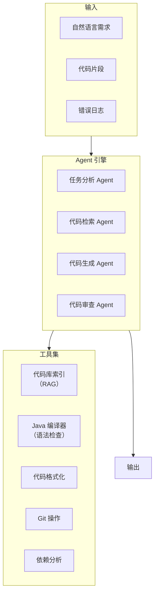
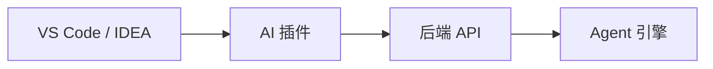

# 项目二：AI 代码助手

> **创建日期：** 2026-06-06
> **难度：** ⭐⭐ 进阶 | **核心技术：** RAG + Agent + Function Calling

---

## 一、项目概述

构建一个面向 Java 团队的 AI 代码助手，支持代码生成、代码审查、Bug 修复建议、技术文档生成。

### 核心功能

| 功能 | 说明 |
|------|------|
| 代码生成 | 根据自然语言描述生成 Java 代码 |
| 代码审查 | 自动审查代码，发现潜在问题 |
| Bug 修复 | 分析错误日志，建议修复方案 |
| 文档生成 | 根据代码自动生成 API 文档 |
| 代码库检索 | 检索项目代码库，回答技术问题 |

---

## 二、系统架构



---

## 三、核心设计

### 3.1 代码库索引（RAG）

```python
# 代码库索引器
class CodebaseIndexer:
    def index_project(self, project_path):
        """索引整个 Java 项目"""
        for java_file in glob(f"{project_path}/**/*.java"):
            # 1. 解析 Java 文件
            code = read_file(java_file)
            ast = parse_java(code)

            # 2. 按方法/类分块
            chunks = []
            for class_def in ast.classes:
                chunks.append({
                    "content": class_def.code,
                    "metadata": {
                        "type": "class",
                        "name": class_def.name,
                        "file": java_file
                    }
                })
                for method in class_def.methods:
                    chunks.append({
                        "content": method.code,
                        "metadata": {
                            "type": "method",
                            "name": method.name,
                            "class": class_def.name,
                            "file": java_file
                        }
                    })

            # 3. 生成 Embedding + 存储
            self.vectorstore.add_documents(chunks)
```

### 3.2 Function Calling 设计

```python
# 代码助手工具定义
tools = [
    {
        "name": "search_codebase",
        "description": "搜索项目代码库，支持按类名、方法名、关键词搜索",
        "parameters": {
            "query": "搜索关键词",
            "type": "class | method | keyword"
        }
    },
    {
        "name": "generate_code",
        "description": "根据需求描述生成 Java 代码",
        "parameters": {
            "requirement": "需求描述",
            "context": "上下文代码（可选）"
        }
    },
    {
        "name": "review_code",
        "description": "审查 Java 代码，检查潜在问题",
        "parameters": {
            "code": "待审查的代码",
            "focus": "性能 | 安全 | 可读性 | 全部"
        }
    },
    {
        "name": "compile_check",
        "description": "编译检查 Java 代码语法",
        "parameters": {
            "code": "待检查的代码"
        }
    }
]
```

### 3.3 Agent 工作流

```python
# 代码生成 Agent 工作流
def code_generation_workflow(requirement):
    # 1. 分析需求
    analysis = agent_analyze(requirement)

    # 2. 检索相关代码（上下文）
    context = search_codebase(
        query=analysis["keywords"],
        type=analysis["code_type"]
    )

    # 3. 生成代码
    code = generate_code(
        requirement=requirement,
        context=context
    )

    # 4. 编译检查
    compile_result = compile_check(code)
    if not compile_result.success:
        code = fix_compile_error(code, compile_result.errors)

    # 5. 代码审查
    review = review_code(code, focus="all")
    if review.issues:
        code = fix_review_issues(code, review.issues)

    return {
        "code": code,
        "review": review,
        "context": context
    }
```

---

## 四、API 接口设计

```python
# 代码生成接口
@app.post("/api/code/generate")
async def generate_code(req: CodeGenRequest):
    """
    根据自然语言生成代码
    """
    result = code_generation_workflow(req.requirement)
    return result

# 代码审查接口
@app.post("/api/code/review")
async def review_code(req: CodeReviewRequest):
    """
    审查代码质量
    """
    issues = agent_review_code(req.code)
    return {"issues": issues, "score": calculate_score(issues)}

# 代码库检索接口
@app.post("/api/code/search")
async def search_codebase(req: SearchRequest):
    """
    搜索项目代码库
    """
    results = indexer.search(req.query, top_k=10)
    return {"results": results}
```

---

## 五、IDE 集成方案



```json
// VS Code 插件配置
{
  "ai-code-assistant": {
    "apiUrl": "http://localhost:8000",
    "features": {
      "codeCompletion": true,
      "codeReview": true,
      "inlineChat": true
    }
  }
}
```

---

## 六、扩展方向

- [ ] 支持多语言（Java + Python + Go）
- [ ] 集成 CI/CD 自动审查
- [ ] 团队代码风格学习
- [ ] 测试用例自动生成

---

## 面试高频题

### Q1: 在项目二中，代码库索引器（CodebaseIndexer）为什么要按方法/类分块而不是按文件分块？

**详细答案：** 按方法/类分块而非按文件分块，是代码 RAG 与文档 RAG 的核心区别。一个 Java 文件可能包含数个数百行代码，包含多个类和方法。如果按文件分块，会出现两个问题：第一是检索粒度太粗——用户问"UserService 的 createUser 方法怎么实现的"，系统可能返回整个 500 行的 UserService.java 文件，其中只有 20 行是用户真正需要的。这导致 Token 浪费和 LLM 注意力稀释。第二是语义混叠——一个文件中不同方法的语义可能完全不同，按文件分块会导致 Embedding 向量混合了多种语义，检索精度下降。

按方法/类分块将每个方法和类作为独立的检索单元，带来的好处是：检索精度更高（每个单元的语义单一明确）、Token 消耗更少（只返回相关方法的代码）、下游 LLM 理解更准确（上下文聚焦）。此外，元数据的丰富性也更高——每个 Chunk 可以携带方法名、类名、文件路径、代码类型（类/方法）等结构信息，这些元数据可以用于过滤和排序。在项目二中，`CodebaseIndexer` 通过解析 Java AST（抽象语法树）来提取类和方法边界，这比简单的文本切分更精确，能保留代码的结构化信息。不过，这种方案也有限制——它依赖语言特定的 AST 解析器，切换到其他语言（如 Python、Go）需要更换解析器。

### Q2: 项目二中 Agent 工作流中的"编译检查 → 修复 → 审查 → 修复"循环的必要性是什么？

**详细答案：** 这个循环式工作流反映了"AI 生成代码不可靠"这一核心现实。LLM 生成的代码即使"看起来正确"，也可能存在三类问题：语法错误（如缺少分号、括号不匹配）、逻辑错误（如空指针引用、不正确的类型转换）、规范问题（如命名不符合团队规范、缺少异常处理）。如果只依赖 LLM 的一次性生成，这些错误会直接暴露给用户，体验很差。Agent 工作流通过引入"验证 → 反馈 → 修正"的循环，将代码质量从"LLM 的一次性输出"提升到"经过多轮验证的输出"。

编译检查是第一步验证——它是最快速的反馈机制，可以在毫秒级发现语法错误和类型错误。如果编译不通过，Agent 将编译错误信息反馈给 LLM，让 LLM 根据错误信息修正代码。这一步通常能解决 80% 的问题。代码审查是第二步验证——它关注逻辑正确性和代码规范，比编译检查更深入。审查发现问题后，Agent 再次将审查意见反馈给 LLM 进行修正。这个循环可能会迭代多次，直到代码通过所有检查。在实际项目中，还可以加入第三步——单元测试执行，用实际运行结果验证代码功能。整个流程体现了"让 AI 做 AI 擅长的事（生成代码），用传统工具做传统工具擅长的事（编译检查、静态分析），用 Agent 循环将它们串联起来"的设计哲学。

### Q3: Function Calling 在 AI 代码助手中扮演什么角色？与直接调 API 有何区别？

**详细答案：** Function Calling 是 Agent 架构的核心机制，它让 LLM 从"被动回答"转变为"主动行动"。在直接调 API 模式下，LLM 只能生成文本——它可能告诉你"你需要搜索代码库中的 UserService 类"，但无法实际执行搜索。在 Function Calling 模式下，LLM 可以决定"我需要调用 search_codebase 工具"，然后系统执行该工具调用，将结果返回给 LLM，LLM 再基于结果继续推理。这个"推理 → 行动 → 观察 → 推理"的循环，是 Agent 能够自主完成复杂任务的关键。

在项目二中，Function Calling 设计了四个工具：`search_codebase`（搜索代码库）、`generate_code`（生成代码）、`review_code`（审查代码）、`compile_check`（编译检查）。这些工具不是简单的 API 封装，而是构成了 Agent 的"能力边界"——Agent 能做的事情取决于它有哪些工具。工具设计的关键原则是：每个工具职责单一、输入输出明确、失败时返回清晰的错误信息（而不是崩溃）。此外，Function Calling 的 Schema 定义（工具名称、描述、参数类型）直接影响 LLM 选择工具的正确率——描述越清晰，LLM 越能准确判断在什么情况下使用哪个工具。因此，在项目二中，每个工具的 `description` 都精心编写，确保 LLM 能够正确理解工具的用途和适用场景。

### Q4: 项目二中为什么选择 Java 作为代码助手的目标语言？换成 Python 会有什么不同？

**详细答案：** 选择 Java 作为目标语言有两个核心考量。第一是 Java 在企业中的广泛应用——大量传统企业的核心系统（ERP、CRM、财务系统）都是用 Java 开发的，Java 代码助手具有明确的市场需求。第二是 Java 的"规范性"——Java 是静态类型语言，有严格的语法规则和编译检查机制，这使得"编译检查"作为验证手段非常有效。相比之下，Python 是动态类型语言，许多错误（如类型不匹配）在运行时才会暴露，编译检查的作用有限。

如果换成 Python，代码助手的架构需要做几个关键调整。首先是代码索引粒度——Python 的模块结构（文件即模块）与 Java 的类结构不同，分块策略需要调整。其次是验证手段——Python 的编译检查（`python -m py_compile`）只能发现语法错误，无法发现类型错误，需要引入静态分析工具（如 mypy、pylint）来增强验证能力。第三是代码生成风格——Python 的代码风格更灵活（多种方式实现同一功能），LLM 生成的代码可能风格不一致，需要通过代码审查和格式化工具（如 black、ruff）来统一风格。不过，Python 的 AST 解析更简单，不需要像 Java 那样处理复杂的类结构，代码库索引器的实现反而更简洁。总的来说，Java 版本更适合展示"Agent + 编译检查"的完整工作流，Python 版本更适合展示"Agent + 静态分析"的互补模式。

### Q5: VS Code/IDEA 插件集成方案中，前后端如何通信？有哪些延迟优化策略？

**详细答案：** 在项目二的 IDE 插件集成方案中，插件作为客户端通过 HTTP API 与后端 AI 服务通信。具体流程是：用户在 IDE 中触发代码生成/审查功能 → 插件收集当前编辑器的上下文（光标位置、选中代码、打开的文件）→ 通过 HTTP POST 将请求发送到后端 API → 后端执行 Agent 工作流 → 返回结果 → 插件在 IDE 中展示结果。通信协议采用 JSON over HTTP，API 设计遵循 RESTful 风格。插件配置中指定了 `apiUrl`（后端地址）和功能开关（哪些功能可用），方便用户按需配置。

延迟优化是 IDE 插件体验的关键——用户期望在 IDE 中的操作响应是"即时"的，而 AI 处理可能需要数秒甚至数十秒。优化策略包括几个层面。第一是流式响应——后端使用 Server-Sent Events（SSE）或 WebSocket 将结果逐步推送，插件可以在收到第一个 token 后就开始展示，而不是等全部生成完毕。第二是请求去重和缓存——如果用户连续触发相同的代码生成请求，只执行一次，后续请求直接返回缓存结果。第三是预加载——在用户输入过程中，插件可以提前发送请求进行"预测性生成"，就像 GitHub Copilot 的代码补全那样。第四是超时和降级——如果后端超过一定时间未响应，插件显示"正在处理中"的提示，而不是阻塞 UI。这些策略可以显著提升用户体验，让 AI 代码助手从"可用"变为"好用"。

### Q6: 项目二中代码审查（Code Review）功能如何实现？它会检查哪些维度？

**详细答案：** 代码审查功能通过 `review_code` 工具实现，核心是让 LLM 扮演"高级工程师"的角色，对生成的代码进行多维度审查。审查维度包括四个：性能（是否有不必要的循环、重复计算、资源泄漏）、安全（是否有 SQL 注入、XSS 漏洞、敏感信息硬编码）、可读性（变量命名是否清晰、函数职责是否单一、是否有适当的注释）、规范（是否符合 Java 编码规范、是否遵循团队约定）。审查结果以结构化的 Issue 列表返回，每个 Issue 包含问题描述、严重程度（Critical/Major/Minor）和修复建议。

在实际实现中，代码审查的 Prompt 设计是关键。Prompt 需要明确告诉 LLM：你是代码审查者，你的任务是发现问题并给出修复建议，你的输出格式应该是结构化的 Issue 列表。为了提高审查质量，可以在 Prompt 中提供正面示例（一段好代码）和负面示例（一段有问题的代码及审查结果），引导 LLM 按照期望的标准进行审查。此外，审查结果不是最终输出，而是反馈给 `fix_review_issues` 函数，让 LLM 根据审查意见自动修复代码。这个"审查 → 修复"的闭环，将代码审查从"人工的静态检查"变成了"AI 驱动的自动质量改进"，大大提升了代码质量。在项目二的扩展方向中，还可以加入"团队代码风格学习"——通过分析团队历史代码，让 LLM 学习团队的编码风格偏好，使审查结果更贴合团队实际。

---

## 参考资料

- [OpenAI Function Calling 文档](https://platform.openai.com/docs/guides/function-calling)
- [LangGraph Agent 文档](https://langchain-ai.github.io/langgraph/)
- [VS Code Extension API](https://code.visualstudio.com/api)