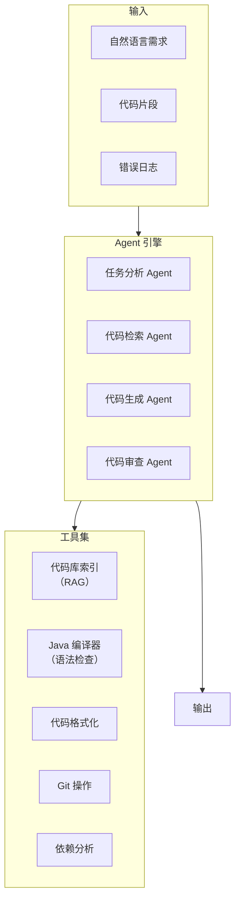
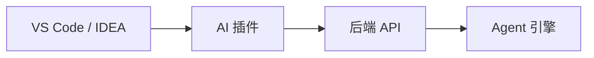

# 项目二：AI 代码助手

> **创建日期：** 2026-06-06
> **难度：** ⭐⭐ 进阶 | **核心技术：** RAG + Agent + Function Calling

---

## 一、项目概述

构建一个面向 Java 团队的 AI 代码助手，支持代码生成、代码审查、Bug 修复建议、技术文档生成。

### 核心功能

| 功能 | 说明 |
|------|------|
| 代码生成 | 根据自然语言描述生成 Java 代码 |
| 代码审查 | 自动审查代码，发现潜在问题 |
| Bug 修复 | 分析错误日志，建议修复方案 |
| 文档生成 | 根据代码自动生成 API 文档 |
| 代码库检索 | 检索项目代码库，回答技术问题 |

---

## 二、系统架构



---

## 三、核心设计

### 3.1 代码库索引（RAG）

```python
# 代码库索引器
class CodebaseIndexer:
    def index_project(self, project_path):
        """索引整个 Java 项目"""
        for java_file in glob(f"{project_path}/**/*.java"):
            # 1. 解析 Java 文件
            code = read_file(java_file)
            ast = parse_java(code)

            # 2. 按方法/类分块
            chunks = []
            for class_def in ast.classes:
                chunks.append({
                    "content": class_def.code,
                    "metadata": {
                        "type": "class",
                        "name": class_def.name,
                        "file": java_file
                    }
                })
                for method in class_def.methods:
                    chunks.append({
                        "content": method.code,
                        "metadata": {
                            "type": "method",
                            "name": method.name,
                            "class": class_def.name,
                            "file": java_file
                        }
                    })

            # 3. 生成 Embedding + 存储
            self.vectorstore.add_documents(chunks)
```

### 3.2 Function Calling 设计

```python
# 代码助手工具定义
tools = [
    {
        "name": "search_codebase",
        "description": "搜索项目代码库，支持按类名、方法名、关键词搜索",
        "parameters": {
            "query": "搜索关键词",
            "type": "class | method | keyword"
        }
    },
    {
        "name": "generate_code",
        "description": "根据需求描述生成 Java 代码",
        "parameters": {
            "requirement": "需求描述",
            "context": "上下文代码（可选）"
        }
    },
    {
        "name": "review_code",
        "description": "审查 Java 代码，检查潜在问题",
        "parameters": {
            "code": "待审查的代码",
            "focus": "性能 | 安全 | 可读性 | 全部"
        }
    },
    {
        "name": "compile_check",
        "description": "编译检查 Java 代码语法",
        "parameters": {
            "code": "待检查的代码"
        }
    }
]
```

### 3.3 Agent 工作流

```python
# 代码生成 Agent 工作流
def code_generation_workflow(requirement):
    # 1. 分析需求
    analysis = agent_analyze(requirement)

    # 2. 检索相关代码（上下文）
    context = search_codebase(
        query=analysis["keywords"],
        type=analysis["code_type"]
    )

    # 3. 生成代码
    code = generate_code(
        requirement=requirement,
        context=context
    )

    # 4. 编译检查
    compile_result = compile_check(code)
    if not compile_result.success:
        code = fix_compile_error(code, compile_result.errors)

    # 5. 代码审查
    review = review_code(code, focus="all")
    if review.issues:
        code = fix_review_issues(code, review.issues)

    return {
        "code": code,
        "review": review,
        "context": context
    }
```

---

## 四、API 接口设计

```python
# 代码生成接口
@app.post("/api/code/generate")
async def generate_code(req: CodeGenRequest):
    """
    根据自然语言生成代码
    """
    result = code_generation_workflow(req.requirement)
    return result

# 代码审查接口
@app.post("/api/code/review")
async def review_code(req: CodeReviewRequest):
    """
    审查代码质量
    """
    issues = agent_review_code(req.code)
    return {"issues": issues, "score": calculate_score(issues)}

# 代码库检索接口
@app.post("/api/code/search")
async def search_codebase(req: SearchRequest):
    """
    搜索项目代码库
    """
    results = indexer.search(req.query, top_k=10)
    return {"results": results}
```

---

## 五、IDE 集成方案



```json
// VS Code 插件配置
{
  "ai-code-assistant": {
    "apiUrl": "http://localhost:8000",
    "features": {
      "codeCompletion": true,
      "codeReview": true,
      "inlineChat": true
    }
  }
}
```

---

## 六、扩展方向

- [ ] 支持多语言（Java + Python + Go）
- [ ] 集成 CI/CD 自动审查
- [ ] 团队代码风格学习
- [ ] 测试用例自动生成