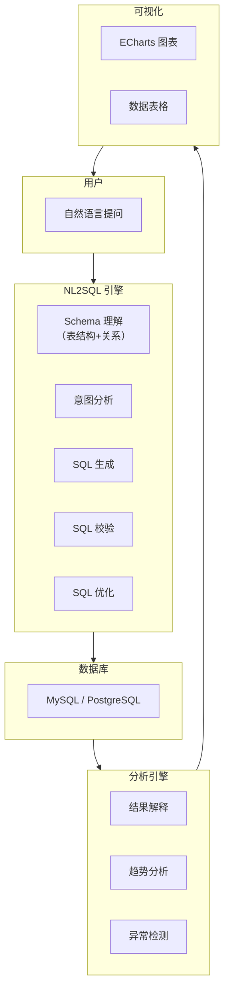

# 项目三：智能数据分析助手

> **创建日期：** 2026-06-06
> **难度：** ⭐⭐⭐ 综合 | **核心技术：** NL2SQL + Agent + 可视化

---

## 一、项目概述

构建一个智能数据分析助手，用户用自然语言提问，系统自动生成 SQL、执行查询、分析结果并生成可视化图表。

### 核心功能

| 功能 | 说明 |
|------|------|
| 自然语言查询 | "上个月销售额最高的10个产品" → SQL |
| 多表关联 | 自动识别表关系，生成 JOIN 查询 |
| 结果分析 | 对查询结果进行解释和总结 |
| 可视化 | 自动生成柱状图、折线图、饼图 |
| 上下文记忆 | 多轮对话，记住之前的查询上下文 |

---

## 二、系统架构



---

## 三、核心设计

### 3.1 Schema 理解

```python
# Schema 管理器
class SchemaManager:
    def get_schema_context(self):
        """获取数据库 Schema 上下文，用于 Prompt"""
        tables = self.get_all_tables()
        context = "数据库 Schema：\n\n"

        for table in tables:
            context += f"表名：{table.name}\n"
            context += f"描述：{table.description}\n"
            context += "字段：\n"
            for col in table.columns:
                context += f"  - {col.name} ({col.type}): {col.description}\n"

            # 关联关系
            for rel in table.relationships:
                context += f"关联：{table.name}.{rel.fk} → {rel.ref_table}.{rel.pk}\n"

            context += "\n"
        return context

    # 生成的 Schema 上下文示例：
    """
    表名：orders
    描述：订单表
    字段：
      - id (INT): 订单ID，主键
      - user_id (INT): 用户ID
      - product_id (INT): 商品ID
      - amount (DECIMAL): 订单金额
      - created_at (DATETIME): 创建时间
      - status (VARCHAR): 订单状态
    关联：orders.user_id → users.id
    关联：orders.product_id → products.id

    表名：users
    描述：用户表
    字段：
      - id (INT): 用户ID，主键
      - name (VARCHAR): 用户姓名
      - department (VARCHAR): 部门
      - created_at (DATETIME): 注册时间
    """
```

### 3.2 NL2SQL Pipeline

```python
# NL2SQL 核心流程
class NL2SQL:
    def generate_sql(self, question, schema_context, history=None):
        # 1. 构建 Prompt（包含 Schema + 历史 + 示例）
        prompt = f"""
        {schema_context}

        对话历史：{history}

        请根据用户问题生成 SQL 查询。
        要求：
        - 只输出 SQL，不要其他内容
        - 使用表别名提高可读性
        - 添加必要的注释

        示例：
        问题：上个月注册的用户数量
        SQL：
        SELECT COUNT(*) as user_count
        FROM users
        WHERE created_at >= DATE_SUB(CURDATE(), INTERVAL 1 MONTH)

        用户问题：{question}
        SQL：
        """

        sql = self.llm.generate(prompt)

        # 2. SQL 校验
        if not self.validate_sql(sql):
            return self.retry_with_feedback(sql, question)

        return sql

    def validate_sql(self, sql):
        """SQL 安全校验"""
        # 只允许 SELECT 语句
        if not sql.strip().upper().startswith("SELECT"):
            return False
        # 禁止 DROP/DELETE/UPDATE/INSERT
        dangerous = ["DROP", "DELETE", "UPDATE", "INSERT", "ALTER"]
        for keyword in dangerous:
            if keyword in sql.upper():
                return False
        return True
```

### 3.3 Agent 驱动分析

```python
# 数据分析 Agent
class DataAnalysisAgent:
    def analyze(self, question):
        # 1. 理解意图，生成 SQL
        sql = self.nl2sql.generate_sql(question, self.schema)

        # 2. 执行查询
        data = self.execute_sql(sql)

        # 3. 分析结果
        analysis = self.analyze_result(data, question)

        # 4. 生成可视化建议
        chart_type = self.recommend_chart(data, question)

        return {
            "sql": sql,
            "data": data,
            "analysis": analysis,
            "chart": {
                "type": chart_type,
                "config": self.generate_chart_config(data, chart_type)
            }
        }

    def recommend_chart(self, data, question):
        """根据数据特征推荐图表类型"""
        if len(data) == 0:
            return "none"

        columns = data[0].keys()
        numeric_cols = [c for c in columns if isinstance(data[0][c], (int, float))]

        if len(numeric_cols) == 0:
            return "table"  # 纯文本数据
        elif len(data) <= 10:
            return "bar"    # 少量数据用柱状图
        elif len(data) <= 30:
            return "line"   # 时间序列用折线图
        else:
            return "pie"    # 用饼图展示占比
```

### 3.4 多表关联处理

```python
# 多表关联示例
"""
问题：查询技术部每个员工的订单总额
"""
# 自动生成的 SQL：
SELECT
    u.name AS 员工姓名,
    u.department AS 部门,
    COUNT(o.id) AS 订单数,
    COALESCE(SUM(o.amount), 0) AS 订单总额
FROM users u
LEFT JOIN orders o ON u.id = o.user_id
WHERE u.department = '技术部'
GROUP BY u.id, u.name, u.department
ORDER BY 订单总额 DESC
```

---

## 四、API 接口

```python
@app.post("/api/analysis/query")
async def natural_query(req: QueryRequest):
    """自然语言查询接口"""
    result = data_agent.analyze(req.question)
    return {
        "sql": result["sql"],
        "data": result["data"],
        "analysis": result["analysis"],
        "chart": result["chart"]
    }

@app.get("/api/analysis/schema")
async def get_schema():
    """获取数据库 Schema"""
    return schema_manager.get_schema_context()
```

---

## 五、可视化配置

```python
# ECharts 配置生成
def generate_echarts_config(data, chart_type):
    if chart_type == "bar":
        return {
            "xAxis": {"data": [row["name"] for row in data]},
            "yAxis": {},
            "series": [{
                "type": "bar",
                "data": [row["value"] for row in data]
            }]
        }
    elif chart_type == "pie":
        return {
            "series": [{
                "type": "pie",
                "data": [{"name": row["name"], "value": row["value"]} for row in data]
            }]
        }
```

---

## 六、扩展方向

- [ ] 支持复杂 SQL（子查询、窗口函数、CTE）
- [ ] 数据导出（Excel/CSV）
- [ ] 定时报告（每日销售摘要自动推送）
- [ ] 多数据源支持（MySQL + PostgreSQL + ClickHouse）

---

## 面试高频题

### Q1: NL2SQL 系统中，Schema 上下文构建的核心挑战是什么？如何解决？

**详细答案：** 这个是我们项目做得最痛苦的部分。我们当时接的是一个电商数据库，大概200多张表、2000多个字段，如果把所有Schema塞进Prompt里，Token直接两万多，而且LLM经常被无关的表干扰，生成关联到完全不相干表的SQL。

我们最后用了Schema向量检索——把每张表的描述（表名、字段、注释、关联关系）全部向量化，用户提问先检索出最相关的3-5张表再注入Prompt。这个改动把SQL的正确率从大概55%提到了82%左右，Token消耗从平均2万降到了3000左右。还有个细节值得说：我们把字段描述用自然语言重写了——比如数据库里叫"amt DECIMAL(10,2)"，我们在Schema上下文里写成"订单金额（小数，精确到分）"，LLM理解起来明显更顺畅。Few-Shot示例这块我们也试了，但我们发现同类型的示例加1-2个就够了，加多了反而让LLM倾向于模仿示例而不是真正理解问题。

### Q2: 项目三中 SQL 安全校验（只允许 SELECT）的必要性是什么？还有哪些安全措施？

**详细答案：** 这个问题其实是在项目早期踩了一个坑之后才重视的。我们一开始觉得LLM又不会主动干坏事，就没加SQL类型校验。结果有个用户输入了一段Prompt大概是"用最有用的SQL帮我看看数据"，后面还加了一句"包括清理一些测试数据"。LLM居然生成了一个DELETE FROM的SQL——幸好我们用的是只读账号，数据库层面没执行成功，但日志里看到这条DELETE的时候我们还是出了一身冷汗。

之后就加了三层防线：第一层是SQL关键字校验，只放行SELECT；第二层是数据库账号只给SELECT权限，这是最后保险；第三层是查询超时限制，我们设了30秒，防止LLM搞出笛卡尔积把库拖垮。另外还有个实际遇到的坑——敏感字段过滤。我们有个users表里有password_hash字段，LLM生成的查询有时候把整个users表都SELECT *了，前端直接展示了password_hash。后来在Schema上下文里直接排除了这些敏感字段名，从根本上解决。

### Q3: DataAnalysisAgent 的图表推荐逻辑是如何工作的？为什么建议这样做？

**详细答案：** 这个推荐逻辑是我们做得比较实用主义的一块。最初的版本我们想了各种智能推荐——分析数据分布、字段类型、业务语义……结果发现准确率还不如几条简单规则。我们在实际使用中观察到，80%以上的查询结果行数在10以内，柱状图覆盖了绝大多数场景。剩下的case，用户其实可以手动切换，我们就没继续在自动推荐上猛投入。

后来加了条比较有用的规则：如果数据里有日期字段且结果多于5条，优先推荐折线图，因为大概率是时间序列。这个改动把折线图的推荐准确率提升了不少。还有一个经验——千万别对大量分类用饼图。我们一开始对超过10个分类的数据推荐饼图，用户抱怨图完全没法看，后来切了阈值。与其追求"推荐多准"，不如确保"推荐不会太差"，然后让用户能方便地切换。

### Q4: 多表关联查询在 NL2SQL 中是如何实现的？相比单表查询增加了哪些复杂度？

**详细答案：** 多表关联是我们项目里SQL生成正确率的"分水岭"。单表查询的正确率当时能做到90%以上，一旦涉及两表以上的JOIN，直接掉到60%左右。核心问题倒不是LLM不会写JOIN——LLM在这块其实挺强的——问题出在"表选择"上。用户问"技术部的销售情况"，数据库里可能有sales、orders、deals三张表都能跟销售搭上边，LLM如果没有schema向量检索辅助，经常选错表。

我们解决这个问题的关键是把外键关联关系在Schema上下文里写得特别明确，比如"orders.user_id → users.id（订单所属用户）"，有了这个之后LLM选对的概率高了很多。JOIN类型我们后来也做了个小技巧：在Prompt里加了一句"如果问题中有'每个''所有'等涉及全量统计的词，优先使用LEFT JOIN"，处理了"即使没有订单也要显示员工"这类场景。这个技巧是在被用户投诉了好几次之后加上的——用户想看"每个部门的订单总额"，用了INNER JOIN导致没订单的部门直接被过滤了。

### Q5: 在项目三中，Agent 驱动分析与传统手工编写 SQL + Python 分析脚本相比，有什么核心优势？

**详细答案：** 我们做这个项目之前，公司的数据分析流程是这样的：业务提需求给分析师，分析师写SQL取数、Python/Excel做分析、再画图，一个简单的"上月各产品线销售额对比"至少半天。Agent上线之后，同样的需求业务方自己几分钟就搞定了，分析师的日常取数类工作大概减少了60%。

但我们说实话也有局限。Agent的处理链路是线性的——你问一个问题，它生成SQL、查数据、分析、画图。如果分析逻辑很复杂（比如先过滤、再分组聚合、再对聚合结果做同比计算），一步SQL写不完。我们试过让Agent支持多步骤分析——让LLM先生成第一步SQL，执行后基于结果生成第二步——但这个链路一长容错率就很差，中间一步出错全盘重来。后来我们觉得没必要跟复杂场景死磕，Agent就定位于"覆盖80%的常规分析需求"，剩下的复杂case还是走人工。面试时如果有人问我Agent能不能完全替代分析师，我会很明确地说不能——它替代的是那些重复性的取数查询工作。

### Q6: 项目三在错误处理方面有哪些设计？当 SQL 生成错误或执行失败时如何优雅地降级？

**详细答案：** 我们项目的错误处理是边踩坑边完善的。第一个坑是LLM生成的SQL引用了不存在的字段——我们把users表的字段从"age"改成了"birth_date"，但LLM还是基于"记忆"生成包含age的SQL，数据库直接报错。解决方法也比较直接：把数据库报错信息作为反馈丢给LLM，让它重新生成——但这个重试不能无限做，我们最多试3次，3次都失败就返回友好的降级提示。

第二个坑是查询超时。有一次用户问"所有订单的详细数据"，数据库几百万行，LLM生成了不带LIMIT的SELECT，查了快两分钟把库搞得很慢。后来在SQL生成提示里强制加了"必须带LIMIT，默认LIMIT 100"，同时SQL执行加了30秒超时。还有一个常见场景是空结果——LLM生成的SQL语法完全正确，但WHERE条件不对导致查不出东西。我们现在的处理是：如果结果是空集，系统在返回前发一句"查询暂无结果，您可能需要调整时间范围或过滤条件"的提示，这个小细节用户反馈还挺好的。

---

## 参考资料

- [ECharts 官方文档](https://echarts.apache.org)
- [MySQL 官方文档](https://dev.mysql.com/doc/)
- [LangChain SQL Agent](https://python.langchain.com/docs/integrations/toolkits/sql_database)