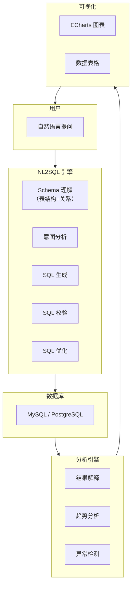

# 项目三：智能数据分析助手

> **创建日期：** 2026-06-06
> **难度：** ⭐⭐⭐ 综合 | **核心技术：** NL2SQL + Agent + 可视化

---

## 一、项目概述

构建一个智能数据分析助手，用户用自然语言提问，系统自动生成 SQL、执行查询、分析结果并生成可视化图表。

### 核心功能

| 功能 | 说明 |
|------|------|
| 自然语言查询 | "上个月销售额最高的10个产品" → SQL |
| 多表关联 | 自动识别表关系，生成 JOIN 查询 |
| 结果分析 | 对查询结果进行解释和总结 |
| 可视化 | 自动生成柱状图、折线图、饼图 |
| 上下文记忆 | 多轮对话，记住之前的查询上下文 |

---

## 二、系统架构



---

## 三、核心设计

### 3.1 Schema 理解

```python
# Schema 管理器
class SchemaManager:
    def get_schema_context(self):
        """获取数据库 Schema 上下文，用于 Prompt"""
        tables = self.get_all_tables()
        context = "数据库 Schema：\n\n"

        for table in tables:
            context += f"表名：{table.name}\n"
            context += f"描述：{table.description}\n"
            context += "字段：\n"
            for col in table.columns:
                context += f"  - {col.name} ({col.type}): {col.description}\n"

            # 关联关系
            for rel in table.relationships:
                context += f"关联：{table.name}.{rel.fk} → {rel.ref_table}.{rel.pk}\n"

            context += "\n"
        return context

    # 生成的 Schema 上下文示例：
    """
    表名：orders
    描述：订单表
    字段：
      - id (INT): 订单ID，主键
      - user_id (INT): 用户ID
      - product_id (INT): 商品ID
      - amount (DECIMAL): 订单金额
      - created_at (DATETIME): 创建时间
      - status (VARCHAR): 订单状态
    关联：orders.user_id → users.id
    关联：orders.product_id → products.id

    表名：users
    描述：用户表
    字段：
      - id (INT): 用户ID，主键
      - name (VARCHAR): 用户姓名
      - department (VARCHAR): 部门
      - created_at (DATETIME): 注册时间
    """
```

### 3.2 NL2SQL Pipeline

```python
# NL2SQL 核心流程
class NL2SQL:
    def generate_sql(self, question, schema_context, history=None):
        # 1. 构建 Prompt（包含 Schema + 历史 + 示例）
        prompt = f"""
        {schema_context}

        对话历史：{history}

        请根据用户问题生成 SQL 查询。
        要求：
        - 只输出 SQL，不要其他内容
        - 使用表别名提高可读性
        - 添加必要的注释

        示例：
        问题：上个月注册的用户数量
        SQL：
        SELECT COUNT(*) as user_count
        FROM users
        WHERE created_at >= DATE_SUB(CURDATE(), INTERVAL 1 MONTH)

        用户问题：{question}
        SQL：
        """

        sql = self.llm.generate(prompt)

        # 2. SQL 校验
        if not self.validate_sql(sql):
            return self.retry_with_feedback(sql, question)

        return sql

    def validate_sql(self, sql):
        """SQL 安全校验"""
        # 只允许 SELECT 语句
        if not sql.strip().upper().startswith("SELECT"):
            return False
        # 禁止 DROP/DELETE/UPDATE/INSERT
        dangerous = ["DROP", "DELETE", "UPDATE", "INSERT", "ALTER"]
        for keyword in dangerous:
            if keyword in sql.upper():
                return False
        return True
```

### 3.3 Agent 驱动分析

```python
# 数据分析 Agent
class DataAnalysisAgent:
    def analyze(self, question):
        # 1. 理解意图，生成 SQL
        sql = self.nl2sql.generate_sql(question, self.schema)

        # 2. 执行查询
        data = self.execute_sql(sql)

        # 3. 分析结果
        analysis = self.analyze_result(data, question)

        # 4. 生成可视化建议
        chart_type = self.recommend_chart(data, question)

        return {
            "sql": sql,
            "data": data,
            "analysis": analysis,
            "chart": {
                "type": chart_type,
                "config": self.generate_chart_config(data, chart_type)
            }
        }

    def recommend_chart(self, data, question):
        """根据数据特征推荐图表类型"""
        if len(data) == 0:
            return "none"

        columns = data[0].keys()
        numeric_cols = [c for c in columns if isinstance(data[0][c], (int, float))]

        if len(numeric_cols) == 0:
            return "table"  # 纯文本数据
        elif len(data) <= 10:
            return "bar"    # 少量数据用柱状图
        elif len(data) <= 30:
            return "line"   # 时间序列用折线图
        else:
            return "pie"    # 用饼图展示占比
```

### 3.4 多表关联处理

```python
# 多表关联示例
"""
问题：查询技术部每个员工的订单总额
"""
# 自动生成的 SQL：
SELECT
    u.name AS 员工姓名,
    u.department AS 部门,
    COUNT(o.id) AS 订单数,
    COALESCE(SUM(o.amount), 0) AS 订单总额
FROM users u
LEFT JOIN orders o ON u.id = o.user_id
WHERE u.department = '技术部'
GROUP BY u.id, u.name, u.department
ORDER BY 订单总额 DESC
```

---

## 四、API 接口

```python
@app.post("/api/analysis/query")
async def natural_query(req: QueryRequest):
    """自然语言查询接口"""
    result = data_agent.analyze(req.question)
    return {
        "sql": result["sql"],
        "data": result["data"],
        "analysis": result["analysis"],
        "chart": result["chart"]
    }

@app.get("/api/analysis/schema")
async def get_schema():
    """获取数据库 Schema"""
    return schema_manager.get_schema_context()
```

---

## 五、可视化配置

```python
# ECharts 配置生成
def generate_echarts_config(data, chart_type):
    if chart_type == "bar":
        return {
            "xAxis": {"data": [row["name"] for row in data]},
            "yAxis": {},
            "series": [{
                "type": "bar",
                "data": [row["value"] for row in data]
            }]
        }
    elif chart_type == "pie":
        return {
            "series": [{
                "type": "pie",
                "data": [{"name": row["name"], "value": row["value"]} for row in data]
            }]
        }
```

---

## 六、扩展方向

- [ ] 支持复杂 SQL（子查询、窗口函数、CTE）
- [ ] 数据导出（Excel/CSV）
- [ ] 定时报告（每日销售摘要自动推送）
- [ ] 多数据源支持（MySQL + PostgreSQL + ClickHouse）

---

## 面试高频题

### Q1: NL2SQL 系统中，Schema 上下文构建的核心挑战是什么？如何解决？

**详细答案：** NL2SQL 系统中 Schema 上下文构建的核心挑战是"信息量与精准度的平衡"。一个企业数据库通常有数百张表、数千个字段，如果把完整的 Schema 全部塞进 Prompt，Token 消耗巨大且 LLM 注意力被稀释，容易生成错误的 SQL。但如果只提供表名列表不提供字段详情，LLM 又无法生成正确的查询。解决方案是项目三中采用的"Schema 向量检索"策略：将每张表的结构描述（表名、字段名、字段类型、字段注释、关联关系）向量化存入向量数据库，当用户提问时，先用问题的语义向量检索最相关的 3-5 张表，只将这些表的完整 Schema 注入 Prompt。

此外，Schema 上下文还需要包含"关联关系"——这是多表关联查询的关键。如果用户问"技术部每个员工的订单总额"，系统需要知道 users 表和 orders 表通过 user_id 关联。在项目三中，`SchemaManager.get_schema_context()` 方法在生成 Schema 上下文时，不仅包含表名和字段，还包含 `关联：orders.user_id → users.id` 这样的关联关系描述。另一个关键考量是 Schema 描述的"LLM 友好性"——Schema 描述应该使用自然语言而非数据库术语，例如"订单金额（DECIMAL）"比"amount DECIMAL(10,2)"更易被 LLM 理解。项目三还引入了 Few-Shot 示例——将历史中成功执行的 SQL 及其对应的自然语言问题作为示例注入 Prompt，进一步提升了 SQL 生成的准确率。

### Q2: 项目三中 SQL 安全校验（只允许 SELECT）的必要性是什么？还有哪些安全措施？

**详细答案：** SQL 安全校验是 NL2SQL 系统中最关键的安全防线，因为 LLM 生成的 SQL 是不可控的——用户可能通过恶意 Prompt 诱导 LLM 生成 DROP TABLE、DELETE FROM 等破坏性语句。在项目三中，`validate_sql` 方法实现了最基本的防护：只允许 SELECT 语句，禁止 DROP、DELETE、UPDATE、INSERT、ALTER 等写操作。这个校验虽然简单，但能拦截绝大多数安全风险。更进一步，系统应该只给数据库配置只读权限（read-only user），这样即使校验被绕过，数据库层面也无法执行写操作。

除了 SQL 类型校验，还需要其他安全措施。第一是 SQL 注入防护——虽然 LLM 生成的 SQL 不太可能包含注入代码，但用户输入中可能包含恶意片段，需要对用户输入进行转义或使用参数化查询。第二是敏感字段过滤——某些字段（如用户密码、身份证号）不应出现在查询结果中，需要在 Schema 上下文构建时排除这些字段，或在查询结果返回前进行脱敏。第三是查询复杂度限制——防止 LLM 生成笛卡尔积查询或超大结果集查询，需要对 SQL 的执行时间、返回行数设置上限。第四是审计日志——记录所有 NL2SQL 查询（原始问题、生成的 SQL、执行时间、返回行数），便于事后审计和问题排查。这些安全措施共同构成了 NL2SQL 系统的"纵深防御"体系。

### Q3: DataAnalysisAgent 的图表推荐逻辑是如何工作的？为什么建议这样做？

**详细答案：** 在项目三中，`DataAnalysisAgent.recommend_chart` 方法根据查询结果的数据特征自动推荐图表类型。推荐逻辑基于三个规则：如果结果中没有数值列（纯文本数据），返回 `table`（表格展示）；如果结果行数 <= 10，返回 `bar`（柱状图，适合少量分类数据对比）；如果结果行数 <= 30，返回 `line`（折线图，适合展示时间序列趋势）；其他情况返回 `pie`（饼图，适合展示占比分布）。这个推荐逻辑虽然简单，但覆盖了最常用的可视化场景，且准确率较高。

为什么建议这种自动化推荐？因为 NL2SQL 的目标用户（业务人员）通常不熟悉数据可视化最佳实践，他们可能不知道"柱状图适合对比、折线图适合趋势、饼图适合占比"这些基本原则。如果让用户自己选择图表类型，他们可能选错（比如用饼图展示 20 个类别，导致图表不可读），或者根本不知道选什么。自动化推荐让用户只需用自然语言提问题，系统自动判断"这个数据最适合用什么图表展示"，降低了使用门槛。当然，自动推荐不是最终方案——用户应该可以手动覆盖推荐的类型，选择自己偏好的图表。在生产环境中，还可以引入更智能的推荐：基于历史用户的图表选择偏好进行个性化推荐，或使用 LLM 分析数据特征和问题意图来推荐更复杂的图表类型（如散点图、热力图、漏斗图等）。

### Q4: 多表关联查询在 NL2SQL 中是如何实现的？相比单表查询增加了哪些复杂度？

**详细答案：** 多表关联查询在 NL2SQL 中的实现依赖于 Schema 上下文中的"关联关系"描述。在项目三的 Schema 上下文中，每张表不仅包含字段信息，还包含 `关联：orders.user_id → users.id` 这样的关联关系声明。当 LLM 看到这些关联关系后，能够理解表之间的连接方式，并生成包含 JOIN 的 SQL。例如，用户问"查询技术部每个员工的订单总额"，LLM 能够识别出需要 JOIN users 和 orders 两张表，通过 `users.id = orders.user_id` 关联，并按部门筛选。

相比单表查询，多表关联查询增加了三个层次的复杂度。第一是"表选择"——当数据库有数十张表时，LLM 需要从众多表中选出正确的表进行关联。如果 Schema 上下文包含所有表的关联关系，LLM 可能被误导，将不相关的表也 JOIN 进来。因此，Schema 向量检索在此时至关重要——只把最相关的 3-5 张表及其关联关系注入 Prompt。第二是"JOIN 类型选择"——LLM 需要判断使用 INNER JOIN、LEFT JOIN 还是 RIGHT JOIN。这取决于问题的语义（"每个员工"意味着包含没有订单的员工，应该用 LEFT JOIN）。第三是"聚合和分组"——多表关联后的聚合查询（COUNT、SUM、GROUP BY）比单表更复杂，LLM 需要正确处理字段的归属（哪个字段属于哪张表），避免"ambiguous column"错误。

### Q5: 在项目三中，Agent 驱动分析与传统手工编写 SQL + Python 分析脚本相比，有什么核心优势？

**详细答案：** Agent 驱动分析相比传统手工分析有三个核心优势。第一是"门槛降低"——传统方式需要业务人员提出需求后，数据分析师编写 SQL 查询、用 Python 处理数据、用 Matplotlib/ECharts 生成图表，整个过程需要数小时到数天。Agent 驱动分析让业务人员直接用自然语言提问，系统自动完成"理解意图 → 生成 SQL → 执行查询 → 分析结果 → 生成图表"的全流程，几分钟内就能得到结果。这大大缩短了"从问题到洞察"的周期，让数据分析更加民主化。

第二是"探索性分析支持"——传统方式中，每次新的分析需求都需要重新编写代码，导致业务人员在分析过程中不愿意频繁改变分析方向（因为每次改变都需要等待）。Agent 驱动分析支持多轮对话，用户可以在看到第一个结果后追问"那按部门分组呢？"或"只看最近三个月的数据"，系统自动调整 SQL 并重新查询。这种"即时反馈"的分析体验，更符合人类探索数据的自然思维过程。第三是"结果解释"——传统方式只返回原始数据和图表，用户需要自己解读"这个数据意味着什么"。Agent 驱动分析通过 `AnalysisEngine` 对查询结果进行解释和总结，用自然语言告诉用户"销售额增长了 15%，主要由 XX 产品带动"，降低了数据解读的门槛。当然，Agent 驱动分析也有局限——对于极其复杂的分析逻辑（如多步骤数据转换、自定义算法），传统手工方式仍然更灵活和精确。

### Q6: 项目三在错误处理方面有哪些设计？当 SQL 生成错误或执行失败时如何优雅地降级？

**详细答案：** 项目三在错误处理方面采用了"多层防护 + 优雅降级"的设计理念。第一层防护是 SQL 安全校验（`validate_sql`），在 SQL 执行之前就拦截不需要的写操作语句。如果校验失败，系统不会执行 SQL，而是返回错误提示给用户。第二层是 SQL 执行错误捕获——当 LLM 生成的 SQL 语法正确但逻辑有问题（如引用了不存在的字段、JOIN 了不存在的表），数据库会返回错误信息。项目三的 `retry_with_feedback` 方法会将数据库错误信息作为反馈，让 LLM 根据错误信息修正 SQL 并重新生成。这个"错误反馈 → 修正"的循环最多执行 2-3 次，避免无限重试。

第三层是结果验证——SQL 执行成功后，系统检查返回结果是否为空集。如果结果为空，可能是 SQL 条件写错了，系统会提示用户"查询未返回结果，请检查查询条件"。第四层是超时保护——对 SQL 执行设置超时时间（如 30 秒），防止 LLM 生成笛卡尔积查询导致数据库长时间阻塞。当所有重试都失败后，系统的降级策略是：返回一个友好的错误提示，说明"系统暂时无法处理您的查询，请尝试换一种方式描述您的问题"，同时记录完整的错误日志供开发团队排查。这种多层防护设计确保了系统的鲁棒性——即使 LLM 生成了错误的 SQL，系统也能优雅地处理和恢复，而不是崩溃或返回无意义的错误信息。

---

## 参考资料

- [ECharts 官方文档](https://echarts.apache.org)
- [MySQL 官方文档](https://dev.mysql.com/doc/)
- [LangChain SQL Agent](https://python.langchain.com/docs/integrations/toolkits/sql_database)