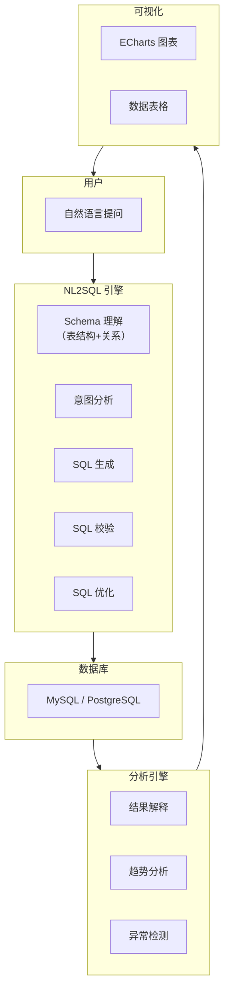

# 项目三：智能数据分析助手

> **创建日期：** 2026-06-06
> **难度：** ⭐⭐⭐ 综合 | **核心技术：** NL2SQL + Agent + 可视化

---

## 一、项目概述

构建一个智能数据分析助手，用户用自然语言提问，系统自动生成 SQL、执行查询、分析结果并生成可视化图表。

### 核心功能

| 功能 | 说明 |
|------|------|
| 自然语言查询 | "上个月销售额最高的10个产品" → SQL |
| 多表关联 | 自动识别表关系，生成 JOIN 查询 |
| 结果分析 | 对查询结果进行解释和总结 |
| 可视化 | 自动生成柱状图、折线图、饼图 |
| 上下文记忆 | 多轮对话，记住之前的查询上下文 |

---

## 二、系统架构



---

## 三、核心设计

### 3.1 Schema 理解

```python
# Schema 管理器
class SchemaManager:
    def get_schema_context(self):
        """获取数据库 Schema 上下文，用于 Prompt"""
        tables = self.get_all_tables()
        context = "数据库 Schema：\n\n"

        for table in tables:
            context += f"表名：{table.name}\n"
            context += f"描述：{table.description}\n"
            context += "字段：\n"
            for col in table.columns:
                context += f"  - {col.name} ({col.type}): {col.description}\n"

            # 关联关系
            for rel in table.relationships:
                context += f"关联：{table.name}.{rel.fk} → {rel.ref_table}.{rel.pk}\n"

            context += "\n"
        return context

    # 生成的 Schema 上下文示例：
    """
    表名：orders
    描述：订单表
    字段：
      - id (INT): 订单ID，主键
      - user_id (INT): 用户ID
      - product_id (INT): 商品ID
      - amount (DECIMAL): 订单金额
      - created_at (DATETIME): 创建时间
      - status (VARCHAR): 订单状态
    关联：orders.user_id → users.id
    关联：orders.product_id → products.id

    表名：users
    描述：用户表
    字段：
      - id (INT): 用户ID，主键
      - name (VARCHAR): 用户姓名
      - department (VARCHAR): 部门
      - created_at (DATETIME): 注册时间
    """
```

### 3.2 NL2SQL Pipeline

```python
# NL2SQL 核心流程
class NL2SQL:
    def generate_sql(self, question, schema_context, history=None):
        # 1. 构建 Prompt（包含 Schema + 历史 + 示例）
        prompt = f"""
        {schema_context}

        对话历史：{history}

        请根据用户问题生成 SQL 查询。
        要求：
        - 只输出 SQL，不要其他内容
        - 使用表别名提高可读性
        - 添加必要的注释

        示例：
        问题：上个月注册的用户数量
        SQL：
        SELECT COUNT(*) as user_count
        FROM users
        WHERE created_at >= DATE_SUB(CURDATE(), INTERVAL 1 MONTH)

        用户问题：{question}
        SQL：
        """

        sql = self.llm.generate(prompt)

        # 2. SQL 校验
        if not self.validate_sql(sql):
            return self.retry_with_feedback(sql, question)

        return sql

    def validate_sql(self, sql):
        """SQL 安全校验"""
        # 只允许 SELECT 语句
        if not sql.strip().upper().startswith("SELECT"):
            return False
        # 禁止 DROP/DELETE/UPDATE/INSERT
        dangerous = ["DROP", "DELETE", "UPDATE", "INSERT", "ALTER"]
        for keyword in dangerous:
            if keyword in sql.upper():
                return False
        return True
```

### 3.3 Agent 驱动分析

```python
# 数据分析 Agent
class DataAnalysisAgent:
    def analyze(self, question):
        # 1. 理解意图，生成 SQL
        sql = self.nl2sql.generate_sql(question, self.schema)

        # 2. 执行查询
        data = self.execute_sql(sql)

        # 3. 分析结果
        analysis = self.analyze_result(data, question)

        # 4. 生成可视化建议
        chart_type = self.recommend_chart(data, question)

        return {
            "sql": sql,
            "data": data,
            "analysis": analysis,
            "chart": {
                "type": chart_type,
                "config": self.generate_chart_config(data, chart_type)
            }
        }

    def recommend_chart(self, data, question):
        """根据数据特征推荐图表类型"""
        if len(data) == 0:
            return "none"

        columns = data[0].keys()
        numeric_cols = [c for c in columns if isinstance(data[0][c], (int, float))]

        if len(numeric_cols) == 0:
            return "table"  # 纯文本数据
        elif len(data) <= 10:
            return "bar"    # 少量数据用柱状图
        elif len(data) <= 30:
            return "line"   # 时间序列用折线图
        else:
            return "pie"    # 用饼图展示占比
```

### 3.4 多表关联处理

```python
# 多表关联示例
"""
问题：查询技术部每个员工的订单总额
"""
# 自动生成的 SQL：
SELECT
    u.name AS 员工姓名,
    u.department AS 部门,
    COUNT(o.id) AS 订单数,
    COALESCE(SUM(o.amount), 0) AS 订单总额
FROM users u
LEFT JOIN orders o ON u.id = o.user_id
WHERE u.department = '技术部'
GROUP BY u.id, u.name, u.department
ORDER BY 订单总额 DESC
```

---

## 四、API 接口

```python
@app.post("/api/analysis/query")
async def natural_query(req: QueryRequest):
    """自然语言查询接口"""
    result = data_agent.analyze(req.question)
    return {
        "sql": result["sql"],
        "data": result["data"],
        "analysis": result["analysis"],
        "chart": result["chart"]
    }

@app.get("/api/analysis/schema")
async def get_schema():
    """获取数据库 Schema"""
    return schema_manager.get_schema_context()
```

---

## 五、可视化配置

```python
# ECharts 配置生成
def generate_echarts_config(data, chart_type):
    if chart_type == "bar":
        return {
            "xAxis": {"data": [row["name"] for row in data]},
            "yAxis": {},
            "series": [{
                "type": "bar",
                "data": [row["value"] for row in data]
            }]
        }
    elif chart_type == "pie":
        return {
            "series": [{
                "type": "pie",
                "data": [{"name": row["name"], "value": row["value"]} for row in data]
            }]
        }
```

---

## 六、扩展方向

- [ ] 支持复杂 SQL（子查询、窗口函数、CTE）
- [ ] 数据导出（Excel/CSV）
- [ ] 定时报告（每日销售摘要自动推送）
- [ ] 多数据源支持（MySQL + PostgreSQL + ClickHouse）