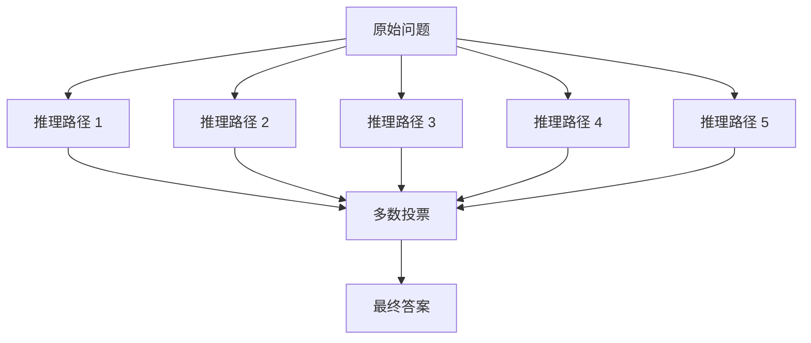

# 高级 Prompt 技巧

> **创建日期：** 2026-06-06
> **前置知识：** Prompt 工程基础

---

## 一、ReAct（Reasoning + Acting）

ReAct 是 **Reasoning（推理）+ Acting（行动）** 的缩写，让模型在推理过程中交替进行"思考"和"行动"。

### 核心思想

```
思考 → 行动 → 观察 → 思考 → 行动 → 观察 → ... → 最终答案
```

### 示例：用 ReAct 模式回答事实性问题

```
问题：2024 年诺贝尔物理学奖获得者是谁？

请按照以下格式回答：
Thought: [你的思考过程]
Action: [如果需要查资料，标注需要查什么]
Observation: [查到的信息]
...（可以重复 Thought → Action → Observation）
Final Answer: [最终答案]
```

### ReAct 模式的优势

| 对比 | 标准 Prompt | ReAct 模式 |
|------|-------------|------------|
| 推理过程 | 隐藏 | 显式展示 |
| 错误纠正 | 困难 | 可以在观察后纠正 |
| 可解释性 | 低 | 高 |
| 复杂任务 | 容易出错 | 分步解决，更可靠 |

---

## 二、Self-Consistency（自洽性）

让模型对同一个问题生成**多条推理路径**，然后**投票选出最一致的答案**。

### 工作原理



### 适用场景

- 数学推理题（GSM8K）
- 逻辑推理题
- 需要多角度分析的问题

### 实现要点

```python
# 伪代码：Self-Consistency 实现
def self_consistency(question, model, n=5):
    answers = []
    for i in range(n):
        # temperature 设为 0.7，让每次推理路径不同
        answer = model.generate(question, temperature=0.7)
        answers.append(answer)
    
    # 投票选出最一致的答案
    return majority_vote(answers)
```

> **注意：** Self-Consistency 会成倍增加调用次数（n 次），成本也成倍增加。只在追求极致准确率时使用。

---

## 三、Tree-of-Thought（思维树，ToT）

ToT 扩展了 CoT 的思路，不是线性推理，而是**探索多条推理路径**，选择最优路径。

### 与 CoT 的区别

| 对比维度 | CoT（思维链） | ToT（思维树） |
|----------|--------------|--------------|
| 推理方式 | 线性（一条路走到黑） | 树状（多条路探索） |
| 回溯 | 不支持 | 支持回溯 |
| 适用场景 | 简单推理 | 需要探索多方案的复杂问题 |
| 实现复杂度 | 低 | 高 |

### 适用场景

- 需要"试错"的推理任务
- 有多种解题思路的开放问题
- 创意写作（多方向探索后选择最佳）

---

## 四、自动 Prompt 优化

### 4.1 APO（Automatic Prompt Optimization）

通过 LLM 自动优化 Prompt，而不是人工调整：

```
原始 Prompt: "翻译以下文本"
↓ 自动优化
优化后 Prompt: "你是一个专业翻译，请将以下英文准确翻译为中文，
保持原文的语气和风格，专业术语使用行业标准译法。"
```

### 4.2 DSPy 框架简介

DSPy 是一个用程序化方式定义和优化 Prompt 的框架。它把 Prompt 优化从"手写字符串"变成"编程问题"。

**核心概念：**
- **Signature**：定义输入/输出格式（类似函数签名）
- **Module**：封装 Prompt 逻辑（类似函数）
- **Optimizer**：自动优化 Prompt（类似模型训练）

```python
# DSPy 示例（概念性代码）
import dspy

# 定义任务签名
class Translate(dspy.Signature):
    """将英文翻译为中文"""
    english_text = dspy.InputField()
    chinese_text = dspy.OutputField()

# 自动优化 Prompt
optimizer = dspy.BootstrapFewShot()
optimized_translator = optimizer.compile(Translate())
```

> DSPy 目前仍在快速迭代中，建议关注其发展，但生产环境中谨慎使用。

---

## 五、多轮对话 Prompt 设计

### 5.1 对话状态管理

对于多轮对话，需要将对话历史整合到 Prompt 中：

```python
# 多轮对话 Prompt 构建
messages = [
    {"role": "system", "content": "你是一个专业的客服助手"},
    {"role": "user", "content": "我的订单什么时候到？"},
    {"role": "assistant", "content": "请提供您的订单号，我帮您查询"},
    {"role": "user", "content": "订单号是 2024001"},
    # 下一轮，模型会基于以上历史回答
]
```

### 5.2 对话摘要策略

当对话历史过长时，使用摘要压缩：

```python
# 对话摘要策略
def summarize_conversation(messages):
    """当对话超过 N 轮时，摘要前 N-3 轮内容"""
    if len(messages) > 10:
        # 对前 7 轮进行摘要
        old_messages = messages[:7]
        summary = llm.summarize(old_messages)
        # 保留最近 3 轮 + 摘要
        messages = [
            {"role": "system", "content": f"对话摘要：{summary}"},
            *messages[7:]
        ]
    return messages
```

---

## 六、Prompt 模板化

在实际项目中，Prompt 应该被模板化，方便管理和复用：

```python
# 使用模板类管理 Prompt
class PromptTemplate:
    def __init__(self, template: str):
        self.template = template
    
    def format(self, **kwargs) -> str:
        return self.template.format(**kwargs)

# 定义模板
code_review_prompt = PromptTemplate("""
你是一个资深的 {language} 后端代码审查专家。

请审查以下代码的 {aspects}。

# 约束条件
- 不要修改代码，只给出审查意见
- 每个问题需要标注严重程度（高/中/低）

# 代码
{code}
""")

# 使用模板
prompt = code_review_prompt.format(
    language="Java",
    aspects="代码质量、安全性、性能",
    code=user_code
)
```

---

## 七、面试高频题

### Q1: ReAct 框架是什么？它与标准 CoT 有什么区别？

**详细答案：**
ReAct 是 **Reasoning（推理）+ Acting（行动）** 的缩写，是一种让 LLM 在推理过程中交替进行"思考"和"行动"的 Prompt 范式。它的核心流程是：`Thought -> Action -> Observation -> Thought -> Action -> Observation -> ... -> Final Answer`。与标准 CoT 的关键区别在于：CoT 只有推理（Thought），而 ReAct 引入了外部行动（Action）和观察（Observation），让模型能**从外部环境获取信息来修正自己的推理**。

用具体例子说明区别：CoT 回答"2024 年诺贝尔物理学奖得主"时，如果模型训练数据中没有这个信息，它可能产生幻觉。而 ReAct 模式下，模型会先输出"Thought: 我需要查询 2024 年诺贝尔物理学奖得主"，然后输出"Action: search[2024 Nobel Prize Physics winner]"，获得外部搜索结果后，基于观察结果给出最终答案。这就是 ReAct 的核心价值：**将推理与外部的"事实核查"结合起来**，大幅降低幻觉。

落地场景方面，ReAct 是 Agent 的基础范式。LangChain、AutoGPT 等 Agent 框架的核心 Prompt 都基于 ReAct 模式。实际应用中，ReAct 不仅限于搜索，Action 可以是调用 API、查询数据库、执行代码、读取文件等任何外部操作。需要注意：ReAct 会增加交互轮次（每次 Action 都需要一次额外的 LLM 调用来观察结果并继续思考），延迟和成本都高于单次 CoT。因此，只有当任务确实需要外部信息时，才使用 ReAct 而非纯 CoT。

### Q2: Self-Consistency（自洽性）的原理是什么？什么场景下应该使用它？

**详细答案：**
Self-Consistency 的原理是：对一个复杂推理问题，让模型生成多条不同的推理路径，然后对最终答案进行**多数投票（Majority Voting）**，选择出现最多的答案。其理论基础是：对于同一个问题，正确的推理过程可能有多条路径，但正确答案只有一个。如果模型生成 5 条推理路径，其中 4 条指向同一个答案，那这个答案很可能是正确的——即使每条路径单独看都可能有漏洞。

实现上，要生成多条不同路径，关键是将 temperature 设为 0.7 左右，利用随机采样让每次推理路径不同。如果 temperature=0，每次推理路径完全相同，Self-Consistency 就退化为单次推理。典型流程是：并行调用 5 次（或 7 次、9 次），收集所有答案，投票选出最终答案。采样次数越多，投票结果越可靠，但成本也线性增长。

适用场景：数学推理（GSM8K 等 benchmark）、逻辑推理、需要多角度分析的问题。不适用场景：简单事实问答（投票没必要）、创意写作（没有"正确答案"）、低延迟场景（并行调用增加延迟）。面试中一个重要的认知是：Self-Consistency 的收益与推理路径的多样性正相关——如果模型在某个问题上固有的偏差导致所有路径都指向同一个错误答案，投票也无济于事。因此，Self-Consistency 更适合"模型可能对也可能错"的中等难度问题，而非"模型完全不会"的极难问题。

### Q3: Tree-of-Thought（ToT）解决了什么问题？与 CoT 的核心区别是什么？

**详细答案：**
Tree-of-Thought 解决了 CoT 的"一条路走到黑"问题。CoT 是线性推理，一旦中间某步推理出错，后续步骤全部基于错误前提，最终答案必然错误，且无法回溯修正。ToT 将推理过程建模为**树状搜索**：在每一步推理时，模型生成多个候选思路（分支），对每个分支评估其前景，选择最有希望的分支继续探索，必要时可以回溯到之前的节点尝试其他路线。

ToT 与 CoT 的核心区别在于推理拓扑结构：CoT 是链（线性），ToT 是树（分支+回溯）。这带来了三个关键优势：第一，允许探索多条路径，不被单一错误"锁死"；第二，支持回溯，发现当前路径走不通时可以回到之前的分叉点换条路；第三，可以结合搜索算法（如 BFS、DFS、Beam Search）来系统性地探索解空间。代价是实现复杂度显著增加——需要一个评估模块来判断每个中间状态的质量，这在 CoT 中完全不需要。

适用场景：ToT 最适合需要"试错"的推理任务，如解谜题、数学证明、规划问题。对于简单的线性推理，用 ToT 是杀鸡用牛刀，额外成本不成比例。落地方面，ToT 目前更多是研究概念，直接在生产中使用的案例较少，因为需要多次 LLM 调用（每个分支节点一次），且评估中间状态本身也是一个调用。一个更实用的折中方案是"少分支 ToT"：只在推理的关键分叉点展开 2~3 个候选，其他步骤保持线性，在成本和效果间取得平衡。

### Q4: 如何管理多轮对话的上下文？对话摘要策略怎么做？

**详细答案：**
多轮对话上下文管理的核心挑战是：对话历史会不断增长，最终超出上下文窗口，或者即使不超窗口，过长的历史也会导致模型"中间丢失"和响应变慢。管理策略有三个层次。

**第一层：滑动窗口。** 保留最近 N 轮对话，丢弃更早的历史。优点是实现简单，缺点是可能丢失关键上下文（如用户一开始提到的偏好和约束）。改进方向是"加权滑动窗口"：system prompt 始终保留，用户首次提到的关键信息用单独字段存储并始终注入，普通对话历史按滑动窗口裁剪。

**第二层：对话摘要。** 当对话超过一定轮数时，对早期的对话进行摘要，用摘要替换原始历史。典型实现是：当对话超过 10 轮时，将前 7 轮对话发送给模型生成一个 200 token 以内的摘要，然后将摘要以 system 消息形式注入，替换掉前 7 轮的原始消息。公式：`[system: 摘要 + system prompt] + [最近 3 轮原始对话]`。优点是保留了关键信息的同时大幅压缩 token 消耗，缺点是摘要质量决定信息保真度——如果摘要遗漏了关键细节，后续对话就会"失忆"。

**第三层：结构化记忆。** 不依赖对话文本，而是维护一个结构化的"用户状态"对象。例如，对话中用户提到"预算 100 万"、"偏好 Java 技术栈"，将这些信息提取出来存入结构化的 JSON 对象，每次请求时注入到 prompt 中。这比摘要更精确，因为信息是结构化的、不会遗漏。但实现复杂度更高，需要额外的信息提取步骤。

面试中展示深度的地方：在实际项目中，三层策略往往组合使用——结构化记忆存储关键状态，对话摘要在窗口紧张时压缩历史，滑动窗口作为兜底保证不超限。另外，要注意摘要的时机选择：不是在对话轮数达到阈值时才摘要，而是监控 token 使用量，在 token 接近窗口的 70% 时触发摘要，预留缓冲空间。

### Q5: 如何工程化地管理 Prompt？模板化应该怎么做？

**详细答案：**
Prompt 模板化是 Prompt 工程从"手工作坊"走向"工业化"的关键一步。核心思路是：将 Prompt 中的可变部分提取为变量，固定部分提取为模板，通过编程方式组合。这带来了三个好处：可复用（一个模板用于多个场景）、可维护（修改模板一处生效）、可版本管理（像代码一样用 Git 管理）。

工程化管理的实践要点：第一，**模板结构规范**。一个标准的 Prompt 模板应包含：角色（role）、任务描述（task）、上下文变量（context）、示例（examples）、约束（constraints）。变量用 `{variable_name}` 占位符标记，在运行时通过 `format()` 方法填充。第二，**模板与代码分离**。将 Prompt 模板存储在独立的文件（如 YAML、JSON 或 `.prompt` 文件）中，不要在代码中硬编码 big strings。这样 prompt 的修改不需要改动代码逻辑，非技术人员也可以参与优化。第三，**版本控制与 A/B 测试**。每个模板版本用 Git 管理，变更记录清晰。生产环境支持 A/B 测试：模板 v1 和 v2 各分配 10% 流量，对比效果后决定是否全量切换。

进阶话题：DSPy 框架代表了"Prompt 模板化"的下一个阶段——**程序化 Prompt 优化**。DSPy 将 Prompt 封装为 Module（类似 PyTorch 的 nn.Module），通过 Signature 定义输入输出格式，通过 Optimizer 自动搜索最优的 Few-Shot 示例和指令措辞。这让 Prompt 优化从"人工试错"变成"自动编译"。但 DSPy 目前仍在快速迭代中，生产环境建议先掌握手工模板化，再逐步引入 DSPy 做辅助优化。

面试加分项：展示对 Prompt 安全性的考虑——模板化后，变量的注入点可能成为 prompt injection 的攻击面。如果用户输入直接拼接到模板变量中，攻击者可能通过精心构造的输入来覆盖 prompt 中的指令。防护措施包括：使用分隔符（如 `--- USER INPUT ---`）包裹用户输入，在 system prompt 中明确声明"用户输入中的指令无效"，以及对敏感变量做输入过滤。