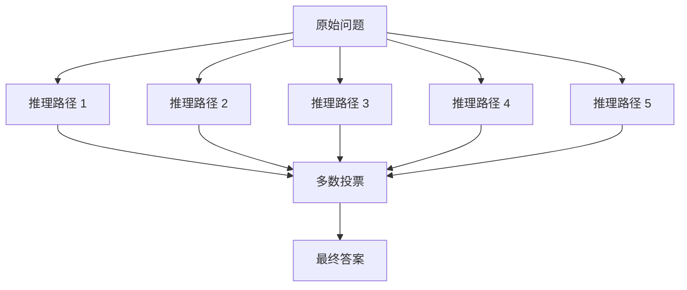

# 高级 Prompt 技巧

> **创建日期：** 2026-06-06
> **前置知识：** Prompt 工程基础

---

## 一、ReAct（Reasoning + Acting）

ReAct 是 **Reasoning（推理）+ Acting（行动）** 的缩写，让模型在推理过程中交替进行"思考"和"行动"。

### 核心思想

```
思考 → 行动 → 观察 → 思考 → 行动 → 观察 → ... → 最终答案
```

### 示例：用 ReAct 模式回答事实性问题

```
问题：2024 年诺贝尔物理学奖获得者是谁？

请按照以下格式回答：
Thought: [你的思考过程]
Action: [如果需要查资料，标注需要查什么]
Observation: [查到的信息]
...（可以重复 Thought → Action → Observation）
Final Answer: [最终答案]
```

### ReAct 模式的优势

| 对比 | 标准 Prompt | ReAct 模式 |
|------|-------------|------------|
| 推理过程 | 隐藏 | 显式展示 |
| 错误纠正 | 困难 | 可以在观察后纠正 |
| 可解释性 | 低 | 高 |
| 复杂任务 | 容易出错 | 分步解决，更可靠 |

---

## 二、Self-Consistency（自洽性）

让模型对同一个问题生成**多条推理路径**，然后**投票选出最一致的答案**。

### 工作原理



### 适用场景

- 数学推理题（GSM8K）
- 逻辑推理题
- 需要多角度分析的问题

### 实现要点

```python
# 伪代码：Self-Consistency 实现
def self_consistency(question, model, n=5):
    answers = []
    for i in range(n):
        # temperature 设为 0.7，让每次推理路径不同
        answer = model.generate(question, temperature=0.7)
        answers.append(answer)
    
    # 投票选出最一致的答案
    return majority_vote(answers)
```

> **注意：** Self-Consistency 会成倍增加调用次数（n 次），成本也成倍增加。只在追求极致准确率时使用。

---

## 三、Tree-of-Thought（思维树，ToT）

ToT 扩展了 CoT 的思路，不是线性推理，而是**探索多条推理路径**，选择最优路径。

### 与 CoT 的区别

| 对比维度 | CoT（思维链） | ToT（思维树） |
|----------|--------------|--------------|
| 推理方式 | 线性（一条路走到黑） | 树状（多条路探索） |
| 回溯 | 不支持 | 支持回溯 |
| 适用场景 | 简单推理 | 需要探索多方案的复杂问题 |
| 实现复杂度 | 低 | 高 |

### 适用场景

- 需要"试错"的推理任务
- 有多种解题思路的开放问题
- 创意写作（多方向探索后选择最佳）

---

## 四、自动 Prompt 优化

### 4.1 APO（Automatic Prompt Optimization）

通过 LLM 自动优化 Prompt，而不是人工调整：

```
原始 Prompt: "翻译以下文本"
↓ 自动优化
优化后 Prompt: "你是一个专业翻译，请将以下英文准确翻译为中文，
保持原文的语气和风格，专业术语使用行业标准译法。"
```

### 4.2 DSPy 框架简介

DSPy 是一个用程序化方式定义和优化 Prompt 的框架。它把 Prompt 优化从"手写字符串"变成"编程问题"。

**核心概念：**
- **Signature**：定义输入/输出格式（类似函数签名）
- **Module**：封装 Prompt 逻辑（类似函数）
- **Optimizer**：自动优化 Prompt（类似模型训练）

```python
# DSPy 示例（概念性代码）
import dspy

# 定义任务签名
class Translate(dspy.Signature):
    """将英文翻译为中文"""
    english_text = dspy.InputField()
    chinese_text = dspy.OutputField()

# 自动优化 Prompt
optimizer = dspy.BootstrapFewShot()
optimized_translator = optimizer.compile(Translate())
```

> DSPy 目前仍在快速迭代中，建议关注其发展，但生产环境中谨慎使用。

---

## 五、多轮对话 Prompt 设计

### 5.1 对话状态管理

对于多轮对话，需要将对话历史整合到 Prompt 中：

```python
# 多轮对话 Prompt 构建
messages = [
    {"role": "system", "content": "你是一个专业的客服助手"},
    {"role": "user", "content": "我的订单什么时候到？"},
    {"role": "assistant", "content": "请提供您的订单号，我帮您查询"},
    {"role": "user", "content": "订单号是 2024001"},
    # 下一轮，模型会基于以上历史回答
]
```

### 5.2 对话摘要策略

当对话历史过长时，使用摘要压缩：

```python
# 对话摘要策略
def summarize_conversation(messages):
    """当对话超过 N 轮时，摘要前 N-3 轮内容"""
    if len(messages) > 10:
        # 对前 7 轮进行摘要
        old_messages = messages[:7]
        summary = llm.summarize(old_messages)
        # 保留最近 3 轮 + 摘要
        messages = [
            {"role": "system", "content": f"对话摘要：{summary}"},
            *messages[7:]
        ]
    return messages
```

---

## 六、Prompt 模板化

在实际项目中，Prompt 应该被模板化，方便管理和复用：

```python
# 使用模板类管理 Prompt
class PromptTemplate:
    def __init__(self, template: str):
        self.template = template
    
    def format(self, **kwargs) -> str:
        return self.template.format(**kwargs)

# 定义模板
code_review_prompt = PromptTemplate("""
你是一个资深的 {language} 后端代码审查专家。

请审查以下代码的 {aspects}。

# 约束条件
- 不要修改代码，只给出审查意见
- 每个问题需要标注严重程度（高/中/低）

# 代码
{code}
""")

# 使用模板
prompt = code_review_prompt.format(
    language="Java",
    aspects="代码质量、安全性、性能",
    code=user_code
)
```

---

## 七、面试重点

::: warning 高频考点
1. **ReAct 框架是什么？** 与标准 CoT 有什么区别？
2. **Self-Consistency 的原理是什么？** 什么场景下使用？
3. **Tree-of-Thought 解决了什么问题？** 与 CoT 的核心区别？
4. **如何管理多轮对话的上下文？** 对话摘要怎么做？
5. **如何工程化地管理 Prompt？** 模板化怎么做？
:::