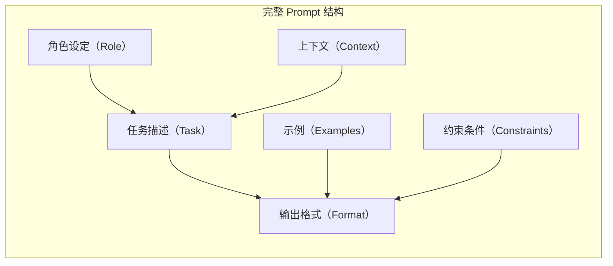
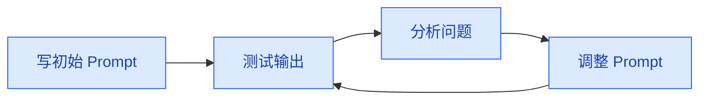

# Prompt 工程基础

> **创建日期：** 2026-06-06
> **前置知识：** LLM 基础概念

---

## 一、什么是 Prompt Engineering？

Prompt Engineering 是**通过精心设计输入文本（Prompt）来引导 LLM 产生期望输出**的技术。它不修改模型参数，而是通过改变输入来改变输出。

::: tip 关键认知
Prompt Engineering 是 AI 应用开发中**投入产出比最高**的技能。一个好的 Prompt 往往比换一个更贵的模型带来的提升更大。
:::

---

## 二、Prompt 基本结构

一个完整的 Prompt 通常包含以下要素：



### 示例：一个结构化的 Prompt

```
# 角色设定
你是一个资深的 Java 后端代码审查专家。

# 上下文
以下是用户提交的一段 Spring Boot 代码，
需要你从代码质量、安全性、性能三个维度进行审查。

# 任务描述
请审查以下代码，并按照下面的格式输出审查结果。

# 约束条件
- 不要修改代码，只给出审查意见
- 每个问题需要标注严重程度（高/中/低）
- 如果代码没有问题，请明确说明"代码审查通过"

# 代码
[粘贴代码]
```

---

## 三、核心技巧

### 3.1 Zero-Shot（零样本提示）

直接给出任务描述，不给示例。适用于简单、明确的任务。

```
请将以下英文翻译成中文：
"Artificial Intelligence is transforming the world."
```

### 3.2 Few-Shot（少样本提示）

提供 1~5 个示例，让模型理解任务模式。适用于需要特定格式或风格的任务。

```
# 示例 1
英文：Hello
中文：你好

# 示例 2
英文：Thank you
中文：谢谢

# 示例 3
英文：Good morning
中文：早上好

# 任务
英文：How are you?
中文：
```

### 3.3 Chain-of-Thought（思维链，CoT）

要求模型展示推理过程，而不是直接给出答案。适用于需要推理的复杂任务。

```
# 不使用 CoT
问题：一个班有 35 个学生，男生比女生多 5 个，有多少个男生？
答案：20 个

# 使用 CoT
问题：一个班有 35 个学生，男生比女生多 5 个，有多少个男生？
请一步步推理：
1. 设女生人数为 x
2. 男生人数为 x + 5
3. 总人数：x + (x + 5) = 35
4. 2x + 5 = 35
5. 2x = 30
6. x = 15
7. 男生人数 = 15 + 5 = 20
答案：20 个
```

### 3.4 角色设定

给模型一个明确的角色，引导其用特定方式回答。

| 角色设定示例 | 效果 |
|--------------|------|
| "你是一个资深的 Java 架构师" | 回答更专业，使用技术术语 |
| "你是一个耐心的编程老师" | 回答更详细，解释更多基础概念 |
| "你是一个严格的代码审查员" | 回答更挑剔，指出更多问题 |
| "你是一个友好的客服助手" | 回答更亲切，使用礼貌用语 |

---

## 四、输出格式控制

### 4.1 指定输出格式

```
请列出 Java 中的 5 种设计模式，以 JSON 格式输出：

{
  "patterns": [
    {
      "name": "设计模式名称",
      "category": "创建型/结构型/行为型",
      "description": "一句话描述",
      "use_case": "适用场景"
    }
  ]
}
```

### 4.2 如何使用分隔符

```
请分析以下代码的性能问题。

--- 代码开始 ---
public List<String> process(List<String> items) {
    List<String> result = new ArrayList<>();
    for (String item : items) {
        result.add(item.toUpperCase());
    }
    return result;
}
--- 代码结束 ---

请以 Markdown 表格形式输出分析结果。
```

### 4.3 控制输出长度

```
请用一句话总结 Transformer 架构的核心思想。
（回答不超过 50 个字）
```

---

## 五、Prompt 迭代优化方法论

### 5.1 优化循环



### 5.2 常见问题与调整策略

| 问题 | 可能原因 | 调整策略 |
|------|----------|----------|
| 回答太短/不完整 | 任务描述不够明确 | 增加具体要求，增加示例 |
| 回答太长/偏题 | 缺少长度约束 | 添加长度限制，强调"只回答核心问题" |
| 格式不正确 | 没有明确格式要求 | 增加格式示例，使用 JSON 模板 |
| 编造信息（幻觉） | 缺少约束 | 添加"如果不知道，请明确说不知道" |
| 回答不一致 | temperature 过高 | 降低 temperature 到 0~0.3 |

### 5.3 系统性优化流程

1. **建立评估集**：收集 20~30 个真实任务，定义"好"回答的标准
2. **量化评估**：对每个版本打分（1-5 分）
3. **A/B 对比**：每次只改一个变量，对比效果
4. **记录日志**：保存每次 Prompt 版本和评估结果
5. **持续迭代**：根据用户反馈持续优化

> 记住：**Prompt 优化没有银弹，只有不断迭代。** 好的 Prompt 往往是通过几十次甚至上百次的调整打磨出来的。

---

## 六、面试高频题

### Q1: 什么是 Prompt Engineering？为什么它在 AI 应用开发中如此重要？

**详细答案：**
Prompt Engineering 是通过精心设计输入文本（Prompt）来引导 LLM 产生期望输出的技术。它不修改模型参数，不进行微调，纯粹通过改变输入来改变输出。核心思想是：LLM 是一个"由输入上下文决定的概率引擎"，你的 prompt 质量直接决定了模型在概率空间中的搜索方向。一句话总结：Prompt Engineering 就是"用语言编程"——你用自然语言写指令，模型执行。

Prompt Engineering 之所以是"投入产出比最高"的技能，有三个原因。第一，**成本低、见效快**：写好一个 prompt 只需要经验和时间，不需要 GPU 集群、训练数据和数万美元的微调费用。第二，**效果提升显著**：一个好的 prompt 带来的输出质量提升，往往超过换一个更贵的模型——在多项基准测试中，优化后的 prompt 可以让廉价模型（如 Flash）在某些任务上超越未优化的旗舰模型。第三，**可迁移性强**：好的 prompt 设计原则（结构化、角色设定、示例驱动）跨模型通用，学一次终身受用。

面试中一个能拉开差距的认知是：Prompt Engineering 不是"写给 AI 的提示词"，而是"定义 AI 的任务边界"。好的 prompt 不仅要告诉模型做什么，更要告诉它**不做什么**、**什么情况下说不知道**、**输出格式是什么**。这是很多初学者忽略的维度——他们只写"帮我写一篇文章"，而不会写"你需要先分析目标读者，再确定文章结构，最后输出 Markdown 格式"。

### Q2: Zero-Shot 和 Few-Shot 的核心区别是什么？什么时候应该用 Few-Shot？

**详细答案：**
Zero-Shot 是直接给模型任务描述而不给任何示例，模型完全凭对任务描述的理解来生成输出。Few-Shot 是在任务描述之外，额外提供 1~5 个"输入-输出"示例，让模型通过模式匹配来理解任务期望。Zero-Shot 依赖模型的泛化能力，Few-Shot 依赖模型的上下文学习（In-Context Learning）能力。

什么时候用 Few-Shot 而非 Zero-Shot？第一，**需要特定输出格式**：比如要求输出 JSON、表格、代码块，Few-Shot 示例比文字描述更直观，模型更容易遵守。第二，**任务定义模糊**：当任务比较主观或难以用文字精确描述时（如"写得有幽默感"、"用专业口吻"），示例是最好的说明书。第三，**需要一致风格**：比如客服回复需要统一的语气和长度，给 3 个标准回复作为示例，效果远好于文字描述"请保持亲切但专业的语气"。第四，**输出结构复杂**：如需要模型同时输出摘要、关键词、分类，Few-Shot 示例可以直接展示期望的输出结构。

Few-Shot 示例的选择质量直接影响效果。几个关键原则：第一，示例格式必须与期望输出格式完全一致；第二，示例应该覆盖任务的不同情况（正面、负面、边界）；第三，示例按难度递增排列，从简单到复杂；第四，示例数量不宜过多，3~5 个通常最优，超过 5 个边际收益递减反而增加成本。面试中常见的误区是认为"示例越多越好"——实际上，过多的示例会稀释关键信息，且增加 token 消耗。另一个坑是示例与任务不匹配：如果你的示例都是简单情况，但实际用户问的都是复杂问题，Few-Shot 反而会误导模型。

### Q3: Chain-of-Thought（CoT）如何提升模型的推理能力？它的原理是什么？

**详细答案：**
Chain-of-Thought 的核心思想是要求模型在给出最终答案之前，先展示完整的推理过程。标准 Prompt 是"问题 -> 答案"，CoT 是"问题 -> 推理步骤 -> 答案"。为什么简单的格式变化能产生巨大的效果提升？因为自回归模型生成每个 token 时，都基于之前的所有 token 作为上下文——当模型"被迫"写出推理步骤时，这些步骤本身成为后续 token 的上下文，为最终答案的计算提供了"脚手架"。

从技术角度理解，CoT 本质上是将**隐式推理显式化**。在没有 CoT 的情况下，模型需要在一次前向传播中"直觉式"地给出答案，对于需要多步逻辑推导的问题（如数学题、逻辑推理），单步预测的准确率很低。CoT 将难题分解为多个简单的子问题，每一步的计算量都远小于直接跳到最后答案，而且中间步骤的错误可以被后续步骤"纠正"（因为模型看到自己写出的错误推理后，可能产生修正行为）。

CoT 的适用场景和局限性：适用场景包括数学推理、逻辑推理、多步规划、代码调试等需要"一步一步想"的任务；不适用场景包括简单的事实问答（"巴黎是哪个国家的首都"）、创意写作（过度的推理反而破坏自然流畅度）、情感表达类任务。一个重要的面试认知是：CoT 不是免费的午餐——它显著增加了输出 token 数（推理步骤往往比答案本身长很多），成本会翻倍甚至更多。所以生产环境中要按需使用：复杂推理任务用 CoT，简单任务直接 Zero-Shot。此外，CoT 的变体 Zero-Shot-CoT（只需在 prompt 末尾加一句"Let's think step by step"）在大多数场景下效果与手写推理链接近，实现成本极低。

### Q4: 如何有效控制 LLM 的输出格式？有哪些方法及其适用场景？

**详细答案：**
控制 LLM 输出格式是生产环境的基本需求，因为你的代码需要解析模型输出才能做后续处理。控制方法按精确度从低到高分为四个层级。

**第一层：自然语言描述格式。** 在 prompt 中用文字描述期望的格式，如"请以 Markdown 表格形式输出"。优点是实现简单，不需要额外工具；缺点是模型可能不遵守，尤其是格式复杂时。适用于：对格式要求不严格、有人工介入的场景。

**第二层：模板 + Few-Shot。** 在 prompt 中给出格式模板和示例，让模型"填空"。例如先写一个 JSON 骨架，模型只需填充值。比纯文字描述更可靠，但仍有可能偏离。适用于：格式相对固定但允许一定灵活性的场景。

**第三层：JSON Mode / Structured Output。** 在 API 调用时开启 JSON Mode（OpenAI）或 Structured Output 功能，模型被强制要求输出合法 JSON。这是目前在代码层面最可靠的方法，因为输出在 token 层面被约束，不会出现非法 JSON。适用于：需要程序化解析输出的所有生产场景。需要注意：JSON Mode 会略微增加延迟，且某些模型不支持。

**第四层：Guidance / Outlines 等 token 级约束。** 使用专门的库在 token 生成时实时约束，确保输出完全符合指定的正则表达式或语法规则。这是最精确的方法，可以生成任何自定义格式，但实现复杂度最高。适用于：对格式有极端严格要求的场景，如生成 SQL 语句、代码语法树。

面试中能展示实践经验的回答是：生产环境通常用"第三层 JSON Mode + 第二层 Few-Shot 示例"的组合——JSON Mode 保证格式合法，Few-Shot 示例保证内容质量。另外，永远在代码中对模型输出做容错处理：即使强制 JSON Mode，也要加 try-catch 解析，因为 API 断连、超时或其他异常可能导致输出不完整。

### Q5: 如何系统性地优化 Prompt？请说说你的方法论。

**详细答案：**
Prompt 优化不是"凭感觉改改词"，而是一个需要量化评估的工程过程。成熟的方法论包含五个步骤。

**第一步：建立评估集。** 收集 20~30 个真实场景的任务用例，覆盖正常情况、边界情况、异常情况。每个用例需要定义"好回答"的标准——可以是参考答案（用于比对相似度）、评分维度（准确性、完整性、格式合规性）、或通过/失败判定。评估集是优化的"锚点"，没有它，你永远不知道改动是变好了还是变坏了。

**第二步：量化评估。** 对每个版本做 1-5 分的打分，打分维度包括：准确性（回答是否正确）、完整性（是否覆盖所有要点）、格式合规性（是否遵守输出格式）、简洁性（是否有多余信息）。可以用 LLM-as-Judge（让另一个模型打分）来降低人工评估成本，但关键用例仍需人工核实。

**第三步：A/B 对比，单变量控制。** 每次只改一个变量（如角色设定、示例数量、温度参数），对比新旧版本的得分差异。如果一次改多个变量，你无法判断哪个改动带来了效果提升。常见做法是维护一个"Prompt 版本表"，记录每个版本的改动点、评估得分、观察到的现象。

**第四步：分析失败案例。** 不要只看平均分，重点分析低分案例。问三个问题：为什么这个用例得分低？模型是被什么信息误导了？如何修改 prompt 来避免同类错误？失败案例是优化的金矿，一个失败案例可能揭示出 prompt 中的系统性缺陷。

**第五步：持续迭代与监控。** Prompt 优化不是一锤子买卖。模型更新后（服务商静默升级模型版本），原来好用的 prompt 可能变差。生产环境需要建立监控：定期用评估集回归测试，观察输出质量是否退化。如果退化，触发新一轮优化。

面试加分项：提到"Prompt 版本管理"——像管理代码一样管理 prompt，用 Git 管理 prompt 版本，用 CI 跑自动化评估，用 A/B 测试验证新版本。还有一个关键是：不要过度优化——追求 95 分到 99 分可能消耗大量资源，而且容易过拟合到评估集。80 分就能上线的任务，没必要花两周优化到 90 分。