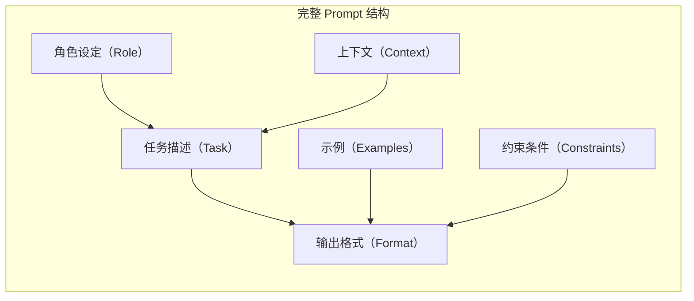
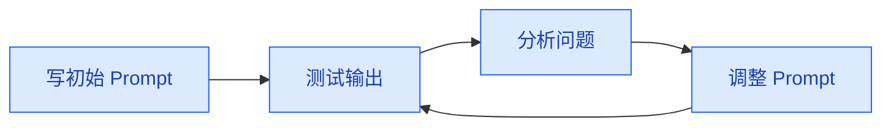

# Prompt 工程基础

> **创建日期：** 2026-06-06
> **前置知识：** LLM 基础概念

---

## 一、什么是 Prompt Engineering？

Prompt Engineering 是**通过精心设计输入文本（Prompt）来引导 LLM 产生期望输出**的技术。它不修改模型参数，而是通过改变输入来改变输出。

::: tip 关键认知
Prompt Engineering 是 AI 应用开发中**投入产出比最高**的技能。一个好的 Prompt 往往比换一个更贵的模型带来的提升更大。
:::

---

## 二、Prompt 基本结构

一个完整的 Prompt 通常包含以下要素：



### 示例：一个结构化的 Prompt

```
# 角色设定
你是一个资深的 Java 后端代码审查专家。

# 上下文
以下是用户提交的一段 Spring Boot 代码，
需要你从代码质量、安全性、性能三个维度进行审查。

# 任务描述
请审查以下代码，并按照下面的格式输出审查结果。

# 约束条件
- 不要修改代码，只给出审查意见
- 每个问题需要标注严重程度（高/中/低）
- 如果代码没有问题，请明确说明"代码审查通过"

# 代码
[粘贴代码]
```

---

## 三、核心技巧

### 3.1 Zero-Shot（零样本提示）

直接给出任务描述，不给示例。适用于简单、明确的任务。

```
请将以下英文翻译成中文：
"Artificial Intelligence is transforming the world."
```

### 3.2 Few-Shot（少样本提示）

提供 1~5 个示例，让模型理解任务模式。适用于需要特定格式或风格的任务。

```
# 示例 1
英文：Hello
中文：你好

# 示例 2
英文：Thank you
中文：谢谢

# 示例 3
英文：Good morning
中文：早上好

# 任务
英文：How are you?
中文：
```

### 3.3 Chain-of-Thought（思维链，CoT）

要求模型展示推理过程，而不是直接给出答案。适用于需要推理的复杂任务。

```
# 不使用 CoT
问题：一个班有 35 个学生，男生比女生多 5 个，有多少个男生？
答案：20 个

# 使用 CoT
问题：一个班有 35 个学生，男生比女生多 5 个，有多少个男生？
请一步步推理：
1. 设女生人数为 x
2. 男生人数为 x + 5
3. 总人数：x + (x + 5) = 35
4. 2x + 5 = 35
5. 2x = 30
6. x = 15
7. 男生人数 = 15 + 5 = 20
答案：20 个
```

### 3.4 角色设定

给模型一个明确的角色，引导其用特定方式回答。

| 角色设定示例 | 效果 |
|--------------|------|
| "你是一个资深的 Java 架构师" | 回答更专业，使用技术术语 |
| "你是一个耐心的编程老师" | 回答更详细，解释更多基础概念 |
| "你是一个严格的代码审查员" | 回答更挑剔，指出更多问题 |
| "你是一个友好的客服助手" | 回答更亲切，使用礼貌用语 |

---

## 四、输出格式控制

### 4.1 指定输出格式

```
请列出 Java 中的 5 种设计模式，以 JSON 格式输出：

{
  "patterns": [
    {
      "name": "设计模式名称",
      "category": "创建型/结构型/行为型",
      "description": "一句话描述",
      "use_case": "适用场景"
    }
  ]
}
```

### 4.2 如何使用分隔符

```
请分析以下代码的性能问题。

--- 代码开始 ---
public List<String> process(List<String> items) {
    List<String> result = new ArrayList<>();
    for (String item : items) {
        result.add(item.toUpperCase());
    }
    return result;
}
--- 代码结束 ---

请以 Markdown 表格形式输出分析结果。
```

### 4.3 控制输出长度

```
请用一句话总结 Transformer 架构的核心思想。
（回答不超过 50 个字）
```

---

## 五、Prompt 迭代优化方法论

### 5.1 优化循环



### 5.2 常见问题与调整策略

| 问题 | 可能原因 | 调整策略 |
|------|----------|----------|
| 回答太短/不完整 | 任务描述不够明确 | 增加具体要求，增加示例 |
| 回答太长/偏题 | 缺少长度约束 | 添加长度限制，强调"只回答核心问题" |
| 格式不正确 | 没有明确格式要求 | 增加格式示例，使用 JSON 模板 |
| 编造信息（幻觉） | 缺少约束 | 添加"如果不知道，请明确说不知道" |
| 回答不一致 | temperature 过高 | 降低 temperature 到 0~0.3 |

### 5.3 系统性优化流程

1. **建立评估集**：收集 20~30 个真实任务，定义"好"回答的标准
2. **量化评估**：对每个版本打分（1-5 分）
3. **A/B 对比**：每次只改一个变量，对比效果
4. **记录日志**：保存每次 Prompt 版本和评估结果
5. **持续迭代**：根据用户反馈持续优化

> 记住：**Prompt 优化没有银弹，只有不断迭代。** 好的 Prompt 往往是通过几十次甚至上百次的调整打磨出来的。

---

## 六、面试重点

::: warning 高频考点
1. **什么是 Prompt Engineering？** 为什么重要？
2. **Zero-Shot 和 Few-Shot 的区别？** 什么时候用 Few-Shot？
3. **Chain-of-Thought 如何提升推理能力？** 原理是什么？
4. **如何控制 LLM 的输出格式？** 有哪些方法？
5. **如何系统性优化 Prompt？** 说说你的方法论
:::

::: danger 容易翻车的点
- 只会写简单 Prompt，不会结构化设计
- 不知道如何迭代优化 Prompt
- 不理解 Few-Shot 示例的选择对结果的影响
- 没有用评估集量化 Prompt 效果
:::