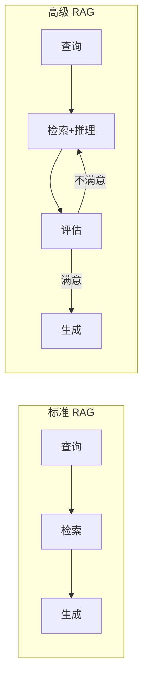
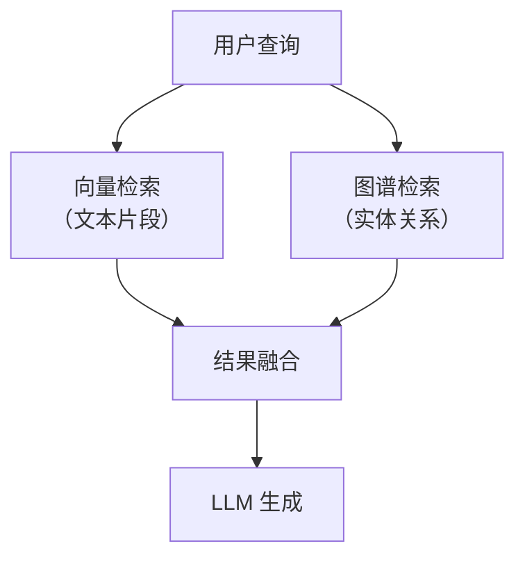
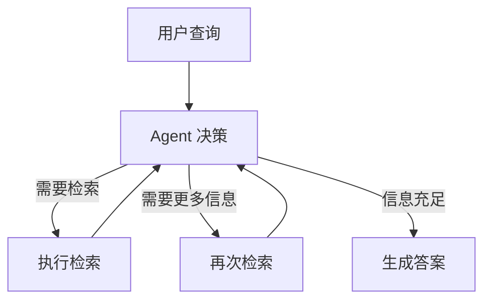
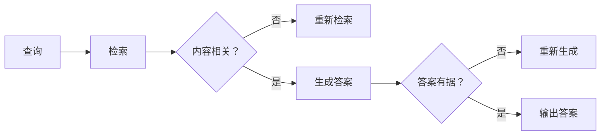
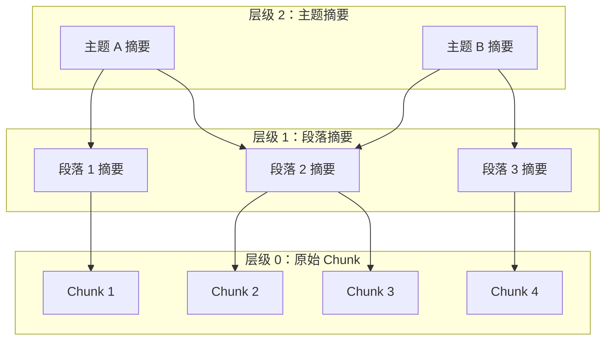
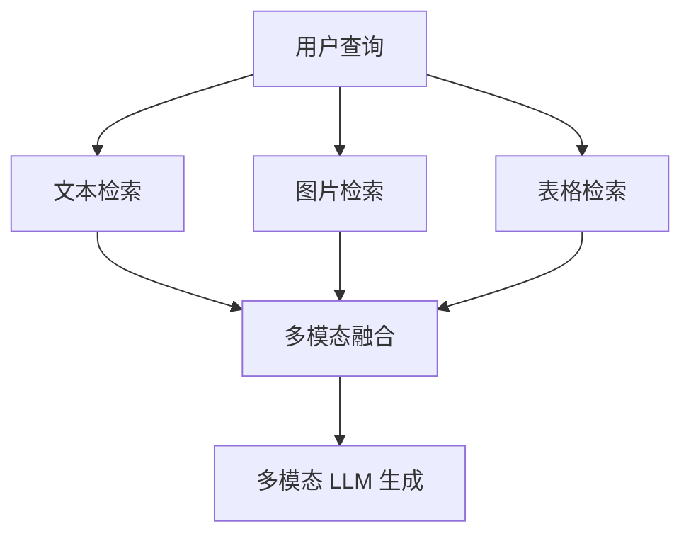

# 高级 RAG 模式

> **创建日期：** 2026-06-06
> **前置知识：** RAG 基础原理、RAG 优化策略、RAG 评估体系

---

## 一、从标准 RAG 到高级 RAG

标准 RAG 的局限：检索一次 → 生成一次，缺乏反馈和迭代。高级 RAG 通过引入**多步推理、自我反思、知识图谱**等机制，解决更复杂的场景。



---

## 二、Graph RAG（知识图谱增强检索）

### 2.1 核心思想

传统 RAG 只检索"文本片段"，但很多知识是**结构化关系**（实体之间的关联），纯文本检索无法捕捉。

Graph RAG 构建**知识图谱**，将实体和关系作为额外的检索源：



### 2.2 适用场景

| 场景 | 为什么需要 Graph RAG | 示例 |
|------|---------------------|------|
| 多跳推理 | 答案需要跨文档关联实体 | "张三的上级的上级是谁？" |
| 实体关系查询 | 问的是实体间关系而非文本 | "哪些产品与竞品X有相似功能？" |
| 知识汇总 | 需要从多个文档中汇总实体信息 | "公司所有供应商的合同金额汇总" |

### 2.3 实现要点

1. **实体识别**：从文档中抽取实体（人、公司、产品等）
2. **关系抽取**：识别实体间的关系（属于、管辖、相似等）
3. **图谱存储**：使用 Neo4j 或 NebulaGraph 存储图谱
4. **混合检索**：向量检索 + 图谱查询，结果融合

---

## 三、Agentic RAG（Agent 驱动的检索）

### 3.1 核心思想

让 Agent 自主决定**检索什么、何时检索、检索多少次**，而不是固定的"检索一次→生成"流程。



### 3.2 与标准 RAG 的区别

| 维度 | 标准 RAG | Agentic RAG |
|------|----------|-------------|
| 检索次数 | 固定 1 次 | 动态，Agent 自主决定 |
| 检索策略 | 预设 | Agent 根据中间结果调整 |
| 适用场景 | 简单问答 | 复杂多步推理 |
| 实现复杂度 | 低 | 高 |
| 延迟 | 低 | 较高（多次检索+推理） |

### 3.3 何时使用 Agentic RAG

- 问题需要**分解为多个子问题**才能回答
- 单次检索无法覆盖所有需要的信息
- 需要**对比多个来源**的信息
- 需要**验证**检索结果的可靠性

---

## 四、Self-RAG（自我反思检索）

### 4.1 核心思想

Self-RAG 让模型在生成过程中**自我反思**：检索到的内容是否相关？生成的答案是否有据可查？



### 4.2 反思标记

Self-RAG 在生成过程中插入特殊标记：

| 标记 | 含义 |
|------|------|
| `[Retrieve]` | 需要检索 |
| `[No Retrieval]` | 不需要检索 |
| `[Relevant]` | 检索内容相关 |
| `[Irrelevant]` | 检索内容不相关 |
| `[Supported]` | 生成内容有据可查 |
| `[Partially]` | 部分有据可查 |
| `[Unsupported]` | 无据可查 |

---

## 五、Corrective RAG（纠错检索）

### 5.1 核心思想

Corrective RAG 在检索后进行**质量评估**，如果检索质量不达标，自动触发**纠错机制**：

1. 用更宽泛的查询重新检索
2. 切换到 Web 搜索补充信息
3. 分解查询为多个子查询分别检索

```python
# Corrective RAG 伪代码
def corrective_rag(query):
    docs = retrieve(query)
    score = evaluate_retrieval_quality(docs)

    if score < threshold:
        # 纠错：改写查询，重新检索
        rewritten = rewrite_query(query)
        docs = retrieve(rewritten)
        # 或：切换到 Web 搜索
        docs += web_search(query)

    return generate(docs, query)
```

---

## 六、RAPTOR（层级摘要索引）

### 6.1 核心思想

RAPTOR 对文档建立**层级摘要树**：底层是原始 chunk，上层是摘要节点。检索时自顶向下，快速定位到最相关的 chunk。



### 6.2 优势

- 先检索高层摘要，快速过滤无关内容
- 同时支持"宏观问题"（需要综合多个 chunk）和"微观问题"（需要精确某段）
- 适合大型文档库（数万份文档）

---

## 七、多模态 RAG

### 7.1 核心思想

不仅检索文本，还能检索**图片、表格、图表**等多模态内容：



### 7.2 实现方式

| 模态 | 编码方式 | 示例 |
|------|----------|------|
| 文本 | 文本 Embedding | BGE / OpenAI Embedding |
| 图片 | CLIP / 多模态 Embedding | 图片描述 → 文本 Embedding |
| 表格 | 表格 → Markdown → 文本 Embedding | 或将表格转文本后向量化 |

---

## 八、高级 RAG 模式对比与选型

| 模式 | 复杂度 | 延迟 | 适用场景 | 核心价值 |
|------|--------|------|----------|----------|
| **标准 RAG** | ⭐ | 低 | 简单问答 | 基础方案 |
| **Graph RAG** | ⭐⭐⭐ | 中 | 实体关系查询 | 结构化知识检索 |
| **Agentic RAG** | ⭐⭐⭐⭐ | 高 | 复杂多步推理 | 自主决策检索 |
| **Self-RAG** | ⭐⭐⭐ | 中 | 高质量要求 | 自我纠错 |
| **Corrective RAG** | ⭐⭐⭐ | 中 | 检索质量不稳定 | 自动纠错 |
| **RAPTOR** | ⭐⭐⭐ | 中 | 大型文档库 | 层级检索加速 |
| **多模态 RAG** | ⭐⭐⭐⭐ | 高 | 图文混合内容 | 多模态融合 |

---

## 九、面试高频题

### Q1: Graph RAG 解决了传统 RAG 的什么问题？什么场景下必须使用 Graph RAG？

**详细答案：** Graph RAG 解决的是传统向量检索在"关系推理"上的硬伤。我们项目里有个很典型的 case——用户问"这款重疾险能保125种重疾，其中前6种核心重疾的赔付标准分别是什么"，标准 RAG 捞回来一堆关于这 6 种重疾的文档片段，但分散在不同的 Chunk 里，没有一个是完整的 6 种集中在一起的。LLM 需要自己跨 6 个片段做信息聚合，经常漏一两个或者把不同疾病的保额搞混。如果构建一个知识图谱——实体是"疾病名称"、"赔付比例"、"等待期"，关系是"包含"、"赔付"、"适用条件"——查询时直接在图里遍历，"重疾险 125 种 → 核心 6 种 → 每种赔付标准"，一步到位，精确度远超向量检索。

但说实话，Graph RAG 不是万能药。我们在保险项目里评估过，构建实体和关系抽取的 pipeline 投入太大了——你需要先跑 NER、再做关系抽选、再维护图数据，一套下来至少多 2-3 周的开发周期。我们最后的结论是：如果业务里 90% 是简单问答，就没必要上。只有你的查询以实体关系为主（比如"A 和 B 的关联是什么"、"哪些产品有 X 特性"），才值得。我们当时只给"疾病-赔付条件"这个子领域建了知识图谱作为多路召回的一路，没全量铺开。

### Q2: Agentic RAG 和标准 RAG 的核心区别是什么？什么情况下需要升级到 Agentic RAG？

**详细答案：** 我们在保险问答项目里做过一个对比，说下实际感受。标准 RAG 是固定流程——用户问一句，你预设置一个检索策略（比如 Top-5 召回），然后生成一次回答就结束了，所有流程写死，没法中途调整。Agentic RAG 则把检索决策权交给了 Agent，Agent 自己判断"我现在缺不缺信息？缺的话需要再搜点什么？"。比如用户问"我买的这款重疾险包含糖尿病并发症吗？需要额外附加险吗？多少钱一年？"，标准 RAG 是一次性检索"糖尿病并发症 重疾险"，但很多信息分散在不同的条款章节里，一次捞不全。Agentic RAG 会分解成三个子问题——先确认这款重疾险基础责任包含哪些，再确认糖尿病并发症是否在基础责任中，然后再确认附加险的价格，分三次检索完再汇总生成答案，准确率比一次检索高了 15%。

但我们最后没上全量 Agentic RAG，为什么呢？代价摆在这里。多轮检索意味着多轮 LLM 调用，原来回答一个问题 2 秒，现在要 5-6 秒，P99 延迟直接翻倍，token 成本也翻了三倍。产品那边权衡了一下，大部分用户查询还是简单问答，所以我们只在"产品对比"、"复杂理赔规则"这类复杂场景开了 Agentic RAG，普通问答还是走标准 RAG 快路径。判断标准其实很简单：如果 80% 的问题能一次搞定，就没必要全上；如果多数问题都需要拆分成多个子问题再一步步查，那值得上。

### Q3: Self-RAG 的反思机制是如何工作的？反思标记（Reflection Tokens）有什么作用？

**详细答案：** Self-RAG 和我们后来在保险项目里加的一个自检机制思路很像。简单说就是在生成答案的过程中插入质量检查点——先看检索到的文档和问题到底有没有关系（如果没关系就重新检索），再看生成的答案是不是能在文档里找到依据（找不到就重新生成）。和传统 RAG 最大的区别是：传统 RAG 是开环的，检索完直接生成，中间没有任何质量验证，前面的问题全堆积到用户看到错误答案后才暴露。Self-RAG 在每个关键节点插了一个"断言"，不合格就重来。

它特殊的地方是用了 Reflection Tokens 来引导这个流程。`[Retrieve]` / `[No Retrieval]` 决定要不要检索，`[Relevant]` / `[Irrelevant]` 判断检索质量，`[Supported]` / `[Partially]` / `[Unsupported]` 检验生成质量。我们在用的时候有一个体会——这些标记最好是通过微调植入模型内部，让模型原生支持自我反思，而不是用 Prompt 去"劝说"模型反思（Prompt 式的反思不稳定，模型有时听话有时不听话）。

我们也踩过一个坑：自检不是免费的。我们加了 Self-RAG 逻辑后，一次回答问题最多能触发 3 轮重试（检索→检查→重检索→检查→生成→检查→重生成），延迟从 2 秒飙到了 4-5 秒。后来的折中方案是只在 Faithfulness 得分最低的 20% 请求上开启 Self-RAG，剩下 80% 直接信任 Rerank 后的结果，既控制了延迟也提升了整体质量。

### Q4: RAPTOR 的层级摘要索引是什么？它相比固定 Chunk 检索有什么优势？

**详细答案：** RAPTOR 的思路是把文档组织成一棵树，而不是平铺 Chunk。底层是细粒度的原始 Chunk，中间层是把几个相邻 Chunk 聚类后用 LLM 生成的摘要，顶层是更宏观的主题摘要。检索的时候从粗到细逐层深入——先判断这个主题分支是否相关，再下沉到具体细节。我们在保险项目里做过一个 PoC 但没有上生产，说说感受。

它最大的优势是解决了"粒度不对称"问题。标准 Chunk 检索面对"这个保险合同主要保什么"这种宏观问题很难受，因为没有一个单独的 Chunk 能概括整份合同，你得把所有 Chunk 捞回来让 LLM 总结，token 直接爆炸。RAPTOR 的顶层摘要节点天然就能回答这类宏观问题，因为摘要本身就是对多个 Chunk 的综合提炼。反过来对于"第3.2.1条第3款"这种微观查询，它也能通过剪枝快速定位到底层 Chunk，不用像标准检索一样跑到所有 Chunk 中去比对。不过说实话，RAPTOR 的构建代价不小——生成摘要节点需要大量 LLM 调用，我们 5000 份保险条款估了一下大概要跑 50 万次 LLM 摘要生成，成本太高了。我们最终的结论是：文档量在万级以下走标准检索 + 元数据过滤就够了，十万级以上才有必要考虑 RAPTOR 这种层级结构。

### Q5: 面对多种高级 RAG 模式，如何在实际项目中做选型？请给出具体场景的推荐。

**详细答案：** 我们项目从标准 RAG 一路迭代上来，说下我们的选型思路。核心原则就一条：**复杂度要配得上问题难度**，不要为了炫技上高级模式。标准 RAG 是我们的基座，混合检索 + Rerank + 查询改写，这条链路覆盖了 80% 以上的查询。我们先花大力气优化基座——把 Recall@5 从 62% 做到 84%，Faithfulness 从 0.65 做到 0.85——基座夯实了再看哪些缺口填不了。

我们具体在不同缺口上的选择是这样的：精确匹配缺口（条款编号）→ 加 BM25 混合检索，不用上 Graph RAG，因为只是关键词匹配不需要实体关系建模；复杂多步推理缺口（"对比 A 险种和 B 险种的轻症保障差异"）→ 开 Agentic RAG 的子问题拆分，但只对这类查询触发；高质量要求缺口（赔付条件必须零幻觉）→ 加了 Self-RAG 的自检机制，但也只在 Faithfulness 可能不达标的请求上触发，不是全局开启。

这些模式在实际项目中完全可以组合——我们现在跑的是"标准 RAG + Graph 的子领域图谱 + Agentic RAG 的复杂场景路由 + Self-RAG 的质量兜底"四层架构。关键的经验是：**不要一次性全上**，先跑好标准 RAG，标记出哪类问题标准 RAG 搞不定，再针对性地加高级模式。每条高级链路加上去都要单独做 A/B 测试验证收益是否大于成本（延迟、token、开发人力），没收益就赶紧砍掉。