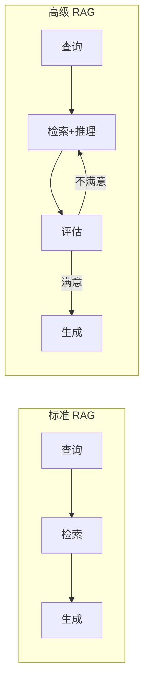
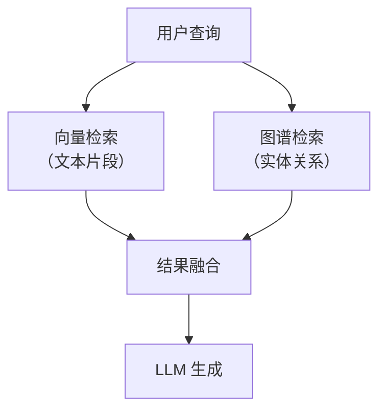
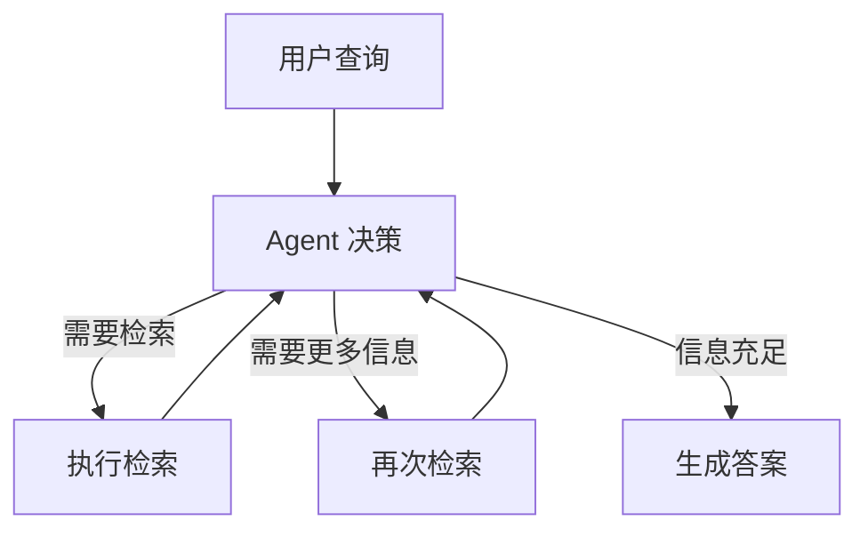
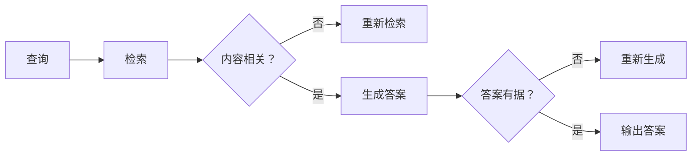
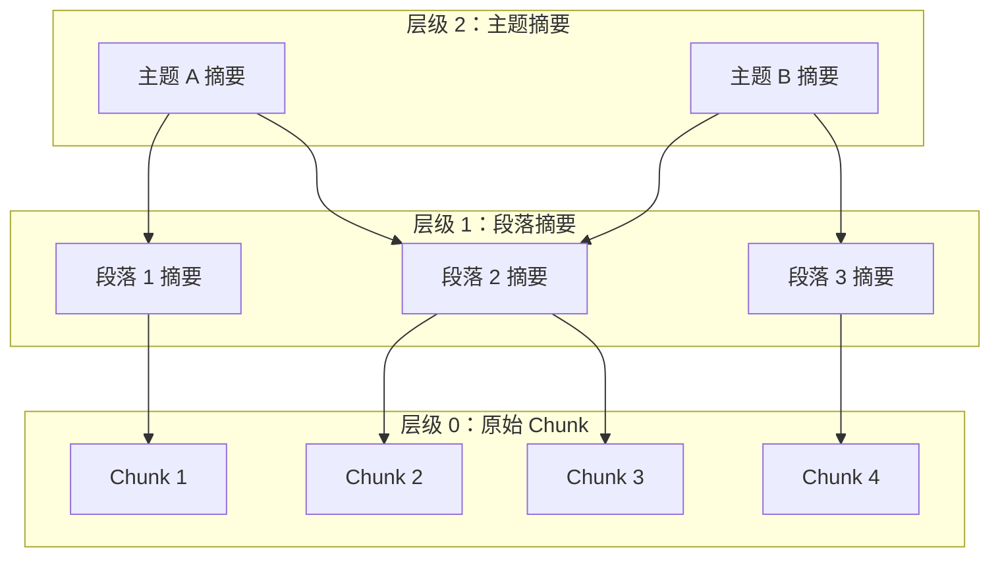
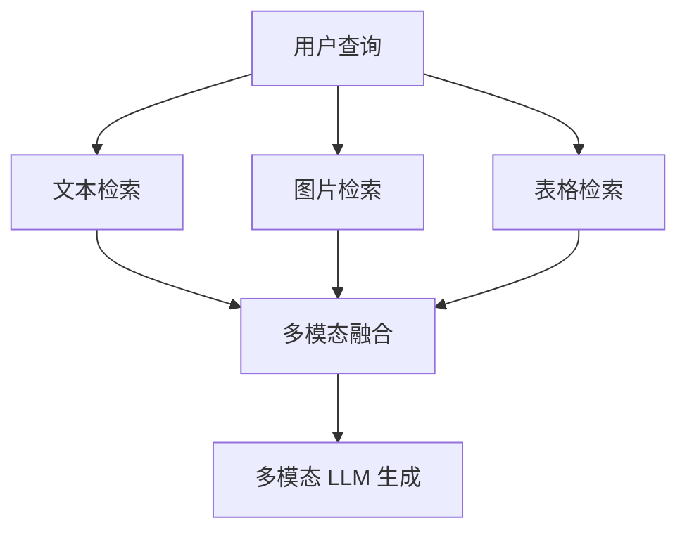

# 高级 RAG 模式

> **创建日期：** 2026-06-06
> **前置知识：** RAG 基础原理、RAG 优化策略、RAG 评估体系

---

## 一、从标准 RAG 到高级 RAG

标准 RAG 的局限：检索一次 → 生成一次，缺乏反馈和迭代。高级 RAG 通过引入**多步推理、自我反思、知识图谱**等机制，解决更复杂的场景。



---

## 二、Graph RAG（知识图谱增强检索）

### 2.1 核心思想

传统 RAG 只检索"文本片段"，但很多知识是**结构化关系**（实体之间的关联），纯文本检索无法捕捉。

Graph RAG 构建**知识图谱**，将实体和关系作为额外的检索源：



### 2.2 适用场景

| 场景 | 为什么需要 Graph RAG | 示例 |
|------|---------------------|------|
| 多跳推理 | 答案需要跨文档关联实体 | "张三的上级的上级是谁？" |
| 实体关系查询 | 问的是实体间关系而非文本 | "哪些产品与竞品X有相似功能？" |
| 知识汇总 | 需要从多个文档中汇总实体信息 | "公司所有供应商的合同金额汇总" |

### 2.3 实现要点

1. **实体识别**：从文档中抽取实体（人、公司、产品等）
2. **关系抽取**：识别实体间的关系（属于、管辖、相似等）
3. **图谱存储**：使用 Neo4j 或 NebulaGraph 存储图谱
4. **混合检索**：向量检索 + 图谱查询，结果融合

---

## 三、Agentic RAG（Agent 驱动的检索）

### 3.1 核心思想

让 Agent 自主决定**检索什么、何时检索、检索多少次**，而不是固定的"检索一次→生成"流程。



### 3.2 与标准 RAG 的区别

| 维度 | 标准 RAG | Agentic RAG |
|------|----------|-------------|
| 检索次数 | 固定 1 次 | 动态，Agent 自主决定 |
| 检索策略 | 预设 | Agent 根据中间结果调整 |
| 适用场景 | 简单问答 | 复杂多步推理 |
| 实现复杂度 | 低 | 高 |
| 延迟 | 低 | 较高（多次检索+推理） |

### 3.3 何时使用 Agentic RAG

- 问题需要**分解为多个子问题**才能回答
- 单次检索无法覆盖所有需要的信息
- 需要**对比多个来源**的信息
- 需要**验证**检索结果的可靠性

---

## 四、Self-RAG（自我反思检索）

### 4.1 核心思想

Self-RAG 让模型在生成过程中**自我反思**：检索到的内容是否相关？生成的答案是否有据可查？



### 4.2 反思标记

Self-RAG 在生成过程中插入特殊标记：

| 标记 | 含义 |
|------|------|
| `[Retrieve]` | 需要检索 |
| `[No Retrieval]` | 不需要检索 |
| `[Relevant]` | 检索内容相关 |
| `[Irrelevant]` | 检索内容不相关 |
| `[Supported]` | 生成内容有据可查 |
| `[Partially]` | 部分有据可查 |
| `[Unsupported]` | 无据可查 |

---

## 五、Corrective RAG（纠错检索）

### 5.1 核心思想

Corrective RAG 在检索后进行**质量评估**，如果检索质量不达标，自动触发**纠错机制**：

1. 用更宽泛的查询重新检索
2. 切换到 Web 搜索补充信息
3. 分解查询为多个子查询分别检索

```python
# Corrective RAG 伪代码
def corrective_rag(query):
    docs = retrieve(query)
    score = evaluate_retrieval_quality(docs)

    if score < threshold:
        # 纠错：改写查询，重新检索
        rewritten = rewrite_query(query)
        docs = retrieve(rewritten)
        # 或：切换到 Web 搜索
        docs += web_search(query)

    return generate(docs, query)
```

---

## 六、RAPTOR（层级摘要索引）

### 6.1 核心思想

RAPTOR 对文档建立**层级摘要树**：底层是原始 chunk，上层是摘要节点。检索时自顶向下，快速定位到最相关的 chunk。



### 6.2 优势

- 先检索高层摘要，快速过滤无关内容
- 同时支持"宏观问题"（需要综合多个 chunk）和"微观问题"（需要精确某段）
- 适合大型文档库（数万份文档）

---

## 七、多模态 RAG

### 7.1 核心思想

不仅检索文本，还能检索**图片、表格、图表**等多模态内容：



### 7.2 实现方式

| 模态 | 编码方式 | 示例 |
|------|----------|------|
| 文本 | 文本 Embedding | BGE / OpenAI Embedding |
| 图片 | CLIP / 多模态 Embedding | 图片描述 → 文本 Embedding |
| 表格 | 表格 → Markdown → 文本 Embedding | 或将表格转文本后向量化 |

---

## 八、高级 RAG 模式对比与选型

| 模式 | 复杂度 | 延迟 | 适用场景 | 核心价值 |
|------|--------|------|----------|----------|
| **标准 RAG** | ⭐ | 低 | 简单问答 | 基础方案 |
| **Graph RAG** | ⭐⭐⭐ | 中 | 实体关系查询 | 结构化知识检索 |
| **Agentic RAG** | ⭐⭐⭐⭐ | 高 | 复杂多步推理 | 自主决策检索 |
| **Self-RAG** | ⭐⭐⭐ | 中 | 高质量要求 | 自我纠错 |
| **Corrective RAG** | ⭐⭐⭐ | 中 | 检索质量不稳定 | 自动纠错 |
| **RAPTOR** | ⭐⭐⭐ | 中 | 大型文档库 | 层级检索加速 |
| **多模态 RAG** | ⭐⭐⭐⭐ | 高 | 图文混合内容 | 多模态融合 |

---

## 九、面试高频题

### Q1: Graph RAG 解决了传统 RAG 的什么问题？什么场景下必须使用 Graph RAG？

**详细答案：** Graph RAG 解决的是传统 RAG 在**结构化关系推理**方面的根本缺陷。传统 RAG 基于向量检索，核心假设是"相关文档的文本片段在语义上接近查询"，这意味着它只能捕捉到文本层面的相似性，但无法理解实体之间的关系。例如，用户问"张三的上级的上级是谁？"，传统 RAG 可能检索到"张三的上级是李四"和"李四的上级是王五"两段文本，但这两段文本在向量空间中分布在不同的 Chunk 中，且仅仅靠语义相似度很难同时将两者召回。即使都召回了，传统 RAG 还需要 LLM 在两段文本之间做"多跳推理"，这对 LLM 来说是有挑战的。

Graph RAG 通过构建知识图谱，将文档中的实体（人、组织、产品、地点等）和关系（汇报给、属于、提供、位于等）显式地建模为图结构，使得检索时可以直接在图上做关系遍历。对于"张三的上级的上级是谁？"这个问题，Graph RAG 可以直接从"张三"节点出发，沿着"汇报给"边跳两步，到达目标节点，精确而高效。此外，Graph RAG 还能处理聚合类查询（如"技术部所有员工的总薪资"），这类查询在传统 RAG 中几乎不可能回答，因为涉及跨多个文档的数值汇总。

必须使用 Graph RAG 的场景包括：一是**多跳推理**，答案需要跨多个文档或实体关联；二是**实体关系查询**，用户问的是"A 和 B 是什么关系"而非"关于 A 的文档有哪些"；三是**知识汇总**，需要聚合多个实体的属性信息（如"列出所有供应商及其合同金额"）。但要注意，Graph RAG 的建设和维护成本远高于传统 RAG，需要实体抽取、关系抽取、图谱存储等额外环节，不是所有场景都值得投入。如果业务中 90% 的查询都是简单问答，传统 RAG 就足够了。

### Q2: Agentic RAG 和标准 RAG 的核心区别是什么？什么情况下需要升级到 Agentic RAG？

**详细答案：** Agentic RAG 和标准 RAG 的核心区别在于**检索决策的自主性**。标准 RAG 遵循固定的"用户查询 → 检索 → 生成"管道，检索策略是预设的（检索多少次、用什么方式检索、检索什么内容），不可根据中间结果动态调整。Agentic RAG 则引入了 Agent 作为决策者，Agent 可以自主决定：是否需要检索、检索什么、用什么策略检索、检索几次、本轮检索结果是否足够、是否需要换个角度重新检索。这种自主决策能力使得 Agentic RAG 能够处理需要多步推理和动态调整的复杂任务。

以一个具体场景为例：用户问"对比一下我们公司的三个产品，哪个在 Q2 增长最快，并分析原因"。标准 RAG 的做法是一次性检索"三个产品 Q2 增长"，得到的文档可能覆盖面不全、质量参差不齐，然后 LLM 基于这些文档生成答案。Agentic RAG 的做法是：首先检索三个产品的基本信息，然后逐一检索每个产品的 Q2 数据，再检索增长分析报告，最后将这四轮检索结果综合后生成答案。如果在检索过程中发现某个产品的数据缺失，Agent 还会尝试用不同的查询词重新检索，或在 Web 上搜索补充信息。

判断是否需要升级到 Agentic RAG 的标准有三条。第一，**问题是否需要分解为多个子问题**：如果问题可以分解为多个独立子问题，且每个子问题需要不同的检索策略，Agentic RAG 更合适。第二，**单次检索是否无法覆盖所有信息**：如果需要从多个来源、多个角度获取信息，Agentic RAG 的多轮检索能力更有优势。第三，**是否需要验证检索结果**：如果业务对答案的可靠性要求极高，Agentic RAG 可以通过自我验证和纠错来保证质量。但 Agentic RAG 的代价也很明显：延迟增加（多轮检索 + 多次 LLM 调用）、成本增加、实现复杂度高。对于简单问答场景，标准 RAG 完全够用。

### Q3: Self-RAG 的反思机制是如何工作的？反思标记（Reflection Tokens）有什么作用？

**详细答案：** Self-RAG 的反思机制是在生成过程中插入**自我评估**环节，让 LLM 在输出最终答案之前，先检查检索到的内容是否相关、生成的答案是否有据可查。这不是简单的"生成后检查"，而是在生成过程中通过特殊标记（Reflection Tokens）来引导模型的注意力分配和输出内容。Self-RAG 的训练方式是在模型微调阶段就加入了这些反思标记，使其成为模型原生能力的一部分，而非通过 Prompt 工程实现的"事后检查"。

反思标记是 Self-RAG 的核心创新，分为两类。第一类是**检索决策标记**：`[Retrieve]` 表示当前需要检索外部知识，`[No Retrieval]` 表示不需要检索（模型可以直接回答）。第二类是**质量评估标记**：`[Relevant]` / `[Irrelevant]` 评估检索到的文档是否与问题相关；`[Supported]` / `[Partially]` / `[Unsupported]` 评估生成的答案是否能在检索到的文档中找到支撑。这些标记在生成过程中被显式输出，然后由系统解析并触发相应的分支逻辑。例如，如果模型输出了 `[Irrelevant]`，系统会触发重新检索；如果输出了 `[Unsupported]`，系统会触发重新生成。

Self-RAG 相比传统 RAG 的优势在于**闭环反馈**。传统 RAG 是开环的——检索到文档后直接生成，中间没有质量检查，如果检索结果差，生成结果必然差。Self-RAG 是闭环的——它会在关键节点检查质量，不合格就重来，直到合格或达到上限。这类似于编程中的"断言"（assert）机制，在每个关键步骤插入检查点。但 Self-RAG 也有局限性：它需要特定调优的模型（不能直接用普通 LLM），且多轮反思会增加延迟和成本。在面试中，展示对 Self-RAG 机制的理解，以及能说出它和传统 RAG 在"开环 vs 闭环"上的本质区别，是加分项。

### Q4: RAPTOR 的层级摘要索引是什么？它相比固定 Chunk 检索有什么优势？

**详细答案：** RAPTOR（Recursive Abstractive Processing for Tree-Organized Retrieval）是一种**层级化的文档索引方法**，它的核心思路是：不把文档切成固定大小的 Chunk 然后平铺检索，而是构建一棵"摘要树"——底层是原始 Chunk（细粒度），中层是对底层 Chunk 的聚类摘要（中粒度），顶层是对中层摘要的再聚类摘要（粗粒度）。检索时，从顶层开始自上而下搜索，先快速定位到相关的主题区域，再深入到底层找到最精确的 Chunk。

RAPTOR 相比固定 Chunk 检索有三大优势。第一，**同时支持宏观和微观问题**：固定 Chunk 检索只能回答"局部问题"（答案在某个 Chunk 中），而 RAPTOR 通过高层摘要节点可以回答"全局问题"（如"这篇文章主要讲了什么？"），因为高层摘要节点本身就是对多个 Chunk 的综合概括。第二，**检索效率高**：在大型文档库中，RAPTOR 的树状结构使得检索可以"剪枝"——在顶层发现某个主题区域不相关后，其下所有子节点都可以跳过，避免了对不相关 Chunk 的逐一比对。第三，**信息密度高**：高层摘要节点的信息密度远高于原始 Chunk，检索时命中的节点包含的信息量更大，减少了"命中但信息不足"的情况。

RAPTOR 的适用场景非常明确：**大型文档库**（数万到数十万份文档），且查询类型多样（既有宏观问题也有微观问题）。典型场景包括：企业知识库（需要同时回答"公司有多少员工？"和"公司的核心价值观是什么？"）、学术论文库（需要同时回答"某篇论文的结论"和"某个领域的研究趋势"）。但 RAPTOR 的构建成本较高——需要多轮 LLM 调用来生成摘要节点，且树结构需要定期更新以保持与原始文档的同步。对于小规模文档库（几百份文档），RAPTOR 的收益不足以覆盖成本，固定 Chunk 检索更简单高效。

### Q5: 面对多种高级 RAG 模式，如何在实际项目中做选型？请给出具体场景的推荐。

**详细答案：** 高级 RAG 模式的选型应该遵循"场景驱动、由简到繁"的原则，而不是盲目追求技术复杂度。选型决策需要考虑三个核心维度：**任务复杂度**（简单问答 vs 多步推理）、**数据规模**（小文档库 vs 大文档库）、**质量要求**（可接受偶尔错误 vs 零容忍）。具体来说：

对于**简单问答**场景（如 FAQ 机器人、产品帮助文档搜索），标准 RAG 就足够了。标准 RAG 的延迟低、成本低、维护简单，在 80% 的常见场景中都能达到满意的效果。如果标准 RAG 的检索质量不够好，优先考虑优化检索策略（混合检索、Rerank、查询改写），而不是直接升级到高级 RAG 模式。

对于**实体关系查询**场景（如供应链管理、企业组织架构查询），推荐 **Graph RAG**。如果业务的核心价值在于实体间的关系网络（如"查找所有由供应商 A 提供且被项目 B 使用的组件"），Graph RAG 是最直接有效的方案。但要注意，Graph RAG 的建设和维护成本高，需要评估 ROI。

对于**多步推理**场景（如竞品分析、投资研究），推荐 **Agentic RAG**。如果典型的用户问题需要"先查 A，再根据 A 的结果查 B，最后对比 A 和 B 得出结论"，Agentic RAG 的自主决策能力能大幅提升答案质量。但 Agentic RAG 的延迟和成本较高，适合对质量要求高但可接受秒级延迟的"重决策"场景。

对于**质量敏感型**场景（如医疗、法律、金融合规），推荐 **Self-RAG** 或 **Corrective RAG**。在这些场景中，错误答案的代价可能非常高，因此需要额外的质量保障机制。Self-RAG 通过反思标记确保输出有据可查，Corrective RAG 通过自动纠错确保检索质量不达标时能自我修复。

对于**大型文档库**场景（数万份以上文档），推荐 **RAPTOR** 或 **层级索引**。当文档规模大到"全量检索"变得不现实时，层级索引的价值就体现出来了——先快速定位主题区域，再精确检索。

面试中的加分项是展示"组合使用"的思路：实际项目中，这些模式往往不是互斥的，而是可以组合使用的。例如，Graph RAG + Self-RAG 的组合：先用 Graph RAG 做实体关系检索，再用 Self-RAG 确保生成答案的忠实度；或者 Agentic RAG + Corrective RAG 的组合：Agent 自主决策检索策略，当检索质量不达标时触发 Corrective RAG 的纠错机制。能说出这种组合思路，说明对高级 RAG 模式的理解已经超越了"知道每个模式是什么"的层面，达到了"知道如何根据场景灵活组合"的层次。