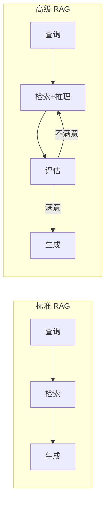
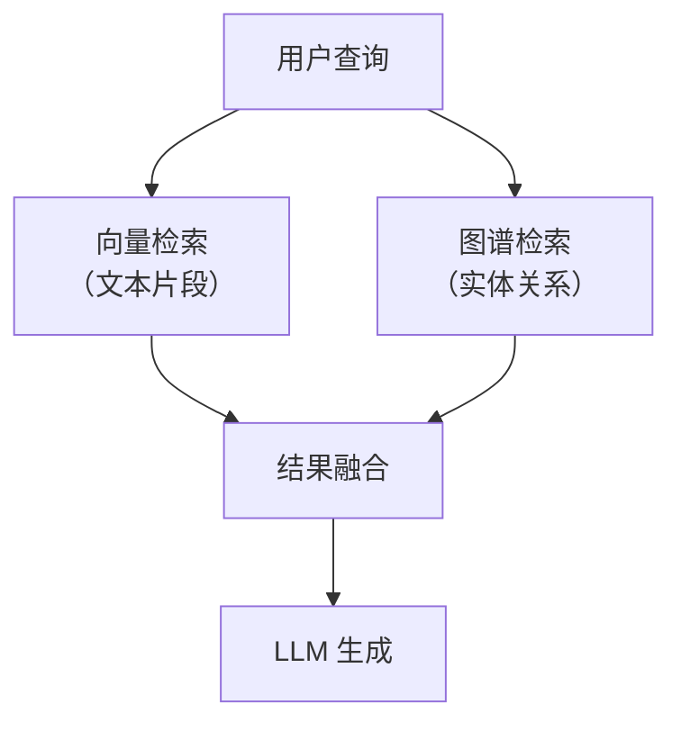
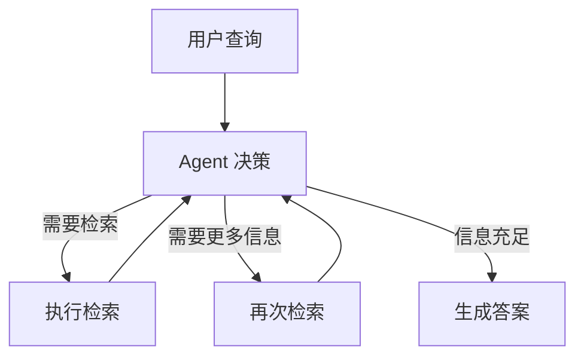
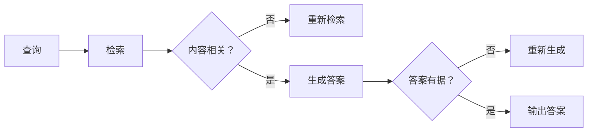
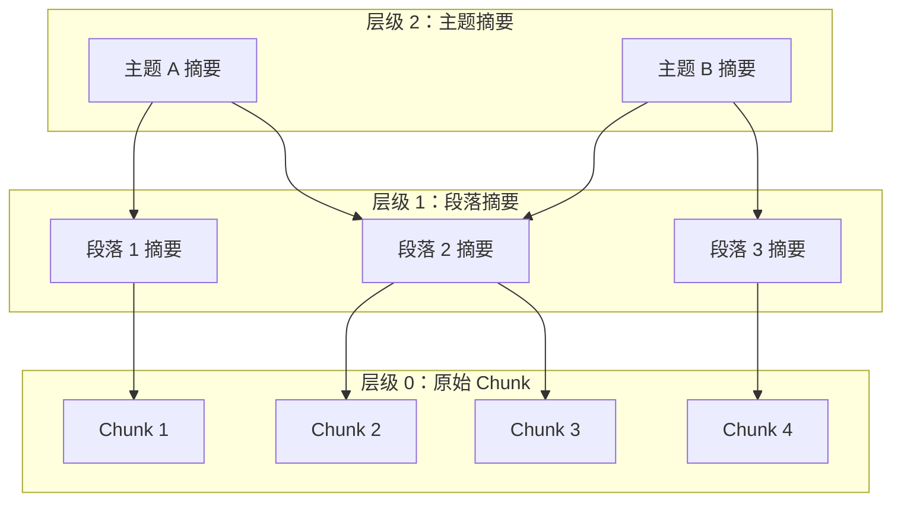
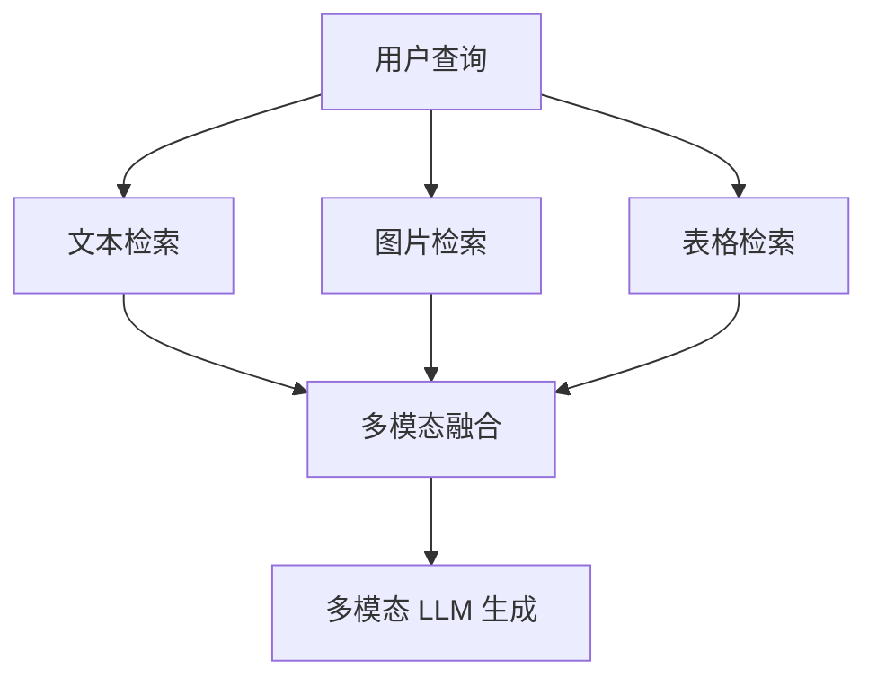

# 高级 RAG 模式

> **创建日期：** 2026-06-06
> **前置知识：** RAG 基础原理、RAG 优化策略、RAG 评估体系

---

## 一、从标准 RAG 到高级 RAG

标准 RAG 的局限：检索一次 → 生成一次，缺乏反馈和迭代。高级 RAG 通过引入**多步推理、自我反思、知识图谱**等机制，解决更复杂的场景。



---

## 二、Graph RAG（知识图谱增强检索）

### 2.1 核心思想

传统 RAG 只检索"文本片段"，但很多知识是**结构化关系**（实体之间的关联），纯文本检索无法捕捉。

Graph RAG 构建**知识图谱**，将实体和关系作为额外的检索源：



### 2.2 适用场景

| 场景 | 为什么需要 Graph RAG | 示例 |
|------|---------------------|------|
| 多跳推理 | 答案需要跨文档关联实体 | "张三的上级的上级是谁？" |
| 实体关系查询 | 问的是实体间关系而非文本 | "哪些产品与竞品X有相似功能？" |
| 知识汇总 | 需要从多个文档中汇总实体信息 | "公司所有供应商的合同金额汇总" |

### 2.3 实现要点

1. **实体识别**：从文档中抽取实体（人、公司、产品等）
2. **关系抽取**：识别实体间的关系（属于、管辖、相似等）
3. **图谱存储**：使用 Neo4j 或 NebulaGraph 存储图谱
4. **混合检索**：向量检索 + 图谱查询，结果融合

---

## 三、Agentic RAG（Agent 驱动的检索）

### 3.1 核心思想

让 Agent 自主决定**检索什么、何时检索、检索多少次**，而不是固定的"检索一次→生成"流程。



### 3.2 与标准 RAG 的区别

| 维度 | 标准 RAG | Agentic RAG |
|------|----------|-------------|
| 检索次数 | 固定 1 次 | 动态，Agent 自主决定 |
| 检索策略 | 预设 | Agent 根据中间结果调整 |
| 适用场景 | 简单问答 | 复杂多步推理 |
| 实现复杂度 | 低 | 高 |
| 延迟 | 低 | 较高（多次检索+推理） |

### 3.3 何时使用 Agentic RAG

- 问题需要**分解为多个子问题**才能回答
- 单次检索无法覆盖所有需要的信息
- 需要**对比多个来源**的信息
- 需要**验证**检索结果的可靠性

---

## 四、Self-RAG（自我反思检索）

### 4.1 核心思想

Self-RAG 让模型在生成过程中**自我反思**：检索到的内容是否相关？生成的答案是否有据可查？



### 4.2 反思标记

Self-RAG 在生成过程中插入特殊标记：

| 标记 | 含义 |
|------|------|
| `[Retrieve]` | 需要检索 |
| `[No Retrieval]` | 不需要检索 |
| `[Relevant]` | 检索内容相关 |
| `[Irrelevant]` | 检索内容不相关 |
| `[Supported]` | 生成内容有据可查 |
| `[Partially]` | 部分有据可查 |
| `[Unsupported]` | 无据可查 |

---

## 五、Corrective RAG（纠错检索）

### 5.1 核心思想

Corrective RAG 在检索后进行**质量评估**，如果检索质量不达标，自动触发**纠错机制**：

1. 用更宽泛的查询重新检索
2. 切换到 Web 搜索补充信息
3. 分解查询为多个子查询分别检索

```python
# Corrective RAG 伪代码
def corrective_rag(query):
    docs = retrieve(query)
    score = evaluate_retrieval_quality(docs)

    if score < threshold:
        # 纠错：改写查询，重新检索
        rewritten = rewrite_query(query)
        docs = retrieve(rewritten)
        # 或：切换到 Web 搜索
        docs += web_search(query)

    return generate(docs, query)
```

---

## 六、RAPTOR（层级摘要索引）

### 6.1 核心思想

RAPTOR 对文档建立**层级摘要树**：底层是原始 chunk，上层是摘要节点。检索时自顶向下，快速定位到最相关的 chunk。



### 6.2 优势

- 先检索高层摘要，快速过滤无关内容
- 同时支持"宏观问题"（需要综合多个 chunk）和"微观问题"（需要精确某段）
- 适合大型文档库（数万份文档）

---

## 七、多模态 RAG

### 7.1 核心思想

不仅检索文本，还能检索**图片、表格、图表**等多模态内容：



### 7.2 实现方式

| 模态 | 编码方式 | 示例 |
|------|----------|------|
| 文本 | 文本 Embedding | BGE / OpenAI Embedding |
| 图片 | CLIP / 多模态 Embedding | 图片描述 → 文本 Embedding |
| 表格 | 表格 → Markdown → 文本 Embedding | 或将表格转文本后向量化 |

---

## 八、高级 RAG 模式对比与选型

| 模式 | 复杂度 | 延迟 | 适用场景 | 核心价值 |
|------|--------|------|----------|----------|
| **标准 RAG** | ⭐ | 低 | 简单问答 | 基础方案 |
| **Graph RAG** | ⭐⭐⭐ | 中 | 实体关系查询 | 结构化知识检索 |
| **Agentic RAG** | ⭐⭐⭐⭐ | 高 | 复杂多步推理 | 自主决策检索 |
| **Self-RAG** | ⭐⭐⭐ | 中 | 高质量要求 | 自我纠错 |
| **Corrective RAG** | ⭐⭐⭐ | 中 | 检索质量不稳定 | 自动纠错 |
| **RAPTOR** | ⭐⭐⭐ | 中 | 大型文档库 | 层级检索加速 |
| **多模态 RAG** | ⭐⭐⭐⭐ | 高 | 图文混合内容 | 多模态融合 |

---

## 九、面试重点

::: warning 高频考点
1. **Graph RAG 解决了传统 RAG 的什么问题？** 什么场景下必须用 Graph RAG？
2. **Agentic RAG 和标准 RAG 的核心区别？** 何时需要 Agentic？
3. **Self-RAG 的反思机制是如何工作的？** 反思标记有什么作用？
4. **RAPTOR 的层级索引有什么优势？** 适合什么场景？
5. **高级 RAG 模式如何选型？** 给出具体场景的推荐
:::