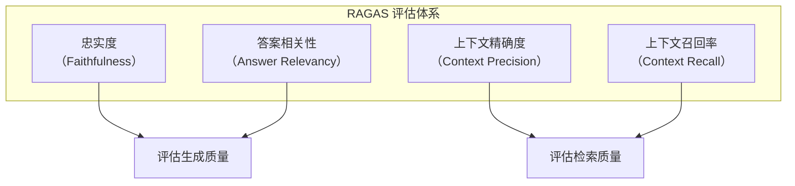
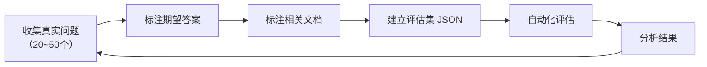

# RAG 评估体系

> **创建日期：** 2026-06-06
> **前置知识：** RAG 基础原理、RAG 优化策略

---

## 一、为什么需要 RAG 评估？

没有评估的 RAG 优化是盲目的。每次改动（换模型、调分块、改检索策略）都需要量化评估效果。

::: tip 核心原则
**从第一天开始建立评估集。** 20~50 个真实 QA 对的评估集，比任何直觉判断都可靠。
:::

---

## 二、RAGAS 评估框架

RAGAS（RAG Assessment）是目前最主流的开源 RAG 评估框架，定义了四大核心指标：



| 指标 | 评估对象 | 含义 | 计算公式 |
|------|----------|------|----------|
| **忠实度** | 生成质量 | 答案是否完全基于检索到的上下文，没有编造 | 基于上下文的事实断言数 / 总断言数 |
| **答案相关性** | 生成质量 | 答案是否直接回答了用户问题，没有偏离 | 基于答案反向生成问题的语义相似度 |
| **上下文精确度** | 检索质量 | 检索到的文档中，相关文档的排名是否靠前 | 相关文档在结果中的排名加权 |
| **上下文召回率** | 检索质量 | 是否检索到了所有必要的文档 | 检索到的相关文档 / 所有相关文档 |

### 2.1 忠实度详解

忠实度是 RAG 系统**最重要的指标**——它衡量 LLM 是否在编造信息。

```python
# RAGAS 忠实度评估
from ragas import evaluate
from ragas.metrics import faithfulness

result = evaluate(
    dataset,
    metrics=[faithfulness]
)
print(f"忠实度: {result['faithfulness']:.2%}")
```

### 2.2 各指标的理想值

| 指标 | 及格线 | 良好 | 优秀 |
|------|--------|------|------|
| 忠实度 | > 0.7 | > 0.85 | > 0.95 |
| 答案相关性 | > 0.7 | > 0.80 | > 0.90 |
| 上下文精确度 | > 0.6 | > 0.75 | > 0.85 |
| 上下文召回率 | > 0.6 | > 0.75 | > 0.85 |

---

## 三、评估集构建方法

### 3.1 构建流程



### 3.2 评估集格式

```json
[
  {
    "question": "如何申请年假？",
    "answer": "年假需要在OA系统申请，提前3天提交...",
    "contexts": [
      "员工手册第3章：年假申请流程...",
      "请假制度管理规定..."
    ],
    "ground_truth": "在OA系统提交申请，提前3天..."
  }
]
```

### 3.3 构建要点

- **覆盖典型场景**：高频问题 + 边界问题 + 对抗性问题
- **标注质量 > 数量**：20 个高质量标注，胜过 100 个粗糙标注
- **持续更新**：每次发现新问题，加入评估集

---

## 四、自动化评估流程

```python
# 完整的 RAGAS 评估流程
from ragas import evaluate
from ragas.metrics import (
    faithfulness,
    answer_relevancy,
    context_precision,
    context_recall
)
from datasets import Dataset

# 1. 准备评估数据
eval_data = {
    "question": [...],
    "answer": [...],      # RAG 系统生成的答案
    "contexts": [...],    # 检索到的文档
    "ground_truth": [...] # 人工标注的标准答案
}
dataset = Dataset.from_dict(eval_data)

# 2. 运行评估
result = evaluate(
    dataset,
    metrics=[
        faithfulness,
        answer_relevancy,
        context_precision,
        context_recall
    ]
)

# 3. 输出结果
print(f"忠实度: {result['faithfulness']:.2%}")
print(f"答案相关性: {result['answer_relevancy']:.2%}")
print(f"上下文精确度: {result['context_precision']:.2%}")
print(f"上下文召回率: {result['context_recall']:.2%}")
```

---

## 五、常见评估陷阱

::: danger 陷阱一：只看一个指标
只关注忠实度而忽略上下文召回率，可能导致系统变得"保守"——只回答检索到的内容，但检索不到关键信息。
:::

::: danger 陷阱二：用生成数据做评估
用 LLM 生成的问答对作为评估集，可能引入 LLM 的偏见。评估集应该来自**真实用户问题**。
:::

::: danger 陷阱三：评估集太小
20 个问题以下的评估集不可靠。一个偶然的好结果可能不代表系统真的好。
:::

::: danger 陷阱四：不及时更新评估集
系统上线后会发现新的问题类型，必须将这些新问题加入评估集，否则评估会"过拟合"。
:::

---

## 六、A/B 测试最佳实践

当需要对比两个 RAG 方案时，遵循以下原则：

1. **每次只改一个变量**：分块大小、检索策略、模型选择，逐个对比
2. **使用相同的评估集**：确保对比公平
3. **记录所有参数**：便于复现和回溯
4. **关注统计显著性**：样本量足够大时，小差异可能不显著

```python
# A/B 对比框架
def ab_test(config_a, config_b, eval_set):
    result_a = evaluate_with_config(config_a, eval_set)
    result_b = evaluate_with_config(config_b, eval_set)

    for metric in ["faithfulness", "answer_relevancy"]:
        diff = result_b[metric] - result_a[metric]
        print(f"{metric}: A={result_a[metric]:.2%}, "
              f"B={result_b[metric]:.2%}, "
              f"变化={diff:+.2%}")
```

---

## 七、面试高频题

### Q1: RAGAS 四大指标分别衡量什么？哪个指标最重要？

**详细答案：** 我们在保险问答项目里一直在用 RAGAS 做自动化评估，跑了快一年了，说下实际感受。它的四个指标分两拨：Faithfulness（忠实度）和 Answer Relevancy（答案相关性）评估生成质量，Context Precision（上下文精确度）和 Context Recall（上下文召回率）评估检索质量。Faithfulness 是把答案拆成原子断言，然后逐条检查能不能在检索回来的文档里找到支持——这个我们压得最紧，阈值设了 0.7，低于这个值直接告警，因为保险行业给错误赔付建议是要出大问题的。

但老实讲，哪个指标最重要取决于你的业务场景。我们保险问答，Faithfulness 是第一位的——给用户一个编造的理赔条件比给不全信息严重得多。但如果你做的是知识探索工具，Context Recall 可能更关键，漏了信息等于白查。实际跑 RAGAS 的过程中我们发现一个小坑：RAGAS 的 Faithfulness 评估本身也依赖 LLM，LLM 打分会有随机性，同一份答案跑两遍得分能差 0.05 左右。所以我们现在每次评估跑 3 遍取均值，降低随机波动的影响。另外，Faithfulness 高有时候是假象——如果你的检索结果总是很短很简单，LLM 被迫只能从这短短几段话里提取信息，当然"忠实"，但答案可能不完整。所以得四个指标一起看，不能单看一个。

### Q2: 如何构建 RAG 评估集？评估集的数据应该从哪里来？

**详细答案：** 我们现在的评估集有 200 多条，全是线上真实用户问题攒出来的。一开始 MVP 上线时只有 50 道题，那时候还没用户，就找了几个保险业务专家人工写了一些"典型问题"。但跑了一阵就发现不对——专家写的问题全是标准问法，什么"请说明重疾险轻症赔付条件"，但真实用户上来就是"我这病能赔多少钱"，语气、用词、长度完全不一样。

所以我们做了一个机制：每周把用户点了"没帮助"的 bad case 拉出来，手动标注相关文档和标准答案，加到评估集里。现在大概每个月新增 20 题，评估集慢慢滚到 200 多，覆盖了"缩写查询"、"编号查询"、"口语化提问"、"拼写错误"这些真实场景。标注的时候我们要求每条至少标注一个相关文档，这样 Context Recall 才能算准。

我们现在保持 70% 高频问题、20% 边界问题、10% 对抗问题的比例。对抗问题很重要，比如用户问"酒后驾车出事故保险公司赔吗"，知识库明确说不赔，这种测试我们得加进去，验证系统会不会乱答。有一个教训——一开始用 LLM 生成了 100 道题，发现一半都是模型瞎编的场景，根本不是真实用户会问的，标注完了反而误导优化方向。所以我觉得，即使在项目初期，也尽量找业务专家出点题，少让 LLM 编，宁可少点也要准点。

### Q3: RAG 系统的忠实度低可能是什么原因？如何系统性地提升忠实度？

**详细答案：** 我们在做保险项目时 Faithfulness 一直是我们最看重的指标，这条出问题真不敢上线。分析下来，Faithfulness 低的原因基本分三层。第一层是检索层——捞回来的文档和用户问题不沾边，LLM 没办法只好靠自己的预训练知识硬编。这个我们在刚上线那会儿很严重，"除外责任"类问题的 Faithfulness 才 0.45。第二层是 Prompt 层——如果你在 Prompt 里写"你可以根据你的知识补充"，这就是主动邀请 LLM 编造。我们把 Prompt 收紧为"仅基于以下文档回答，文档中没有的请明确说明"，Faithfulness 立刻从 0.65 提到了 0.82。第三层是模型层——有些模型就是更容易 hallucinate，我们测过 DeepSeek V2 和 GPT-3.5 的中文 RAG 任务，同一条 Prompt 下 Faithfulness 能差 0.1 以上。

我们提升的步骤是按成本从低到高来的。第一步改 Prompt，零成本，效果最明显。第二步上 Rerank，确保送到 LLM 面前的是最相关的文档，Faithfulness 又提了 0.08。第三步我们甚至还加了 Self-RAG 的机制——让 LLM 生成答案后,再调一次 LLM 自检"这段回答里的每个事实能否在检索文档中找到支撑"，不能的标红让 LLM 重新生成。这招效果很好但多了一次 LLM 调用，延迟加了 600ms，所以我们只在 Faithfulness 得分低于阈值的答案上触发。所以我的经验是，先别急着换模型，大部分 Faithfulness 问题靠 Prompt 和检索优化就能解决。

### Q4: 上下文召回率低说明什么系统问题？有哪些优化手段？

**详细答案：** Context Recall 低是我们最开始上线时遇到的主要问题——很多用户问的问题我们知识库里有答案，但检索就是没捞到。排查下来最常见的原因有四个。第一是 chunk 切碎了，一条完整条款被切成三块，检索只命中了一块，另外两块的关键信息丢了。第二是只用了向量检索没用 BM25，编号类和精确匹配类的问题漏得一塌糊涂。第三是用户提到的"交强险"这种行业缩写，文档里是"机动车交通事故责任强制保险"，语义向量根本匹配不上。第四是知识库本身缺文档——有些新条款还没入库。

我们的优化是有顺序的，按投入成本从小到大来。第一步调 chunk 策略，把 chunk_size 从 1000 降到 600 并加了元数据过滤，Context Recall 从 0.58 升到 0.72。第二步上混合检索加 BM25，编号类问题的召回立马好了。第三步做查询改写，缩写展开后再检索。第四步多路召回。这里踩了个关键的跷跷板——Context Recall 上去了，Context Precision 会往下掉。因为你在"广撒网"捞更多文档，必然会把不相关的文档也捞进来。我们的解决是在检索层之后再接一层 Rerank，"宁可多捞、精排兜底"。

### Q5: 如何做 RAG 系统的 A/B 测试？有哪些关键注意事项？

**详细答案：** 我们在保险问答项目里做过好几轮 A/B 测试，说下实际经验。离线测试是主线——每次改了一个变量（chunk size、rerank 模型、Prompt 模板任选一个），用同一套 200 道题的评估集跑一遍，对比四个 RAGAS 指标和 P95 延迟。这里最重要的纪律就是"一次只改一个变量"——我们犯过一次错，同时调了 chunk size 和加了 Rerank，出来结果好了一截但完全不知道是哪个改动的功劳。后来拆成两次单独跑，才发现 chunk size 改了提升 8 个点，Rerank 提了 3 个点，投入产出比完全不一样。

在线 A/B 测试我们就谨慎多了，毕竟用户在用。一般是先在离线评估通过之后，开 10% 的灰度流量跑一周，收集用户点了"有帮助/没帮助"的数据、对话轮次、问题解决率这些指标。RAG 系统的 A/B 有个天然难题——同一个问题两次答案可能不一样（LLM 的随机性），所以样本量不能太小，我们至少跑 200 个有效对话才出结论。还有一个实际坑：A/B 不能只看质量，还要看延迟和成本。有一次 Rerank 把 Faithfulness 提了，但 P95 延迟涨了 400ms，灰度了一周发现用户"有帮助"点击率没变，但平均对话时长下降了——说明用户觉得慢了就不耐烦了，直接换了个问题，最后我们没上这个版本。