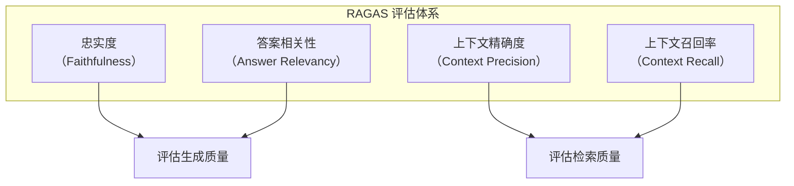
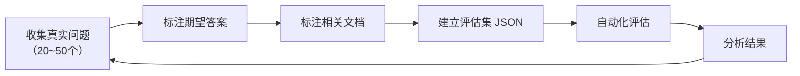

# RAG 评估体系

> **创建日期：** 2026-06-06
> **前置知识：** RAG 基础原理、RAG 优化策略

---

## 一、为什么需要 RAG 评估？

没有评估的 RAG 优化是盲目的。每次改动（换模型、调分块、改检索策略）都需要量化评估效果。

::: tip 核心原则
**从第一天开始建立评估集。** 20~50 个真实 QA 对的评估集，比任何直觉判断都可靠。
:::

---

## 二、RAGAS 评估框架

RAGAS（RAG Assessment）是目前最主流的开源 RAG 评估框架，定义了四大核心指标：



| 指标 | 评估对象 | 含义 | 计算公式 |
|------|----------|------|----------|
| **忠实度** | 生成质量 | 答案是否完全基于检索到的上下文，没有编造 | 基于上下文的事实断言数 / 总断言数 |
| **答案相关性** | 生成质量 | 答案是否直接回答了用户问题，没有偏离 | 基于答案反向生成问题的语义相似度 |
| **上下文精确度** | 检索质量 | 检索到的文档中，相关文档的排名是否靠前 | 相关文档在结果中的排名加权 |
| **上下文召回率** | 检索质量 | 是否检索到了所有必要的文档 | 检索到的相关文档 / 所有相关文档 |

### 2.1 忠实度详解

忠实度是 RAG 系统**最重要的指标**——它衡量 LLM 是否在编造信息。

```python
# RAGAS 忠实度评估
from ragas import evaluate
from ragas.metrics import faithfulness

result = evaluate(
    dataset,
    metrics=[faithfulness]
)
print(f"忠实度: {result['faithfulness']:.2%}")
```

### 2.2 各指标的理想值

| 指标 | 及格线 | 良好 | 优秀 |
|------|--------|------|------|
| 忠实度 | > 0.7 | > 0.85 | > 0.95 |
| 答案相关性 | > 0.7 | > 0.80 | > 0.90 |
| 上下文精确度 | > 0.6 | > 0.75 | > 0.85 |
| 上下文召回率 | > 0.6 | > 0.75 | > 0.85 |

---

## 三、评估集构建方法

### 3.1 构建流程



### 3.2 评估集格式

```json
[
  {
    "question": "如何申请年假？",
    "answer": "年假需要在OA系统申请，提前3天提交...",
    "contexts": [
      "员工手册第3章：年假申请流程...",
      "请假制度管理规定..."
    ],
    "ground_truth": "在OA系统提交申请，提前3天..."
  }
]
```

### 3.3 构建要点

- **覆盖典型场景**：高频问题 + 边界问题 + 对抗性问题
- **标注质量 > 数量**：20 个高质量标注，胜过 100 个粗糙标注
- **持续更新**：每次发现新问题，加入评估集

---

## 四、自动化评估流程

```python
# 完整的 RAGAS 评估流程
from ragas import evaluate
from ragas.metrics import (
    faithfulness,
    answer_relevancy,
    context_precision,
    context_recall
)
from datasets import Dataset

# 1. 准备评估数据
eval_data = {
    "question": [...],
    "answer": [...],      # RAG 系统生成的答案
    "contexts": [...],    # 检索到的文档
    "ground_truth": [...] # 人工标注的标准答案
}
dataset = Dataset.from_dict(eval_data)

# 2. 运行评估
result = evaluate(
    dataset,
    metrics=[
        faithfulness,
        answer_relevancy,
        context_precision,
        context_recall
    ]
)

# 3. 输出结果
print(f"忠实度: {result['faithfulness']:.2%}")
print(f"答案相关性: {result['answer_relevancy']:.2%}")
print(f"上下文精确度: {result['context_precision']:.2%}")
print(f"上下文召回率: {result['context_recall']:.2%}")
```

---

## 五、常见评估陷阱

::: danger 陷阱一：只看一个指标
只关注忠实度而忽略上下文召回率，可能导致系统变得"保守"——只回答检索到的内容，但检索不到关键信息。
:::

::: danger 陷阱二：用生成数据做评估
用 LLM 生成的问答对作为评估集，可能引入 LLM 的偏见。评估集应该来自**真实用户问题**。
:::

::: danger 陷阱三：评估集太小
20 个问题以下的评估集不可靠。一个偶然的好结果可能不代表系统真的好。
:::

::: danger 陷阱四：不及时更新评估集
系统上线后会发现新的问题类型，必须将这些新问题加入评估集，否则评估会"过拟合"。
:::

---

## 六、A/B 测试最佳实践

当需要对比两个 RAG 方案时，遵循以下原则：

1. **每次只改一个变量**：分块大小、检索策略、模型选择，逐个对比
2. **使用相同的评估集**：确保对比公平
3. **记录所有参数**：便于复现和回溯
4. **关注统计显著性**：样本量足够大时，小差异可能不显著

```python
# A/B 对比框架
def ab_test(config_a, config_b, eval_set):
    result_a = evaluate_with_config(config_a, eval_set)
    result_b = evaluate_with_config(config_b, eval_set)

    for metric in ["faithfulness", "answer_relevancy"]:
        diff = result_b[metric] - result_a[metric]
        print(f"{metric}: A={result_a[metric]:.2%}, "
              f"B={result_b[metric]:.2%}, "
              f"变化={diff:+.2%}")
```

---

## 七、面试重点

::: warning 高频考点
1. **RAGAS 四大指标分别衡量什么？** 哪个指标最重要？
2. **如何构建 RAG 评估集？** 评估集应该从哪里来？
3. **忠实度低可能是什么原因？** 如何提升？
4. **上下文召回率低说明什么问题？** 如何优化？
5. **如何做 RAG 系统的 A/B 测试？** 需要注意什么？
:::