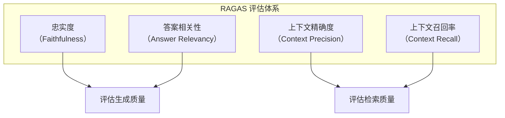
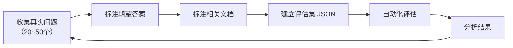

# RAG 评估体系

> **创建日期：** 2026-06-06
> **前置知识：** RAG 基础原理、RAG 优化策略

---

## 一、为什么需要 RAG 评估？

没有评估的 RAG 优化是盲目的。每次改动（换模型、调分块、改检索策略）都需要量化评估效果。

::: tip 核心原则
**从第一天开始建立评估集。** 20~50 个真实 QA 对的评估集，比任何直觉判断都可靠。
:::

---

## 二、RAGAS 评估框架

RAGAS（RAG Assessment）是目前最主流的开源 RAG 评估框架，定义了四大核心指标：



| 指标 | 评估对象 | 含义 | 计算公式 |
|------|----------|------|----------|
| **忠实度** | 生成质量 | 答案是否完全基于检索到的上下文，没有编造 | 基于上下文的事实断言数 / 总断言数 |
| **答案相关性** | 生成质量 | 答案是否直接回答了用户问题，没有偏离 | 基于答案反向生成问题的语义相似度 |
| **上下文精确度** | 检索质量 | 检索到的文档中，相关文档的排名是否靠前 | 相关文档在结果中的排名加权 |
| **上下文召回率** | 检索质量 | 是否检索到了所有必要的文档 | 检索到的相关文档 / 所有相关文档 |

### 2.1 忠实度详解

忠实度是 RAG 系统**最重要的指标**——它衡量 LLM 是否在编造信息。

```python
# RAGAS 忠实度评估
from ragas import evaluate
from ragas.metrics import faithfulness

result = evaluate(
    dataset,
    metrics=[faithfulness]
)
print(f"忠实度: {result['faithfulness']:.2%}")
```

### 2.2 各指标的理想值

| 指标 | 及格线 | 良好 | 优秀 |
|------|--------|------|------|
| 忠实度 | > 0.7 | > 0.85 | > 0.95 |
| 答案相关性 | > 0.7 | > 0.80 | > 0.90 |
| 上下文精确度 | > 0.6 | > 0.75 | > 0.85 |
| 上下文召回率 | > 0.6 | > 0.75 | > 0.85 |

---

## 三、评估集构建方法

### 3.1 构建流程



### 3.2 评估集格式

```json
[
  {
    "question": "如何申请年假？",
    "answer": "年假需要在OA系统申请，提前3天提交...",
    "contexts": [
      "员工手册第3章：年假申请流程...",
      "请假制度管理规定..."
    ],
    "ground_truth": "在OA系统提交申请，提前3天..."
  }
]
```

### 3.3 构建要点

- **覆盖典型场景**：高频问题 + 边界问题 + 对抗性问题
- **标注质量 > 数量**：20 个高质量标注，胜过 100 个粗糙标注
- **持续更新**：每次发现新问题，加入评估集

---

## 四、自动化评估流程

```python
# 完整的 RAGAS 评估流程
from ragas import evaluate
from ragas.metrics import (
    faithfulness,
    answer_relevancy,
    context_precision,
    context_recall
)
from datasets import Dataset

# 1. 准备评估数据
eval_data = {
    "question": [...],
    "answer": [...],      # RAG 系统生成的答案
    "contexts": [...],    # 检索到的文档
    "ground_truth": [...] # 人工标注的标准答案
}
dataset = Dataset.from_dict(eval_data)

# 2. 运行评估
result = evaluate(
    dataset,
    metrics=[
        faithfulness,
        answer_relevancy,
        context_precision,
        context_recall
    ]
)

# 3. 输出结果
print(f"忠实度: {result['faithfulness']:.2%}")
print(f"答案相关性: {result['answer_relevancy']:.2%}")
print(f"上下文精确度: {result['context_precision']:.2%}")
print(f"上下文召回率: {result['context_recall']:.2%}")
```

---

## 五、常见评估陷阱

::: danger 陷阱一：只看一个指标
只关注忠实度而忽略上下文召回率，可能导致系统变得"保守"——只回答检索到的内容，但检索不到关键信息。
:::

::: danger 陷阱二：用生成数据做评估
用 LLM 生成的问答对作为评估集，可能引入 LLM 的偏见。评估集应该来自**真实用户问题**。
:::

::: danger 陷阱三：评估集太小
20 个问题以下的评估集不可靠。一个偶然的好结果可能不代表系统真的好。
:::

::: danger 陷阱四：不及时更新评估集
系统上线后会发现新的问题类型，必须将这些新问题加入评估集，否则评估会"过拟合"。
:::

---

## 六、A/B 测试最佳实践

当需要对比两个 RAG 方案时，遵循以下原则：

1. **每次只改一个变量**：分块大小、检索策略、模型选择，逐个对比
2. **使用相同的评估集**：确保对比公平
3. **记录所有参数**：便于复现和回溯
4. **关注统计显著性**：样本量足够大时，小差异可能不显著

```python
# A/B 对比框架
def ab_test(config_a, config_b, eval_set):
    result_a = evaluate_with_config(config_a, eval_set)
    result_b = evaluate_with_config(config_b, eval_set)

    for metric in ["faithfulness", "answer_relevancy"]:
        diff = result_b[metric] - result_a[metric]
        print(f"{metric}: A={result_a[metric]:.2%}, "
              f"B={result_b[metric]:.2%}, "
              f"变化={diff:+.2%}")
```

---

## 七、面试高频题

### Q1: RAGAS 四大指标分别衡量什么？哪个指标最重要？

**详细答案：** RAGAS（RAG Assessment）定义了四个核心指标，分为生成质量和检索质量两个维度。生成质量方面，**忠实度（Faithfulness）** 衡量 LLM 生成的答案是否完全基于检索到的上下文，而非模型自身的知识或幻觉——它通过将答案分解为原子断言，逐一检查每个断言是否能在上下文中找到支撑来计算。**答案相关性（Answer Relevancy）** 衡量答案是否紧扣用户问题，没有跑题或答非所问——它通过反向生成（用答案生成假设问题，再计算假设问题与原始问题的语义相似度）来评估。检索质量方面，**上下文精确度（Context Precision）** 衡量检索到的文档中，相关文档是否排在前面——它通过计算相关文档在排名列表中的加权位置来评估，排名越靠前分数越高。**上下文召回率（Context Recall）** 衡量是否检索到了所有必要的信息——它通过对比检索到的文档与标准答案所需的全部信息来计算覆盖率。

在这四个指标中，**忠实度通常被认为是最重要的**，因为它直接关系到 RAG 系统的核心价值——"基于真实知识回答问题"。如果忠实度低，意味着系统在编造信息（幻觉），这比答得不全或答得不好更严重，因为它会误导用户。但面试中更高级的回答是：四个指标需要综合关注，不能只看一个。例如，如果只追求高忠实度，系统可能变得"保守"——只回答检索到的内容，但检索覆盖面窄导致答案不完整（上下文召回率低）。因此，一个优秀的 RAG 系统应该在四个指标上都达到"良好"以上（忠实度 > 0.85、答案相关性 > 0.80、精确度和召回率 > 0.75）。

实际应用中，不同场景的指标优先级也不同。客服场景中忠实度最重要（绝对不能给用户错误信息），知识发现场景中召回率最重要（不能漏掉关键信息），而搜索场景中精确度最重要（排名靠前的必须是相关结果）。面试时如果能结合场景分析指标优先级，会显得思考更深入。

### Q2: 如何构建 RAG 评估集？评估集的数据应该从哪里来？

**详细答案：** 构建 RAG 评估集的核心原则是"**来自真实用户，覆盖典型场景**"。一个高质量的评估集通常包含 20-50 个 QA 对，每条数据包括：`question`（用户问题）、`answer`（RAG 系统生成的答案）、`contexts`（检索到的文档列表）、`ground_truth`（人工标注的标准答案或关键事实）。评估集不能太小（少于 20 个），否则统计结果不可靠；也无需太大（超过 100 个），因为标注成本高且边际收益递减。

评估集的数据来源是面试中的关键考点。评估集应该主要来自**真实用户问题**，而不是 LLM 生成的问题。原因有三：第一，真实用户问题的分布才是你的系统实际面临的分布，LLM 生成的问题可能偏向某些类型，导致评估失真；第二，LLM 生成的问题可能带有模型自身的偏见，比如倾向于生成"标准问答"而非"对抗性问题"；第三，真实用户问题中包含了 LLM 难以模拟的奇葩问题、模糊问题、拼写错误问题，这些恰恰是评估系统鲁棒性的关键。当然，在项目初期没有真实用户数据时，可以先用 LLM 辅助生成种子问题，但必须尽快用真实数据替换。

构建流程上，建议采用"迭代式"方法：先收集 20-30 个高频真实问题做初始评估集，快速跑通评估流程；每次优化后，将新发现的 bad case 加入评估集，防止同类问题再次出现；定期（如每两周）回顾评估集，剔除过时问题、加入新类型问题。评估集本质上是一个"活文档"，需要持续维护。另外，标注时要注意覆盖三类问题：高频问题（占 70%）、边界问题（占 20%，如极端情况、歧义查询）、对抗性问题（占 10%，如故意误导、错误前提）。

### Q3: RAG 系统的忠实度低可能是什么原因？如何系统性地提升忠实度？

**详细答案：** 忠实度低意味着 LLM 生成的答案中包含了检索文档中没有的信息，本质上是模型在"编造"。原因可以分为三个层面分析。第一层是**检索层面**：检索到的文档与问题不相关，LLM 被迫使用自己的知识而不是检索到的文档来回答。这通常是因为检索策略不够好（如只用向量检索未用 BM25、未做 Rerank、Chunk 大小不合适），或者知识库本身缺乏相关文档。第二层是**Prompt 层面**：Prompt 没有明确约束 LLM 只能基于检索到的文档回答，或者 Prompt 中给了 LLM 太多"自由度"。例如，Prompt 中写"你可以根据你的知识补充"，就等同于鼓励模型编造。第三层是**模型层面**：某些模型本身就有较强的幻觉倾向，特别是在处理长上下文时，容易忽略或曲解中间部分的文档内容。

系统性地提升忠实度，首先应该从 Prompt 层面入手，这是成本最低、见效最快的方式。在 Prompt 中加入明确的约束："请仅基于以下文档内容回答问题。如果文档中没有相关信息，请明确说'文档中没有相关信息'，不要猜测或编造。" 同时，可以要求 LLM 在答案中引用具体的文档来源（如"根据文档第 3 段..."），这既便于校验，也能约束 LLM 的行为。其次，从检索层面优化：确保检索到的文档是高质量的，使用 Rerank 精排、混合检索、调整 Chunk Size 等策略。最后，如果前两个层面都优化到位了仍然不达预期，可以考虑更换模型（如换用忠实度更高的模型），或引入 Self-RAG 等自我反思机制，让模型在生成后自我检查是否有据可查。

常见误区：有人以为忠实度低就是"模型不好"，但实际上很多忠实度问题可以通过 Prompt 优化和检索优化来解决。同样的问题，一个简单的 Prompt 调整（加入"仅基于文档回答"）可能就能将忠实度从 0.6 提升到 0.85。所以在面试中，展示"先排查检索和 Prompt、再考虑换模型"的分层诊断思路，比直接回答"换更好的模型"得分更高。

### Q4: 上下文召回率低说明什么系统问题？有哪些优化手段？

**详细答案：** 上下文召回率低意味着 RAG 系统没有检索到回答用户问题所需的全部关键信息，这通常比精确度低更严重——因为错过了关键信息，LLM 再强也无法给出完整的正确答案。召回率低的原因通常有四个：一是**分块策略不当**，Chunk Size 太小导致关键信息被切碎分散到多个 Chunk 中，检索只命中了其中一个；二是**检索方式单一**，只用向量检索导致对专有名词、数字 ID 等精确匹配差；三是**查询与文档表达鸿沟**，用户用口语问"怎么提额"，文档中写的是"信用额度调整流程"，语义匹配失败；四是**知识库本身缺乏相关文档**，这是最根本的问题，再好的检索也检索不到不存在的内容。

优化召回率的手段要按照"成本从低到高"的顺序逐步尝试。第一步，**调整 Chunk 参数**：增大 Chunk Size（从 256 到 512 或 1024），增加 Overlap 比例（从 10% 到 20%），确保关键信息不会在 Chunk 边界被切断。第二步，**引入混合检索**：在向量检索基础上叠加 BM25 关键词检索，大幅提升对专有名词和精确匹配的召回。第三步，**查询改写**：用 LLM 将用户口语化查询改写为更精确的检索查询，缩小查询与文档的语义鸿沟。第四步，**多路召回**：除了向量检索和 BM25，还可以加入知识图谱检索、父文档扩展、HyDE 等更多召回路径，通过 RRF 融合扩大召回覆盖面。第五步，如果以上手段都无效，需要检查知识库本身是否缺少相关文档，可能需要补充数据源。

面试中容易被忽略的一点是：召回率和精确度是跷跷板关系——提升召回率往往会降低精确度。例如，增大 Chunk Size 能让更多信息被检索到（召回率提升），但也会让不相关的信息混入（精确度下降）。因此，优化召回率时需要配合 Rerank 精排来"兜底"，在召回阶段"宁可多召回，不可漏掉"，然后在精排阶段过滤掉不相关的，实现"高召回 + 高精度"。

### Q5: 如何做 RAG 系统的 A/B 测试？有哪些关键注意事项？

**详细答案：** RAG 系统的 A/B 测试比传统软件系统的 A/B 测试更复杂，因为输出是自然语言而非结构化数据，很难用简单的指标判断优劣。RAG 系统的 A/B 测试通常分为两个阶段：**离线评估**和**在线评估**。离线评估阶段，使用相同的评估集在两种配置下分别运行，对比 RAGAS 四大指标的变化。关键原则是"每次只改一个变量"——比如只改 Chunk Size（从 256 到 512），其他参数保持不变，这样才能准确归因效果变化。如果一次改了多个变量（同时改了 Chunk Size、检索策略、Rerank 模型），就无法判断哪个改动带来了效果提升。

在线评估阶段，将两种配置分别部署到生产环境，按一定比例分流（如 50/50 或 90/10 灰度），收集真实用户的反馈。在线评估的指标包括：用户满意度评分（如点赞/点踩率）、问题解决率（用户是否追问了同类问题）、平均对话轮次（越少越好）、用户留存率等。此外，还可以通过 LLM-as-Judge 的方式，让一个独立的 LLM 对两种配置的答案做盲评（不告诉 LLM 哪个是哪个配置），给出"A 更好、B 更好、差不多"的判断。

A/B 测试的关键注意事项有四。第一，**样本量要足够大**：RAG 系统的答案质量波动较大（即使相同配置，同一问题两次回答可能不同），需要足够的样本量（通常至少 100-200 个问题）才能得到统计显著的结论。第二，**评估集不能过拟合**：如果评估集是你自己在优化时反复使用的，那么评估结果可能已经"过拟合"了评估集，上线后效果可能不如预期。第三，**关注 latency 和 cost 的 trade-off**：A/B 测试不能只看质量指标，还要关注延迟和成本。例如，启用了 Rerank 后质量提升 5%，但延迟增加了 200ms、成本增加了 30%，这个 trade-off 需要在业务层面做决策。第四，**记录所有实验参数**：每次 A/B 测试的配置、评估集、结果都要文档化，方便后续回溯和复现。