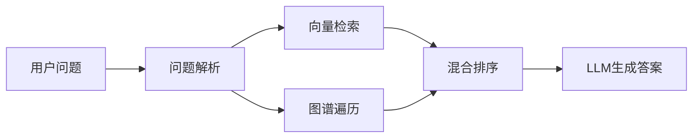
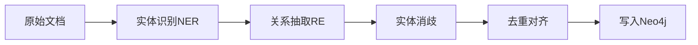
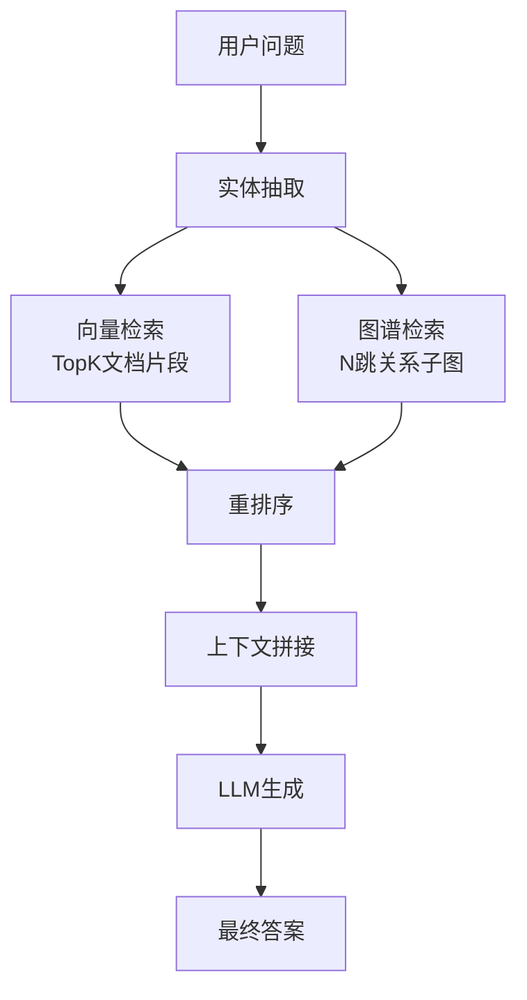

# GraphRAG 知识图谱增强检索实践指南

面向 Java 后端开发者的 GraphRAG 落地实践指南。

## 1. 概述

GraphRAG（Graph Retrieval-Augmented Generation）是**知识图谱增强的检索生成框架**，在传统向量 RAG 基础上引入知识图谱的结构化信息，解决原生 RAG 的痛点：

| 特性 | 传统向量 RAG | GraphRAG |
|------|-------------|----------|
| 推理能力 | 单跳检索，无法处理多跳关系 | 支持多跳推理，显式建模实体关系 |
| 知识表示 | 隐式向量存储，关系模糊 | 显式图谱结构，关系清晰 |
| 可解释性 | 黑盒检索，无法追溯来源 | 关系可追溯，路径可解释 |
| 适用场景 | 文档语义搜索 | 复杂问答、知识推理、关系查询 |

**核心优势**：
- 解决多跳推理问题：例如"查找使用Java开发的开源项目中，来自Apache基金会的项目有哪些？"需要遍历多个关系
- 实体关系查询：明确回答实体之间的关联关系
- 减少幻觉：结构化知识约束生成过程



## 2. 知识图谱构建

### 2.1 构建流程



### 2.2 关键步骤

**实体识别（NER）**：从文本中识别出实体（人名、组织、产品、概念等）

**关系抽取（RE）**：识别实体之间的语义关系（如"开发"、"属于"、"使用"）

**实体消歧**：同名实体归一化（如"苹果"既是公司又是水果）

**图谱存储**：优先选择原生图数据库 Neo4j，支持高效的图遍历查询。

## 3. 图谱检索策略

### 3.1 检索方式

1. **实体查询**：根据问题中的实体定位到图谱节点
2. **关系遍历**：从实体出发，沿着关系路径探索关联节点
3. **子图检索**：提取与问题相关的子图作为上下文
4. **混合融合**：将图谱检索结果与向量检索结果融合

### 3.2 融合策略

```
向量检索：召回语义相关的文档片段
图谱检索：召回实体关系路径
两者取并集/交集，送入LLM生成最终答案
```

## 4. 混合检索架构



**架构特点**：双路召回，优势互补：
- 向量检索擅长宽泛语义匹配
- 图谱检索擅长精确关系推理

## 5. 实战：LLM自动构建知识图谱

以下是使用 Python + LangChain + Neo4j 自动抽取实体关系的示例：

```python
from langchain_community.graphs import Neo4jGraph
from langchain_openai import ChatOpenAI
from langchain_experimental.graph_transformers import LLMGraphTransformer

# 连接Neo4j
graph = Neo4jGraph(
    url="bolt://localhost:7687",
    username="neo4j",
    password="password"
)

# 使用LLM抽取知识图谱
llm = ChatOpenAI(temperature=0, model="gpt-4")
llm_transformer = LLMGraphTransformer(llm=llm)

# 输入文档，转换为图谱
from langchain_core.documents import Document
documents = [Document(page_content="""
Spring Boot是由Pivotal团队开发的Java框架，
它基于Spring框架，简化了微服务应用的开发。
""")]

graph_documents = llm_transformer.convert_to_graph_documents(documents)
graph.add_graph_documents(graph_documents)
```

**Java 开发者提示**：可以调用 OpenAI API 完成抽取，结果存入 Neo4j 驱动使用官方 neo4j-java-driver。

## 6. 性能考量

| 维度 | 优化建议 |
|------|---------|
| 图谱规模 | 领域建模，只存业务需要的实体关系，避免全量知识图谱 |
| 检索延迟 | 控制跳数（通常2-3跳足够），建立索引，使用查询缓存 |
| 索引优化 | 对实体属性建立全文索引，加速实体查找 |
| 存储 | 按需分区，热点数据缓存 |

## 7. 常见陷阱

1. **过度建模**：不是所有场景都需要 GraphRAG，简单问答用向量 RAG 足够
2. **实体抽取错误**：LLM 抽取也会出错，需要后处理校验
3. **遍历爆炸**：跳数过深导致子图过大，上下文超限
4. **维护成本**：知识图谱需要更新，增量抽取难，考虑全量重建
5. **对齐困难**：多个来源实体命名不统一，消歧成本高

## 8. 面试高频题

### Q1: GraphRAG 和传统 RAG 的核心区别是什么？什么场景下你会选择 GraphRAG？

**详细答案：**

核心区别在于知识表示方式和推理能力。传统 RAG 将文档切块转为向量，依赖语义相似度检索，是单跳检索，无法显式处理实体之间的关系。GraphRAG 在向量检索基础上，额外构建知识图谱，显式存储实体和关系，支持多跳推理。

选择 GraphRAG 的场景：当问题需要多跳推理，或者需要明确查询实体关系时。比如知识问答、企业知识库查询、复杂领域问答。如果只是简单的文档搜索、FAQ 问答，传统向量 RAG 更轻量，维护成本更低，没必要用 GraphRAG。

### Q2: 知识图谱构建过程中，实体消歧是怎么处理的？

**详细答案：**

实体消歧目标是解决同名实体混淆问题，比如"苹果"指公司还是水果。常见做法：首先，利用上下文计算实体语义向量，和知识库中已有的实体向量做相似度比较，最相近的判定为同一实体，合并归一化。其次，可以利用实体的描述信息，通过 LLM 判断是否指向同一实体。

工程上，可以维护实体同义词表，做归一化映射。对于领域场景，可以提前梳理领域实体字典，构建时直接对齐。

### Q3: GraphRAG 的检索流程是怎样的？如何融合图谱检索和向量检索？

**详细答案：**

典型的双路召回流程：第一步对用户问题做实体识别，抽取问题中的关键实体；第二步，在知识图谱中找到这些实体，然后沿着关系做N跳遍历，得到相关子图；与此同时，用问题向量做向量检索，召回语义相关的文档片段。

融合方式通常有几种：简单拼接就是把子图的关系路径和向量检索的文档片段拼在一起，作为上下文送入 LLM。也可以对两路结果分别打分，然后按权重混合排序，取TopN。还有一种是先用图谱检索缩小范围，再在范围内做向量精排。工程上简单拼接最常用，实现简单效果也不错。

### Q4: Neo4j 在 GraphRAG 中主要负责什么？为什么不直接用关系数据库存储图谱？

**详细答案：**

Neo4j 是原生图数据库，存储层就是按图结构设计的，对图遍历查询做了专门优化。在 GraphRAG 中，Neo4j 负责存储实体节点、关系、属性，并且提供高效的多跳遍历查询，快速抽取和问题相关的子图。

如果用关系数据库存储图谱，实体一张表，关系一张表，多跳遍历需要多次 JOIN，随着深度增加性能指数下降，而原生图数据库访问邻居节点是 O(1) 复杂度。所以对于需要频繁图遍历的场景，Neo4j 性能远好于关系数据库。

### Q5: 在 Java 项目中如何集成 GraphRAG？讲讲整体技术栈。

**详细答案：**

Java 项目集成 GraphRAG 的技术栈选择：知识图谱存储用 Neo4j，官方提供 neo4j-java-driver，直接依赖接入。实体关系抽取可以调用 LLM API（OpenAI、通义千问等），Java 项目用 RestTemplate 或者 HttpClient 调用接口即可。向量存储可以用 Pinecone、Milvus 或者 Elasticsearch，Java 都有客户端。

整体流程：文档预处理阶段，调用 LLM API 抽取实体关系，写入 Neo4j，文档切片写入向量库。检索阶段，Java 服务接收用户问题，并行调用向量检索和图谱检索，合并结果，拼接上下文，调用 LLM 生成答案返回。对于复杂查询，可以先在知识图谱做路径探索，再根据找到的实体去向量库检索相关文档。