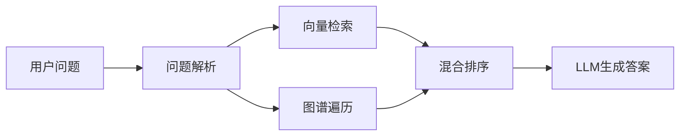
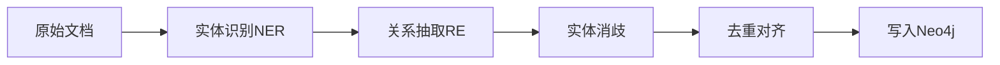
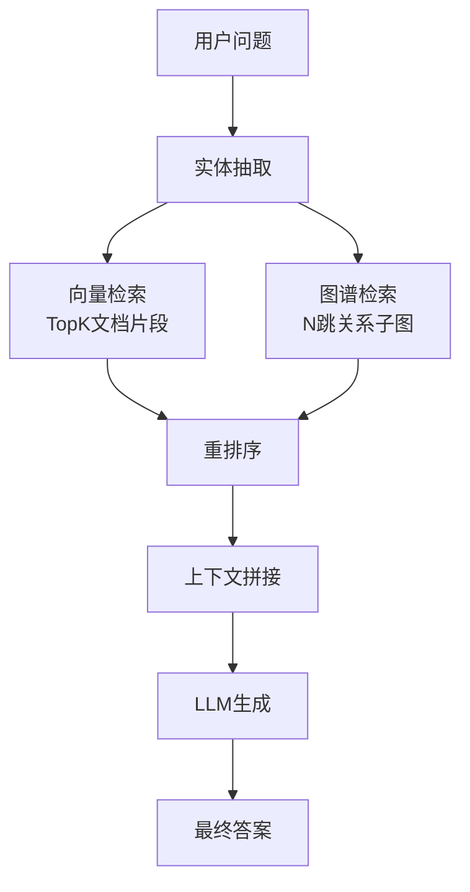

# GraphRAG 知识图谱增强检索实践指南

面向 Java 后端开发者的 GraphRAG 落地实践指南。

## 1. 概述

GraphRAG（Graph Retrieval-Augmented Generation）是**知识图谱增强的检索生成框架**，在传统向量 RAG 基础上引入知识图谱的结构化信息，解决原生 RAG 的痛点：

| 特性 | 传统向量 RAG | GraphRAG |
|------|-------------|----------|
| 推理能力 | 单跳检索，无法处理多跳关系 | 支持多跳推理，显式建模实体关系 |
| 知识表示 | 隐式向量存储，关系模糊 | 显式图谱结构，关系清晰 |
| 可解释性 | 黑盒检索，无法追溯来源 | 关系可追溯，路径可解释 |
| 适用场景 | 文档语义搜索 | 复杂问答、知识推理、关系查询 |

**核心优势**：
- 解决多跳推理问题：例如"查找使用Java开发的开源项目中，来自Apache基金会的项目有哪些？"需要遍历多个关系
- 实体关系查询：明确回答实体之间的关联关系
- 减少幻觉：结构化知识约束生成过程



## 2. 知识图谱构建

### 2.1 构建流程



### 2.2 关键步骤

**实体识别（NER）**：从文本中识别出实体（人名、组织、产品、概念等）

**关系抽取（RE）**：识别实体之间的语义关系（如"开发"、"属于"、"使用"）

**实体消歧**：同名实体归一化（如"苹果"既是公司又是水果）

**图谱存储**：优先选择原生图数据库 Neo4j，支持高效的图遍历查询。

## 3. 图谱检索策略

### 3.1 检索方式

1. **实体查询**：根据问题中的实体定位到图谱节点
2. **关系遍历**：从实体出发，沿着关系路径探索关联节点
3. **子图检索**：提取与问题相关的子图作为上下文
4. **混合融合**：将图谱检索结果与向量检索结果融合

### 3.2 融合策略

```
向量检索：召回语义相关的文档片段
图谱检索：召回实体关系路径
两者取并集/交集，送入LLM生成最终答案
```

## 4. 混合检索架构



**架构特点**：双路召回，优势互补：
- 向量检索擅长宽泛语义匹配
- 图谱检索擅长精确关系推理

## 5. 实战：LLM自动构建知识图谱

以下是使用 Python + LangChain + Neo4j 自动抽取实体关系的示例：

```python
from langchain_community.graphs import Neo4jGraph
from langchain_openai import ChatOpenAI
from langchain_experimental.graph_transformers import LLMGraphTransformer

# 连接Neo4j
graph = Neo4jGraph(
    url="bolt://localhost:7687",
    username="neo4j",
    password="password"
)

# 使用LLM抽取知识图谱
llm = ChatOpenAI(temperature=0, model="gpt-4")
llm_transformer = LLMGraphTransformer(llm=llm)

# 输入文档，转换为图谱
from langchain_core.documents import Document
documents = [Document(page_content="""
Spring Boot是由Pivotal团队开发的Java框架，
它基于Spring框架，简化了微服务应用的开发。
""")]

graph_documents = llm_transformer.convert_to_graph_documents(documents)
graph.add_graph_documents(graph_documents)
```

**Java 开发者提示**：可以调用 OpenAI API 完成抽取，结果存入 Neo4j 驱动使用官方 neo4j-java-driver。

## 6. 性能考量

| 维度 | 优化建议 |
|------|---------|
| 图谱规模 | 领域建模，只存业务需要的实体关系，避免全量知识图谱 |
| 检索延迟 | 控制跳数（通常2-3跳足够），建立索引，使用查询缓存 |
| 索引优化 | 对实体属性建立全文索引，加速实体查找 |
| 存储 | 按需分区，热点数据缓存 |

## 7. 常见陷阱

1. **过度建模**：不是所有场景都需要 GraphRAG，简单问答用向量 RAG 足够
2. **实体抽取错误**：LLM 抽取也会出错，需要后处理校验
3. **遍历爆炸**：跳数过深导致子图过大，上下文超限
4. **维护成本**：知识图谱需要更新，增量抽取难，考虑全量重建
5. **对齐困难**：多个来源实体命名不统一，消歧成本高

## 8. 面试高频题

### Q1: GraphRAG 和传统 RAG 的核心区别是什么？什么场景下你会选择 GraphRAG？

**详细答案：** 我们做保险问答时有个很典型的 case 能说明这个区别。用户问"这款重疾险的125种重疾分别对应什么赔付比例"，传统向量 RAG 捞回来一堆和"重疾"相关的文档，但每条文档讲的是某一种疾病的赔付比例，没有一条把所有 125 种全部列出。LLM 跨 6 个 chunk 自己拼凑，经常漏掉两种或者把 A 病的保额套到 B 病上。GraphRAG 则是把"重疾险"作为实体节点，"125种重疾"是子实体，"赔付比例"是属性，查询时直接遍历子图把所有关系找出来，精确度完全不在一个量级。

选择标准其实很简单：如果你的问题需要"从 A 找到 B 再找到 C"这种跨实体跳转，必选 GraphRAG。如果大部分问题是"关于 X 的文档在哪里"，传统向量 RAG 就够了。我们实际用下来的经验是 80% 的查询走传统 RAG 就够了，只有"实体对比""关联关系"这类走 GraphRAG，投入产出比最高。

### Q2: 知识图谱构建过程中，实体消歧是怎么处理的？

**详细答案：** 实体消歧我们踩过坑。保险领域有个典型歧义——"第三者"在车险条款里是"第三方责任人"，在健康险里是"保险公司作为第三方"，完全是两回事。如果图谱把这两个"第三者"当同一个实体来处理，后面的关系遍历全乱套。我们做法是上下文向量比对：抽取实体时把实体所在的句子也记下来，计算这个实体片段的 Embedding，再和知识库中已有实体的 Embedding 做相似度比较，大于 0.9 的认为是同一个实体，0.7 到 0.9 之间走人工标注，低于 0.7 直接新建实体。另外我们维护了一份保险领域术语字典，记录了 200 多个常用术语的标准名称和别名，构建时直接做归一化映射，省了不少事。

### Q3: GraphRAG 的检索流程是怎样的？如何融合图谱检索和向量检索？

**详细答案：** 我们现在的检索流程是双路并行：用户问题进来，先做实体识别把关键实体抽出来（比如"重疾险""糖尿病并发症""赔付比例"），然后一路在 Neo4j 图里从这些实体开始做 2 跳遍历，找到所有关联实体和关系路径，输出格式化的三元组；另一路同时走 Milvus 向量检索捞 Top-10 语义相关的文本片段。两路结果用简单拼接的方式合并进 Prompt——前面放图谱关系路径，后面放向量检索的文档片段——然后一起送给 LLM 生成答案。

融合方式试过几种，加权分数融合调参调半天不稳定，最后选了最简单直接的拼接，效果就不错。我们有个小经验：图谱检索结果不能太长，跳数控制到 2 跳以内，否则子图爆炸——一次"重疾险"节点 2 跳下去能拉出 300 多个节点和关系，token 直接炸了。我们的做法是限制每跳最多展开 10 个邻居节点，超过就按实体重要性截断。

### Q4: Neo4j 在 GraphRAG 中主要负责什么？为什么不直接用关系数据库存储图谱？

**详细答案：** Neo4j 在我们的架构里就是图谱的存储和查询引擎。实体存成 Node，关系存成 Relationship，属性挂在 Node 上。核心价值是它的图遍历查询——从起点实体出发，沿着关系路径多跳遍历，找关联实体，这条路在 Neo4j 里用 Cypher `MATCH (a)-[*1..2]-(b)` 语句就能搞定，几百毫秒的事。

如果用 PostgreSQL 来存图，你得两张表——Entity 表和 Relation 表，然后做 JOIN。一跳 JOIN 一次可能还行，但两跳就两次 JOIN，三跳三次，随着深度增加性能指数级下降。我们试过用 PostgreSQL 存了一个 5000 实体的原型图，三跳查询就要 3-5 秒，Neo4j 同样规模只要 200ms。但在实际选择上，我们只有实体关系类的查询走 Neo4j，其他的元数据和业务数据仍走 PostgreSQL，两者各司其职。

### Q5: 在 Java 项目中如何集成 GraphRAG？讲讲整体技术栈。

**详细答案：** 我们的 Java 后端接入 GraphRAG 是这样一个栈。图谱存储直接用的 Neo4j Community Edition，Java 侧通过 neo4j-java-driver 连，用 Cypher 语句做图遍历。实体和关系抽取用的是 LLM（GPT-4 API + LangChain 的 LLMGraphTransformer），Python 单独起了一个抽取服务，Java 端通过 REST 调它把抽取结果写入 Neo4j。不影响 Java 主工程的业务逻辑。

向量存储走的 Milvus，Java 端用 milvus-sdk-java 连接。检索服务在 Java 层实现了双路并行——用 CompletableFuture 同时发起图谱检索（Cypher 查询）和向量检索（Milvus Search），拿到结果后拼接，再调 LLM API 生成最终答案。一般在 500ms 内能完成整个链路。有一个小经验：把图谱遍历的深度控制在 2 跳，否则返回的子图太大，LLM 处理不过来，我们还在 Cypher 查询里加了 `LIMIT 20` 避免结果爆炸。