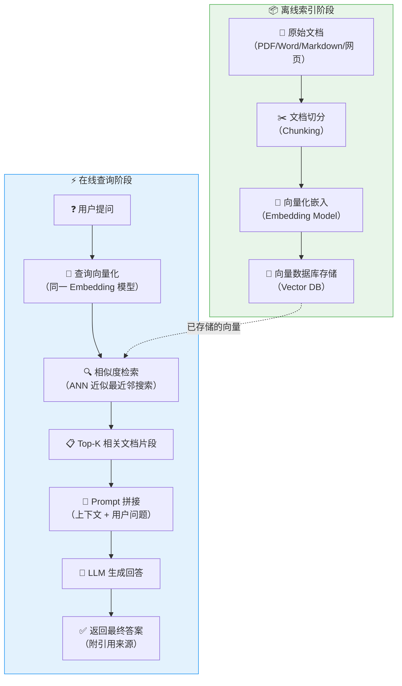
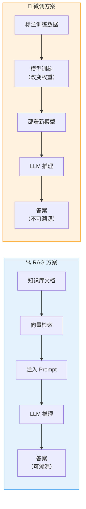
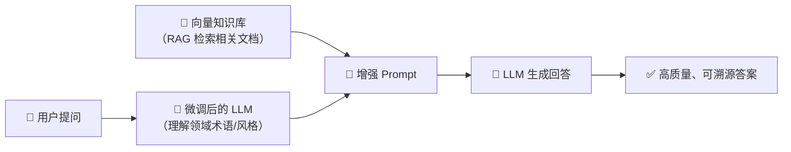

# RAG（检索增强生成）原理详解

> **检索增强生成（Retrieval-Augmented Generation, RAG）** 是一种将信息检索与文本生成相结合的技术架构，旨在让大语言模型（LLM）在生成回答时，能够动态地引用外部知识库中的相关信息，从而显著提升回答的准确性和时效性。

---

## RAG 完整架构流程

RAG 的核心思想是：**先检索、后增强、再生成**。整个流程分为离线索引阶段和在线查询阶段两大环节。

### 各阶段详解

#### 阶段一：文档加载与解析
- 支持多种格式：PDF、Word、Markdown、HTML、数据库记录等
- ⭐ **关键点**：保留文档结构信息（标题层级、段落边界）

#### 阶段二：文档切分（Chunking）
- 将长文档切分为合理大小的文本块
- 常见策略：固定长度切分、语义切分、递归切分
- ⭐ **关键点**：Chunk 大小直接影响检索精度，典型值 256~1024 tokens，需设置 overlap（重叠窗口）保证语义连续性

#### 阶段三：向量化嵌入（Embedding）
- 使用嵌入模型将文本转换为高维向量
- 常见模型：OpenAI text-embedding-3、BGE、M3E、Jina Embeddings
- ⭐ **关键点**：查询和文档必须使用**同一个**嵌入模型

#### 阶段四：向量检索（Retrieval）
- 将用户查询向量化后在向量数据库中执行相似度搜索
- 支持 Top-K 返回、相似度阈值过滤
- ⭐ **关键点**：K 值不宜过大（通常 3~10），过多无关上下文会稀释 LLM 注意力

#### 阶段五：上下文增强（Augmentation）
- 将检索到的文档片段拼接到 Prompt 中
- 通常格式：`基于以下参考资料回答问题：\n{context}\n\n问题：{query}`

#### 阶段六：生成回答（Generation）
- LLM 基于增强后的 Prompt 生成最终答案
- 可要求 LLM 注明引用来源

---

## RAG vs 微调 对比

| 维度 | RAG（检索增强生成） | 微调（Fine-tuning） |
|------|---------------------|---------------------|
| **核心原理** | 动态检索外部知识，注入 Prompt | 通过训练改变模型权重参数 |
| **知识更新** | ⭐ 实时更新，只需更新向量库 | 需要重新训练，成本高 |
| **可解释性** | ⭐ 可追溯引用的具体文档片段 | 黑盒，难以解释推理来源 |
| **幻觉控制** | ⭐ 有据可查，大幅降低幻觉 | 仍可能产生幻觉 |
| **成本** | 较低（检索+推理） | 较高（需 GPU 训练） |
| **适用场景** | 知识密集型、实时信息查询 | 风格定制、领域专业术语 |
| **数据需求** | 需要高质量知识库文档 | 需要标注训练数据 |
| **延迟** | 增加检索环节延迟（ms级） | 纯推理，无额外延迟 |
| **领域适应性** | 通过更换知识库快速切换 | 每个领域需单独训练 |

---

## 何时用 RAG？何时用微调？

### ⭐ 优先使用 RAG 的场景

::: tip RAG 最佳实践场景
| 场景 | 说明 |
|------|------|
| **企业知识库问答** | 内部文档、制度规范、产品手册等需要频繁更新 |
| **实时信息查询** | 新闻、股价、天气等时效性强的信息 |
| **法律法规查询** | 法条引用的准确性和可溯源是硬性要求 |
| **多租户知识隔离** | 不同客户的知识库完全隔离，互不干扰 |
| **零样本冷启动** | 没有标注数据，仅有文档即可上线 |
| **合规审计** | 需要清晰展示"这个答案来自哪份文件" |
:::

### ⭐ 优先使用微调的场景

::: warning 微调适用场景
| 场景 | 说明 |
|------|------|
| **特定写作风格** | 让模型模仿特定的语气、文风（如法律文书、诗歌） |
| **专业术语内化** | 医疗、法律、金融等领域的专有名词和表达习惯 |
| **特定输出格式** | 严格遵循某种 JSON Schema 或结构化输出 |
| **推理范式定制** | Chain-of-Thought、ReAct 等推理模式的固化 |
| **多语言翻译风格** | 特定领域的翻译风格调整 |
:::

### ⭐ 组合策略：RAG + 微调

实际生产环境中，最优方案往往是**两者结合**：

| 组合方式 | 说明 |
|----------|------|
| **先微调、再 RAG** | 微调让模型理解领域术语，RAG 提供最新知识 |
| **先 RAG、再微调** | RAG 生成高质量训练数据，再用这些数据微调模型 |

---

## 面试常见问题

### Q1：RAG 的核心挑战是什么？

1. **检索质量瓶颈**：检索不到相关文档，再好的 LLM 也白搭
2. **上下文窗口限制**：LLM 的 context window 有限，检索出的文档不能太多
3. **答案漂移**：检索到的无关文档可能误导 LLM
4. **延迟叠加**：检索 + LLM 推理 = 更高的端到端延迟

### Q2：如何提升 RAG 检索质量？

- ⭐ **混合检索**（Hybrid Search）：向量检索 + 关键词检索（BM25），取两者并集或加权排序
- ⭐ **重排序**（Re-ranking）：用 Cross-Encoder 对初检结果精排
- **查询改写**（Query Rewriting）：用 LLM 优化用户查询表达
- **多路召回**：稀疏检索 + 稠密检索 + 图谱检索等多路并行
- **Chunk 优化**：调整切分大小、overlap 策略、添加摘要索引

### Q3：RAG 和长上下文 LLM（如 128K tokens）如何选择？

- 长上下文 LLM：适合**单次、少量文档**的分析任务（如分析一篇长论文）
- RAG：适合**大规模知识库**的精准检索（如检索数万份文档中的相关段落）
- ⭐ **最佳实践**：两者非互斥，RAG 检索到的片段 + 长上下文窗口 = 更多有效信息

### Q4：文档切分（Chunking）有哪些策略？

| 策略 | 说明 | 适用场景 |
|------|------|----------|
| 固定长度切分 | 按 token 数等长切分 | 通用场景 |
| 语义切分 | 按段落、章节自然划分 | 结构化文档 |
| 递归切分 | 先按大分隔符（段落），再按小分隔符（句子） | 混合类型文档 |
| 句子级切分 | 以句号为边界 | 问答对、FAQ |

---

## 实战建议

::: info 实战清单
1. ✅ **选型前先评估**：明确是知识密集型任务还是风格/推理范式定制
2. ✅ **从小规模开始**：先用 100 份文档跑通 RAG 全流程，再逐步扩展
3. ✅ **监控检索质量**：建立检索命中率、答案准确率的评估体系
4. ✅ **迭代优化**：检索策略不是一劳永逸，需要根据反馈持续调优
5. ✅ **考虑混合方案**：RAG + 微调 往往是最优解
6. ✅ **关注安全**：RAG 知识库可能包含敏感信息，注意权限控制和数据隔离
:::

---

## 参考资料

- [Retrieval-Augmented Generation for Knowledge-Intensive NLP Tasks (原始论文)](https://arxiv.org/abs/2005.11401)
- LangChain / LlamaIndex RAG 官方文档
- OpenAI RAG Best Practices

---

## 面试高频题

### Q1: RAG 架构中，离线索引阶段和在线查询阶段分别承担什么职责？它们之间如何解耦？

**详细答案：** 我们项目里做的是一个保险条款智能问答系统，离线阶段和在线阶段拆得比较干净。离线这边，我们每天晚上 3 点跑一次全量索引构建，处理大概 5000 多份保险条款 PDF，用 BGE-large-v1.5 做嵌入，整个索引构建大概跑 40 分钟。这里踩过一个坑——一开始解析 PDF 直接用的 PyPDF2，上线后发现表格数据全丢了，条款里的费率表、赔付比例表根本检索不到，排查了两天才定位到是 PDF 解析库的问题，后来换成 Unstructured.io 才把表格内容正确提取出来。在线查询这边对延迟很敏感，我们 P99 控制在 1.5 秒以内，后端用的是 FastAPI + Milvus。两个阶段通过 Milvus 的 alias 机制解耦——离线构建新索引后做一次 alias swap，线上查询毫秒级就能切到新索引，完全不需要重启服务。而且我们给每个租户建了独立的 Collection，租户 A 的条款和租户 B 的条款物理隔离，数据安全和权限控制这块也省心了。

### Q2: RAG 与长上下文 LLM（如 128K tokens）应该如何选择？两者能否结合使用？

**详细答案：** 我们项目里也纠结过这个问题。当时 GPT-4 出了 128K 版本，产品经理就问能不能直接把整份保单扔进去让模型回答。我们测了一下，一份车险条款大概 2 万字，通读式提问确实能答，但暴露了两个致命问题——第一是成本，单次推理光 input token 就要四五万，我们一天几万次查询，算下来一个月 token 费用奔着十几万去了，ROI 根本撑不住。第二是延迟，128K 上下文下模型的生成速度明显下降，P50 都飙到 4 秒多，用户体验非常差。

我们最后定的策略是 RAG + 长上下文组合：先用混合检索（向量 + BM25）捞 Top-5 相关片段，但关键的一点是，每个片段我们不是只取那一小块，而是把相邻的上下 3 个段落也带上，利用长上下文窗口让模型能看到更完整的逻辑链。这样 Token 控制在 8000 左右，既省了钱又保证了答案质量。还有一类场景我们直接走长上下文——用户上传一份单独的保单 PDF 要求逐条分析的时候，这种"单文件深度分析"RAG 反而多此一举，全文塞进去效率最高。另外我们也把长上下文当降级策略用——如果检索结果相似度分数全部低于 0.6，就不走 RAG，直接让模型基于自身知识回答并提示"未找到相关条款"。

### Q3: 文档切分（Chunking）策略对 RAG 系统的检索质量有何影响？如何选择 Chunk 大小和 Overlap？

**详细答案：** 切分策略这个东西，不真正上线跑一跑你根本不知道有多坑。我们最开始用的是 LangChain 的 RecursiveCharacterTextSplitter，chunk_size 设了 1000，overlap 设了 200，这是文档里推荐的"通用配置"。上线后发现保险条款里很多编号（比如"第3.2.1条"）被切断到两个 Chunk 里了，用户搜"3.2.1 条"根本搜不出来，因为前半段在一个 Chunk 里，后半段在另一个里。后来我们把 chunk_size 降到 600，overlap 调成 150，这类问题的召回率从 62% 直接提到了 78%，效果立竿见影。

还有一个踩坑是语义切分。保险条款的标题层级很深——第X章下面有第X节，第X节下面有第X条——我们试着按标题切分，结果一条长篇"除外责任"条款被切成五六段，检索时返回一堆碎片，LLM 根本拼不出完整意思来。最后我们搞了两套策略：结构化条款（像责任免除、赔偿限额这种有编号的）按标题切，每条独立条款作为一个 Chunk；非结构化的描述性段落（比如条款正文里的场景说明）用 512 tokens 固定切分加 50 的 overlap。针对不同文档类型走不同策略，效果明显比一刀切好。另外我们还给每个 Chunk 加了元数据——所属章节标题、条款编号、文档类型——检索时可以根据这些元数据做过滤，减少跨章节的噪音匹配。

### Q4: RAG 系统中，检索质量不佳的主要表现有哪些？如何诊断和优化？

**详细答案：** 我们项目上线一个月后，业务反馈说"除外责任"类问题的准确率只有 40% 多，远低于整体 75% 的水平。排查了一周才发现是三个问题叠在一起了。第一是术语缩写——用户输入的都是"交强险"，但保单里写的是"机动车交通事故责任强制保险"，向量检索的余弦相似度根本匹配不上。我们做了一个查询改写层，把用户输入里的常见行业缩写用 LLM 展开，改写后再检索，这类问题的召回率从 45% 直接涨到了 82%。第二是条款编号（如"第3.2.1条"）这种精确匹配场景，向量检索天然不擅长，因为 BGE 模型对纯数字不敏感。后来我们在 Milvus 里并行跑了 BM25 做混合检索，关键词命中直接提分，编号类查询的准确率立刻上去了。第三是 Top-K 设太大了——一开始我们设 K=10，但保险条款各险种之间区分度很高，多加的几条文档全是噪音，LLM 被误导后把车险的赔付逻辑套到了健康险上。改回 K=5 后 Faithfulness 指标反而升了不少。诊断这块我们用的 RAGAS 自动跑评估集，每周一次，重点关注 Faithfulness 和 Context Precision。最有效的诊断手段其实是从线上拉 bad case——我们每周拉 20 条"用户点了踩"的真实 query 出来做归因分析，比看什么汇总指标都管用。

### Q5: 在生产环境中，如何评估一个 RAG 系统的整体效果？关键评估指标有哪些？

**详细答案：** 我们在投产之后上了一套评估体系，分享几个实操经验。检索质量这块，我们构建了一个 50 道题的黄金评估集，每道题人工标注了相关文档的 chunk id。每周自动跑一次算 Recall@5 和 MRR，数据录到 Grafana 面板里，哪天指标掉了马上能看到告警。有一个教训——我们最初那 50 道题全是内部测试人员写的，规规矩矩的"标准问法"，上线后发现真实用户根本不会那么问，全是口语化的、带错别字的、甚至有中途改主意的。后来我们每周从线上抽取 20 条真实 query 补充进评估集，慢慢滚到 200 多条，覆盖率才真正上去。

生成质量我们用 RAGAS 的 Faithfulness 和 Answer Relevancy 做自动化评估，阈值设的是 Faithfulness 低于 0.7 就自动告警到飞书群里。端到端这边，P95 延迟我们卡在 3 秒，超过就触发 HPA 扩容。还有一个小技巧——我们每个回答下面挂了"有帮助/没帮助"的按钮，用户点完顺手收集反馈，一周大概能收到 300 多条，这些真实用户的反馈数据比任何自动化指标都实在。另外我们每月会抽 100 条线上答案做人工评审，业务专家按 1-5 分打分，主要是看"这个答案用户能拿来直接用吗"而不是"这个答案写得漂亮吗"。

### Q6: RAG 与微调的组合策略在实际项目中如何落地？

**详细答案：** 我们这个保险问答项目走的是"先 RAG 后微调"的路线。为什么不是先微调？因为项目启动时我们手头只有 5000 多份条款 PDF，没有任何标注数据，业务方给的时间窗口就 2 周出 MVP。所以我们先花了两周用 RAG 把核心链路跑通，快速上线。线上跑了大概一个季度后，我们积累了相当多的真实 QA 数据——从里面筛了 3000 条高质量问答，做了一轮清洗和人工标注，然后用 Qwen2-72B 作为基座做了 LoRA 微调，一张 A100 跑了大概 6 个小时搞定。

微调带来的提升很实在——最明显的是法律术语的表达自然多了，模型不再机械地复述条款原文，而是能用老百姓听得懂的话把保险条款解释清楚，用户满意度从 72% 提到了 85%。但微调之后我们没把 RAG 摘掉，因为保险行业法规更新太频繁了，银保监会动不动出新规，靠微调追更新成本根本扛不住。现在的架构是：微调后的模型负责"把话说得像人话"，RAG 负责"告诉用户这句话来自哪份文件的哪一条"。我们也评估过"先微调再 RAG"的路，结论是如果你的领域有大量现成标注数据（比如医疗行业有公开的 QA 数据集），先微调效果更好，模型编码领域知识的效率更高；但对冷启动场景，先 RAG 积累数据再反哺微调，性价比最优。

---

## 参考资料

- [Retrieval-Augmented Generation for Knowledge-Intensive NLP Tasks (原始论文)](https://arxiv.org/abs/2005.11401)
- LangChain / LlamaIndex RAG 官方文档
- OpenAI RAG Best Practices
- [RAGAS 评估框架](https://docs.ragas.io)