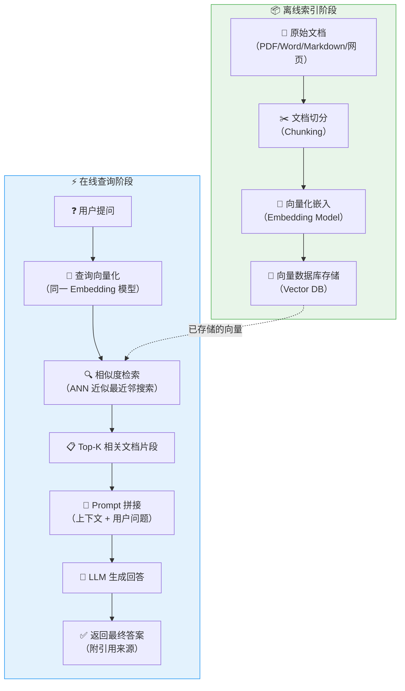
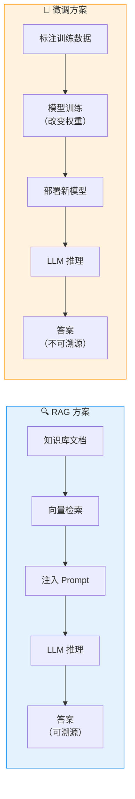
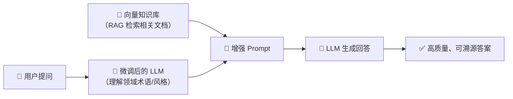

# RAG（检索增强生成）原理详解

> **检索增强生成（Retrieval-Augmented Generation, RAG）** 是一种将信息检索与文本生成相结合的技术架构，旨在让大语言模型（LLM）在生成回答时，能够动态地引用外部知识库中的相关信息，从而显著提升回答的准确性和时效性。

---

## RAG 完整架构流程

RAG 的核心思想是：**先检索、后增强、再生成**。整个流程分为离线索引阶段和在线查询阶段两大环节。

### 各阶段详解

#### 阶段一：文档加载与解析
- 支持多种格式：PDF、Word、Markdown、HTML、数据库记录等
- ⭐ **关键点**：保留文档结构信息（标题层级、段落边界）

#### 阶段二：文档切分（Chunking）
- 将长文档切分为合理大小的文本块
- 常见策略：固定长度切分、语义切分、递归切分
- ⭐ **关键点**：Chunk 大小直接影响检索精度，典型值 256~1024 tokens，需设置 overlap（重叠窗口）保证语义连续性

#### 阶段三：向量化嵌入（Embedding）
- 使用嵌入模型将文本转换为高维向量
- 常见模型：OpenAI text-embedding-3、BGE、M3E、Jina Embeddings
- ⭐ **关键点**：查询和文档必须使用**同一个**嵌入模型

#### 阶段四：向量检索（Retrieval）
- 将用户查询向量化后在向量数据库中执行相似度搜索
- 支持 Top-K 返回、相似度阈值过滤
- ⭐ **关键点**：K 值不宜过大（通常 3~10），过多无关上下文会稀释 LLM 注意力

#### 阶段五：上下文增强（Augmentation）
- 将检索到的文档片段拼接到 Prompt 中
- 通常格式：`基于以下参考资料回答问题：\n{context}\n\n问题：{query}`

#### 阶段六：生成回答（Generation）
- LLM 基于增强后的 Prompt 生成最终答案
- 可要求 LLM 注明引用来源

---

## RAG vs 微调 对比

| 维度 | RAG（检索增强生成） | 微调（Fine-tuning） |
|------|---------------------|---------------------|
| **核心原理** | 动态检索外部知识，注入 Prompt | 通过训练改变模型权重参数 |
| **知识更新** | ⭐ 实时更新，只需更新向量库 | 需要重新训练，成本高 |
| **可解释性** | ⭐ 可追溯引用的具体文档片段 | 黑盒，难以解释推理来源 |
| **幻觉控制** | ⭐ 有据可查，大幅降低幻觉 | 仍可能产生幻觉 |
| **成本** | 较低（检索+推理） | 较高（需 GPU 训练） |
| **适用场景** | 知识密集型、实时信息查询 | 风格定制、领域专业术语 |
| **数据需求** | 需要高质量知识库文档 | 需要标注训练数据 |
| **延迟** | 增加检索环节延迟（ms级） | 纯推理，无额外延迟 |
| **领域适应性** | 通过更换知识库快速切换 | 每个领域需单独训练 |

---

## 何时用 RAG？何时用微调？

### ⭐ 优先使用 RAG 的场景

::: tip RAG 最佳实践场景
| 场景 | 说明 |
|------|------|
| **企业知识库问答** | 内部文档、制度规范、产品手册等需要频繁更新 |
| **实时信息查询** | 新闻、股价、天气等时效性强的信息 |
| **法律法规查询** | 法条引用的准确性和可溯源是硬性要求 |
| **多租户知识隔离** | 不同客户的知识库完全隔离，互不干扰 |
| **零样本冷启动** | 没有标注数据，仅有文档即可上线 |
| **合规审计** | 需要清晰展示"这个答案来自哪份文件" |
:::

### ⭐ 优先使用微调的场景

::: warning 微调适用场景
| 场景 | 说明 |
|------|------|
| **特定写作风格** | 让模型模仿特定的语气、文风（如法律文书、诗歌） |
| **专业术语内化** | 医疗、法律、金融等领域的专有名词和表达习惯 |
| **特定输出格式** | 严格遵循某种 JSON Schema 或结构化输出 |
| **推理范式定制** | Chain-of-Thought、ReAct 等推理模式的固化 |
| **多语言翻译风格** | 特定领域的翻译风格调整 |
:::

### ⭐ 组合策略：RAG + 微调

实际生产环境中，最优方案往往是**两者结合**：

| 组合方式 | 说明 |
|----------|------|
| **先微调、再 RAG** | 微调让模型理解领域术语，RAG 提供最新知识 |
| **先 RAG、再微调** | RAG 生成高质量训练数据，再用这些数据微调模型 |

---

## 面试常见问题

### Q1：RAG 的核心挑战是什么？

1. **检索质量瓶颈**：检索不到相关文档，再好的 LLM 也白搭
2. **上下文窗口限制**：LLM 的 context window 有限，检索出的文档不能太多
3. **答案漂移**：检索到的无关文档可能误导 LLM
4. **延迟叠加**：检索 + LLM 推理 = 更高的端到端延迟

### Q2：如何提升 RAG 检索质量？

- ⭐ **混合检索**（Hybrid Search）：向量检索 + 关键词检索（BM25），取两者并集或加权排序
- ⭐ **重排序**（Re-ranking）：用 Cross-Encoder 对初检结果精排
- **查询改写**（Query Rewriting）：用 LLM 优化用户查询表达
- **多路召回**：稀疏检索 + 稠密检索 + 图谱检索等多路并行
- **Chunk 优化**：调整切分大小、overlap 策略、添加摘要索引

### Q3：RAG 和长上下文 LLM（如 128K tokens）如何选择？

- 长上下文 LLM：适合**单次、少量文档**的分析任务（如分析一篇长论文）
- RAG：适合**大规模知识库**的精准检索（如检索数万份文档中的相关段落）
- ⭐ **最佳实践**：两者非互斥，RAG 检索到的片段 + 长上下文窗口 = 更多有效信息

### Q4：文档切分（Chunking）有哪些策略？

| 策略 | 说明 | 适用场景 |
|------|------|----------|
| 固定长度切分 | 按 token 数等长切分 | 通用场景 |
| 语义切分 | 按段落、章节自然划分 | 结构化文档 |
| 递归切分 | 先按大分隔符（段落），再按小分隔符（句子） | 混合类型文档 |
| 句子级切分 | 以句号为边界 | 问答对、FAQ |

---

## 实战建议

::: info 实战清单
1. ✅ **选型前先评估**：明确是知识密集型任务还是风格/推理范式定制
2. ✅ **从小规模开始**：先用 100 份文档跑通 RAG 全流程，再逐步扩展
3. ✅ **监控检索质量**：建立检索命中率、答案准确率的评估体系
4. ✅ **迭代优化**：检索策略不是一劳永逸，需要根据反馈持续调优
5. ✅ **考虑混合方案**：RAG + 微调 往往是最优解
6. ✅ **关注安全**：RAG 知识库可能包含敏感信息，注意权限控制和数据隔离
:::

---

## 参考资料

- [Retrieval-Augmented Generation for Knowledge-Intensive NLP Tasks (原始论文)](https://arxiv.org/abs/2005.11401)
- LangChain / LlamaIndex RAG 官方文档
- OpenAI RAG Best Practices