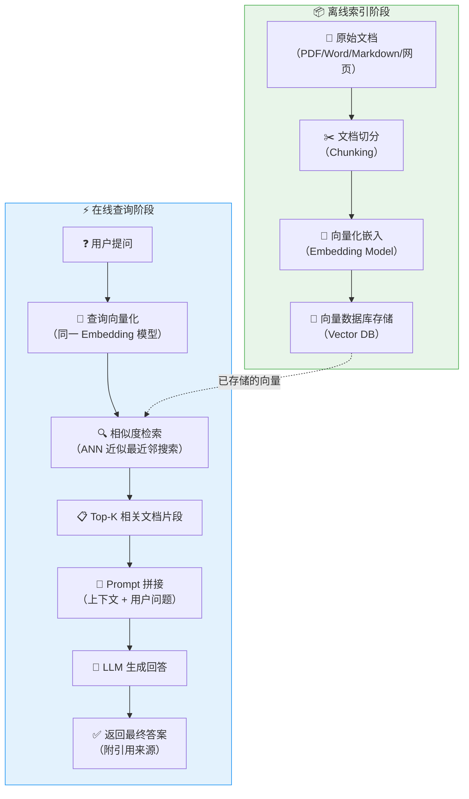
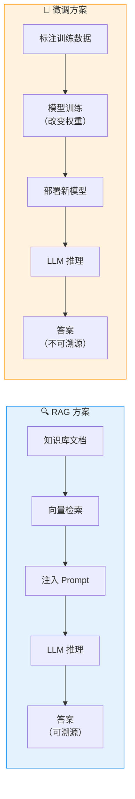
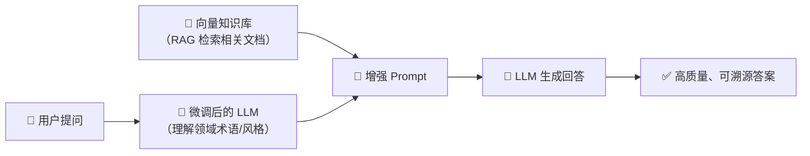

# RAG（检索增强生成）原理详解

> **检索增强生成（Retrieval-Augmented Generation, RAG）** 是一种将信息检索与文本生成相结合的技术架构，旨在让大语言模型（LLM）在生成回答时，能够动态地引用外部知识库中的相关信息，从而显著提升回答的准确性和时效性。

---

## RAG 完整架构流程

RAG 的核心思想是：**先检索、后增强、再生成**。整个流程分为离线索引阶段和在线查询阶段两大环节。

### 各阶段详解

#### 阶段一：文档加载与解析
- 支持多种格式：PDF、Word、Markdown、HTML、数据库记录等
- ⭐ **关键点**：保留文档结构信息（标题层级、段落边界）

#### 阶段二：文档切分（Chunking）
- 将长文档切分为合理大小的文本块
- 常见策略：固定长度切分、语义切分、递归切分
- ⭐ **关键点**：Chunk 大小直接影响检索精度，典型值 256~1024 tokens，需设置 overlap（重叠窗口）保证语义连续性

#### 阶段三：向量化嵌入（Embedding）
- 使用嵌入模型将文本转换为高维向量
- 常见模型：OpenAI text-embedding-3、BGE、M3E、Jina Embeddings
- ⭐ **关键点**：查询和文档必须使用**同一个**嵌入模型

#### 阶段四：向量检索（Retrieval）
- 将用户查询向量化后在向量数据库中执行相似度搜索
- 支持 Top-K 返回、相似度阈值过滤
- ⭐ **关键点**：K 值不宜过大（通常 3~10），过多无关上下文会稀释 LLM 注意力

#### 阶段五：上下文增强（Augmentation）
- 将检索到的文档片段拼接到 Prompt 中
- 通常格式：`基于以下参考资料回答问题：\n{context}\n\n问题：{query}`

#### 阶段六：生成回答（Generation）
- LLM 基于增强后的 Prompt 生成最终答案
- 可要求 LLM 注明引用来源

---

## RAG vs 微调 对比

| 维度 | RAG（检索增强生成） | 微调（Fine-tuning） |
|------|---------------------|---------------------|
| **核心原理** | 动态检索外部知识，注入 Prompt | 通过训练改变模型权重参数 |
| **知识更新** | ⭐ 实时更新，只需更新向量库 | 需要重新训练，成本高 |
| **可解释性** | ⭐ 可追溯引用的具体文档片段 | 黑盒，难以解释推理来源 |
| **幻觉控制** | ⭐ 有据可查，大幅降低幻觉 | 仍可能产生幻觉 |
| **成本** | 较低（检索+推理） | 较高（需 GPU 训练） |
| **适用场景** | 知识密集型、实时信息查询 | 风格定制、领域专业术语 |
| **数据需求** | 需要高质量知识库文档 | 需要标注训练数据 |
| **延迟** | 增加检索环节延迟（ms级） | 纯推理，无额外延迟 |
| **领域适应性** | 通过更换知识库快速切换 | 每个领域需单独训练 |

---

## 何时用 RAG？何时用微调？

### ⭐ 优先使用 RAG 的场景

::: tip RAG 最佳实践场景
| 场景 | 说明 |
|------|------|
| **企业知识库问答** | 内部文档、制度规范、产品手册等需要频繁更新 |
| **实时信息查询** | 新闻、股价、天气等时效性强的信息 |
| **法律法规查询** | 法条引用的准确性和可溯源是硬性要求 |
| **多租户知识隔离** | 不同客户的知识库完全隔离，互不干扰 |
| **零样本冷启动** | 没有标注数据，仅有文档即可上线 |
| **合规审计** | 需要清晰展示"这个答案来自哪份文件" |
:::

### ⭐ 优先使用微调的场景

::: warning 微调适用场景
| 场景 | 说明 |
|------|------|
| **特定写作风格** | 让模型模仿特定的语气、文风（如法律文书、诗歌） |
| **专业术语内化** | 医疗、法律、金融等领域的专有名词和表达习惯 |
| **特定输出格式** | 严格遵循某种 JSON Schema 或结构化输出 |
| **推理范式定制** | Chain-of-Thought、ReAct 等推理模式的固化 |
| **多语言翻译风格** | 特定领域的翻译风格调整 |
:::

### ⭐ 组合策略：RAG + 微调

实际生产环境中，最优方案往往是**两者结合**：

| 组合方式 | 说明 |
|----------|------|
| **先微调、再 RAG** | 微调让模型理解领域术语，RAG 提供最新知识 |
| **先 RAG、再微调** | RAG 生成高质量训练数据，再用这些数据微调模型 |

---

## 面试常见问题

### Q1：RAG 的核心挑战是什么？

1. **检索质量瓶颈**：检索不到相关文档，再好的 LLM 也白搭
2. **上下文窗口限制**：LLM 的 context window 有限，检索出的文档不能太多
3. **答案漂移**：检索到的无关文档可能误导 LLM
4. **延迟叠加**：检索 + LLM 推理 = 更高的端到端延迟

### Q2：如何提升 RAG 检索质量？

- ⭐ **混合检索**（Hybrid Search）：向量检索 + 关键词检索（BM25），取两者并集或加权排序
- ⭐ **重排序**（Re-ranking）：用 Cross-Encoder 对初检结果精排
- **查询改写**（Query Rewriting）：用 LLM 优化用户查询表达
- **多路召回**：稀疏检索 + 稠密检索 + 图谱检索等多路并行
- **Chunk 优化**：调整切分大小、overlap 策略、添加摘要索引

### Q3：RAG 和长上下文 LLM（如 128K tokens）如何选择？

- 长上下文 LLM：适合**单次、少量文档**的分析任务（如分析一篇长论文）
- RAG：适合**大规模知识库**的精准检索（如检索数万份文档中的相关段落）
- ⭐ **最佳实践**：两者非互斥，RAG 检索到的片段 + 长上下文窗口 = 更多有效信息

### Q4：文档切分（Chunking）有哪些策略？

| 策略 | 说明 | 适用场景 |
|------|------|----------|
| 固定长度切分 | 按 token 数等长切分 | 通用场景 |
| 语义切分 | 按段落、章节自然划分 | 结构化文档 |
| 递归切分 | 先按大分隔符（段落），再按小分隔符（句子） | 混合类型文档 |
| 句子级切分 | 以句号为边界 | 问答对、FAQ |

---

## 实战建议

::: info 实战清单
1. ✅ **选型前先评估**：明确是知识密集型任务还是风格/推理范式定制
2. ✅ **从小规模开始**：先用 100 份文档跑通 RAG 全流程，再逐步扩展
3. ✅ **监控检索质量**：建立检索命中率、答案准确率的评估体系
4. ✅ **迭代优化**：检索策略不是一劳永逸，需要根据反馈持续调优
5. ✅ **考虑混合方案**：RAG + 微调 往往是最优解
6. ✅ **关注安全**：RAG 知识库可能包含敏感信息，注意权限控制和数据隔离
:::

---

## 参考资料

- [Retrieval-Augmented Generation for Knowledge-Intensive NLP Tasks (原始论文)](https://arxiv.org/abs/2005.11401)
- LangChain / LlamaIndex RAG 官方文档
- OpenAI RAG Best Practices

---

## 面试高频题

### Q1: RAG 架构中，离线索引阶段和在线查询阶段分别承担什么职责？它们之间如何解耦？

**详细答案：** 离线索引阶段是 RAG 系统的"数据准备"环节，负责将原始文档转化为可检索的向量索引。具体流程包括：文档加载与解析（支持 PDF、Word、Markdown 等多种格式）、文档切分（将长文档按策略切分为合理的文本块）、向量化嵌入（使用 Embedding 模型将文本块转换为高维向量）、向量存储（将向量持久化到向量数据库中）。这个阶段的关键设计考量是：索引构建的频率是批量的（可以每天/每周重建），对实时性要求不高，但需要保证索引质量。离线阶段产出的向量索引是后续在线查询的基础，其质量直接决定了检索效果的上限。

在线查询阶段是 RAG 系统的"服务"环节，负责实时响应用户查询。流程包括：查询向量化（使用与离线阶段相同的 Embedding 模型）、相似度检索（在向量数据库中执行 ANN 搜索）、Top-K 结果获取、上下文增强（将检索到的文档片段拼接到 Prompt 中）、LLM 生成回答。两个阶段通过"向量数据库"解耦——离线阶段负责写入，在线阶段负责读取，彼此独立运行。这种解耦设计意味着知识库的更新（添加新文档、删除旧文档）不需要重启在线服务，只需更新向量数据库即可，实现了真正意义上的"热更新"。

### Q2: RAG 与长上下文 LLM（如 128K tokens）应该如何选择？两者能否结合使用？

**详细答案：** RAG 和长上下文 LLM 解决的是不同层面的问题，它们并非互斥关系，而是互补关系。长上下文 LLM 的优势在于可以在单次推理中处理整篇文档，适合"单次、少量文档"的分析场景——例如分析一篇 50 页的学术论文、审阅一份完整的合同。在这些场景下，直接把全文塞进上下文窗口，LLM 可以理解全局结构和跨段落的逻辑关系，效果优于 RAG 的碎片化检索。但长上下文 LLM 的局限性在于：当知识库有数万份文档时，不可能把所有文档都塞进窗口；而且长上下文意味着更高的 Token 消耗和推理延迟。

RAG 的优势在于"精准检索"——从海量知识库中只提取最相关的几个片段，Token 消耗可控，且能明确标注答案来源。最佳实践是将两者结合：用 RAG 从大规模知识库中检索 Top-K 相关片段，然后利用长上下文 LLM 的大窗口优势，将检索到的片段连同更多上下文（如相邻段落、文档元数据）一起注入 Prompt。这样既保留了 RAG 的精准检索能力，又利用了长上下文窗口的"全局理解"优势。此外，长上下文 LLM 还可以作为 RAG 的"降级策略"——当检索结果为空或置信度不足时，可以回退到让 LLM 基于自身知识回答。

### Q3: 文档切分（Chunking）策略对 RAG 系统的检索质量有何影响？如何选择 Chunk 大小和 Overlap？

**详细答案：** 文档切分是 RAG 系统中影响检索质量最关键的因素之一。Chunk 大小直接决定了检索的"粒度"：Chunk 过小（如 128 tokens），每个片段包含的信息太少，检索时虽然精确但可能丢失上下文，导致 LLM 无法理解完整语义；Chunk 过大（如 2048 tokens），每个片段包含的信息丰富但不够精准，可能检索到包含大量无关内容的片段，稀释 LLM 的注意力。典型的最佳实践是 256~1024 tokens，这个范围在大多数场景下能够平衡精确性和完整性。

Overlap（重叠窗口）的设置同样重要。当按固定长度切分时，一个完整的句子或段落可能被切分到两个不同的 Chunk 中，导致语义断裂。设置 10%~20% 的 Overlap（如 Chunk 512 tokens + Overlap 50 tokens）可以保证相邻 Chunk 之间的语义连续性，避免"一句话被切成两半"的问题。切分策略的选择也需要根据文档类型调整：对于结构化文档（如技术手册），语义切分（按标题、段落）效果更好；对于非结构化文档，递归切分（先按段落再按句子）是通用性最强的方案；对于 FAQ 类文档，句子级切分更合适。最佳实践是先用固定策略建立基线，然后通过 A/B 测试验证不同 Chunk 大小对检索指标（Recall@K、MRR）的影响。

### Q4: RAG 系统中，检索质量不佳的主要表现有哪些？如何诊断和优化？

**详细答案：** 检索质量不佳的典型表现包括三种情况。第一是"检索不到"——相关文档存在于知识库中，但检索结果中没有返回。这通常是因为 Embedding 模型对特定领域的语义理解不够，或者查询与文档之间的语义鸿沟太大。第二是"检索到无关内容"——返回的 Top-K 中包含与问题无关的文档片段，这会导致 LLM 被误导，产生"答案漂移"。第三是"检索到重复/冗余内容"——多个 Chunk 包含几乎相同的信息，浪费了有限的上下文窗口。

诊断检索质量需要建立量化的评估体系。首先，准备一个包含 20-50 个标准 QA 对的评估集，每个问题标注相关的文档 ID。然后计算 Recall@K（前 K 个结果中包含相关文档的比例）和 MRR（第一个相关文档排名的倒数均值）。如果 Recall@K 偏低，问题出在 Embedding 或索引环节；如果 MRR 偏低但 Recall@K 还不错，问题出在排序环节。优化策略按优先级排列：首先尝试混合检索（向量检索 + BM25 关键词检索），这是性价比最高的提升手段；其次引入 Rerank（使用 Cross-Encoder 对初检结果精排）；再次进行查询改写（用 LLM 优化用户的原始查询，补充同义词、扩展缩写）；最后考虑调整 Chunk 策略或更换 Embedding 模型。

### Q5: 在生产环境中，如何评估一个 RAG 系统的整体效果？关键评估指标有哪些？

**详细答案：** 生产环境中评估 RAG 系统需要从三个维度入手：检索质量、生成质量和端到端体验。检索质量评估聚焦于"检索到的文档是否相关、是否全面"，核心指标包括 Recall@K（检索覆盖率）、MRR（首个相关结果排名）、NDCG（排序质量）。生成质量评估关注"LLM 生成的答案是否准确、是否忠实于检索到的文档"，核心指标包括 Faithfulness（忠实度——答案是否完全基于检索到的上下文，没有编造）、Answer Relevancy（答案相关性——答案是否直接回答了问题）、Context Precision（上下文精确度——检索到的上下文中有多少是真正有用的）。

在实际操作中，推荐使用 RAGAS 框架进行自动化评估。RAGAS 提供了上述指标的自动化计算能力，只需提供问题、答案、检索上下文和（可选的）ground truth，即可输出量化分数。除此之外，还需要建立人工评估流程：定期抽取线上回答，由业务专家进行打分（1-5 分），关注"答案是否可用"而非"答案是否完美"。最后，端到端体验指标包括 P95 延迟（从用户提问到返回答案的 95 分位延迟）、用户反馈率（点赞/点踩比例）、问题解决率（用户是否因为答案而结束了对话）。一个好的 RAG 系统应该在这三个维度上都达到可接受的水平，而不是只追求单一指标。

### Q6: RAG 与微调的组合策略在实际项目中如何落地？

**详细答案：** RAG 与微调的组合策略在实际项目中通常有两种落地路径。路径一是"先微调、再 RAG"：首先用领域数据微调 LLM，让模型理解该领域的专业术语、表达习惯和推理范式。例如，一个医疗问答系统可以先用药学教材、病历数据微调基础模型，使其具备医学知识"语感"。然后在此基础上叠加 RAG，用向量数据库提供最新的临床指南、药品说明书等动态知识。这种方式的好处是微调后的模型对检索到的文档理解更准确，能够更好地将领域知识与检索到的上下文融合。

路径二是"先 RAG、再微调"：先用 RAG 系统运行一段时间，收集真实用户问题和模型回答，然后由人工标注高质量的 QA 对。这些 QA 对可以作为微调的训练数据，训练模型内化知识库中的高频问题。这种方式的好处是训练数据来自真实场景，微调的目标更加明确。在实际项目中，选择哪种路径取决于数据条件：如果有大量现成的领域标注数据，优先走路径一；如果只有文档没有标注数据，先走路径二，用 RAG 跑通后积累训练数据。无论哪种路径，核心原则是：微调负责"语言风格和领域理解"，RAG 负责"实时知识和可溯源引用"，两者各司其职、协同工作。

---

## 参考资料

- [Retrieval-Augmented Generation for Knowledge-Intensive NLP Tasks (原始论文)](https://arxiv.org/abs/2005.11401)
- LangChain / LlamaIndex RAG 官方文档
- OpenAI RAG Best Practices
- [RAGAS 评估框架](https://docs.ragas.io)