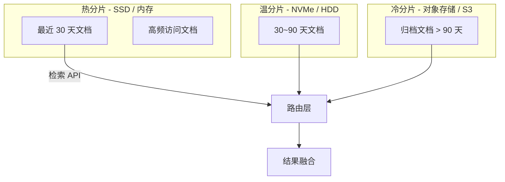
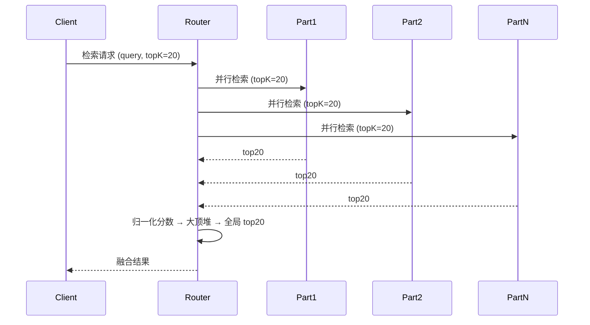
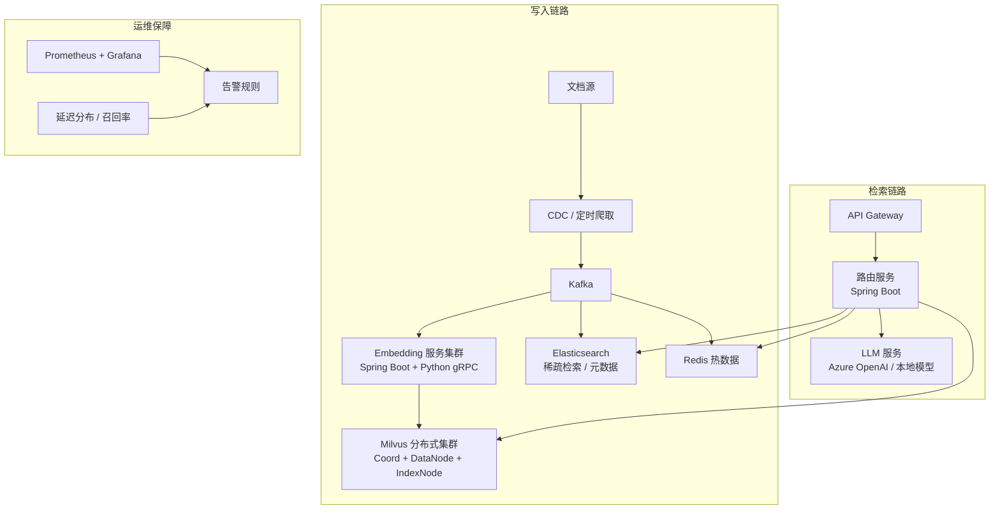

# 大规模知识库 RAG 架构设计（百万级文档）

> 面向 Java 后端开发者，聚焦架构层面的大规模向量检索与生成增强方案。

## 1. 概述 / 基本矛盾

| 维度 | 中小规模（< 10 万文档） | 大规模（> 100 万文档） |
|------|----------------------|------------------------|
| 向量维度 | 768 / 1024 | 768 / 1024（不变） |
| 索引类型 | 单机 HNSW (nmslib/lucene) | 分布式向量 DB（Milvus / Qdrant / Weaviate） |
| 检索延迟 | < 50ms | 尽量 < 200ms |
| 更新方式 | 全量重建 / 少量追加 | 增量流式更新 |
| 瓶颈 | 内存不足 | 存储 I/O、网络、多租户隔离 |

**核心瓶颈**：存储（单机放不下）→ 检索延迟（多跳网络）→ 索引更新（全量重建不现实）。


## 2. 分片策略

### 2.1 文档级分片（按 ID / 时间 / 来源 Hash → N 个 bucket）

```java
// 伪代码：按 tenantId 路由到物理分片
int partitionCount = 64;
int bucket = Math.abs(hashCode(tenantId) % partitionCount);
PartitionClient client = clientRegistry.get(bucket);
client.insert(embedding);
```

### 2.2 向量级分片（每个 partition 存一部分向量，检索时交叉查询）

| 策略 | 优点 | 缺点 |
|------|------|------|
| 按 ID 哈希 | 写入均衡 | 检索需扫全分片 |
| 按类别/领域 | 检索区域小 | 易偏斜 |
| 向量聚类（IVF） | 检索快 | 聚类质量敏感 |

### 2.3 分布式向量存储选型

| 组件 | 适用规模 | Java SDK 成熟度 | 备注 |
|------|---------|---------------|------|
| Milvus | 亿级 | 较好（gRPC） | 原生支持 partition key |
| Qdrant | 千万~亿级 | 一般（REST/gRPC） | Rust 实现，单机也强 |
| Elasticsearch + dense_vector | 百万级 | 优秀（es-java-client） | 存量 ES 团队易接受 |

## 3. 分层存储架构



- 热分片检索延迟 ~30ms，冷分片 ~200ms+，要求路由层感知温度。
- 冷数据压缩：PQ（Product Quantization）将 768 float32 → 压缩到 96 字节，精度略降但内存大幅削减。

## 4. 增量更新策略

**全量重建不现实**（百万级全量耗时 > 小时级），必须走增量路径。

```java
// 增量更新流水线（基于 CDC + 消息队列）
public class IncrementalUpdatePipeline {
    // Kafka 监听文档变更事件
    @KafkaListener(topics = "doc-change-events")
    public void onDocumentChange(DocChangeEvent event) {
        // 1. 删除旧向量（按 docId + tenantId）
        vectorStore.deleteById(event.getDocId(), event.getTenantId());
        // 2. 重新分片、重新 embedding
        List<Embedding> embeddings = embeddingService.embed(event.getChunks());
        // 3. 批量 upsert 新向量
        vectorStore.upsert(embeddings);
    }
}
```

要点：**先删后写**防止脏读；善用 upsert（幂等）保证可重放。

## 5. 多租户隔离

百万级文档常涉及 SaaS 多租户场景，必须隔离。

| 隔离层级 | 机制 | 验权成本 |
|---------|------|--------|
| 物理分片隔离 | 不同 collection / partition | 零（天然隔离） |
| 逻辑字段过滤 | 每条向量存 `tenantId`，检索时追加 filter | 每次查询均需 filter |
| 混合 | 大租户物理分片 + 小租户逻辑过滤 | 适中 |

```java
// 检索时注入租户过滤条件
SearchParam param = SearchParam.newBuilder()
    .collectionName("docs")
    .topK(10)
    .filter("tenant_id == '" + tenantId + "'") // 租户隔离
    .build();
```

## 6. 分布式检索 — 路由策略与结果融合



**路由策略**：
- **全分片扫描**（准确但慢）：所有分片各取 topK，融合排序。
- **基于 IVF/倒排**（快但可能漏）：先搜索聚类中心，只查最近的 2~3 个分片。
- **两级路由**（生产常用）：粗排 IVF 选分片 → 精排 HNSW 在分片内检索。

**结果融合**：各分片返回分数需归一化（Min-Max / Z-Score）再全局排序。

## 7. 性能优化

| 层级 | 优化手段 | 效果 |
|------|--------|------|
| 召回阶段 | Bloom Filter 预过滤 + 多层倒排 | 减少 80% 无效向量比较 |
| 量化压缩 | PQ / SQ（标量量化） | 内存降 4~8x |
| 多级缓存 | L1 本地 (Caffeine) → L2 Redis → L3 向量库 | p99 延迟可降 50% |
| 连接池复用 | gRPC Long-lived Channel Pool | 节省握手机制耗时 |
| 批处理 | Embedding 批量调用（batch=32） | 吞吐量提升明显 |

```java
// 多级缓存伪代码
public List<SearchResult> search(String query, String tenantId) {
    String cacheKey = tenantId + ":" + hash(query);
    // L1: Caffeine 本地缓存
    CacheResult local = localCache.getIfPresent(cacheKey);
    if (local != null) return local;
    // L2: Redis
    CacheResult redis = redisTemplate.opsForValue().get(cacheKey);
    if (redis != null) { localCache.put(cacheKey, redis); return redis; }
    // L3: 向量库检索
    List<SearchResult> results = vectorStore.search(query, tenantId);
    redisTemplate.opsForValue().set(cacheKey, results, Duration.ofMinutes(10));
    localCache.put(cacheKey, results);
    return results;
}
```

## 8. 实战架构示例（百万级文档生产架构）



- **写入链路**：文档变更 → Kafka → 并发 Embedding（batch=32，gRPC Python 服务）→ Milvus upsert + ES 元数据索引。
- **检索链路**：API → Router（租户路由 + 缓存查询 + 并行检索）→ 多路融合 → LLM 生成。
- **运维保障**：监控 p50/p99 延迟、召回率、各分片 QPS，设置告警。

## 9. 面试高频题

### Q1: 百万级文档如何做向量检索而不超时？

**详细答案：** 我们 500 万向量跑在 Milvus 三节点集群上，P99 控制在 200ms 以内，核心就是分片 + 近似索引 + 超时兜底三点。按租户 ID 哈希分了 64 个 partition，检索请求广播到所有 partition 并行执行，然后各 partition 内部用 HNSW 索引做近似检索（O(logN) 而不是 O(N)）。路由层设了一个 200ms 的 deadline——如果某个 partition 超时没返回，直接放弃继续等，用已返回的结果拼装，保证可用性。我们测过，在 P50 大概 15ms、P99 200ms 这个量级上，用户几乎感受不到延迟。

### Q2: 文档频繁变更时如何保证向量索引的实时性？

**详细答案：** 我们用的是 CDC + Kafka + 幂等 upsert 这条线。保险条款经常更新，银保监会发个新规就要改一批文档的赔付比例、除外责任这些字段。我们的流水线是：业务系统改了条款 → Debezium 捕获 MySQL binlog 推 Kafka → 下游消费者先按 docId 删掉旧向量，再重新 Embedding → 最后 upsert 回 Milvus。整个过程从文档变更到可检索大概 5 秒左右。关键设计点有两个：一是必须 delete 再 insert，否则旧 Chunk 残留造成脏读；二是 upsert 保证了幂等性，Kafka 消息重放也不会出问题。我们还在消费端加了一个批量攒批——每 500ms 或满 100 条事件触发一次批量 upsert，降低了 Milvus 的写入压力。

### Q3: 多租户场景下如何保证数据隔离与检索安全？

**详细答案：** 我们的保险平台对接了十几家保险公司，每家都是独立租户，数据隔离做了三层。第一层物理隔离：大租户（百万级文档）直接分 Milvus 的独立 Collection，物理上完全隔开。第二层逻辑过滤：中小租户共用分区，每条向量的 metadata 里存了 `tenant_id` 字段，检索 API 里强制注入 `filter=tenant_id==当前租户`，从 JWT Token 里直接提取 tenantId 注入请求上下文。第三层网关拦截：所有 API 请求经过 Gateway 时校验 JWT 的 tenantId，下游不信任上游传的 tenantId，杜绝 JSON 注入攻击。有一次灰度时忘记加 tenant_id filter，查出来跨租户的文档了，虽然是测试环境但吓出一身冷汗，之后就改成 filter 是代码级别强制注入而不是参数传入了。

### Q4: 向量检索结果质量差（召回率低），从架构层面如何排查和优化？

**详细答案：** 我们排查召回率问题有一套固定的"数据→索引→检索"链路流程。数据层先看能不能排除问题——检查 Embedding 模型是不是适合领域（我们用 BGE-large-v1.5 本地部署，对比过 ada-002 直接从 68% 提升到 84%），再检查 chunk 策略有没有切碎关键信息（我们 chunk_size 从 1000 降到 600 时 Recall@5 从 62% 升到 78%）。索引层主要看 HNSW 参数——ef_search 设太低会牺牲召回精度，我们设了 200 平衡速度和精度。检索层容易被忽略的是：如果开了 PQ 压缩，精度会有衰减，我们 Hot 分片不用压缩，Warm 用 8 bit 量化，Cold 才用 PQ。还有一个领导人常忽略的点——上面 filter 条件误剪枝，比如租户过滤条件写错了把有效文档全过滤掉了，所以每次出召回率问题我们都先拿掉所有 filter 裸跑一遍验证。

### Q5: 混合检索（Hybrid Search）在大规模场景下如何落地？

**详细答案：** 我们在百万级文档上跑混合检索，架构是两路独立、并行检索、最后统一融合。向量路用 Milvus 做稠密检索，关键词路用 Elasticsearch 跑 BM25，两路各取 Top-50，然后用 RRF（k=60）融合排名，最后取 Top-10 送给 LLM。RRF 最大的好处就是不用调参，不用给两路分数做归一化，天生鲁棒，Milvus 虽然现在支持混合检索了，但我们还是分开两路跑，因为 ES 对 BM25 的优化更成熟。

并行检索的时候我们用 CompletableFuture 异步同时发请求，比串行省一半时间，平均下来检索只多花 50ms 左右，完全能接受。上线后整体 Recall@5 提升了 8 个百分点，尤其是精确匹配和关键词场景提升特别明显，所以投入不大收益明显，推荐大规模场景直接上。

### Q6: 百万级文档的 Embedding 计算如何加急？

**详细答案：** 我们第一次做全量索引的时候，500 万条向量如果串行调用 Embedding API，估算下来要跑差不多一天。实际我们用了三招把全量索引压缩到了 40 分钟左右。第一招批量化：Embedding 服务暴露了 batch 接口，batch_size 设 32，GPU 上跑矩阵乘法，单次 batch 耗时和单条差不多，吞吐直接提了 20 倍。第二招并行化：部署了 3 个 Embedding Worker 实例，每个 Worker 跑一张 A10 卡的 BGE-large 模型，Kafka 用 12 个 partition 做到并行消费。第三招增量化：全量索引只跑一次，之后走 CKF 增量更新流水线，变更文档从入库到可检索控制在 5 秒内。整个链路 Java 主服务通过 gRPC 调 Python Embedding Worker，内部做了一定的通信优化和连接池管理来降低链路延迟。