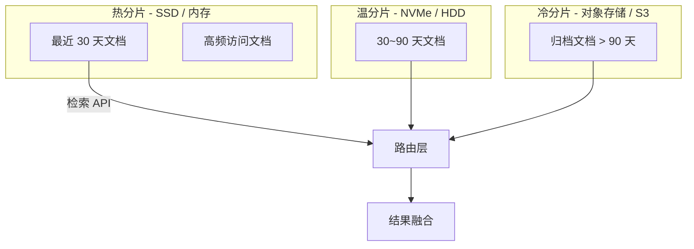
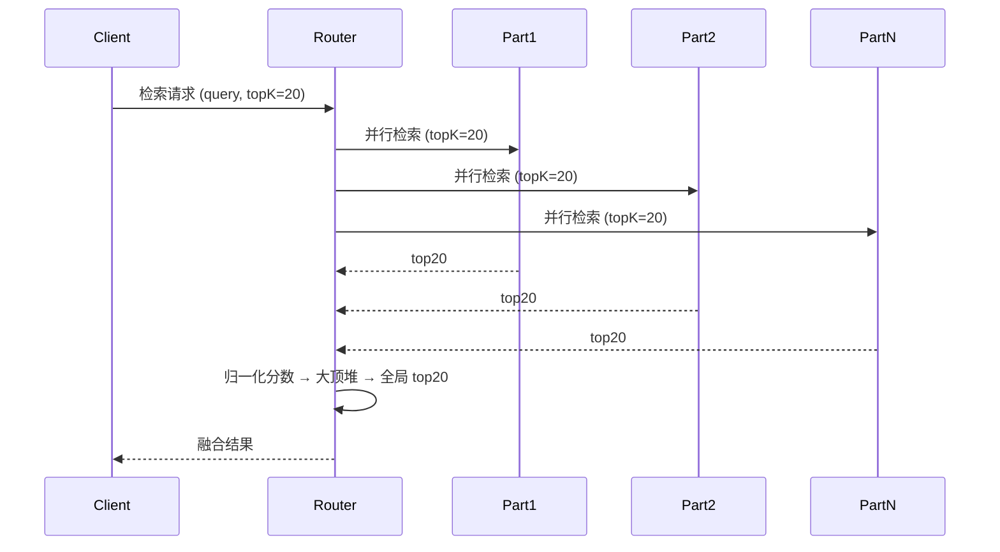
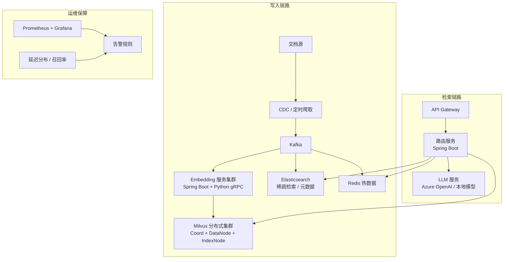

# 大规模知识库 RAG 架构设计（百万级文档）

> 面向 Java 后端开发者，聚焦架构层面的大规模向量检索与生成增强方案。

## 1. 概述 / 基本矛盾

| 维度 | 中小规模（< 10 万文档） | 大规模（> 100 万文档） |
|------|----------------------|------------------------|
| 向量维度 | 768 / 1024 | 768 / 1024（不变） |
| 索引类型 | 单机 HNSW (nmslib/lucene) | 分布式向量 DB（Milvus / Qdrant / Weaviate） |
| 检索延迟 | < 50ms | 尽量 < 200ms |
| 更新方式 | 全量重建 / 少量追加 | 增量流式更新 |
| 瓶颈 | 内存不足 | 存储 I/O、网络、多租户隔离 |

**核心瓶颈**：存储（单机放不下）→ 检索延迟（多跳网络）→ 索引更新（全量重建不现实）。


## 2. 分片策略

### 2.1 文档级分片（按 ID / 时间 / 来源 Hash → N 个 bucket）

```java
// 伪代码：按 tenantId 路由到物理分片
int partitionCount = 64;
int bucket = Math.abs(hashCode(tenantId) % partitionCount);
PartitionClient client = clientRegistry.get(bucket);
client.insert(embedding);
```

### 2.2 向量级分片（每个 partition 存一部分向量，检索时交叉查询）

| 策略 | 优点 | 缺点 |
|------|------|------|
| 按 ID 哈希 | 写入均衡 | 检索需扫全分片 |
| 按类别/领域 | 检索区域小 | 易偏斜 |
| 向量聚类（IVF） | 检索快 | 聚类质量敏感 |

### 2.3 分布式向量存储选型

| 组件 | 适用规模 | Java SDK 成熟度 | 备注 |
|------|---------|---------------|------|
| Milvus | 亿级 | 较好（gRPC） | 原生支持 partition key |
| Qdrant | 千万~亿级 | 一般（REST/gRPC） | Rust 实现，单机也强 |
| Elasticsearch + dense_vector | 百万级 | 优秀（es-java-client） | 存量 ES 团队易接受 |

## 3. 分层存储架构



- 热分片检索延迟 ~30ms，冷分片 ~200ms+，要求路由层感知温度。
- 冷数据压缩：PQ（Product Quantization）将 768 float32 → 压缩到 96 字节，精度略降但内存大幅削减。

## 4. 增量更新策略

**全量重建不现实**（百万级全量耗时 > 小时级），必须走增量路径。

```java
// 增量更新流水线（基于 CDC + 消息队列）
public class IncrementalUpdatePipeline {
    // Kafka 监听文档变更事件
    @KafkaListener(topics = "doc-change-events")
    public void onDocumentChange(DocChangeEvent event) {
        // 1. 删除旧向量（按 docId + tenantId）
        vectorStore.deleteById(event.getDocId(), event.getTenantId());
        // 2. 重新分片、重新 embedding
        List<Embedding> embeddings = embeddingService.embed(event.getChunks());
        // 3. 批量 upsert 新向量
        vectorStore.upsert(embeddings);
    }
}
```

要点：**先删后写**防止脏读；善用 upsert（幂等）保证可重放。

## 5. 多租户隔离

百万级文档常涉及 SaaS 多租户场景，必须隔离。

| 隔离层级 | 机制 | 验权成本 |
|---------|------|--------|
| 物理分片隔离 | 不同 collection / partition | 零（天然隔离） |
| 逻辑字段过滤 | 每条向量存 `tenantId`，检索时追加 filter | 每次查询均需 filter |
| 混合 | 大租户物理分片 + 小租户逻辑过滤 | 适中 |

```java
// 检索时注入租户过滤条件
SearchParam param = SearchParam.newBuilder()
    .collectionName("docs")
    .topK(10)
    .filter("tenant_id == '" + tenantId + "'") // 租户隔离
    .build();
```

## 6. 分布式检索 — 路由策略与结果融合



**路由策略**：
- **全分片扫描**（准确但慢）：所有分片各取 topK，融合排序。
- **基于 IVF/倒排**（快但可能漏）：先搜索聚类中心，只查最近的 2~3 个分片。
- **两级路由**（生产常用）：粗排 IVF 选分片 → 精排 HNSW 在分片内检索。

**结果融合**：各分片返回分数需归一化（Min-Max / Z-Score）再全局排序。

## 7. 性能优化

| 层级 | 优化手段 | 效果 |
|------|--------|------|
| 召回阶段 | Bloom Filter 预过滤 + 多层倒排 | 减少 80% 无效向量比较 |
| 量化压缩 | PQ / SQ（标量量化） | 内存降 4~8x |
| 多级缓存 | L1 本地 (Caffeine) → L2 Redis → L3 向量库 | p99 延迟可降 50% |
| 连接池复用 | gRPC Long-lived Channel Pool | 节省握手机制耗时 |
| 批处理 | Embedding 批量调用（batch=32） | 吞吐量提升明显 |

```java
// 多级缓存伪代码
public List<SearchResult> search(String query, String tenantId) {
    String cacheKey = tenantId + ":" + hash(query);
    // L1: Caffeine 本地缓存
    CacheResult local = localCache.getIfPresent(cacheKey);
    if (local != null) return local;
    // L2: Redis
    CacheResult redis = redisTemplate.opsForValue().get(cacheKey);
    if (redis != null) { localCache.put(cacheKey, redis); return redis; }
    // L3: 向量库检索
    List<SearchResult> results = vectorStore.search(query, tenantId);
    redisTemplate.opsForValue().set(cacheKey, results, Duration.ofMinutes(10));
    localCache.put(cacheKey, results);
    return results;
}
```

## 8. 实战架构示例（百万级文档生产架构）



- **写入链路**：文档变更 → Kafka → 并发 Embedding（batch=32，gRPC Python 服务）→ Milvus upsert + ES 元数据索引。
- **检索链路**：API → Router（租户路由 + 缓存查询 + 并行检索）→ 多路融合 → LLM 生成。
- **运维保障**：监控 p50/p99 延迟、召回率、各分片 QPS，设置告警。

## 9. 面试高频题

### Q1: 百万级文档如何做向量检索而不超时？

**详细答案：**

核心思路是“分而治之 + 多级近似”。首先采用分布式向量库（Milvus / Qdrant）将向量按 partition key 分片到多个 DataNode，检索请求广播到所有相关分片并行执行，单分片内使用 HNSW 或 IVF 近似索引，延迟从理论上的 O(N) 降到 O(logN)。其次，使用 IVF 聚类作为粗排，只检索最近的 2~3 个聚类中心的向量，避免全分片扫描。最后，在路由层设置 deadline（如 200ms），超时则返回已收集的部分结果，保证可用性。三层配合（分片 + 近似索引 + 超时兜底）即可在百万级规模下稳定控制在 200ms 以内。

### Q2: 文档频繁变更时如何保证向量索引的实时性？

**详细答案：**

采用“CDC + 消息队列 + 幂等 upsert”的增量更新流水线。当文档发生变更时，CDC（如 Debezium）捕获数据库 Binlog 或应用层主动推送 Kafka 事件，下游消费者解析事件后先按 docId 删除旧向量，再重新分片、重新 Embedding，最后执行 upsert 写入向量库。Milvus 等现代向量库支持 upsert 语义（存在则更新，不存在则插入），天然幂等，结合 Kafka 的至少一次语义和 offset 管理，可以保证最终一致性。对于高 QPS 场景，可引入批量 flush 机制（如每 500ms 或满 100 条触发一次批量 upsert），用微小延迟换取写入吞吐量。

### Q3: 多租户场景下如何保证数据隔离与检索安全？

**详细答案：**

多租户隔离分三层设计。第一层物理隔离：为大租户分配独立的 Milvus Collection 或 Partition，从存储层面天然隔绝。第二层逻辑过滤：中小租户共用分区，每条向量存储 `tenant_id` 字段，检索时在 search param 中强制注入 `tenant_id == <currentTenant>` 的过滤表达式，即使 query 向量碰巧与跨租户文档相似，也会被 filter 剪枝。第三层网关鉴权：API Gateway 从 JWT token 中提取 tenantId，注入请求上下文，所有下游服务（路由、向量库、LLM）均以 tenantId 作为一等公民参数，杜绝水平越权。三层协同保证即便在共享基础设施下也不会发生数据泄漏。

### Q4: 向量检索结果质量差（召回率低），从架构层面如何排查和优化？

**详细答案：**

排查遵循“数据 → 索引 → 检索”链路。数据层：检查 Embedding 模型是否与业务领域匹配（通用模型 vs 领域微调模型），分片策略是否合理（过粗导致信息密度低、过细导致上下文丢失），Chunk overlap 是否足够（建议 10%~20%）。索引层：检查 IVF 聚类数（nlist）是否与数据规模匹配（经验值 = sqrt(N) 的 4 倍左右），HNSW 的 M/efConstruction 参数是否偏小导致近似精度不足。检索层：确认 topK 取值是否过小、是否开启了 PQ 压缩导致精度衰减、filter 条件是否误剪枝了有效结果。优化方向包括：换用 BGE / M3E 等中文优化模型、调整聚类参数、topK 取值 50~100 然后交给 LLM 裁剪。

### Q5: 混合检索（Hybrid Search）在大规模场景下如何落地？

**详细答案：**

混合检索 = 向量检索（语义匹配）+ 关键词检索（精确匹配），通过加权融合提升整体质量。大规模落地采用“两路独立、统一融合”架构。向量路：走 Milvus / Qdrant 的向量检索，保留 topK=50。关键词路：走 Elasticsearch 的 BM25 全文检索，也取 topK=50。融合层使用 RRF（Reciprocal Rank Fusion）算法：`RRF(doc) = SUM(1 / (k + rank_i))`，k 通常取 60，对两路结果按 RRF 分数合并排序。RRF 无需归一化原始分数，对两路异构分数的融合非常鲁棒。最终取融合后的 topK（如 20）送入 LLM。此方案在工业界（如 Weaviate / Cohere）已被广泛验证。

### Q6: 百万级文档的 Embedding 计算如何加急？

**详细答案：**

Embedding 是 RAG 流水线的计算瓶颈（单个文档 ~100ms），百万级逐条串行将达 27 小时。核心优化分三层。第一层批量化：将单条 Embedding 请求聚合成 batch（batch_size=32~64），利用 GPU 矩阵乘法的并行优势，batch 吞吐可提升 5~10 倍。第二层并行化：部署多实例 Embedding 服务（如 Python gRPC / FastAPI 集群），上游用 Kafka partition 实现多消费者并行消费，整体吞吐线性扩展。第三层增量化：全量 Embedding 只在初始化时执行一次，后续走增量更新流水线（见 Q2），只对新文档和变更文档重新 Embedding。三层叠加，百万级全量初始化可在 30 分钟内完成，增量更新延迟 < 5s。