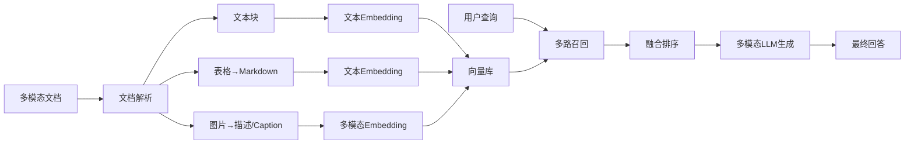
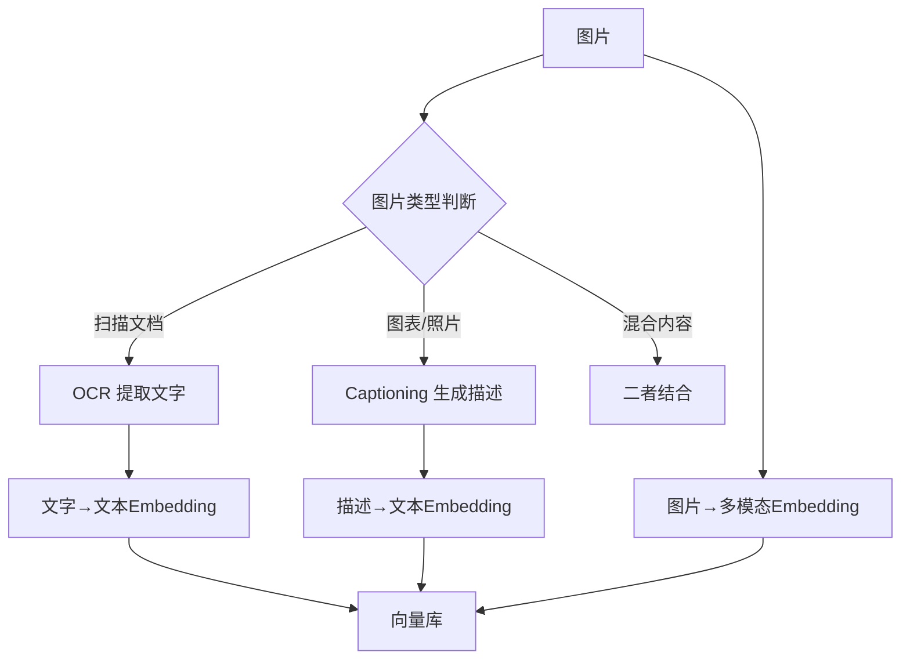
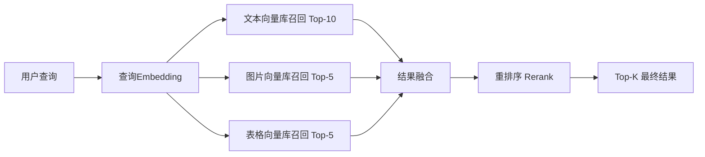

# 多模态 RAG 完整指南（Java 后端开发者视角）

> 面向后端开发者的系统化多模态检索增强生成指南。假设你有传统 RAG 经验，现在需要把图片、表格、扫描件也纳入知识库。

---

## 1. 概述

**多模态 RAG**（Multimodal RAG）是传统 RAG 的扩展：不仅索引文本，还索引图像、表格、图表、扫描 PDF 等非文本模态。

**解决的痛点：**
- 传统 RAG 用 OCR 把 PDF 转文本后向量化，表格结构丢失、图片信息完全忽略。
- 用户问"这个架构图中的模块 A 是什么"时，传统 RAG 无法回答。
- 财务报表、学术论文中的图表数据无法被检索和利用。

其核心流程如下（Mermaid 图）：



---

## 2. 多模态 Embedding

传统文本 Embedding（如 text-embedding-3-small）只看文本语义；多模态 Embedding 模型能将**文本和图片映射到同一个向量空间**，实现"以文搜图"和"图文互搜"。

| 模型 | 参数量 | 特点 | 推荐场景 |
|------|--------|------|----------|
| **CLIP (ViT-B/32)** | 150M | OpenAI 出品，图文对齐开创者 | 通用零样本分类、简单图文检索 |
| **Jina CLIP v1/v2** | 223M | 支持 89 种语言，文本+图片双塔 | 中文/多语言场景 |
| **SigLIP** | 400M+ | Google 出品，sigmoid loss 训练 | 高精度图文检索 |
| **Chinese-CLIP** | ~200M | 中文优化版 CLIP | 纯中文图片检索 |
| **ColPali (PaliGemma)** | 3B | 直接用视觉语言模型做检索 | 文档视觉检索（第 7 节详解） |

**选型建议（Java 后端视角）：**
- 通用场景优先选 **Jina CLIP v2**（多语言 + 开源 + 有 REST API）。
- 纯中文场景用 **Chinese-CLIP** 或 **BGE-VL**。
- 对 PDF 扫描件精度要求高时用 **ColPali**，但推理成本较高。
- Java 端通过 HTTP 调用 Embedding 服务即可，无需 Python 运行时。

---

## 3. 表格提取

表格是 RAG 中最容易丢失信息的模态。OCR 后的表格变成散落数字，ChatGPT 无法理解其结构。

### 3.1 提取流水线

```
PDF/图片 → Table Transformer（检测表格区域）
        → 裁剪表格区域
        → OCR（PaddleOCR / Tesseract）
        → 结构化输出（HTML / Markdown 表格）
        → 文本 Embedding → 向量库
```

### 3.2 核心工具对比

| 工具 | 适用场景 | 特点 |
|------|----------|------|
| **Table Transformer** | 学术论文、报表 | Microsoft 出品，基于 DETR，专做表格检测 |
| **Unstructured** | 通用文档解析 | 一站式方案，自动识别表格/图片/文本 |
| **Marker** | PDF → Markdown | 将 PDF 直接转 Markdown，保留表格格式 |
| **Docling** | 复杂 PDF | IBM 出品，支持表格+公式提取 |

### 3.3 代码示例

```python
# 用 Unstructured 提取表格为 Markdown
from unstructured.partition.pdf import partition_pdf

elements = partition_pdf(
    filename="report.pdf",
    strategy="hi_res",              # 高精度模式, 调用检测模型
    infer_table_structure=True,     # 开启表格结构识别
    extract_images_in_pdf=True,     # 同时提取图片
)

# 分离表格元素并转为 Markdown
tables_md = [
    el.metadata.text_as_html       # Unstructured 输出 HTML 表格
    for el in elements if el.category == "Table"
]
# 将 Markdown 表格做文本 Embedding 存入向量库
```

**关键点：** 表格向量化时使用文本 Embedding 模型即可，因为提取后的表格已经是文本（Markdown/HTML）格式，不需要多模态向量。

---

## 4. 图片处理

图片处理是多模态 RAG 中最复杂的环节，需要组合多种策略。

### 4.1 图片处理流水线



### 4.2 OCR 方案选型

| 工具 | 优势 | 劣势 |
|------|------|------|
| **PaddleOCR** | 中文最强，表格/印章识别好 | 模型较大，Python 依赖 |
| **Tesseract** | 轻量，支持 100+ 语言 | 中文精度一般 |
| **Azure OCR / AWS Textract** | 云原生，与云服务集成 | 有成本，需要网络 |
| **TrOCR (Microsoft)** | 端到端 Transformer OCR | 英文为主 |

### 4.3 图片描述生成（Captioning）

```python
# 使用 BLIP-2 生成图片描述
from transformers import Blip2Processor, Blip2ForConditionalGeneration

processor = Blip2Processor.from_pretrained("Salesforce/blip2-opt-2.7b")
model = Blip2ForConditionalGeneration.from_pretrained(
    "Salesforce/blip2-opt-2.7b", device_map="auto"
)

# 生成图片自然语言描述
inputs = processor(image, return_tensors="pt").to("cuda")
caption_ids = model.generate(**inputs, max_new_tokens=128)
caption = processor.decode(caption_ids[0], skip_special_tokens=True)
# 输出示例: "a bar chart showing quarterly revenue growth from 2020 to 2024"
```

### 4.4 图片分块策略

图片的"分块"与文本不同，推荐三种策略：
1. **整图 Embedding**：直接用 Jina CLIP 对整个图片做向量
2. **描述替代**：用 Captioning 结果替代图片存入文本向量库
3. **混合**：整图向量 + 描述向量双写

---

## 5. 图文混合检索

### 5.1 多路召回架构



### 5.2 融合策略

| 策略 | 做法 | 优缺点 |
|------|------|--------|
| **RRF（倒数排名融合）** | `score = Σ 1/(k + rank)` | 简单有效，不需要模型 |
| **线性加权** | `final = α*txt + β*img + γ*tbl` | 需要调参 |
| **Rerank 模型** | 用 BGE-Reranker 对融合结果重排序 | 精度最高，但多一次推理 |

### 5.3 Java 侧多路召回实现思路

```
// 伪代码示意：多路并行召回
CompletableFuture<List<Doc>> textFuture = asyncSearch(textEmbed, TEXT_INDEX, 10);
CompletableFuture<List<Doc>> imgFuture  = asyncSearch(imgEmbed,  IMG_INDEX,  5);
CompletableFuture<List<Doc>> tblFuture  = asyncSearch(textEmbed, TBL_INDEX,  5);

List<Doc> merged = rrfFusion(textFuture.get(), imgFuture.get(), tblFuture.get());
// 可选：调用 rerank 服务做二次排序
```

---

## 6. 多模态 LLM 生成

检索到的多模态上下文需要多模态 LLM 来消费（看图说话、读表分析）。

| 模型 | 图片理解 | 表格理解 | 中文 | 成本 | 推荐度 |
|------|----------|----------|------|------|--------|
| **GPT-4o** | ⭐⭐⭐⭐⭐ | ⭐⭐⭐⭐⭐ | ⭐⭐⭐⭐ | 高 | 首选，综合最强 |
| **GPT-4V** | ⭐⭐⭐⭐⭐ | ⭐⭐⭐⭐ | ⭐⭐⭐ | 高 | 已被 GPT-4o 取代 |
| **Claude 3.5 Sonnet / Opus** | ⭐⭐⭐⭐⭐ | ⭐⭐⭐⭐⭐ | ⭐⭐⭐⭐ | 中高 | 图表理解超强 |
| **Qwen-VL-Max** | ⭐⭐⭐⭐ | ⭐⭐⭐⭐ | ⭐⭐⭐⭐⭐ | 中 | 中文场景性价比高 |
| **GLM-4V** | ⭐⭐⭐⭐ | ⭐⭐⭐ | ⭐⭐⭐⭐⭐ | 中 | 中文优化 |
| **LLaVA-1.6 (开源)** | ⭐⭐⭐ | ⭐⭐⭐ | ⭐⭐ | 免费 | 私有化部署首选 |

**实战建议：**
- 生产环境用 **GPT-4o** 或 **Claude 3.5 Sonnet**（图表/表格最准）。
- 中文为主的场景用 **Qwen-VL-Max** 或 **GLM-4V**。
- 数据敏感场景用 **LLaVA-1.6** 私有化部署（34B 版本效果尚可）。

```python
# 多模态 LLM 调用示例（OpenAI 兼容 API）
from openai import OpenAI
client = OpenAI()

response = client.chat.completions.create(
    model="gpt-4o",
    messages=[{
        "role": "user",
        "content": [
            {"type": "text", "text": "请根据检索到的这张图表，分析 Q3 的营收趋势。"},
            {"type": "image_url", "image_url": {"url": "data:image/png;base64,..."}},
        ]
    }]
)
print(response.choices[0].message.content)
```

---

## 7. 实战：用 ColPali 做文档视觉检索

**ColPali** 是一种颠覆性思路：不再先 OCR 再向量化，而是直接用视觉语言模型（PaliGemma）对 PDF 页面截图做检索。

### 7.1 为什么 ColPali 更好？

| 传统方案 | ColPali 方案 |
|----------|-------------|
| PDF → OCR → 文本块 → Embedding | PDF → 截图 → ViT 编码 → 晚交互检索 |
| OCR 误差累积 | 无 OCR，直接视觉理解 |
| 表格、图表信息丢失 | 页面视觉全保留 |
| 流水线长，工程复杂 | 端到端，工程简单 |

### 7.2 ColPali 代码示例

```python
# 使用 ColPali 做文档视觉检索
from colpali_engine.models import ColPali, ColPaliProcessor
import torch

model = ColPali.from_pretrained(
    "vidore/colpali-v1.2",
    torch_dtype=torch.bfloat16,
    device_map="cuda"
)
processor = ColPaliProcessor.from_pretrained("vidore/colpali-v1.2")

# 将 PDF 页面渲染为图片后编码（需先将 PDF 转图片）
images = load_page_images("document.pdf")  # 每页一张图
page_embeddings = []
for img in images:
    inputs = processor.process_images([img]).to("cuda")
    with torch.no_grad():
        emb = model(**inputs)  # 输出 [1, N_patches, dim] 的 patch 级别向量
    page_embeddings.append(emb)

# 查询也经过同一模型编码
query_inputs = processor.process_queries(["Q3 营收增长率是多少？"]).to("cuda")
query_emb = model(**query_inputs)

# 用 MaxSim 计算晚交互相似度（ColBERT 风格的匹配）
# Java 端可用 Milvus 2.4+ 的多向量搜索，或自建索引
```

**Java 对接要点：**
- ColPali 推理必须用 Python（GPU），Java 侧只负责调用服务 API。
- 向量存储需支持**多向量（multi-vector）**，如 Milvus 2.4+ 或 Qdrant。
- 检索时用 MaxSim 算子计算查询与文档 patch 间的最大相似度。

---

## 8. 常见陷阱

1. **直接用 OCR 全文代替结构化提取**：OCR 把表格拆成散落文字，LLM 无法推理行/列关系，必须先用 Table Transformer + 结构化输出。
2. **图片只用 Caption 不保留原图**：Caption 可能有信息损失（如颜色、数值），检索阶段应保留原图多模态向量。
3. **混用不同 Embedding 空间做融合**：文本 Embedding 和图片 Embedding 不在同一向量空间，融合前必须做**空间对齐**或使用统一多模态模型。
4. **忽略查询改写**：用户问"这个图表说明了什么"时，需要把"这个"替换为具体上下文，否则检索无意义。
5. **Chunk 策略不当**：PDF 页面级别的 chunk 太大，会稀释图片和表格的语义信号，建议图片/表格独立 chunk。
6. **ColPali 的存储成本**：每个 page 存 1030 个 patch 向量（128 维），存储是传统方案的 10-20 倍，需评估成本。

---

## 9. 面试高频题

### Q1: 传统 RAG 和多模态 RAG 的核心区别是什么？

**详细答案：** 传统 RAG 只能处理文本模态——它假设知识库中的所有信息都可以被转化为纯文本进行索引和检索。这导致它无法处理表格结构（行/列关系在 OCR 后丢失）、图片中的视觉信息（流程图、架构图、产品照片等）以及排版语义（标题层级、高亮区域等视觉信号）。多模态 RAG 引入了多个处理管道，分别对文本、表格、图片使用不同的解析和向量化策略（如表格提取为 Markdown、图片用 CLIP/ColPali 向量化），最终通过多路召回和融合排序实现跨模态检索。

### Q2: 表格怎么在多模态 RAG 中正确处理？

**详细答案：** 表格处理的核心是"结构化保存"。第一步用 Table Transformer 或 Unstructured 检测表格区域；第二步裁剪表格图片后用 OCR 识别文字内容；第三步根据行列关系重建结构并输出为 Markdown 或 HTML 格式；第四步将结构化的表格文本做文本 Embedding 存入向量库。关键原则是：不要将表格 OCR 成一串流水账文字，必须保留行/列结构。对于简单的表头-数据表格，Markdown 格式效果最好；对于合并单元格等复杂情况，HTML 表格更精确。

### Q3: CLIP 和 ColPali 的检索机制有何不同？

**详细答案：** CLIP 使用"双塔"架构，分别对文本和图片做全局编码，输出单一向量（如 768 维），检索时计算余弦相似度。这种方式计算快、存储小，但细节丢失多（一张复杂的 PDF 页面被压缩为一个向量）。ColPali 则基于"晚交互"（Late Interaction）机制——将 PDF 页面切分成 1030 个 patch，每个 patch 独立编码为向量；检索时查询也对每个 patch 计算相似度后取 MaxSim 再求和。这保留了视觉细节（如表格中的数字、图表中的数据点），精准度远超 CLIP，但存储和计算成本也高出 10-20 倍。

### Q4: 多模态 RAG 中怎么处理图文混合的 PDF 页面？

**详细答案：** 含有图片、表格、文字的混合页面需要分层解析。先用文档解析工具（如 Unstructured 或 Marker）将页面分解为"文本块""表格块""图片块"三类元素；文本块直接做文本 Embedding，表格块转 Markdown 后做文本 Embedding，图片块同时做 Captioning（生成自然语言描述）和多模态 Embedding（如 Jina CLIP）。检索时多路召回三类 chunk，用 RRF 融合后交给多模态 LLM（如 GPT-4o）统一理解，LLM 可以同时阅读上下文文本和查看图片。

### Q5: 多模态 RAG 的评估指标和传统 RAG 有什么不同？

**详细答案：** 传统 RAG 主要看检索命中率（Recall@K、MRR）和生成答案的文本质量（Faithfulness、Answer Relevance）。多模态 RAG 还需额外关注：视觉相关度（检索到的图片是否与问题匹配）、表格问答准确率（行/列推理是否正确）、图表理解能力（能否正确读出柱状图中的数值）。业界常用 ViDoRe 基准评测多模态检索器，包含科学图表、表格、文档截图等多样场景。对于生成端的图/表理解评测，通常使用人工评估或特定领域的自动评测集（如 ChartQA、TableVQA）。

---

> **小结：** 多模态 RAG 不是简单加一个 CLIP 模型就完事，它是一套从文档解析到多路召回到多模态生成的系统工程。Java 后端开发者的核心任务不是写 Python 模型代码，而是**设计好服务边界、选对工具组合、控制好成本**。