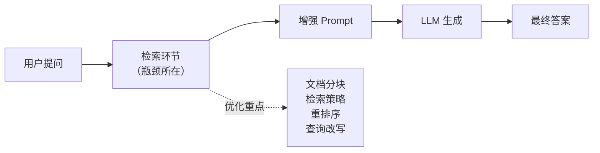
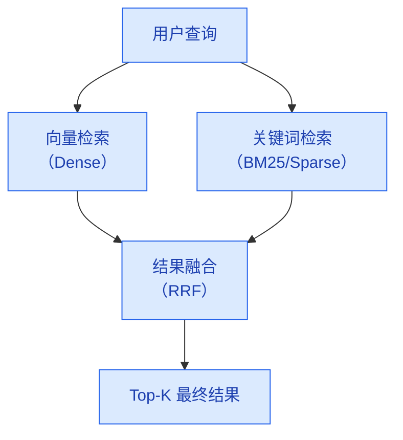
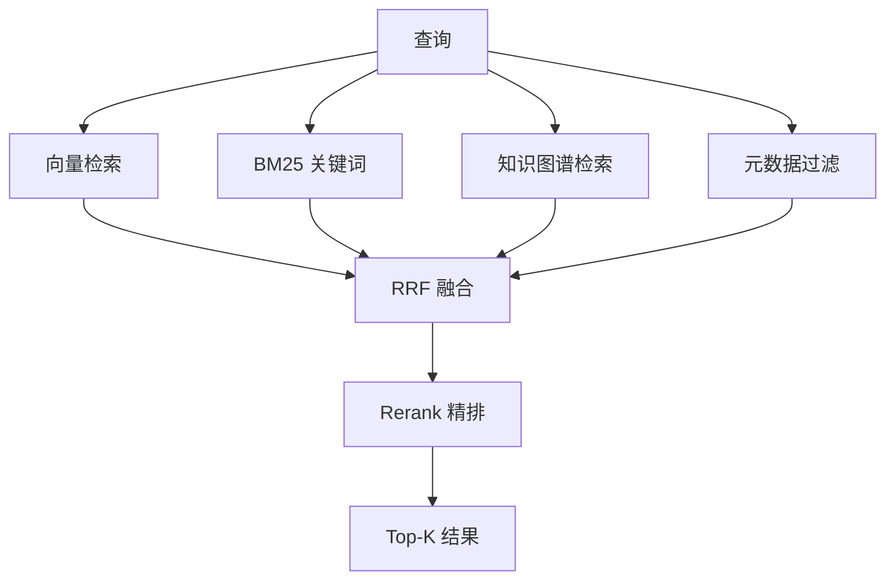

# RAG 优化策略

> **创建日期：** 2026-06-06
> **前置知识：** RAG 基础原理、向量数据库

---

## 一、RAG 优化的核心思路

RAG 系统的瓶颈通常不在 LLM 生成环节，而在**检索质量**。如果检索不到相关文档，再好的 LLM 也无法给出正确答案。



**优化黄金法则：** 先优化检索，再优化生成。检索质量提升 10%，比 Prompt 优化 50% 更有效。

---

## 二、文档分块策略（Chunking）

### 2.1 三种分块策略对比

| 策略 | 原理 | 优点 | 缺点 | 适用场景 |
|------|------|------|------|----------|
| **固定长度切分** | 按 token 数等长切分 | 实现简单，通用性好 | 可能切断语义单元 | 通用场景、快速原型 |
| **语义切分** | 按段落/章节自然边界切分 | 语义完整性好 | 对非结构化文档效果差 | 结构化文档（Markdown/HTML） |
| **结构感知切分** | 利用文档标题层级切分 | 保留层级关系，可添加 metadata | 需要文档有清晰结构 | 企业文档、技术手册 |

### 2.2 关键参数调优

| 参数 | 推荐值 | 说明 |
|------|--------|------|
| **Chunk Size** | 256~1024 tokens | 太小丢失上下文，太大稀释检索精度 |
| **Overlap（重叠窗口）** | 10%~20% of chunk size | 保证语义连续性，避免关键信息被切断 |
| **Metadata 标注** | 必填：标题、来源、页码 | 检索时可做元数据过滤，提升召回精度 |

### 2.3 Chunk 扩展策略

检索到目标 chunk 后，可以扩展上下文：

```python
# 三种扩展策略
def expand_context(chunks, strategy="adjacent"):
    if strategy == "adjacent":
        # 相邻扩展：取目标 chunk 前后各 1 个 chunk
        return chunks_before + chunks + chunks_after
    elif strategy == "parent":
        # 父文档扩展：合并所属的父级文档块
        return parent_document
    elif strategy == "summary":
        # 摘要扩展：在 chunk 前附加父级摘要
        return parent_summary + chunk
```

---

## 三、混合检索（Hybrid Search）

### 3.1 为什么需要混合检索？

| 检索方式 | 优点 | 缺点 |
|----------|------|------|
| **向量检索（稠密）** | 语义理解好，能匹配同义词 | 对专有名词、精确匹配差 |
| **关键词检索（BM25）** | 精确匹配好，专有名词准确 | 无法理解语义，同义词不匹配 |

**混合检索 = 向量检索 + 关键词检索**，取两者优势互补。

### 3.2 融合策略



**RRF（Reciprocal Rank Fusion）** 是最常用的融合算法：

```
RRF_score(d) = Σ 1 / (k + rank_i(d))
```

其中 k 通常取 60，rank_i(d) 是文档 d 在第 i 个检索结果中的排名。

### 3.3 实现示例

```python
# 混合检索伪代码
def hybrid_search(query, top_k=10):
    # 向量检索
    dense_results = vector_db.search(query_embedding, top_k=top_k * 2)
    # 关键词检索
    sparse_results = bm25_index.search(query, top_k=top_k * 2)
    # RRF 融合
    return rrf_merge(dense_results, sparse_results, top_k=top_k)
```

---

## 四、Rerank 重排序

### 4.1 为什么需要 Rerank？

初检（向量检索）的精度有限，需要用更强的模型对初检结果进行**精排**。

| 初检（Bi-Encoder） | 重排序（Cross-Encoder） |
|---------------------|--------------------------|
| 速度快，适合大规模候选 | 速度慢，但精度高 |
| 查询和文档独立编码 | 查询和文档联合编码 |
| 召回 Top-100 | 精排到 Top-5~10 |

### 4.2 常用 Rerank 模型

| 模型 | 特点 | 适用场景 |
|------|------|----------|
| **Cohere Rerank** | 商业 API，效果好 | 生产环境，对效果要求高 |
| **BGE-Reranker** | 开源中文首选 | 中文场景，私有化部署 |
| **Jina Reranker** | 开源，多语言支持 | 多语言场景 |
| **Cross-Encoder** | 通用方案，HuggingFace 丰富 | 定制化需求 |

```python
# Rerank 示例
from FlagEmbedding import FlagReranker

reranker = FlagReranker('BAAI/bge-reranker-v2-m3')
scores = reranker.compute_score([(query, doc) for doc in candidates])
# 按分数排序，取 Top-K
```

---

## 五、查询改写（Query Rewriting）

### 5.1 为什么需要查询改写？

用户的原始查询往往不够精确，需要改写以提升检索效果：

| 问题 | 原始查询 | 改写后 |
|------|----------|--------|
| 表达不精确 | "那个报错怎么解决" | "NullPointerException 如何修复" |
| 指代不明 | "上个月的那个问题" | "2026年5月系统宕机问题" |
| 多轮对话 | "还有别的方案吗" | "除了索引优化，还有哪些MySQL性能优化方案" |

### 5.2 改写策略

```python
# 使用 LLM 改写查询
def rewrite_query(query, history=None):
    prompt = f"""
    将以下用户查询改写为更精确的检索查询。
    要求：补充上下文、消除歧义、使用专业术语。

    对话历史：{history}
    用户查询：{query}
    改写后查询：
    """
    return llm.generate(prompt)
```

**多轮查询改写** 需要结合对话历史，将上下文信息融入改写后的查询中。

---

## 六、HyDE（假设文档嵌入）

### 6.1 核心思想

HyDE（Hypothetical Document Embeddings）不是直接用查询去检索，而是：

1. 让 LLM 根据查询**生成一个假设的答案文档**
2. 用这个假设文档的向量去检索


**为什么有效？** 假设文档比查询本身更接近真实文档的表达方式，向量空间中距离更近。

### 6.2 适用场景

- 查询很短但答案在长文档中
- 查询和文档风格差异大（如口语化查询 vs 正式文档）
- ⚠️ 注意：HyDE 多一次 LLM 调用，增加延迟和成本

---

## 七、多路召回

在生产环境中，单一检索路径往往不够，需要**多路召回**：



| 召回路径 | 适用场景 |
|----------|----------|
| 向量检索 | 语义匹配，兜底方案 |
| BM25 关键词 | 专有名词、精确匹配 |
| 知识图谱 | 实体关系、结构化知识 |
| 元数据过滤 | 时间、来源、权限过滤 |

---

## 八、面试重点

::: warning 高频考点
1. **混合检索为什么比单一检索好？** BM25 和向量检索各有什么优势？
2. **Rerank 在 RAG 中起什么作用？** Cross-Encoder 和 Bi-Encoder 的区别？
3. **查询改写解决什么问题？** 多轮对话中如何改写？
4. **HyDE 的原理是什么？** 什么场景下有效？
5. **文档分块大小如何选择？** 太大和太小各有什么问题？
:::