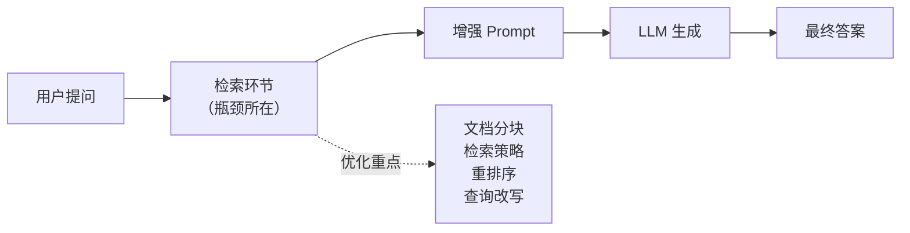
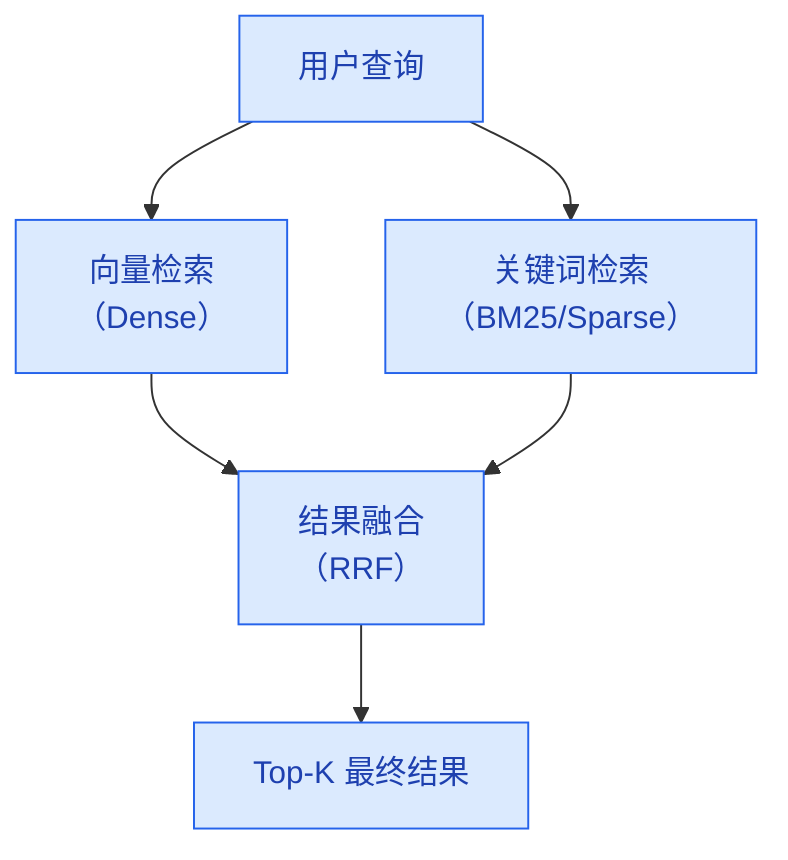
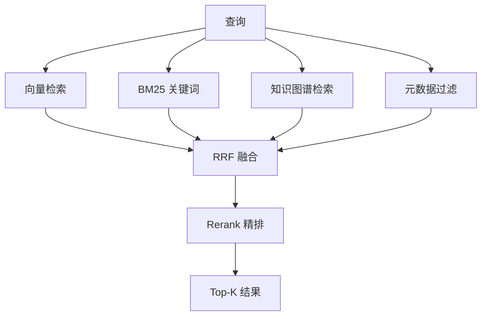

# RAG 优化策略

> **创建日期：** 2026-06-06
> **前置知识：** RAG 基础原理、向量数据库

---

## 一、RAG 优化的核心思路

RAG 系统的瓶颈通常不在 LLM 生成环节，而在**检索质量**。如果检索不到相关文档，再好的 LLM 也无法给出正确答案。



**优化黄金法则：** 先优化检索，再优化生成。检索质量提升 10%，比 Prompt 优化 50% 更有效。

---

## 二、文档分块策略（Chunking）

### 2.1 三种分块策略对比

| 策略 | 原理 | 优点 | 缺点 | 适用场景 |
|------|------|------|------|----------|
| **固定长度切分** | 按 token 数等长切分 | 实现简单，通用性好 | 可能切断语义单元 | 通用场景、快速原型 |
| **语义切分** | 按段落/章节自然边界切分 | 语义完整性好 | 对非结构化文档效果差 | 结构化文档（Markdown/HTML） |
| **结构感知切分** | 利用文档标题层级切分 | 保留层级关系，可添加 metadata | 需要文档有清晰结构 | 企业文档、技术手册 |

### 2.2 关键参数调优

| 参数 | 推荐值 | 说明 |
|------|--------|------|
| **Chunk Size** | 256~1024 tokens | 太小丢失上下文，太大稀释检索精度 |
| **Overlap（重叠窗口）** | 10%~20% of chunk size | 保证语义连续性，避免关键信息被切断 |
| **Metadata 标注** | 必填：标题、来源、页码 | 检索时可做元数据过滤，提升召回精度 |

### 2.3 Chunk 扩展策略

检索到目标 chunk 后，可以扩展上下文：

```python
# 三种扩展策略
def expand_context(chunks, strategy="adjacent"):
    if strategy == "adjacent":
        # 相邻扩展：取目标 chunk 前后各 1 个 chunk
        return chunks_before + chunks + chunks_after
    elif strategy == "parent":
        # 父文档扩展：合并所属的父级文档块
        return parent_document
    elif strategy == "summary":
        # 摘要扩展：在 chunk 前附加父级摘要
        return parent_summary + chunk
```

---

## 三、混合检索（Hybrid Search）

### 3.1 为什么需要混合检索？

| 检索方式 | 优点 | 缺点 |
|----------|------|------|
| **向量检索（稠密）** | 语义理解好，能匹配同义词 | 对专有名词、精确匹配差 |
| **关键词检索（BM25）** | 精确匹配好，专有名词准确 | 无法理解语义，同义词不匹配 |

**混合检索 = 向量检索 + 关键词检索**，取两者优势互补。

### 3.2 融合策略



**RRF（Reciprocal Rank Fusion）** 是最常用的融合算法：

```
RRF_score(d) = Σ 1 / (k + rank_i(d))
```

其中 k 通常取 60，rank_i(d) 是文档 d 在第 i 个检索结果中的排名。

### 3.3 实现示例

```python
# 混合检索伪代码
def hybrid_search(query, top_k=10):
    # 向量检索
    dense_results = vector_db.search(query_embedding, top_k=top_k * 2)
    # 关键词检索
    sparse_results = bm25_index.search(query, top_k=top_k * 2)
    # RRF 融合
    return rrf_merge(dense_results, sparse_results, top_k=top_k)
```

---

## 四、Rerank 重排序

### 4.1 为什么需要 Rerank？

初检（向量检索）的精度有限，需要用更强的模型对初检结果进行**精排**。

| 初检（Bi-Encoder） | 重排序（Cross-Encoder） |
|---------------------|--------------------------|
| 速度快，适合大规模候选 | 速度慢，但精度高 |
| 查询和文档独立编码 | 查询和文档联合编码 |
| 召回 Top-100 | 精排到 Top-5~10 |

### 4.2 常用 Rerank 模型

| 模型 | 特点 | 适用场景 |
|------|------|----------|
| **Cohere Rerank** | 商业 API，效果好 | 生产环境，对效果要求高 |
| **BGE-Reranker** | 开源中文首选 | 中文场景，私有化部署 |
| **Jina Reranker** | 开源，多语言支持 | 多语言场景 |
| **Cross-Encoder** | 通用方案，HuggingFace 丰富 | 定制化需求 |

```python
# Rerank 示例
from FlagEmbedding import FlagReranker

reranker = FlagReranker('BAAI/bge-reranker-v2-m3')
scores = reranker.compute_score([(query, doc) for doc in candidates])
# 按分数排序，取 Top-K
```

---

## 五、查询改写（Query Rewriting）

### 5.1 为什么需要查询改写？

用户的原始查询往往不够精确，需要改写以提升检索效果：

| 问题 | 原始查询 | 改写后 |
|------|----------|--------|
| 表达不精确 | "那个报错怎么解决" | "NullPointerException 如何修复" |
| 指代不明 | "上个月的那个问题" | "2026年5月系统宕机问题" |
| 多轮对话 | "还有别的方案吗" | "除了索引优化，还有哪些MySQL性能优化方案" |

### 5.2 改写策略

```python
# 使用 LLM 改写查询
def rewrite_query(query, history=None):
    prompt = f"""
    将以下用户查询改写为更精确的检索查询。
    要求：补充上下文、消除歧义、使用专业术语。

    对话历史：{history}
    用户查询：{query}
    改写后查询：
    """
    return llm.generate(prompt)
```

**多轮查询改写** 需要结合对话历史，将上下文信息融入改写后的查询中。

---

## 六、HyDE（假设文档嵌入）

### 6.1 核心思想

HyDE（Hypothetical Document Embeddings）不是直接用查询去检索，而是：

1. 让 LLM 根据查询**生成一个假设的答案文档**
2. 用这个假设文档的向量去检索


**为什么有效？** 假设文档比查询本身更接近真实文档的表达方式，向量空间中距离更近。

### 6.2 适用场景

- 查询很短但答案在长文档中
- 查询和文档风格差异大（如口语化查询 vs 正式文档）
- ⚠️ 注意：HyDE 多一次 LLM 调用，增加延迟和成本

---

## 七、多路召回

在生产环境中，单一检索路径往往不够，需要**多路召回**：



| 召回路径 | 适用场景 |
|----------|----------|
| 向量检索 | 语义匹配，兜底方案 |
| BM25 关键词 | 专有名词、精确匹配 |
| 知识图谱 | 实体关系、结构化知识 |
| 元数据过滤 | 时间、来源、权限过滤 |

---

## 八、面试高频题

### Q1: 混合检索为什么比单一检索好？BM25 和向量检索各自的优势是什么？

**详细答案：** 在我们保险条款项目里，混合检索是在排查 bad case 时拍板上的。当时我们发现"除外责任"类问题的准确率只有 40% 多，排查下来最典型的一个 case 是——用户搜"第3.2.1条"，向量检索返回的全是 3.2.2、3.1.1 这种"长得像"的条款，因为 BGE 模型对纯数字不敏感，3.2.1 和 3.2.2 的向量几乎一样。但 BM25 就能精确命中"3.2.1"这个字符串，准确率接近 100%。反过来，用户搜"重疾险赔偿条件是什么"，BM25 搜不到"赔偿"两个字就不会返回"理赔标准"相关的文档，但向量检索能识别出"赔偿条件"和"理赔标准"是同一回事。

所以我们线上是一路向量、一路 BM25（跑在 ES 上），两路各召回 Top-20，然后用 RRF（k=60）融合取 Top-5。融合后条款编号类查询的命中率直接从 50% 提到了 92%。这个方案其实投入不大——多加了一台 8C16G 的机器跑 ES 就够了。我个人的体会是，只要你的知识库里有精确匹配的需求（编号、代码、人名），混合检索几乎是必须的，因为向量检索在精确匹配上就是天然弱项。

### Q2: Rerank 在 RAG 中起什么作用？Cross-Encoder 和 Bi-Encoder 在架构上有什么区别？

**详细答案：** 我们是在混合检索上线之后发现还需要 Rerank 的。混合检索后条款编号类问题解决了，但一些语义模糊的查询，初检的 Top-5 里还是混着不相关的文档。比如用户问"车险全损怎么赔"，初检返回的五条里有一条是关于车辆维修的，一条是关于车辆被盗的，虽然都和"车"有关但完全不是全损场景。我们后加了 bge-reranker-large 做精排——初检召回 Top-50，然后 Reranker 对每条 (query, doc) 做联合打分再精排到 Top-5，效果好得超出预期。

Cross-Encoder 和 Bi-Encoder 的差异是很本质的。Bi-Encoder（我们的 BGE-large）在离线阶段就可以把所有文档向量算好存起来，检索时只算查询向量然后做 ANN 搜索，一条查询 15ms 搞定。但它的代价是 query 和 document 在编码时没见过彼此，只能靠各自的独立向量来近似匹配。Cross-Encoder 不同——它直接把 query 和 doc 拼在一起扔进一个完整的 Transformer，所以能捕捉到细粒度的词级交互，比如"全损"和"全部损失"这种。但代价就是每条 (query, doc) 都要做一次完整推理，50 条就要 50 次，Rerank 环节会增加大概 200ms 的延迟。我们做了个折中：不是每次请求都开 Rerank，只有初检 Top-5 的最大相似度偏差超过一定阈值时才触发精排，省下来一半的 Rerank 调用。

### Q3: 查询改写（Query Rewriting）解决什么问题？在多轮对话中如何实现有效的查询改写？

**详细答案：** 查询改写是我们上了 RAGAS 评估之后发现的一个大缺口。那时我们统计了线上 top-20 的 bad case，发现大概三分之一是因为用户输入和文档用词不匹配导致的——最典型的是"交强险"这个行业缩写，用户全在说"交强险"，但保单里写的全是"机动车交通事故责任强制保险"，Embedding 相似度极低。我们做了个改写层：用 LLM 把用户输入里的常见缩写/俗称展开成正式术语，改写后再检索。这个改动把缩写类查询的召回率从 45% 拉到了 82%。

多轮对话改写更麻烦一些。比如用户第一轮问"车险怎么买"，第二轮说"那如果出事故了呢"，这个"那"指代的是"车险"，如果我们不把历史信息补进去，第二轮单独检索"出事故怎么办"会捞出各式各样的东西。我们的做法是维护最近 3 轮的对话历史，每次用户提问时用一条专用 LLM prompt 把当前问题和历史合并——"结合对话历史，将用户当前问题改写为一个完整独立的检索语句"——然后把改写结果拿去做检索。这里有一个取舍：每次都调 LLM 做改写会增加 200ms 延迟，我们只在多轮对话场景下触发，单轮直接跳过。

### Q4: HyDE（假设文档嵌入）的原理是什么？什么场景下它特别有效？

**详细答案：** HyDE 的思路是"用答案去检索答案"——先让 LLM 根据用户问题生成一个假设性的回答，然后用这个假设回答的向量去检索真实文档。我们在项目里试过这个方案。当时有个典型场景——用户输入非常口语化，比如"撞了车保险公司赔不赔"，就这么一句话，检索结果一直不好。我们让 LLM 先生成一个假设回答："根据机动车保险条款，发生车辆碰撞属于车损险的保障范围，保险公司会按照实际损失金额进行赔付，但需要满足事故发生后48小时内报案、责任认定明确等条件。"用这段假设回答去检索，匹配到的确实是车损险相关的条款文本，召回效果好得多。

但我们最终没把 HyDE 推到线上，因为多一次 LLM 调用直接把延迟从原来的 2 秒飙到了 4 秒多，用户等了两次就投诉了。这个结论其实是有取舍的——如果你的场景对延迟敏感（实时客服、在线问答），不建议上 HyDE；如果是离线分析、知识库深度探索这种不在乎等几秒的，效果确实好。我们还发现一个小坑：如果 LLM 生成的假设答案本身就带幻觉，比如我们故意测了一次"酒后驾车出事故赔不赔"，假设答案生成的是"会赔"，结果检索到的反而是支持"拒赔"的条款，虽然最终 LLM 能根据检索结果纠正过来，但反正浪费了一波检索资源。

### Q5: 文档分块大小（Chunk Size）如何选择？太大和太小各有什么问题？

**详细答案：** 我们在 chunk size 上反复调了三轮。最开始用了 1000 tokens，这是 LangChain 文档里推荐的通用值。上线后发现一堆问题——用户搜条款编号，结果前半段编号在一个 chunk 里，后半段内容在另一个 chunk 里，召回完全是断裂的。评估下来 Recall@5 只有 62%。后来我们把 chunk_size 降到 600，overlap 从 200 降到 150，编号类问题好多了，Recall@5 升到 78%。

但降到 600 之后又出了一个新问题——一些长篇条款（比如"责任免除"章节，单个条款上千字）被切成两三段，检索时每个段落的 Embedding 都只能表达片段语义，LLM 拼出来答案不完整。最后的方案是按文档类型分策略：有标题层级的结构化条款按标题边界切，每条条款独立成 chunk，长度从 200 到 1500 tokens 不等；纯叙述性段落用 512 tokens 固定切分加 50 overlap。Chunk 还要打上元数据——所属章节、条款编号、文档版本——检索时用元数据做过滤，避免跨章节噪音。整个调优过程我们跑了一个月，每周用 50 道评估题验证一轮，切分策略的调整对 Recall 的影响比换 Embedding 模型还大。