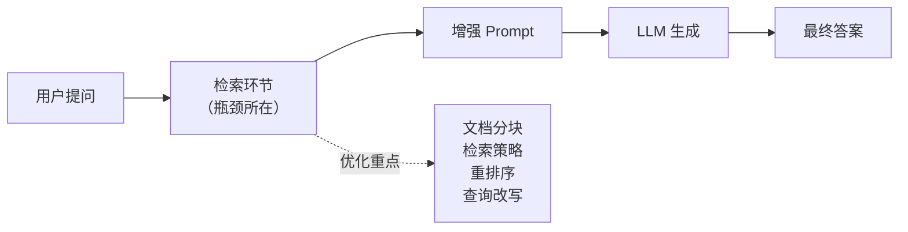
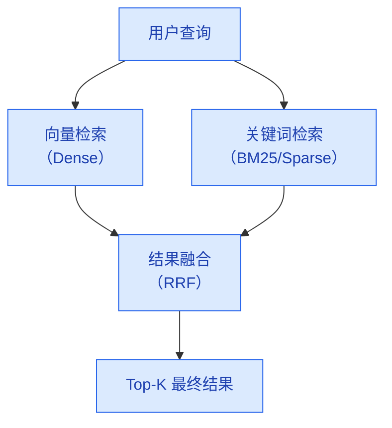
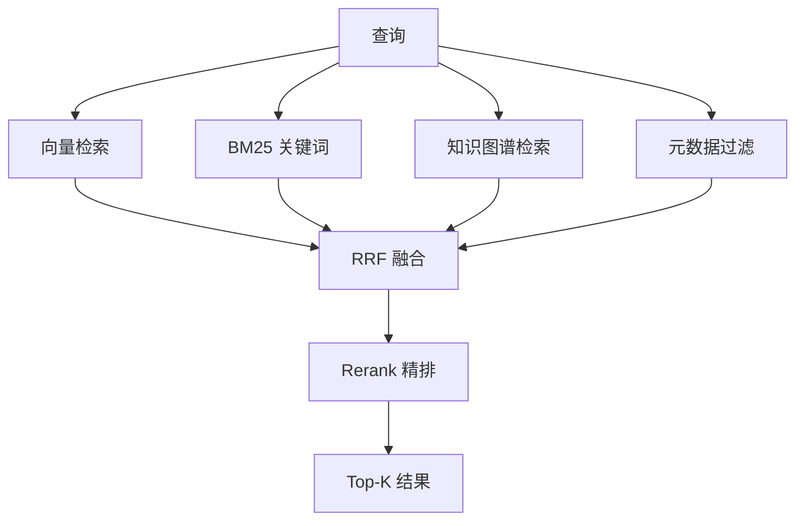

# RAG 优化策略

> **创建日期：** 2026-06-06
> **前置知识：** RAG 基础原理、向量数据库

---

## 一、RAG 优化的核心思路

RAG 系统的瓶颈通常不在 LLM 生成环节，而在**检索质量**。如果检索不到相关文档，再好的 LLM 也无法给出正确答案。



**优化黄金法则：** 先优化检索，再优化生成。检索质量提升 10%，比 Prompt 优化 50% 更有效。

---

## 二、文档分块策略（Chunking）

### 2.1 三种分块策略对比

| 策略 | 原理 | 优点 | 缺点 | 适用场景 |
|------|------|------|------|----------|
| **固定长度切分** | 按 token 数等长切分 | 实现简单，通用性好 | 可能切断语义单元 | 通用场景、快速原型 |
| **语义切分** | 按段落/章节自然边界切分 | 语义完整性好 | 对非结构化文档效果差 | 结构化文档（Markdown/HTML） |
| **结构感知切分** | 利用文档标题层级切分 | 保留层级关系，可添加 metadata | 需要文档有清晰结构 | 企业文档、技术手册 |

### 2.2 关键参数调优

| 参数 | 推荐值 | 说明 |
|------|--------|------|
| **Chunk Size** | 256~1024 tokens | 太小丢失上下文，太大稀释检索精度 |
| **Overlap（重叠窗口）** | 10%~20% of chunk size | 保证语义连续性，避免关键信息被切断 |
| **Metadata 标注** | 必填：标题、来源、页码 | 检索时可做元数据过滤，提升召回精度 |

### 2.3 Chunk 扩展策略

检索到目标 chunk 后，可以扩展上下文：

```python
# 三种扩展策略
def expand_context(chunks, strategy="adjacent"):
    if strategy == "adjacent":
        # 相邻扩展：取目标 chunk 前后各 1 个 chunk
        return chunks_before + chunks + chunks_after
    elif strategy == "parent":
        # 父文档扩展：合并所属的父级文档块
        return parent_document
    elif strategy == "summary":
        # 摘要扩展：在 chunk 前附加父级摘要
        return parent_summary + chunk
```

---

## 三、混合检索（Hybrid Search）

### 3.1 为什么需要混合检索？

| 检索方式 | 优点 | 缺点 |
|----------|------|------|
| **向量检索（稠密）** | 语义理解好，能匹配同义词 | 对专有名词、精确匹配差 |
| **关键词检索（BM25）** | 精确匹配好，专有名词准确 | 无法理解语义，同义词不匹配 |

**混合检索 = 向量检索 + 关键词检索**，取两者优势互补。

### 3.2 融合策略



**RRF（Reciprocal Rank Fusion）** 是最常用的融合算法：

```
RRF_score(d) = Σ 1 / (k + rank_i(d))
```

其中 k 通常取 60，rank_i(d) 是文档 d 在第 i 个检索结果中的排名。

### 3.3 实现示例

```python
# 混合检索伪代码
def hybrid_search(query, top_k=10):
    # 向量检索
    dense_results = vector_db.search(query_embedding, top_k=top_k * 2)
    # 关键词检索
    sparse_results = bm25_index.search(query, top_k=top_k * 2)
    # RRF 融合
    return rrf_merge(dense_results, sparse_results, top_k=top_k)
```

---

## 四、Rerank 重排序

### 4.1 为什么需要 Rerank？

初检（向量检索）的精度有限，需要用更强的模型对初检结果进行**精排**。

| 初检（Bi-Encoder） | 重排序（Cross-Encoder） |
|---------------------|--------------------------|
| 速度快，适合大规模候选 | 速度慢，但精度高 |
| 查询和文档独立编码 | 查询和文档联合编码 |
| 召回 Top-100 | 精排到 Top-5~10 |

### 4.2 常用 Rerank 模型

| 模型 | 特点 | 适用场景 |
|------|------|----------|
| **Cohere Rerank** | 商业 API，效果好 | 生产环境，对效果要求高 |
| **BGE-Reranker** | 开源中文首选 | 中文场景，私有化部署 |
| **Jina Reranker** | 开源，多语言支持 | 多语言场景 |
| **Cross-Encoder** | 通用方案，HuggingFace 丰富 | 定制化需求 |

```python
# Rerank 示例
from FlagEmbedding import FlagReranker

reranker = FlagReranker('BAAI/bge-reranker-v2-m3')
scores = reranker.compute_score([(query, doc) for doc in candidates])
# 按分数排序，取 Top-K
```

---

## 五、查询改写（Query Rewriting）

### 5.1 为什么需要查询改写？

用户的原始查询往往不够精确，需要改写以提升检索效果：

| 问题 | 原始查询 | 改写后 |
|------|----------|--------|
| 表达不精确 | "那个报错怎么解决" | "NullPointerException 如何修复" |
| 指代不明 | "上个月的那个问题" | "2026年5月系统宕机问题" |
| 多轮对话 | "还有别的方案吗" | "除了索引优化，还有哪些MySQL性能优化方案" |

### 5.2 改写策略

```python
# 使用 LLM 改写查询
def rewrite_query(query, history=None):
    prompt = f"""
    将以下用户查询改写为更精确的检索查询。
    要求：补充上下文、消除歧义、使用专业术语。

    对话历史：{history}
    用户查询：{query}
    改写后查询：
    """
    return llm.generate(prompt)
```

**多轮查询改写** 需要结合对话历史，将上下文信息融入改写后的查询中。

---

## 六、HyDE（假设文档嵌入）

### 6.1 核心思想

HyDE（Hypothetical Document Embeddings）不是直接用查询去检索，而是：

1. 让 LLM 根据查询**生成一个假设的答案文档**
2. 用这个假设文档的向量去检索


**为什么有效？** 假设文档比查询本身更接近真实文档的表达方式，向量空间中距离更近。

### 6.2 适用场景

- 查询很短但答案在长文档中
- 查询和文档风格差异大（如口语化查询 vs 正式文档）
- ⚠️ 注意：HyDE 多一次 LLM 调用，增加延迟和成本

---

## 七、多路召回

在生产环境中，单一检索路径往往不够，需要**多路召回**：



| 召回路径 | 适用场景 |
|----------|----------|
| 向量检索 | 语义匹配，兜底方案 |
| BM25 关键词 | 专有名词、精确匹配 |
| 知识图谱 | 实体关系、结构化知识 |
| 元数据过滤 | 时间、来源、权限过滤 |

---

## 八、面试高频题

### Q1: 混合检索为什么比单一检索好？BM25 和向量检索各自的优势是什么？

**详细答案：** 混合检索（Hybrid Search）的核心价值在于融合了**语义匹配**和**精确匹配**两种能力，弥补了单一检索方式的固有缺陷。向量检索（Dense Retrieval）通过 Embedding 模型将文本映射到高维语义空间，擅长捕捉同义词、近义词、跨语言匹配等语义层面的相似性。例如用户搜索"怎么提升收入"，向量检索能匹配到"涨薪攻略"、"加薪方法"等文档，即使关键词完全不同。但向量检索的致命弱点是：对专有名词、缩写、精确 ID 的匹配能力很差——"API-2024-007" 和 "API-2024-008" 在向量空间中可能非常接近，但却是完全不同的文档。

BM25（关键词检索）正好补齐了向量检索的短板。BM25 基于词频和逆文档频率（TF-IDF 的改进版），对精确关键词匹配非常敏感。当用户搜索"API-2024-007" 时，BM25 能精确找到包含该字符串的文档，而向量检索可能会把 "API-2024-008" 也排进来。此外，BM25 对领域专有名词（如"Kubernetes Pod Disruption Budget"）的匹配效果也远优于向量检索，因为这些术语在 Embedding 模型的训练数据中可能不常见，语义向量不够精准。

在工程实践中，混合检索的落地通常采用 RRF（Reciprocal Rank Fusion）融合算法，将两个检索结果的排名加权合并。关键参数 k（通常取 60）控制融合的平滑程度——k 越小，排名靠后的文档越容易被忽略；k 越大，两个来源的排名差异越被平滑。建议在构建 RAG 系统时，向量检索和 BM25 各召回 Top-20 到 Top-50，然后通过 RRF 融合取 Top-5 到 Top-10，效果通常优于任何一种单一检索方式。

### Q2: Rerank 在 RAG 中起什么作用？Cross-Encoder 和 Bi-Encoder 在架构上有什么区别？

**详细答案：** Rerank（重排序）是 RAG 检索链路中的"精排"环节。初检阶段（向量检索或 BM25）通常使用 Bi-Encoder 架构，将查询和文档分别编码为向量，然后通过向量相似度（如余弦相似度）快速召回候选集。Bi-Encoder 的优势是速度快——文档向量可以离线计算并存储在向量数据库中，检索时只需计算查询向量并做近似最近邻搜索（ANN）。但 Bi-Encoder 的精度有限，因为查询和文档在编码时是独立的，没有进行深度交互。

Cross-Encoder 则采用完全不同的架构：它将查询和文档拼接在一起，通过完整的 Transformer 模型进行联合编码，最后输出一个相关性分数。这种联合编码方式意味着 Cross-Encoder 能捕捉查询和文档之间的细粒度交互（如词级别的匹配、语义蕴含关系），精度远高于 Bi-Encoder。但代价是速度慢——对于每个 (query, doc) 对，都需要完整跑一次 Transformer 前向传播。如果对 1000 个候选文档逐一做 Cross-Encoder 打分，延迟会高到不可接受。

因此，RAG 系统的标准做法是"粗排 + 精排"两阶段：先用 Bi-Encoder 从海量文档中召回 Top-100 候选，再用 Cross-Encoder Reranker 对 Top-100 精排，取 Top-5 到 Top-10 送入 LLM 生成。实际选型时，中文场景推荐 BGE-Reranker（BAAI/bge-reranker-v2-m3），英文场景推荐 Cohere Rerank 或 Jina Reranker。注意，Rerank 环节会增加约 100-200ms 的延迟，在延迟敏感的实时系统中需要权衡是否启用。

### Q3: 查询改写（Query Rewriting）解决什么问题？在多轮对话中如何实现有效的查询改写？

**详细答案：** 查询改写解决的核心问题是**用户原始查询与文档表达方式之间的鸿沟**。用户输入往往是口语化、不完整、指代模糊的，而知识库中的文档是正式、精确、完整的。如果不做改写，直接用用户的原始查询去检索，召回效果会大打折扣。查询改写有三类典型场景：一是**表达不精确**，如用户说"那个报错怎么解决"，需要改写成具体的错误信息；二是**指代不明**，如多轮对话中用户说"还有别的方案吗"，需要将"别的方案"补充为"除了索引优化外的 MySQL 性能优化方案"；三是**术语转换**，将口语化表达转换为文档中的专业术语。

在多轮对话场景中，查询改写的关键在于**利用对话历史做上下文消歧**。具体做法是：将当前轮次的用户查询与前几轮的对话历史拼接，让 LLM 理解上下文后生成一个独立、完整、精确的检索查询。例如，Prompt 可以设计为："以下是对话历史：{history}。用户当前查询是：'{query}'。请将用户查询改写为一个独立、完整、适合检索的查询，需要补充上下文信息、消除指代、使用专业术语。" 改写后的查询应该是一个"零上下文"的查询——即使没有对话历史，也能独立理解其含义。

实际落地时，查询改写本身也是一次 LLM 调用，会增加延迟和成本。因此需要权衡：对于简单的单轮问答，可以跳过改写直接检索；对于多轮对话或查询明显模糊的场景，才触发改写。另外，改写后的查询可以和原始查询一起做多路召回，进一步提升召回率。还可以在改写结果的 Prompt 中加入"不要改变用户原意"的约束，避免改写过度导致偏离用户真实意图。

### Q4: HyDE（假设文档嵌入）的原理是什么？什么场景下它特别有效？

**详细答案：** HyDE（Hypothetical Document Embeddings）的核心理念是"用答案去检索答案"——不是直接用用户的查询向量去检索，而是先让 LLM 根据查询生成一个假设性的答案文档，然后用这个假设文档的向量去检索真实文档。其背后的理论依据是：在向量空间中，假设文档比原始查询更接近真实文档。因为用户查询通常是简短的问句或关键词，而知识库中的文档是完整的段落，两者的向量分布差异很大。让 LLM 先生成一个"假答案"，这个假答案在风格、长度、术语使用上都更接近真实文档，因此用它做检索的向量距离更近。

HyDE 的适用场景非常明确。第一，**查询很短但答案在长文档中**：用户问"Kubernetes 是怎么做服务发现的？"这个问题只有几个词，但答案在数千字的文档中。HyDE 生成的假设文档会是几百字的段落，包含 "kube-proxy"、"Service"、"Endpoints" 等术语，能更好地匹配知识库。第二，**查询和文档风格差异大**：用户用口语问"怎么让我的网站变快？"，知识库中是"前端性能优化最佳实践"这样的正式文档，直接匹配效果差，而 HyDE 生成的假设答案会用正式语言描述，风格更接近文档。

但 HyDE 也有明显的代价和风险。它需要额外一次 LLM 调用来生成假设文档，增加了延迟和成本（约翻倍）。此外，如果 LLM 生成的假设文档本身就有错误（幻觉），就可能导致检索到错误方向的文档。因此，HyDE 不适合延迟敏感的场景（如实时客服），更适合对质量要求高、可接受秒级延迟的离线分析场景。另外，HyDE 可以与查询改写结合使用——先用改写让查询更精确，再用 HyDE 生成假设文档，效果叠加。

### Q5: 文档分块大小（Chunk Size）如何选择？太大和太小各有什么问题？

**详细答案：** Chunk Size 是 RAG 系统中最基础也最关键的参数之一，它直接影响检索精度和生成质量。Chunk Size 太小（如 128 tokens）会导致"语义碎片化"——单个 chunk 可能只包含一个句子或半句话，缺乏完整的上下文，检索到的 chunk 虽然匹配但无法支撑 LLM 生成完整答案。例如，一个关于"年假申请流程"的 chunk 被切成 128 tokens，可能只包含"年假需要提前"这几个字，真正关键的"3天提交"被切到了下一个 chunk，导致检索漏掉核心信息。

Chunk Size 太大（如 2048 tokens）则会导致"精度稀释"——一个 chunk 包含了太多不相关的信息，检索时虽然这个 chunk 被召回了，但 LLM 需要从大量噪音中提取相关片段，浪费 token 预算且容易引入干扰信息。此外，Chunk 太大还会导致向量 Embedding 变得"模糊"——一个包含多个主题的 chunk 的 Embedding 是所有这些主题语义的加权平均，与任何单一主题的查询的相似度都不高，反而降低了检索精度。

在工程实践中，推荐的 Chunk Size 范围是 256 到 1024 tokens，具体选择取决于文档类型和应用场景。对于结构化文档（如技术手册、FAQ），建议 256-512 tokens，因为信息密度高，小 chunk 就足够；对于叙述性文档（如研究报告、长文），建议 512-1024 tokens，因为需要更多上下文才能理解；对于混合类型文档库，可以先用 512 tokens 作为默认值，然后通过 RAGAS 评估调优。另一个关键参数是 Overlap（重叠窗口），通常设为 Chunk Size 的 10%-20%，可以保证跨 chunk 的语义连续性，避免关键信息被切断在 chunk 边界上。