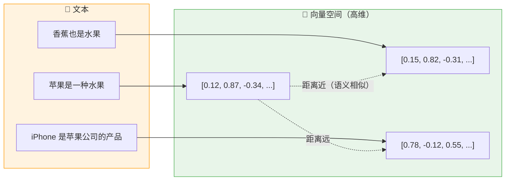
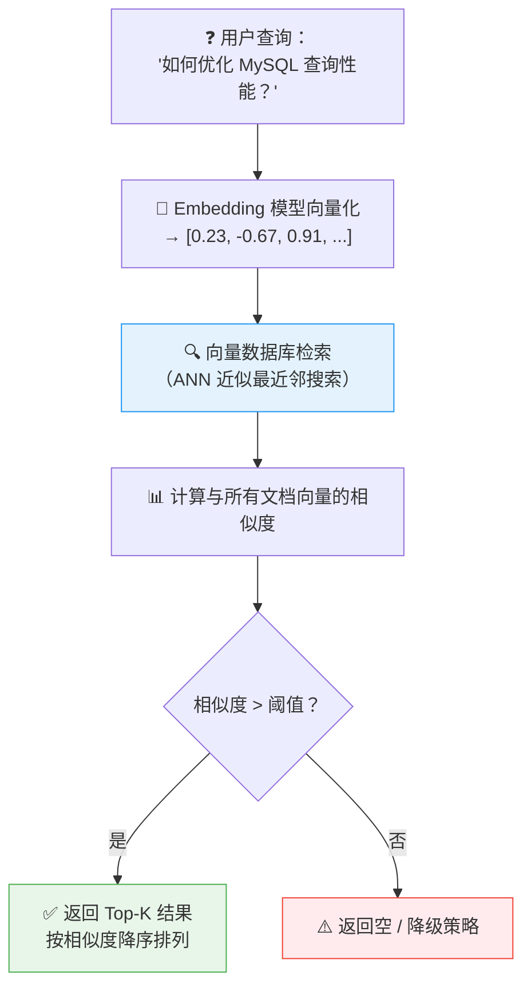
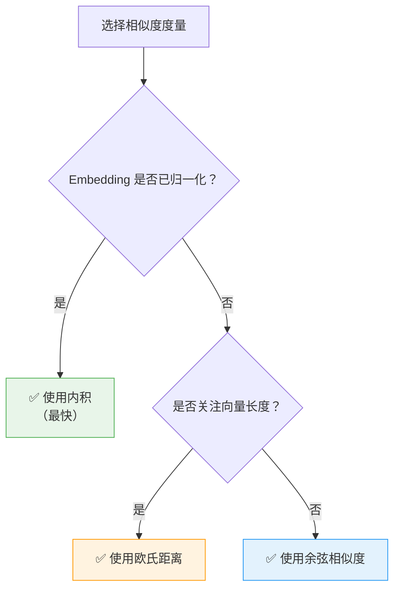
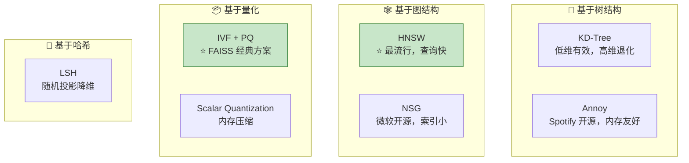
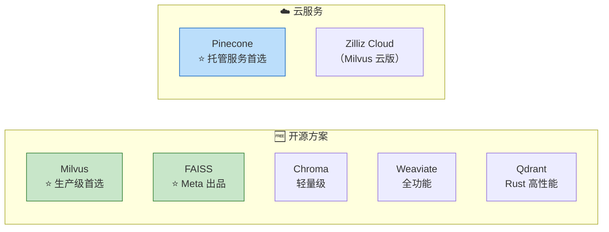
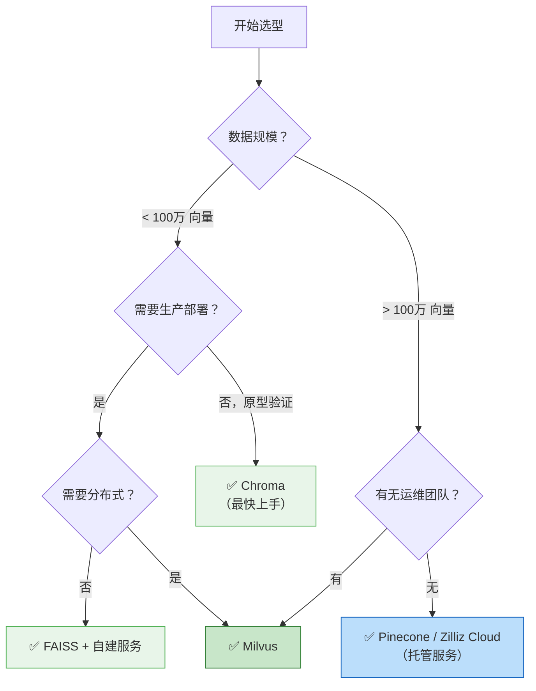

# 向量数据库详解

> **向量数据库（Vector Database）** 是一种专门用于存储、索引和检索高维向量数据的数据库系统。它是 RAG 架构中的核心基础设施，负责高效地找到与查询向量最相似的文档向量。

---

## 核心概念

### 什么是向量嵌入（Vector Embedding）？

将文本、图像、音频等非结构化数据通过嵌入模型（Embedding Model）映射为固定维度的浮点数向量，语义相近的内容在向量空间中距离也相近。

---

## 向量召回（Vector Recall）

### 召回流程

### ⭐ 召回质量评估指标

| 指标 | 公式 / 说明 | 含义 |
|------|------------|------|
| **Recall@K** | 前 K 个结果中包含相关文档的比例 | 召回的覆盖能力 |
| **MRR**（Mean Reciprocal Rank） | 第一个相关文档排名的倒数均值 | 首个相关结果的排名质量 |
| **NDCG**（Normalized DCG） | 考虑排序位置的归一化折损累计增益 | 排序质量的综合评估 |

---

## 相似度度量方法

### 1. 余弦相似度（Cosine Similarity）

最常用的向量相似度度量方式。

$$\text{cosine}(A, B) = \frac{A \cdot B}{\|A\| \times \|B\|} = \frac{\sum_{i=1}^{n} A_i B_i}{\sqrt{\sum_{i=1}^{n} A_i^2} \times \sqrt{\sum_{i=1}^{n} B_i^2}}$$

- **取值范围**：[-1, 1]，1 表示完全相同方向，0 表示正交，-1 表示完全相反
- ⭐ **优点**：对向量长度不敏感，只关心方向 —— 适合文本嵌入（归一化后等价于内积）
- ⭐ **注意**：当 Embedding 模型已做 L2 归一化时，余弦相似度退化为**内积**

### 2. 欧氏距离（Euclidean Distance）

$$d(A, B) = \sqrt{\sum_{i=1}^{n} (A_i - B_i)^2}$$

- 值越小表示越相似（与余弦相反）
- 对向量长度敏感

### 3. 内积（Dot Product / Inner Product）

$$A \cdot B = \sum_{i=1}^{n} A_i B_i$$

- 当向量已归一化时，内积 = 余弦相似度
- 计算效率最高

### ⭐ 相似度度量选择指南

---

## ANN 近似最近邻搜索

### 为什么需要 ANN？

暴力搜索（Brute Force）的时间复杂度为 **O(n * d)**，其中 n 为向量数量，d 为维度。当 n 达到百万级时，暴力搜索不可接受。

⭐ **ANN（Approximate Nearest Neighbor）** 通过牺牲少量精度换取数量级的性能提升。

### 主流 ANN 算法对比

| 算法 | 原理 | 查询速度 | 索引构建 | 内存占用 | 适用规模 |
|------|------|----------|----------|----------|----------|
| ⭐ **HNSW** | 分层可导航小世界图 | 极快 | 较慢 | 高 | 百万~亿级 |
| ⭐ **IVF+PQ** | 倒排索引 + 乘积量化 | 快 | 快 | 低 | 千万~十亿级 |
| **Annoy** | 随机投影树森林 | 较快 | 快 | 中 | 百万级 |
| **LSH** | 局部敏感哈希 | 中 | 快 | 中 | 百万级 |
| **暴力搜索** | 全量遍历 | 慢 | 无需 | 低 | 万级以下 |

---

## 常见向量数据库对比

### 详细对比表

| 特性 | ⭐ Milvus | ⭐ FAISS | Pinecone | Chroma |
|------|-----------|----------|----------|--------|
| **类型** | 开源向量数据库 | 开源向量检索库 | 云托管服务 | 开源向量数据库 |
| **开发者** | Zilliz | Meta | Pinecone | Chroma 团队 |
| **分布式** | ✅ 原生支持 | ❌ 需自行实现 | ✅ 全托管 | ❌ 单机 |
| **ANN 算法** | HNSW, IVF, DiskANN 等 | IVF+PQ, HNSW 等 | 专有算法 | HNSW |
| **混合检索** | ✅ 向量 + 标量过滤 | ❌ 仅向量 | ✅ 元数据过滤 | ✅ 元数据过滤 |
| **部署难度** | 中等 | ⭐ 低（Python 库） | ⭐ 极低（完全托管） | ⭐ 低 |
| **性能** | ⭐ 极高（十亿级） | ⭐ 极高 | 高（取决于套餐） | 中（百万级） |
| **社区生态** | 活跃，CNCF 项目 | 学术/工业界广泛使用 | 商业支持好 | 社区活跃 |
| **多模态** | ✅ | ✅（需自行组织） | ✅ | ✅ |
| **适用场景** | 生产级大规模应用 | 本地开发、研究 | 快速上线、零运维 | 原型验证、小项目 |

### ⭐ 选型建议

---

## 面试常见问题

### Q1：向量数据库和传统数据库有什么区别？

| 维度 | 向量数据库 | 传统数据库 |
|------|-----------|------------|
| 查询方式 | 相似度搜索（近似匹配） | 精确匹配 / 范围查询 |
| 索引结构 | ANN 索引（HNSW / IVF） | B-Tree / Hash / 倒排索引 |
| 数据类型 | 高维浮点向量 | 结构化标量数据 |
| 典型应用 | 语义搜索、推荐系统 | 事务处理、报表统计 |

### Q2：为什么需要专门用向量数据库，而不直接用 PostgreSQL 的 pgvector？

- pgvector 适合**中小规模**（百万级以下）场景，简单方便
- ⭐ 当数据量达到千万级以上时，专用向量数据库（Milvus 等）在性能、分布式能力上有显著优势
- pgvector 的 IVFFlat 索引在高维场景下性能下降明显

### Q3：向量的维度对检索有什么影响？

- **维度越高**：表达能力越强，但计算和存储成本指数增长（维度灾难）
- 常见嵌入维度：OpenAI ada-002（1536维）、BGE-large（1024维）
- ⭐ 并非维度越高越好，需要平衡精度和性能

### Q4：如何处理向量数据的更新和删除？

- ⭐ **增量更新**：大多数向量数据库支持实时插入和删除
- **批量重建**：当数据变更量较大时，重新构建索引效率更高
- **软删除 + 定期清理**：避免频繁的索引修改
- FAISS 不支持原地更新，需重新构建索引后整体替换

---

## 实战建议

::: info 实战清单
1. ✅ **原型阶段**：使用 Chroma 或 FAISS 快速验证，开发成本最低
2. ✅ **生产环境**：数据百万级以上优选 Milvus；无运维团队考虑 Pinecone 云服务
3. ✅ **索引选择**：HNSW 适合低延迟查询场景（推荐），IVF+PQ 适合内存受限场景
4. ✅ **维度控制**：768~1536 维是业界主流范围，不建议盲目追求高维度
5. ✅ **混合检索**：向量检索 + BM25 关键词检索 双路召回，用 RRF（Reciprocal Rank Fusion）融合排序
6. ✅ **性能监控**：关注 QPS、P99 延迟、召回率、索引构建时间等关键指标
7. ✅ **冷启动预案**：当向量库为空时需要有降级策略（如返回通用回答、引导用户补充知识库）
:::

## 参考资料

- [Milvus 官方文档](https://milvus.io/docs)
- [FAISS GitHub](https://github.com/facebookresearch/faiss)
- [Pinecone 官方文档](https://docs.pinecone.io)
- [Chroma 官方文档](https://docs.trychroma.com)

---

## 面试高频题

### Q1: 向量数据库与传统关系型数据库的核心区别是什么？它们能否互补使用？

**详细答案：** 向量数据库和传统关系型数据库解决的是完全不同的查询范式。关系型数据库的核心是"精确匹配"——通过 SQL 的 WHERE 条件进行等值查询、范围查询、JOIN 关联，返回的结果是精确满足条件的记录集。向量数据库的核心是"相似度搜索"——通过计算向量之间的距离（余弦相似度、欧氏距离、内积）找出语义上最相似的内容，返回的结果是"近似匹配"而非"精确匹配"。这种差异源于它们处理的数据类型不同：关系型数据库处理结构化数据（数字、字符串、日期），而向量数据库处理非结构化数据的高维向量表示（文本、图像、音频的 Embedding）。

在实际生产中，两者通常是互补使用而非替代关系。一个典型的 RAG 系统会同时使用两种数据库：用向量数据库存储和检索文档的语义向量，实现"语义搜索"；用关系型数据库存储文档的元数据（文件名、作者、创建时间、权限标签），实现"精确过滤"。例如，用户查询"技术部的最新考勤制度"，系统先在向量数据库中检索语义相似的文档片段，同时通过关系型数据库过滤出"部门=技术部"且"文档类型=考勤制度"的文档，两路结果取交集。这正是 Milvus 等向量数据库支持"向量 + 标量过滤"混合查询的原因——它们认识到在实际业务中，语义搜索和精确过滤需要协同工作。

### Q2: HNSW 算法为什么成为向量数据库中最流行的 ANN 索引算法？

**详细答案：** HNSW（Hierarchical Navigable Small World，分层可导航小世界图）之所以成为最流行的 ANN 算法，是因为它在查询速度、召回率和实现复杂度之间取得了最优平衡。HNSW 的核心思想是构建一个多层图结构：顶层图稀疏，用于快速定位大致区域；底层图稠密，用于精确搜索。查询时，从顶层开始贪婪搜索，逐层向下，最终在底层找到最相似的向量。这种分层策略使得 HNSW 的查询时间复杂度接近 O(log N)，在百万级向量规模下可以实现毫秒级的查询延迟。

与其他 ANN 算法相比，HNSW 的优势更加明显。相比 IVF+PQ（倒排索引 + 乘积量化），HNSW 不需要训练阶段，可以直接增量插入数据，对动态数据更加友好。相比 Annoy（随机投影树），HNSW 在高维空间（如 768 维以上）的召回率显著更高。相比 LSH（局部敏感哈希），HNSW 的查询精度更稳定，不会出现"偶尔漏检"的问题。HNSW 的主要代价是内存占用较高（需要存储图结构）和索引构建较慢（需要逐点插入并建立连接），但这些代价在大多数生产场景中是可以接受的。因此，Milvus、Chroma、Weaviate 等主流向量数据库都以 HNSW 作为默认或推荐索引算法。

### Q3: 在 RAG 系统中，如何选择 Embedding 模型？有哪些关键考量因素？

**详细答案：** 选择 Embedding 模型是 RAG 系统设计中最关键的决策之一，因为它直接决定了检索的语义理解质量。关键考量因素包括五个维度。第一是语言支持——如果主要处理中文文档，BGE（BAAI/bge-base-zh-v1.5）是目前中文开源领域的首选，在 C-MTEB 中文基准上表现优异；如果多语言混合，可以选择 multilingual-e5 或 Jina Embeddings v2。第二是向量维度——维度越高表达能力越强，但存储和计算成本也越大。业界主流维度是 768-1536 维，OpenAI text-embedding-3 提供了 256/1024/3072 三种维度选择，可以根据精度需求灵活调整。

第三是模型大小与推理速度——大模型（如 BGE-large）效果更好但推理慢、资源消耗大；小模型（如 BGE-small）速度快但精度略低。在需要高并发的生产环境中，通常选择小模型搭配 Rerank 的思路：用快速的小模型做初检，用精确的 Cross-Encoder 做精排。第四是领域适配性——通用 Embedding 模型在特定领域（如医疗、法律、金融）可能效果不佳，此时可以考虑领域微调或选择领域特化的 Embedding 模型。第五是与 LLM 的协同——理想的 Embedding 模型应该与下游 LLM 在语义空间上对齐，这样检索到的内容更容易被 LLM 理解和利用。此外，还有一个关键原则：**查询和文档必须使用同一个 Embedding 模型**，否则向量空间不同，相似度计算就失去了意义。

### Q4: Milvus、FAISS、Chroma、Pinecone 分别适用于什么场景？选型决策树是什么？

**详细答案：** 这四个向量数据库的定位和适用场景有明显差异。Chroma 是最轻量级的方案，适合原型验证和小型项目（百万级向量以下），它的优势是"开箱即用"——几行 Python 代码就能完成向量存储和检索，非常适合在学习阶段和 MVP 阶段使用。FAISS 是 Meta 出品的向量检索库，虽然不是完整的数据库（没有持久化、分布式、元数据过滤等能力），但其检索性能极强，适合在本地开发、学术研究和需要自定义管线的场景中作为核心检索引擎使用。

Milvus 是生产级向量数据库的首选，支持分布式部署、十亿级向量规模、混合检索（向量 + 标量过滤）、多种 ANN 索引算法动态切换，是 CNCF 孵化项目，社区活跃度很高。如果你的数据量超过百万级，需要生产部署，且有运维团队支持，Milvus 是首选。Pinecone 是完全托管的云服务，优势是零运维——不需要管理服务器、不需要调优索引、不需要处理扩容，适合没有运维团队或希望快速上线的团队。选型决策树的核心逻辑是：先看数据规模——百万级以下用 Chroma 或 FAISS；百万级以上看运维能力——有运维团队选 Milvus，无运维团队选 Pinecone 或 Zilliz Cloud（Milvus 云版）；如果只是原型验证，直接 Chroma 起步，最快上手。

### Q5: 混合检索（向量检索 + BM25 关键词检索）为什么能提升检索质量？RRF 融合算法是如何工作的？

**详细答案：** 混合检索之所以能提升检索质量，是因为向量检索和关键词检索各自有盲区，两者互补。向量检索擅长捕捉"语义相似"——"苹果手机"和"iPhone"虽然字面完全不同，但向量检索能识别出它们的语义相似性。然而，向量检索对"精确关键词"的处理并不理想——当用户搜索"2024年考勤制度"时，向量检索可能返回"2023年考勤制度"或"请假制度"，因为它们在语义上也有一定相关性。关键词检索（BM25）则恰好相反：它擅长精确匹配"考勤制度"和"2024"，但无法理解"苹果手机"和"iPhone"是同一件事。两者结合，就能同时覆盖"语义相似"和"精确匹配"两个维度。

RRF（Reciprocal Rank Fusion，倒数排名融合）是一种简单而有效的融合算法，不需要对分数进行归一化。它的工作原理是：对每个文档，计算它在各路检索结果中的排名的倒数之和作为最终得分。公式为 `RRF_score(d) = sum(1 / (k + rank_i(d)))`，其中 k 是平滑常数（通常取 60），rank_i 是文档在第 i 路检索中的排名。RRF 的核心优势在于：它不需要知道各路检索的原始分数（向量检索返回的是余弦相似度分数，BM25 返回的是 TF-IDF 分数，两者量纲不同），只需要排名信息，因此天然适合融合异构检索结果。相比直接加权求和（需要归一化分数），RRF 更鲁棒、更易实现，是目前混合检索的主流融合策略。

### Q6: 向量数据库在实际生产环境中如何进行性能监控和容量规划？

**详细答案：** 向量数据库的性能监控需要关注四个核心指标。第一是查询性能指标——QPS（每秒查询数）、P50/P95/P99 延迟，这些指标直接反映用户体验。当 P99 延迟超过 500ms 时，通常意味着索引结构需要优化（如切换索引算法、调整 HNSW 的 M 和 ef_construction 参数）或需要扩容。第二是召回率指标——定期用评估集验证检索结果的 Recall@K，确保索引重建或参数调整后检索质量没有退化。第三是资源指标——CPU 使用率、内存使用率（向量数据库通常内存消耗较大）、磁盘 I/O 和存储增长趋势。第四是数据新鲜度——监控新文档从入库到可检索的延迟，确保知识库的时效性。

容量规划的核心是预估向量数量和存储空间。向量数量的预估基于业务增长模型——文档数量、每个文档的 Chunk 数量、知识库的更新频率。存储空间的预估公式为：`存储量 = 向量数量 × 维度 × 4 字节（float32）+ 索引额外开销（通常 20%~100%）`。例如，100 万条 768 维向量，原始数据约 3GB，加上 HNSW 索引额外开销，总存储约 5-6GB。此外，还需要考虑元数据存储（文档来源、创建时间等）和备份存储。在容量规划中，建议预留 50% 的余量应对突发增长，并建立自动扩容策略——当存储使用率达到 70% 时触发告警，达到 85% 时自动扩容。

---

## 参考资料

- [Milvus 官方文档](https://milvus.io/docs)
- [FAISS GitHub](https://github.com/facebookresearch/faiss)
- [Pinecone 官方文档](https://docs.pinecone.io)
- [Chroma 官方文档](https://docs.trychroma.com)
- [BGE 嵌入模型](https://huggingface.co/BAAI/bge-base-zh-v1.5)