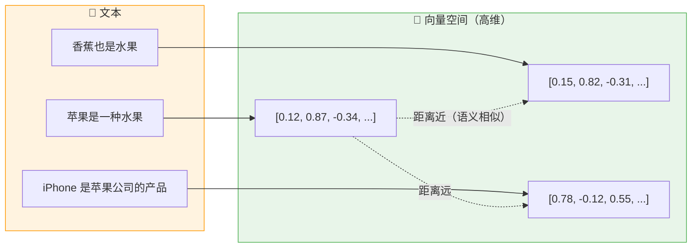
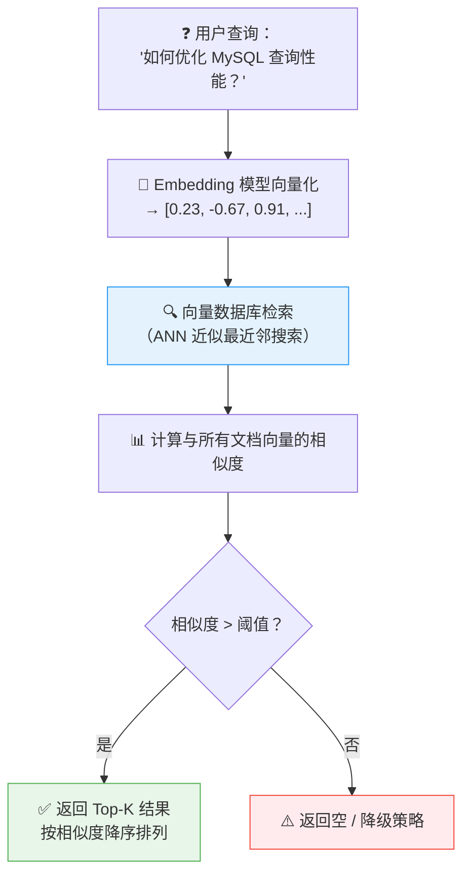
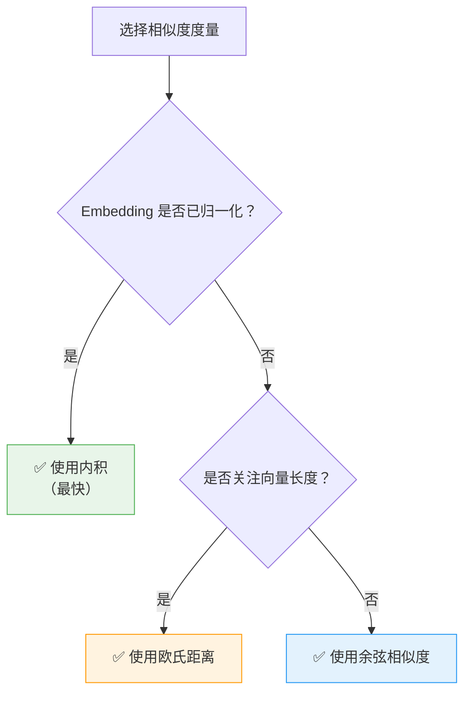
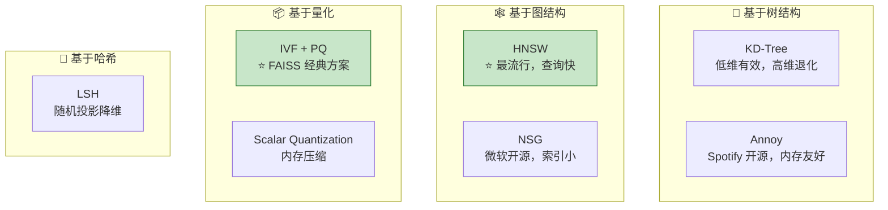
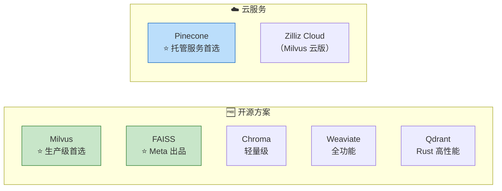
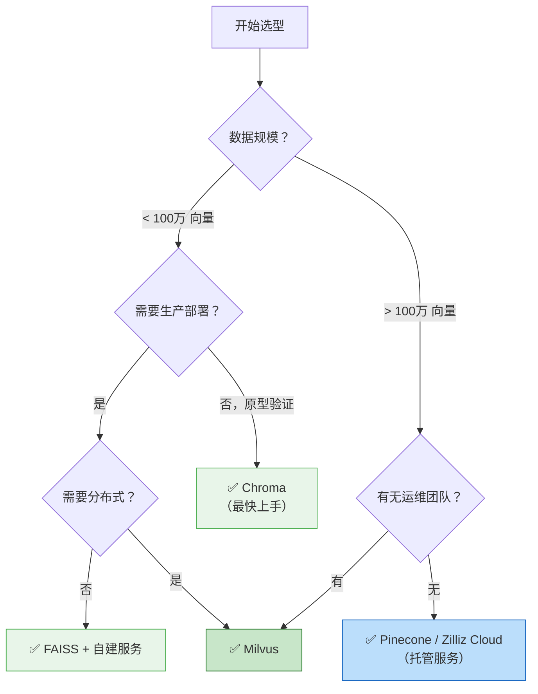

# 向量数据库详解

> **向量数据库（Vector Database）** 是一种专门用于存储、索引和检索高维向量数据的数据库系统。它是 RAG 架构中的核心基础设施，负责高效地找到与查询向量最相似的文档向量。

---

## 核心概念

### 什么是向量嵌入（Vector Embedding）？

将文本、图像、音频等非结构化数据通过嵌入模型（Embedding Model）映射为固定维度的浮点数向量，语义相近的内容在向量空间中距离也相近。

---

## 向量召回（Vector Recall）

### 召回流程

### ⭐ 召回质量评估指标

| 指标 | 公式 / 说明 | 含义 |
|------|------------|------|
| **Recall@K** | 前 K 个结果中包含相关文档的比例 | 召回的覆盖能力 |
| **MRR**（Mean Reciprocal Rank） | 第一个相关文档排名的倒数均值 | 首个相关结果的排名质量 |
| **NDCG**（Normalized DCG） | 考虑排序位置的归一化折损累计增益 | 排序质量的综合评估 |

---

## 相似度度量方法

### 1. 余弦相似度（Cosine Similarity）

最常用的向量相似度度量方式。

$$\text{cosine}(A, B) = \frac{A \cdot B}{\|A\| \times \|B\|} = \frac{\sum_{i=1}^{n} A_i B_i}{\sqrt{\sum_{i=1}^{n} A_i^2} \times \sqrt{\sum_{i=1}^{n} B_i^2}}$$

- **取值范围**：[-1, 1]，1 表示完全相同方向，0 表示正交，-1 表示完全相反
- ⭐ **优点**：对向量长度不敏感，只关心方向 —— 适合文本嵌入（归一化后等价于内积）
- ⭐ **注意**：当 Embedding 模型已做 L2 归一化时，余弦相似度退化为**内积**

### 2. 欧氏距离（Euclidean Distance）

$$d(A, B) = \sqrt{\sum_{i=1}^{n} (A_i - B_i)^2}$$

- 值越小表示越相似（与余弦相反）
- 对向量长度敏感

### 3. 内积（Dot Product / Inner Product）

$$A \cdot B = \sum_{i=1}^{n} A_i B_i$$

- 当向量已归一化时，内积 = 余弦相似度
- 计算效率最高

### ⭐ 相似度度量选择指南

---

## ANN 近似最近邻搜索

### 为什么需要 ANN？

暴力搜索（Brute Force）的时间复杂度为 **O(n * d)**，其中 n 为向量数量，d 为维度。当 n 达到百万级时，暴力搜索不可接受。

⭐ **ANN（Approximate Nearest Neighbor）** 通过牺牲少量精度换取数量级的性能提升。

### 主流 ANN 算法对比

| 算法 | 原理 | 查询速度 | 索引构建 | 内存占用 | 适用规模 |
|------|------|----------|----------|----------|----------|
| ⭐ **HNSW** | 分层可导航小世界图 | 极快 | 较慢 | 高 | 百万~亿级 |
| ⭐ **IVF+PQ** | 倒排索引 + 乘积量化 | 快 | 快 | 低 | 千万~十亿级 |
| **Annoy** | 随机投影树森林 | 较快 | 快 | 中 | 百万级 |
| **LSH** | 局部敏感哈希 | 中 | 快 | 中 | 百万级 |
| **暴力搜索** | 全量遍历 | 慢 | 无需 | 低 | 万级以下 |

---

## 常见向量数据库对比

### 详细对比表

| 特性 | ⭐ Milvus | ⭐ FAISS | Pinecone | Chroma |
|------|-----------|----------|----------|--------|
| **类型** | 开源向量数据库 | 开源向量检索库 | 云托管服务 | 开源向量数据库 |
| **开发者** | Zilliz | Meta | Pinecone | Chroma 团队 |
| **分布式** | ✅ 原生支持 | ❌ 需自行实现 | ✅ 全托管 | ❌ 单机 |
| **ANN 算法** | HNSW, IVF, DiskANN 等 | IVF+PQ, HNSW 等 | 专有算法 | HNSW |
| **混合检索** | ✅ 向量 + 标量过滤 | ❌ 仅向量 | ✅ 元数据过滤 | ✅ 元数据过滤 |
| **部署难度** | 中等 | ⭐ 低（Python 库） | ⭐ 极低（完全托管） | ⭐ 低 |
| **性能** | ⭐ 极高（十亿级） | ⭐ 极高 | 高（取决于套餐） | 中（百万级） |
| **社区生态** | 活跃，CNCF 项目 | 学术/工业界广泛使用 | 商业支持好 | 社区活跃 |
| **多模态** | ✅ | ✅（需自行组织） | ✅ | ✅ |
| **适用场景** | 生产级大规模应用 | 本地开发、研究 | 快速上线、零运维 | 原型验证、小项目 |

### ⭐ 选型建议

---

## 面试常见问题

### Q1：向量数据库和传统数据库有什么区别？

| 维度 | 向量数据库 | 传统数据库 |
|------|-----------|------------|
| 查询方式 | 相似度搜索（近似匹配） | 精确匹配 / 范围查询 |
| 索引结构 | ANN 索引（HNSW / IVF） | B-Tree / Hash / 倒排索引 |
| 数据类型 | 高维浮点向量 | 结构化标量数据 |
| 典型应用 | 语义搜索、推荐系统 | 事务处理、报表统计 |

### Q2：为什么需要专门用向量数据库，而不直接用 PostgreSQL 的 pgvector？

- pgvector 适合**中小规模**（百万级以下）场景，简单方便
- ⭐ 当数据量达到千万级以上时，专用向量数据库（Milvus 等）在性能、分布式能力上有显著优势
- pgvector 的 IVFFlat 索引在高维场景下性能下降明显

### Q3：向量的维度对检索有什么影响？

- **维度越高**：表达能力越强，但计算和存储成本指数增长（维度灾难）
- 常见嵌入维度：OpenAI ada-002（1536维）、BGE-large（1024维）
- ⭐ 并非维度越高越好，需要平衡精度和性能

### Q4：如何处理向量数据的更新和删除？

- ⭐ **增量更新**：大多数向量数据库支持实时插入和删除
- **批量重建**：当数据变更量较大时，重新构建索引效率更高
- **软删除 + 定期清理**：避免频繁的索引修改
- FAISS 不支持原地更新，需重新构建索引后整体替换

---

## 实战建议

::: info 实战清单
1. ✅ **原型阶段**：使用 Chroma 或 FAISS 快速验证，开发成本最低
2. ✅ **生产环境**：数据百万级以上优选 Milvus；无运维团队考虑 Pinecone 云服务
3. ✅ **索引选择**：HNSW 适合低延迟查询场景（推荐），IVF+PQ 适合内存受限场景
4. ✅ **维度控制**：768~1536 维是业界主流范围，不建议盲目追求高维度
5. ✅ **混合检索**：向量检索 + BM25 关键词检索 双路召回，用 RRF（Reciprocal Rank Fusion）融合排序
6. ✅ **性能监控**：关注 QPS、P99 延迟、召回率、索引构建时间等关键指标
7. ✅ **冷启动预案**：当向量库为空时需要有降级策略（如返回通用回答、引导用户补充知识库）
:::

## 参考资料

- [Milvus 官方文档](https://milvus.io/docs)
- [FAISS GitHub](https://github.com/facebookresearch/faiss)
- [Pinecone 官方文档](https://docs.pinecone.io)
- [Chroma 官方文档](https://docs.trychroma.com)

---

## 面试高频题

### Q1: 向量数据库与传统关系型数据库的核心区别是什么？它们能否互补使用？

**详细答案：** 我们项目里实际上就是这么用的——Milvus 存向量做语义搜索，PostgreSQL 存文档元数据做精确过滤，两者配合。举个例子，在我们的保险问答系统里，用户问"2024版重疾险轻症理赔标准是什么"，我们先从 Milvus 捞 Top-10 语义最相关的文档，然后拿着这 10 个文档的 ID 去 PostgreSQL 里查，过滤掉"生效年份 != 2024"、"险种类型 != 重疾险"的记录，剩下的再拼进 Prompt。这就是最典型的互补用法。

核心区别其实就是查询范式：PostgreSQL 是精确匹配，WHERE 条件必须命中才能返回；Milvus 是相似度匹配，找的是语义相近的结果。比如"理赔条件"和"赔付标准"这种同义不同字的，PostgreSQL 如果没建全文索引搜不到，向量库一下就能捞出来。但反过来，用户明确要 2024 版的，向量检索可能把 2023 版也捞回来，这时候就得靠 PostgreSQL 做标量过滤。现在 Milvus 本身也支持 scalar filtering 了，但我们还是保持分离——关系数据库做过滤我们更熟，权限控制、事务这些成熟特性直接就能用，比向量库自带的元数据过滤稳定多了。

### Q2: HNSW 算法为什么成为向量数据库中最流行的 ANN 索引算法？

**详细答案：** 我们在用 Milvus 的时候，HNSW 就是默认索引，用下来确实觉得没什么理由换。它最让人安心的一点是查询延迟非常稳定——我们 500 万向量，P99 查询延迟稳定在 15ms 以内，从来没出过"突然某条查询飙到几百毫秒"的情况。相比之下，IVF+PQ 我们测的时候就发现，如果查询向量恰好不在倒排索引聚类中心附近，延迟会翻好几倍，用户体验很差。

HNSW 的核心思路很简单：构建一个多层图，上层稀疏用来快速定位大致区域，下层稠密用来精确搜索。查询从顶层开始，逐层向下，到最底层就能找到近似最近邻。代价就是内存——我们的 HNSW 索引比原始向量数据多占了大概 40% 的内存，M 和 ef_construction 调大了会更吃。不过在 16GB 内存的服务器上跑 500 万条 1024 维向量绰绰有余。还有一个好处，HNSW 不需要像 IVF 那样先做 K-Means 聚类训练才能建索引，支持增量插入，对我们这种每天都有新条款入库的场景特别友好。FAISS 里的 HNSW 实现我们也在用，但 Faiss 只负责检索不管存储，和 Milvus 这种完整数据库的定位不一样。

### Q3: 在 RAG 系统中，如何选择 Embedding 模型？有哪些关键考量因素？

**详细答案：** 我们选 Embedding 模型走了一条弯路。一开始图省事直接上 OpenAI text-embedding-ada-002，图它调 API 方便，不做本地部署。但跑了半个月发现两个问题：一是中文语义理解明显不如英文强，保险条款里的"除外责任"和"免赔责任"这种近义但不同的概念，它经常混在一起，导致 Recall@5 只有 68%。二是成本——一天 5 万条查询调用，光嵌入 API 一个月就要 2000 多美元。后来切成了 BGE-large-v1.5 本地部署，1024 维，一张 A10 卡就能跑，Recall@5 提到了 84%，而且是自家部署没有 API 费。

切模型的时候有一个坑必须提：**查询和文档用了不同的 Embedding 模型或者不同的归一化方式，向量空间就对不上了**。我们切 BGE 后得把旧的 ada-002 向量全部重新做一遍嵌入重建索引，500 万条跑了两天才搞完。还有就是模型大小的取舍——BGE-large 效果最好但推理稍慢，单条 50ms；BGE-base 快一些但精度略降。我们的做法是把 BGE-large 部署在 GPU 上做在线查询嵌入，索引构建时也用它，保证一致性。Rerank 环节用了和初检不同的模型——bge-reranker-large，精确度一下就上去了。另外有个小经验：如果你的知识库有大量英文混杂，BGE 虽然支持多语言但不如专门的 multilingual-e5 好，要做一下评估。

### Q4: Milvus、FAISS、Chroma、Pinecone 分别适用于什么场景？选型决策树是什么？

**详细答案：** 我们项目从 MVP 走到生产，这四个里用过三个，说下真实感受。MVP 阶段我们直接用 Chroma，真的太方便了——pip install 之后，import chromadb ，几行代码就搞定了存储和检索，根本不用开 Docker，也不用配网络。我们 MVP 大概 5 万条向量，跑起来非常快，完全够用。缺点是它不支持分布式，百万级向量以上就有点卡了。

FAISS 我们只用过本地原型阶段当检索引擎，它就是个纯算法库，不提供存储也不提供服务，你得自己写 Server，自己做持久化，自己做分片，适合学术界做研究或者工业界做定制管线用。我们现在生产用的是 Milvus，500 万向量跑在三节点 16C32G 上，P99 查询 15ms，很稳。Milvus 的好处是它支持分布式、支持元数据过滤、支持 HNSW 和 IVF 切换，真的是生产级的，坑都帮你踩过了。但缺点就是需要自己运维，集群得自己搭，索引参数得自己调，扩容得自己折腾。

Pinecone 我们没用来生产，但我们早期尝过鲜，真的零运维，API 调用就行，不用管机器，适合创业团队没运维人员的情况，就是贵——大一点的数据量一个月大几千美元。选型其实很简单：MVP/验证阶段 → Chroma；自研管线 → FAISS；生产级千万级向量，有运维能力 → Milvus；生产级但想省运维 → Pinecone/Zilliz Cloud。我们当时就是 MVP 用 Chroma 两周跑通，验证需求之后切到 Milvus 上线，这个路径很顺。

### Q5: 混合检索（向量检索 + BM25 关键词检索）为什么能提升检索质量？RRF 融合算法是如何工作的？

**详细答案：** 我们是在排查"除外责任"类问题准确率低的时候上的混合检索，效果立竿见影。核心原因很简单——向量检索和 BM25 各自有盲区。向量检索能搞定语义相似，"理赔条件"和"赔付标准"这种同义不同词的它能识别；但遇到精确匹配就拉胯了，比如用户搜"第3.2.1条"，向量模型对纯数字不敏感，可能返回第3.2.2条、第3.1.1条，反正"看着都差不多"。BM25 恰好相反——"第3.2.1条"命中率接近 100%，但它理解不了同义词。

RRF 算法我们真正用到线上才知道它有多好用。公式就是每个文档最终得分 = 各路的 `1/(k + rank)` 之和，k 一般取 60。为什么不用加权求和？因为向量检索返回的是 cosine similarity（0到1的小数），BM25 返回的是很大范围的分值，直接加权归一化特别难调，归一化函数稍微变一下排名就乱。RRF 只依赖排名不依赖原始分数，天然免疫量纲问题。我们在保险项目里把向量检索和 BM25 的 RRF 融合后，条款编号类问题的命中率从 50% 提到了 92%，整体 Recall@5 也提升了 8 个点。唯一的代价是多了一个 ES 集群跑 BM25，但一台 8C16G 机器顶得住。

### Q6: 向量数据库在实际生产环境中如何进行性能监控和容量规划？

**详细答案：** 我们做了一套比较完整的监控体系。查询性能这块，我们在 Milvus 的服务层埋了 Prometheus metrics，QPS、P50/P95/P99 延迟都接到 Grafana 上，P99 超过 500ms 就飞书告警。有一回 P99 突然飙到 800ms，查了半天发现是新插入了一大批文档后没触发索引重建，导致部分查询走了暴力检索，重建后立马恢复了。召回质量这块，我们每周自动跑一遍 200 道题的评估集，算 Recall@5 和 MRR，如果比上周降超过 5% 也会告警。这里踩了个坑——有一次我们随手升级了 BGE 模型的版本号，忘了重新评估，线上跑了三天发现 Recall 掉了 3 个点，查 Git diff 才发现模型权重更新了。

容量规划其实有个简单公式：`存储 = 向量数 × 维度 × 4 字节 × (1 + 索引开销比例)`。我们的 BGE-large 是 1024 维，500 万条向量原始数据约 20GB，HNSW 索引额外占 40%，总共接近 28GB。增长预测我们按每个月新增 10 万条来算，一年增长约 7GB，加上 50% 的预留，配了 64GB 内存的机器。扩容阈值设的是内存使用到 70% 就开始申请加机器。还有一个容易忽略的点——不仅要看向量存储，还要看元数据存储，我们的 PostgreSQL 存的文档元数据增长比向量还快，每条 Chunk 都关联了来源信息、版本号、权限标签这些。

---

## 参考资料

- [Milvus 官方文档](https://milvus.io/docs)
- [FAISS GitHub](https://github.com/facebookresearch/faiss)
- [Pinecone 官方文档](https://docs.pinecone.io)
- [Chroma 官方文档](https://docs.trychroma.com)
- [BGE 嵌入模型](https://huggingface.co/BAAI/bge-base-zh-v1.5)