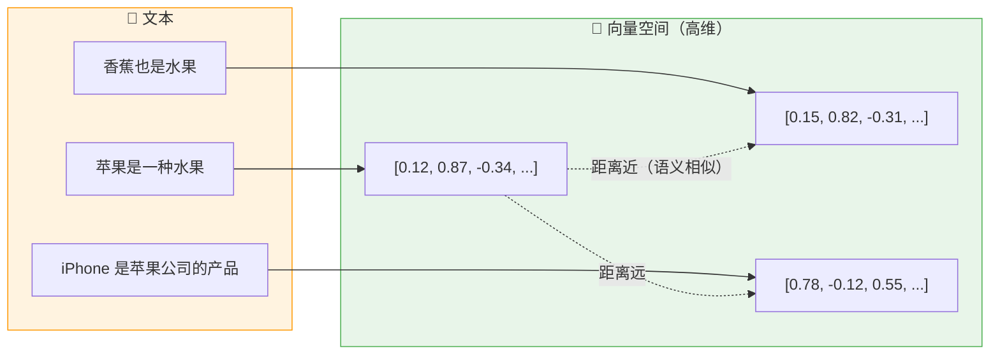
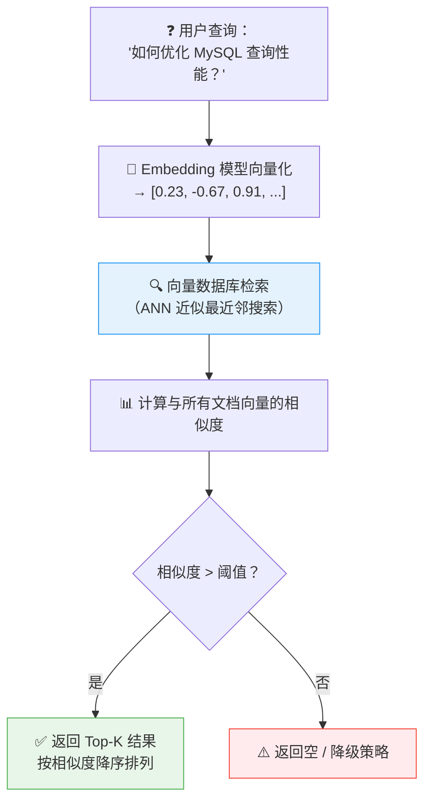
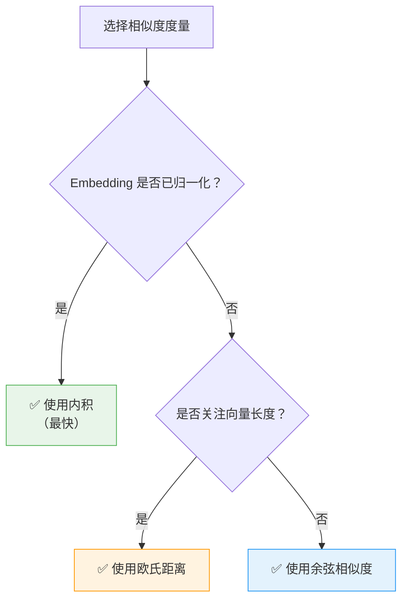
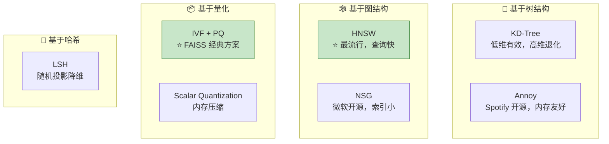
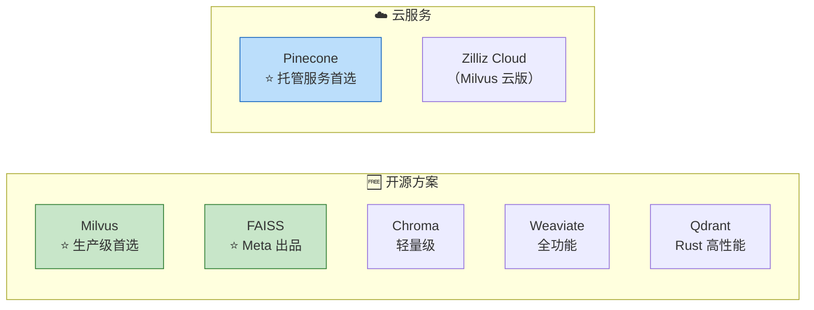
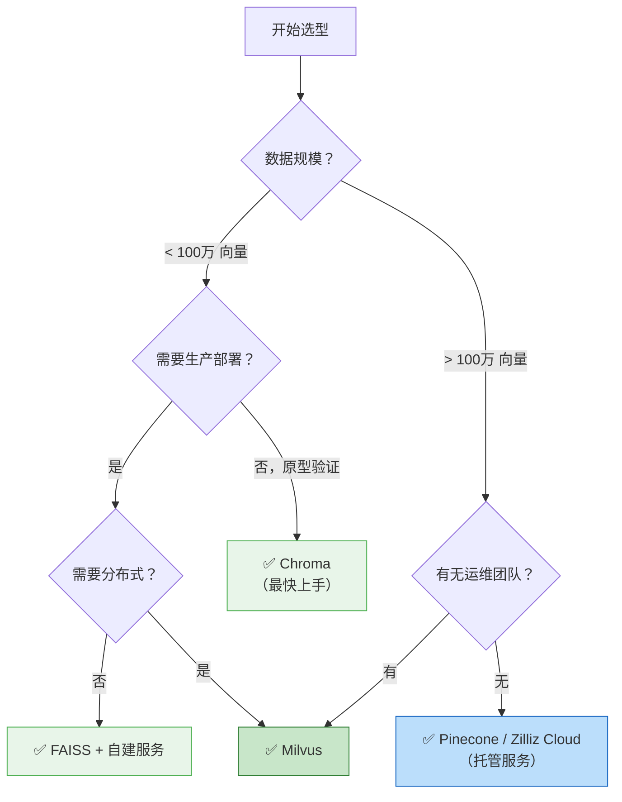

# 向量数据库详解

> **向量数据库（Vector Database）** 是一种专门用于存储、索引和检索高维向量数据的数据库系统。它是 RAG 架构中的核心基础设施，负责高效地找到与查询向量最相似的文档向量。

---

## 核心概念

### 什么是向量嵌入（Vector Embedding）？

将文本、图像、音频等非结构化数据通过嵌入模型（Embedding Model）映射为固定维度的浮点数向量，语义相近的内容在向量空间中距离也相近。

---

## 向量召回（Vector Recall）

### 召回流程

### ⭐ 召回质量评估指标

| 指标 | 公式 / 说明 | 含义 |
|------|------------|------|
| **Recall@K** | 前 K 个结果中包含相关文档的比例 | 召回的覆盖能力 |
| **MRR**（Mean Reciprocal Rank） | 第一个相关文档排名的倒数均值 | 首个相关结果的排名质量 |
| **NDCG**（Normalized DCG） | 考虑排序位置的归一化折损累计增益 | 排序质量的综合评估 |

---

## 相似度度量方法

### 1. 余弦相似度（Cosine Similarity）

最常用的向量相似度度量方式。

$$\text{cosine}(A, B) = \frac{A \cdot B}{\|A\| \times \|B\|} = \frac{\sum_{i=1}^{n} A_i B_i}{\sqrt{\sum_{i=1}^{n} A_i^2} \times \sqrt{\sum_{i=1}^{n} B_i^2}}$$

- **取值范围**：[-1, 1]，1 表示完全相同方向，0 表示正交，-1 表示完全相反
- ⭐ **优点**：对向量长度不敏感，只关心方向 —— 适合文本嵌入（归一化后等价于内积）
- ⭐ **注意**：当 Embedding 模型已做 L2 归一化时，余弦相似度退化为**内积**

### 2. 欧氏距离（Euclidean Distance）

$$d(A, B) = \sqrt{\sum_{i=1}^{n} (A_i - B_i)^2}$$

- 值越小表示越相似（与余弦相反）
- 对向量长度敏感

### 3. 内积（Dot Product / Inner Product）

$$A \cdot B = \sum_{i=1}^{n} A_i B_i$$

- 当向量已归一化时，内积 = 余弦相似度
- 计算效率最高

### ⭐ 相似度度量选择指南

---

## ANN 近似最近邻搜索

### 为什么需要 ANN？

暴力搜索（Brute Force）的时间复杂度为 **O(n * d)**，其中 n 为向量数量，d 为维度。当 n 达到百万级时，暴力搜索不可接受。

⭐ **ANN（Approximate Nearest Neighbor）** 通过牺牲少量精度换取数量级的性能提升。

### 主流 ANN 算法对比

| 算法 | 原理 | 查询速度 | 索引构建 | 内存占用 | 适用规模 |
|------|------|----------|----------|----------|----------|
| ⭐ **HNSW** | 分层可导航小世界图 | 极快 | 较慢 | 高 | 百万~亿级 |
| ⭐ **IVF+PQ** | 倒排索引 + 乘积量化 | 快 | 快 | 低 | 千万~十亿级 |
| **Annoy** | 随机投影树森林 | 较快 | 快 | 中 | 百万级 |
| **LSH** | 局部敏感哈希 | 中 | 快 | 中 | 百万级 |
| **暴力搜索** | 全量遍历 | 慢 | 无需 | 低 | 万级以下 |

---

## 常见向量数据库对比

### 详细对比表

| 特性 | ⭐ Milvus | ⭐ FAISS | Pinecone | Chroma |
|------|-----------|----------|----------|--------|
| **类型** | 开源向量数据库 | 开源向量检索库 | 云托管服务 | 开源向量数据库 |
| **开发者** | Zilliz | Meta | Pinecone | Chroma 团队 |
| **分布式** | ✅ 原生支持 | ❌ 需自行实现 | ✅ 全托管 | ❌ 单机 |
| **ANN 算法** | HNSW, IVF, DiskANN 等 | IVF+PQ, HNSW 等 | 专有算法 | HNSW |
| **混合检索** | ✅ 向量 + 标量过滤 | ❌ 仅向量 | ✅ 元数据过滤 | ✅ 元数据过滤 |
| **部署难度** | 中等 | ⭐ 低（Python 库） | ⭐ 极低（完全托管） | ⭐ 低 |
| **性能** | ⭐ 极高（十亿级） | ⭐ 极高 | 高（取决于套餐） | 中（百万级） |
| **社区生态** | 活跃，CNCF 项目 | 学术/工业界广泛使用 | 商业支持好 | 社区活跃 |
| **多模态** | ✅ | ✅（需自行组织） | ✅ | ✅ |
| **适用场景** | 生产级大规模应用 | 本地开发、研究 | 快速上线、零运维 | 原型验证、小项目 |

### ⭐ 选型建议

---

## 面试常见问题

### Q1：向量数据库和传统数据库有什么区别？

| 维度 | 向量数据库 | 传统数据库 |
|------|-----------|------------|
| 查询方式 | 相似度搜索（近似匹配） | 精确匹配 / 范围查询 |
| 索引结构 | ANN 索引（HNSW / IVF） | B-Tree / Hash / 倒排索引 |
| 数据类型 | 高维浮点向量 | 结构化标量数据 |
| 典型应用 | 语义搜索、推荐系统 | 事务处理、报表统计 |

### Q2：为什么需要专门用向量数据库，而不直接用 PostgreSQL 的 pgvector？

- pgvector 适合**中小规模**（百万级以下）场景，简单方便
- ⭐ 当数据量达到千万级以上时，专用向量数据库（Milvus 等）在性能、分布式能力上有显著优势
- pgvector 的 IVFFlat 索引在高维场景下性能下降明显

### Q3：向量的维度对检索有什么影响？

- **维度越高**：表达能力越强，但计算和存储成本指数增长（维度灾难）
- 常见嵌入维度：OpenAI ada-002（1536维）、BGE-large（1024维）
- ⭐ 并非维度越高越好，需要平衡精度和性能

### Q4：如何处理向量数据的更新和删除？

- ⭐ **增量更新**：大多数向量数据库支持实时插入和删除
- **批量重建**：当数据变更量较大时，重新构建索引效率更高
- **软删除 + 定期清理**：避免频繁的索引修改
- FAISS 不支持原地更新，需重新构建索引后整体替换

---

## 实战建议

::: info 实战清单
1. ✅ **原型阶段**：使用 Chroma 或 FAISS 快速验证，开发成本最低
2. ✅ **生产环境**：数据百万级以上优选 Milvus；无运维团队考虑 Pinecone 云服务
3. ✅ **索引选择**：HNSW 适合低延迟查询场景（推荐），IVF+PQ 适合内存受限场景
4. ✅ **维度控制**：768~1536 维是业界主流范围，不建议盲目追求高维度
5. ✅ **混合检索**：向量检索 + BM25 关键词检索 双路召回，用 RRF（Reciprocal Rank Fusion）融合排序
6. ✅ **性能监控**：关注 QPS、P99 延迟、召回率、索引构建时间等关键指标
7. ✅ **冷启动预案**：当向量库为空时需要有降级策略（如返回通用回答、引导用户补充知识库）
:::

## 参考资料

- [Milvus 官方文档](https://milvus.io/docs)
- [FAISS GitHub](https://github.com/facebookresearch/faiss)
- [Pinecone 官方文档](https://docs.pinecone.io)
- [Chroma 官方文档](https://docs.trychroma.com)