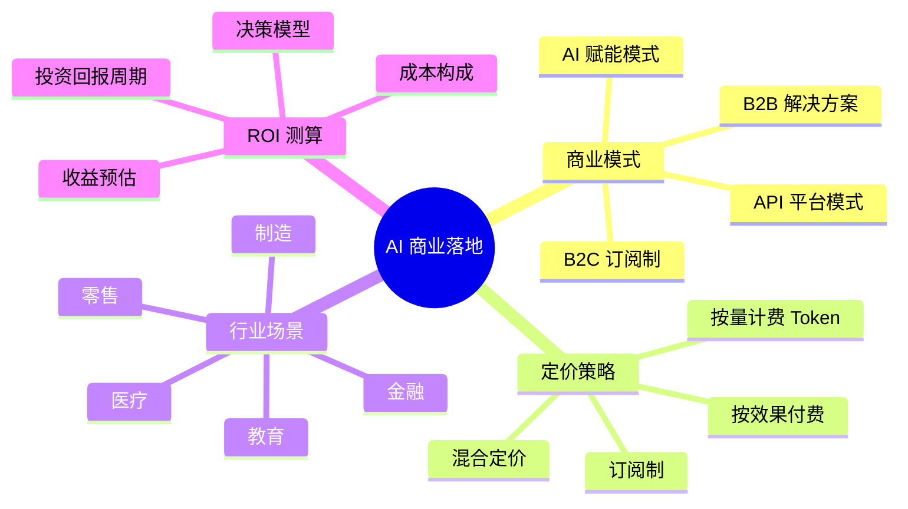

# AI 商业落地与策略

## 概述

AI 产品经理不是只做功能设计——你需要证明**AI 创造的价值能够覆盖它的成本**。本章从商业模式设计、定价策略、行业场景适配、ROI 测算四个维度，构建 AI 产品的商业落地能力。

::: tip 学习目标
掌握 AI 商业模式设计方法、定价策略、行业适配思路和 ROI 计算模型，能把技术方案转化为商业论证。
:::

---

## 一、知识图谱



---

## 二、AI 商业模式设计

### 2.1 四种主流 AI 商业模式

| 模式 | 核心逻辑 | 典型产品 | PM 需要关注的 |
|------|---------|---------|-------------|
| **B2B 解决方案** | 卖"AI 能力+定制化服务" | 企业级智能客服、工业质检 AI | 交付周期、客单价、续约率 |
| **B2C 订阅制** | 卖"AI 功能的使用权" | ChatGPT Plus、Midjourney Pro | 留存率、付费转化率、用户使用频率 |
| **API 平台模式** | 卖"AI 算力+模型调用" | OpenAI API、百度千帆 | Token 消耗量、开发者生态、迁移成本 |
| **AI 赋能** | AI 作为现有产品的增值功能 | Notion AI、飞书智能助手 | 功能使用率、对主产品留存的影响 |

### 2.2 商业模式画布实操

以"AI 法律合同审查"产品为例：

| 维度 | 内容 |
|------|------|
| **价值主张** | 5 分钟审完一份 50 页合同，识别 100+ 类风险条款 |
| **目标客户** | 中小律所（买不起高价人工审阅）、企业法务部门 |
| **收入模型** | 基础版 ¥99/月（50 份合同/月），专业版 ¥299/月（不限额） |
| **成本结构** | GPT-4o API 费用（约占营收 15%）+ 自研精调模型推理成本（约 5%）+ 团队人力 |
| **核心壁垒** | 行业精调数据集（积累的 10 万+ 条款标注）+ 律师审核网络 |

::: tip 关键问题
你必须问自己：如果 OpenAI 明天推出一个免费的合同审查功能，你的产品还能活吗？如果答案是"不能"——你需要构建的是**AI 能力之外的壁垒**（数据集、行业 Know-how、专家网络、集成深度），而不是裸依赖 API。
:::

---

## 三、定价策略

### 3.1 四种计费模式的适用场景

| 计费模式 | 典型应用 | 优势 | 劣势 |
|----------|---------|------|------|
| **按 Token / 用量** | OpenAI API、百度千帆 | 公平、与成本对齐 | 用户体验"按字收费"不友好 |
| **按效果付费** | 工业质检（检出一个瑕疵收费） | 用户只付"有效"的部分 | 效果定义容易扯皮 |
| **订阅制（固定月费）** | ChatGPT Plus、Jasper | 收入可预测、用户无感知成本 | 重度用户吃垮利润 |
| **混合制** | Azure AI（基础费 + 超量费） | 兼顾可预测性和公平性 | 定价结构复杂 |

### 3.2 定价中的常见错误

**错误一：按 API 成本直接加成定价**

如果你的 GPT-4o API 成本是 0.1 元/次，你不能直接定 0.3 元/次就完了。你还需要覆盖：Prompt 优化的人力成本、知识库维护成本、用户支持成本、获客成本。毛利率只算 API 成本是自欺欺人。

**错误二：忽视重度用户**

一个 B2C AI 产品，5% 的重度用户可能消耗了 40% 的 API 成本。定价时必须设置用量上限（如"每月最多 500 次"），或者对超量部分收高价。

**错误三：对标竞品而不算自己的账**

竞品定 99 元/月不代表你也能定 99 元/月。你要先算自己的成本结构——如果你的推理成本比竞品高 30%，定同样的价格就是赔钱。

---

## 四、行业场景适配

### 4.1 各行业 AI 应用成熟度

| 行业 | 成熟度 | 典型场景 | PM 切入建议 |
|------|--------|---------|------------|
| **金融** | 高 | 风控、反欺诈、智能投顾、文档审核 | 合规是硬门槛，不懂金融监管别做 |
| **医疗** | 中高 | 影像辅助诊断、病历质控、药物研发 | 需要医疗认证，周期长但有壁垒 |
| **零售/电商** | 高 | 智能推荐、AI 客服、供应链预测 | 竞争激烈，差异化在数据和算法 |
| **教育** | 中 | 个性化学习、智能批改、AI 陪练 | 政策风险大，需关注双减政策 |
| **制造** | 中低 | 质检、预测性维护、工艺优化 | 行业碎片化严重，难做标准化产品 |
| **法律** | 低 | 合同审查、案例检索、合规检查 | 专业门槛极高，产品需要律师深度参与 |

### 4.2 垂直行业的切入策略

**横向切入**：做一个通用的 AI 能力（如文档解析），然后卖给多个行业。优点是 TAM（可触达市场）大，缺点是每个行业的需求都有细微差异，通用方案"什么都能做但什么都不精"。

**纵向切入**：深耕一个行业（如医疗影像），做深做透。优点是壁垒高、客单价高，缺点是市场天花板低。

一般建议：**PM 前期用纵向切入建立壁垒，中期用横向扩张做大市场。**

---

## 五、ROI 测算

### 5.1 AI 产品 ROI 计算模型

```
AI 产品 ROI = (AI 带来的价值 - AI 的总成本) / AI 的总成本

AI 带来的价值 = 人工成本节约 + 效率提升带来的增收 + 体验提升带来的留存增收
AI 的总成本 = API/推理成本 + 数据标注成本 + 研发人力成本 + 运维成本
```

### 5.2 实战案例：客服 AI 的 ROI

> 某电商客服中心，日均 5000 通咨询，人工客服 50 人。

| 项目 | 金额 |
|------|------|
| **AI 替代率目标** | 40% 咨询由 AI 自动处理（2000 通/天） |
| **人工成本节约** | 20 个客服 × 年薪 10 万 = **200 万/年** |
| **API 成本** | 2000 通 × 365 天 × 0.03 元（含检索+Rerank+LLM）= **2.19 万/年** |
| **标注与运维** | 标注数据持续优化 + 运维监控 = **15 万/年** |
| **研发分摊** | 初期研发投入 50 万，按 3 年分摊 = **16.7 万/年** |
| **年净收益** | 200 - 2.19 - 15 - 16.7 = **166 万/年** |
| **ROI** | **980%** |

**这个案例的关键洞察**：AI 产品的 ROI 往往非常好看——因为 AI 成本（推理费用）远低于人工成本。但前提是**你真的能替代 40% 的咨询量**。如果 AI 的自动解决率只有 20%，ROI 就会从 980% 降到不到 300%——还是很好，但差距巨大。

---

## 六、面试追问合集

### Q1: 你如何向客户证明"AI 值得投入"？

::: details 答案

我不会一上来就讲技术多牛，而是用**对比法算经济账**：

第一步：帮客户框定明确的应用场景（"不是 AI 万能，而是 AI 在你的退货退款场景中能做哪些事"）。

第二步：算现状成本——"你的客服团队现在每月处理 3000 个退货申请，平均每个耗时 8 分钟，客服的人力成本是……"

第三步：算 AI 方案成本——"我们的 AI 能自动处理其中的 50%，每个处理成本是 0.05 元。另外 50% 复杂 case 还是人工处理。"

第四步：给出 ROI："投入 10 万研发 + 每月 2000 元推理成本，一年能省 50 万人工成本。"

这个方法的关键是：**不是讲 AI 多好，而是算清楚 AI 比现在省多少钱**。C-level 只关心数字，不关心模型结构。
:::

### Q2: 如果竞品在 AI 能力上比你强，你怎么竞争？

::: details 答案

AI 能力永远不是护城河——因为模型本身是公开的。GPT-4o 谁都能用。真正的护城河是：

1. **数据飞轮**：我用得越多，数据积累越多，模型效果越好，用户越多。ChatGPT 的最大壁垒不是模型，而是它拥有最多的用户对话数据。
2. **系统集成深度**：用 AI 不只是"接个 API"，还涉及到跟客户现有的 CRM/ERP/工单系统的深度打通。这种集成粘性比 AI 能力本身高得多。
3. **行业 Know-how**：我做的 AI 客服系统跟保险公司内部的理赔流程、合规要求深度绑定——竞品就算 AI 强，不懂保险也做不好。
4. **体验壁垒**：用户不关心你的模型 F1 是多少。他们关心的是"用起来顺不顺"。流程设计、交互细节、容错机制——这些东西比模型能力更难复制。
:::

---

## 六、主流 AI 产品定价横向拆解 ✨

### 6.1 定价模式对比

了解市场收费方式，是面试中"行业认知"的必考题：

| 产品 | 免费版 | 入门付费 | 专业/团队版 | 企业版 | 核心卖点 |
|------|--------|---------|------------|--------|---------|
| **ChatGPT** | GPT-4o mini（有限次数） | Plus $20/月（GPT-4o, 5x用量） | Pro $200/月（o1 pro, 无限） | Team $25/人, Enterprise 定制 | 最强通用能力 + 插件生态 |
| **Claude** | Sonnet（有限次数） | Pro $20/月（Opus + 5x用量） | Team $25/人 | Enterprise 定制 | 安全合规 + 长篇写作 |
| **Kimi（月之暗面）** | 免费（K2 模型） | - | - | API 按量 | 超长上下文（200万字） |
| **豆包（字节）** | 免费 | - | - | API 按量 | 字节生态集成 + 音色克隆 |
| **GitHub Copilot** | 免费（2000次补全/月） | Individual $10/月 | Business $19/人 | Enterprise $39/人 | 代码补全 + Chat + Agent |
| **Cursor** | Hobby 免费 | Pro $20/月（500次快速请求） | Business $40/人 | - | AI-first IDE + 多模型选择 |
| **Notion AI** | - | $10/月/人（附加） | - | 定制 | 嵌入笔记/文档的 AI 写作 |
| **Perplexity** | 免费（Pro Search 5次/天） | Pro $20/月（不限次 + Deep Research） | - | Enterprise 定制 | AI 搜索引擎 + 实时引用来源 |

### 6.2 从定价表提炼的通用规律

**规律一：定价锚点统一**

几乎所有 AI 产品都以 **$20/月** 作为标准付费门槛（ChatGPT Plus、Claude Pro、Cursor Pro、Perplexity Pro）。这不是巧合——这是 OpenAI 建立的市场价格锚点，其他厂商跟随。

**规律二：免费版到付费版的转化策略**

| 策略 | 代表产品 | 做法 |
|------|---------|------|
| **用量限制** | ChatGPT, Claude, Cursor, Perplexity | 免费版给"够用但不爽"的额度，让你尝到甜头后想要更多 |
| **功能阉割** | ChatGPT（GPT-4o mini vs GPT-4o）、Perplexity（普通搜索 vs Pro Search） | 免费版用次一档的模型/功能，让用户感知"Pro 好很多" |
| **体验降级** | Kimi, 豆包 | 免费版功能完整，但高峰期排队、响应慢——付费即优先 |

**规律三：企业版定价远高于消费版**

ChatGPT Enterprise 的价格是 Plus 的 3-5 倍（含 SSO/审计/数据不训练等能力）。AI 产品的 B2B 溢价空间远超 B2C，但需要额外的合规、安全、管理功能来支撑价格。

**规律四：API 定价是"按 Token"还是"按次"？**

- 按 Token：OpenAI、Claude、Kimi API——对用量敏感，开发者需要精确计算成本
- 按次/固定：Cursor（每月 500 次快速请求）、GitHub Copilot（不计 Token）——对用户友好但成本不可控

**选择建议**：初期用"按次/固定"模式降低用户心理负担；当用户量变大后逐步加入"按 Token/用量"模式以控制成本——ChatGPT 就是这么做的。

---

## 相关文档

- [AI PM 角色定位与三大方向](./role-overview)
- [实战案例：智能客服全流程](./case-study)
- [AI PM 面试高频题](./interview)