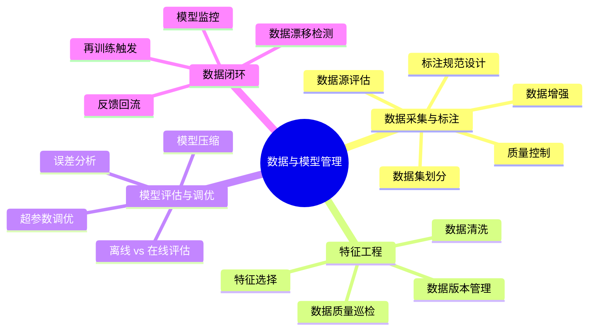
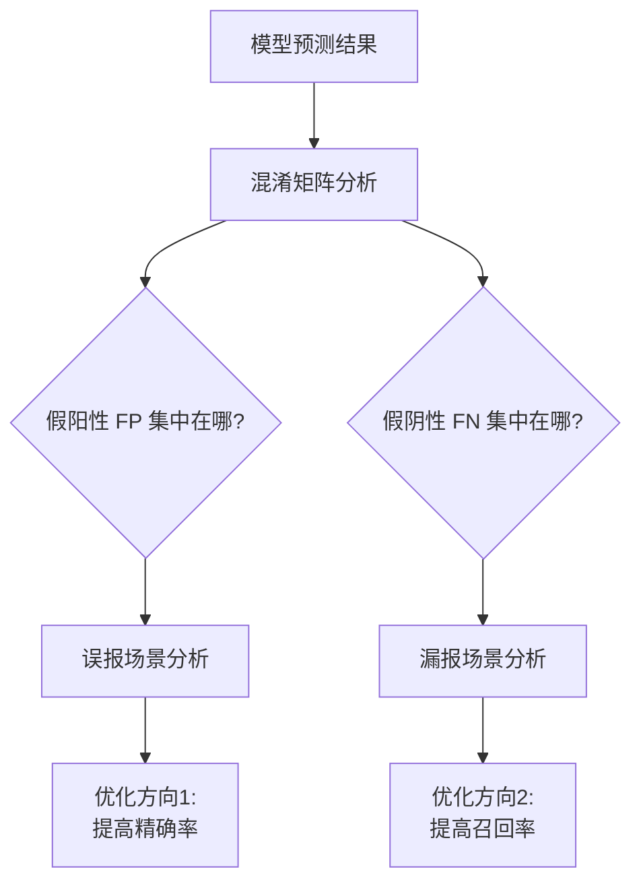

# 数据与模型管理

## 概述

数据是 AI 产品的燃料，模型是引擎。**AI 产品经理的核心增量价值之一，就是构建从数据到模型的完整闭环**。本章从数据采集标注、特征工程、模型评估调优、数据闭环四个维度，建立 PM 视角下的数据与模型管理能力。

::: tip 学习目标
理解数据标注规范设计、模型评估方法论、数据漂移监控机制，能主导 AI 产品的数据策略。
:::

---

## 一、知识图谱



---

## 二、数据采集与标注

### 2.1 数据是 AI 产品的第一大成本

在 AI 产品开发中，数据阶段的投入通常占总工作量的 **40%-50%**。这不是技术问题，而是产品管理问题。

| 数据来源 | 优点 | 缺点 | PM 注意事项 |
|----------|------|------|------------|
| **自有业务数据** | 免费、贴合场景 | 可能有偏差、质量参差 | 业务数据不等于训练数据——需要清洗和标注 |
| **公开数据集** | 低成本、可快速启动 | 与业务场景有 Gap | 适合 POC 阶段，不适合上线 |
| **采购数据** | 专业标注、质量可控 | 成本高（每条几毛到几块钱）、周期长 | 明确标注规范和验收标准是 PM 的活 |
| **用户交互数据** | 自动收集、持续增长 | 隐私合规、需要脱敏 | 设计产品时就要嵌入数据采集点 |

### 2.2 标注规范设计——AI PM 的核心交付物

::: warning 面试追问
**Q: 设计一份标注规范的思路是什么？请以"用户评价情感分析"为例。**

**A:** 标注规范不是"正/中/负"三个标签就完了。以下是完整的设计思路：

**一、定义标签体系**

- 正面：明确的好评或满意度表达。例："很好用"、"不错，推荐"
- 中性：客观描述或模糊表达。例："还行吧"、"用了三天了"
- 负面：明确的差评或不满表达。例："太难用了"、"质量不行"
- **重要**：混合评价归为哪一类？"物流快但质量差"——这个归"负面"（以最终满意度为准），并在规范里明确说明这个规则。

**二、定义边界 Case（这是最容易出问题的地方）**

| 文本 | 标注 | 原因 | 
|------|------|------|
| "还行吧" | 中性 | 无明显正/负倾向 |
| "还行吧，就那样" | 中性 | 同上 |
| "还行吧！强烈推荐！" | 正面 | "强烈推荐"是最强信号 |
| "质量还行，客服差" | 负面 | 以"客服差"为主要情绪 |
| 纯表情"😂" | 正面 | 上下文无负面语义 |
| 反讽"真棒，第三天就坏了" | 负面 | 这是反讽，实际意思是负面 |

**三、质量控制**

- 一致性检验：同一个样本让两个标注员分别标，计算 Kappa 系数。Kappa < 0.7 说明标注规范不够清晰或标注员理解不一致。
- 黄金集校准：准备 100 条已确认标注的"标准答案"样本，标注员入职前必须通过黄金集测试（准确率 > 95%）。

**四、标注成本估算**

这个需求如果外包给标注公司，每条大概 0.2-0.5 元。你需要 10000 条训练数据 + 2000 条测试数据，大概 3000-6000 元 + 两周周转。
:::

### 2.3 训练集/验证集/测试集划分

| 数据集 | 用途 | 典型比例 | PM 关注点 |
|--------|------|---------|----------|
| **训练集** | 用于训练模型参数 | 70% | 数据量是否足够？类别分布是否均衡？ |
| **验证集** | 训练过程中调超参数用 | 15% | 不能偷看验证集——会导致过拟合验证集 |
| **测试集** | 最终评估模型性能 | 15% | 测试集必须与训练集完全隔离，不能"污染" |

**常见错误**：训练集、验证集、测试集不是随机切分就完了。你需要确保三个集的数据分布一致——比如按时间切分（训练集用 Q1 数据，测试集用 Q2 数据），避免"用未来数据预测过去"。

---

## 三、模型评估与调优

### 3.1 误差分析——AI PM 最重要的分析能力

模型上线前的评估不只是看一个数值，而是深度分析"模型在什么地方做错了"。



**实战方法**：

1. 拉出 100 条 Bad Case（模型预测错误的样本）
2. 人工分类这些 Bad Case 的"错误原因"：是标注错误？是模型能力不足？还是输入数据有问题？
3. 统计各类原因的占比，优先解决占比最高的那类

### 3.2 模型升级决策——要不要换更大的模型？

| 场景 | 小模型（BERT/TinyLLM） | 大模型（GPT-4o） | 决策依据 |
|------|----------------------|-----------------|---------|
| 简单分类 | 85% 准确率，成本极低 | 92% 准确率，成本高 | 多 7 个点的提升值不值成本差异？ |
| 复杂推理 | 60% 准确率（基本不可用） | 88% 准确率 | 小模型压根不够用，必须上大模型 |
| 高并发（10000 QPS） | 轻松应对 | 成本爆炸 | 用大模型做标注/训练，用小模型上线推理 |

::: tip 实战原则
**大模型当老师，小模型当打工人。** 用 GPT-4o 生成高质量训练数据 + 做人评，用精调后的小模型上线服务。这是目前业界性价比最高的方案。
:::

---

## 四、数据闭环——AI 产品上线后的核心工作

### 4.1 数据漂移监控

数据漂移是 AI 产品"上线后死亡"的第一原因——模型在训练集上表现完美，上线后表现持续下降。

| 漂移类型 | 含义 | 检测方法 | 产品案例 |
|----------|------|---------|---------|
| **数据漂移 Data Drift** | 输入数据的统计分布变了 | PSI（Population Stability Index） | 用户搜索词分布变化（疫情期搜"口罩"暴增） |
| **概念漂移 Concept Drift** | 输入和输出的关系变了 | 在线上新数据上重新评估 | "快了"在快递场景以前是正面评价，现在可能是抱怨（和"明天就到"对比） |

**PM 的工作**：
1. 定义需要监控的特征（核心输入字段、预测置信度分布、各类别占比）
2. 设定告警阈值（PSI > 0.25 触发告警，PSI > 0.3 触发自动再训练）
3. 定期 review 监控报告（建议频率：周级）

### 4.2 再训练触发机制

| 触发方式 | 优点 | 缺点 | 适用场景 |
|----------|------|------|---------|
| **定时触发** | 可预测、可控 | 可能在不需要时浪费资源 | 稳定性要求高的场景（金融风控） |
| **数据量触发** | 不浪费 | 可能很久不触发 | 数据增长较慢的场景 |
| **性能触发** | 最精准 | 需要有完善的监控 | 高并发场景（推荐系统） |
| **事件触发** | 响应业务变化 | 需要人工判断 | 业务规则变更时 |

---

## 五、面试追问合集

### Q1: 标注数据不够怎么办？

::: details 答案

这是 AI PM 最常面对的现实问题——标注数据永远不够。应对策略从易到难：

1. **数据增强**：对现有样本做微调——文本分类可以做同义词替换、回译（中→英→中），CV 可以做旋转、裁剪、亮度调整。成本几乎为零，但效果有限，大约能提升 2-5% 准确率。

2. **主动学习**：让模型帮你找出"最不确定"的样本，优先标注那些——而不是随机标注。我们项目用了这个方法，标注效率提升了约 40%。

3. **Few-shot Learning + 大模型辅助标注**：用 GPT-4o 先自动标注一批数据，然后人审核修正——准确率虽然达不到纯人工标注的水平（GPT-4o 自动标注大概 85-90%，人工可以到 95%+），但速度和成本是人工的 1/10。对于快速验证阶段足够了。

4. **迁移学习**：在公开的大数据集上预训练，然后在你自己的小数据集上微调——这是 Deep Learning 时代最标准的做法。
:::

### Q2: 如何跟算法团队沟通模型效果不理想的问题？

::: details 答案

很多 PM 会犯的错误是直接说"这个模型不准"——算法工程师听了只会觉得"你说了等于没说"。

正确的沟通方式是用数据和案例说话：

❌ "模型太差了吧"
✅ "我跑了 100 条测试用例，发现模型在以下三类 case 上准确率偏低：1) 用户用缩写表达时（如'jd'→京东），准确率只有 65%；2) 用户输入有错别字时，准确率 70%；3) 中英文混输时，准确率 72%。这是具体的 Bad Case 列表，你看是不是数据层面的问题还是模型架构的问题？"

关键是要提供**可复现的 Bad Case + 量化的影响范围**。算法看到"3 类 Bad Case 影响了约 15% 的流量"，就知道优先度的方向了。
:::

### Q3: 上线后模型效果下降，怎么排查？

::: details 答案

标准排查流程：

1. **确认是不是真的下降**：噪音波动还是趋势性下降？看 2-4 周的监控趋势，别被单日波动吓到。

2. **看数据分布变化**（Data Drift）：拉一下线上数据和训练数据的特征分布对比。如果某些特征的分布偏移明显，就是数据漂移。

3. **看特定人群/场景**：是不是只在某些用户群体或时间段下降了？比如只在 Android 用户上降了——可能是某个端的数据格式有问题。

4. **回滚到上一个稳定版本**：先止血（如果影响业务指标的话），再慢慢排查。

5. **触发再训练**：如果确认是数据漂移，用最近的数据微调模型或者直接触发一次完整的再训练。

**最容易忽略的排查方向**：不是模型变了，是数据变了。业务规则改了、用户群体变了、营销活动导致了异常流量——这些是 PM 的知识域，算法不一定知道。
:::

---

## 五、LLM 时代的数据前沿话题 ✨

### 5.1 合成数据（Synthetic Data）

合成数据是用 AI 生成的数据代替/补充人工标注数据。2024-2025 年这已成为 AI 产品研发的标准实践。

**PM 需要知道的核心三点：**

**① 什么时候适合用合成数据？**

| 适合 | 不适合 |
|------|--------|
| 标注数据不够（可用 GPT-4o 自动标注 + 人工审核） | 需要精确领域知识（如医学诊断） |
| 多样化的用户表达方式生成（"退货"的 100 种说法） | 数据质量要求极高且不能被"机器思维"污染 |
| 快速冷启动（模型还没数据积累的阶段） | 模型的判断可能带有训练数据的偏见 |

**② 合成数据的工作流：**

```
Step 1: 用 GPT-4o 为 200 条种子数据自动生成标签
Step 2: 人工审核前 50-100 条，如果准确率 > 90% → 批量放行
Step 3: 对不准确的部分，细化标注规范 → 让 GPT-4o 重新生成
Step 4: 最终数据集 = GPT-4o 标注 + 人工修正 = 成本是纯人工的 1/5
```

**③ 合成数据的风险：**
- 模型自我循环——用 GPT-4o 标注的数据训练小模型，小模型的偏差来自 GPT-4o，受限于 GPT-4o 的上限
- "幻觉传染"——GPT-4o 如果在一类 Case 上系统性给错标签，后面的模型全学歪

**PM 对策**：合成数据必须保持一定比例（≥20%）的人工抽查验证。关键场景（医疗/金融/法律）的合成数据必须 100% 人工审核。

### 5.2 用户反馈数据——被低估的金矿

用户反馈数据有两种类型，AI PM 需要区别对待：

| 反馈类型 | 收集方式 | 数据价值 | PM 需要的 |
|----------|---------|---------|----------|
| **显式反馈** | 赞/踩按钮、打分、举报 | 明确但稀疏（< 5% 用户会点） | 每个"踩"都是一条 Bad Case，值得人工复查 |
| **隐式反馈** | 点击、停留时长、复制、分享、重复提问 | 丰富但噪声大 | 用户复制了 AI 回答 = 有用；用户 30 秒内重复问了类似问题 = AI 没解决 |

**一个实战洞察**：某 AI 客服项目发现，用户点赞率 85%，但隐式反馈数据（重复提问率）显示只有 68% 的问题被真正解决。**显式反馈是"礼貌性点赞"，隐式反馈才是"真实的满意度"**。AI PM 必须同时看两组数据。

### 5.3 数据版本管理简介

当项目涉及多轮迭代和团队协作时，数据版本管理变得必要。以下是 PM 级别的理解：

| 工具 | 定位 | PM 需要知道的 |
|------|------|-------------|
| **DVC** | 数据版本控制（类似 Git for Data） | 知道标注数据每次更新都有版本记录，可以回溯 |
| **LakeFS** | 数据湖版本管理 | 了解"分支"概念——在数据分支上做标注实验，满意后 merge 到主分支 |
| **Git LFS** | Git 的大文件扩展 | 用于管理 Prompt 模板和评测集的版本 |

**PM 不需要会用这些工具，但需要知道它们解决的问题**：标注数据 V1.0 和 V1.1 之间到底改了哪些样本？谁改的？为什么？能不能回滚？——如果回答不了这些问题，数据版本管理就是刚需。

---

## 相关文档

- [AI 技术基础](./tech-basics)
- [AI 产品设计](./product-design)
- [AI 评估体系](./evaluation)
- [实战案例：智能客服全流程](./case-study)
- [AI PM 面试高频题](./interview)