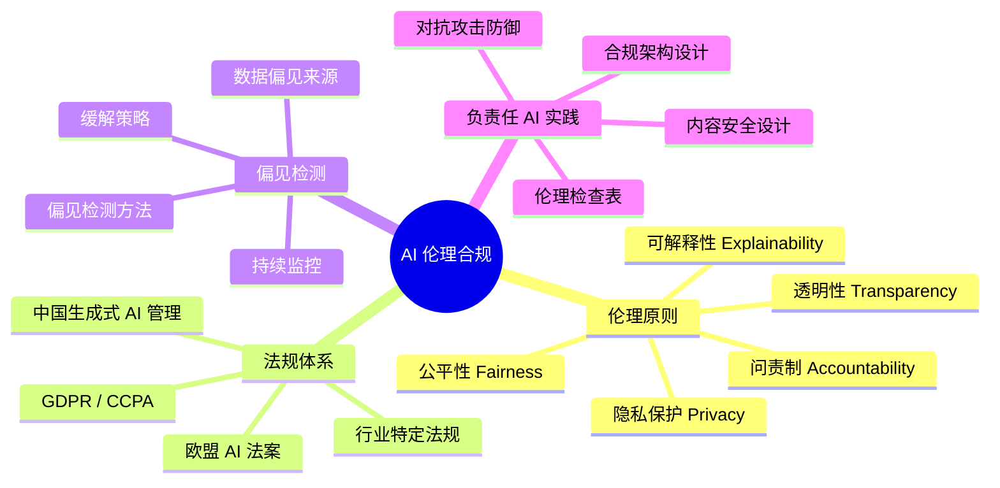

# AI 伦理合规与治理

## 概述

2025 年欧盟 AI 法案正式实施，中国《生成式人工智能服务管理暂行办法》持续收紧——**合规设计不再是"可选项"，而是产品能否上市的硬门槛**。本章从伦理原则、法规解读、偏见检测、负责任 AI 实践四个维度，建立 AI PM 的伦理合规能力。

::: tip 学习目标
理解核心 AI 伦理原则、掌握主要法规要求、了解偏见检测方法、能在产品设计阶段嵌入合规能力。
:::

---

## 一、知识图谱

---

## 二、五大 AI 伦理原则

### 2.1 原则概览

| 原则 | 核心问题 | PM 实践要点 |
|------|---------|------------|
| **公平性 Fairness** | AI 会不会对不同群体区别对待？ | 检查训练数据的人群分布是否均衡 |
| **透明性 Transparency** | 用户是否知道自己在跟 AI 互动？ | 明确标注"AI 生成内容"，不要假装是真人 |
| **可解释性 Explainability** | AI 为什么要做这个决策？能否解释？ | 提供"影响因子可视化"或简单的决策解释 |
| **隐私保护 Privacy** | 用户数据如何被使用？是否安全？ | 数据最小化、脱敏、差分隐私 |
| **问责制 Accountability** | 出了问题谁负责？ | 明确人机协作中的责任归属 |

### 2.2 公平性——最容易翻车的维度

::: warning 面试追问
**Q: 你发现模型的推荐结果对某个用户群体有明显偏差，怎么处理？**

**A:** 这是一个经典的公平性问题——AI 从历史数据中学到了人类社会已有的偏见。

我的处理流程：

**第一步：确认偏差来源**。是数据偏差（训练数据中某类用户样本太少），还是算法偏差（特征选择不当导致模型放大了差异）？数据偏差最常见——比如金融风控模型的历史数据中，某类人群因为历史原因被拒绝贷款的比例更高，模型学会了"这类人群风险高"——这是统计学上的"真实"，但不是伦理上的"公平"。

**第二步：修复方案**。数据层面：对少数群体过采样或数据增强。算法层面：引入公平性约束（如 Demographic Parity——不同群体的推荐结果分布应一致）。产品层面：对敏感特征做脱敏或降权处理。

**第三步：建立持续监控**。公平性不是一次修复就永久的——每次模型更新都要重新检查。我们建立了"人群维度指标看板"，按性别、年龄段、地域等维度分别看模型的指标表现。

**最关键的一点**：公平性问题不是纯技术问题。某些偏差可能是业务原因——比如某类产品确实更适合某个人群。PM 要能区分"合理差异"和"不公偏差"。这需要跟业务、法务、合规多方沟通，不是一个人拍脑袋决定的。
:::

---

## 三、核心法规解读

### 3.1 欧盟 AI 法案 (EU AI Act)

| 风险等级 | 定义 | 要求 | 产品案例 |
|----------|------|------|---------|
| **不可接受风险（禁止）** | 社会评分、实时生物识别监控 | 完全禁止 | 公共场所的人脸识别大规模监控 |
| **高风险** | 医疗、招聘、信贷、执法 | 严格合规要求：风险评估、人工监督、透明度 | AI 辅助诊断、AI 简历筛选 |
| **有限风险** | 聊天机器人、情感识别 | 透明度义务（告知用户你是 AI） | 客服 Bot、AI 面试辅助 |
| **低风险** | 推荐系统、垃圾过滤 | 基本无额外要求 | 电商推荐、垃圾邮件过滤 |

**PM 重点关注**：如果你的产品属于"高风险"，你必须：
- 建立风险管理体系（风险识别→评估→缓解→监控循环）
- 保留详细的技术文档（训练数据来源、模型评估报告、人工监督机制）
- 提供人工监督能力（用户可以申诉并让人类介入审核）

### 3.2 中国《生成式人工智能服务管理暂行办法》

核心要求：

| 要求 | 具体内容 | PM 行动项 |
|------|---------|----------|
| **内容安全** | 生成内容不得违反法律法规 | 设计内容过滤机制、敏感词库 |
| **真实性** | 采取有效措施提高生成内容的真实性和准确性 | RAG 架构、标注"AI 生成" |
| **数据合规** | 训练数据需合法来源，不侵犯知识产权 | 审核数据采购合同中的授权条款 |
| **用户权益** | 保护用户个人信息 | 数据脱敏、用户删除权 |
| **备案要求** | 具有舆论属性和社会动员能力的生成式 AI 服务需备案 | 产品上线前确认是否需要备案 |

**如果不做备案就上线会怎样？**——网信办约谈、下架产品、罚款。这不是吓唬人，2024 年有多家 AI 公司因为未备案或内容不合规被要求暂停服务。

---

## 四、偏见检测与缓解

### 4.1 数据偏见的常见来源

| 偏见类型 | 说明 | 案例 |
|----------|------|------|
| **选择偏见** | 数据采集方式导致样本不具代表性 | 只在城市用户中收集数据，忽略农村用户 |
| **历史偏见** | 历史数据中已经存在的歧视 | 招聘数据中女性高管比例低 |
| **标注偏见** | 标注员的个人偏见进入数据 | 标注"专业形象"时天然倾向于某种性别/年龄 |
| **度量偏见** | 选错了评估指标 | 用准确率评估医疗 AI（忽视假阴性漏诊的代价） |

### 4.2 偏见检测与缓解方法

| 阶段 | 方法 | 操作 |
|------|------|------|
| **数据阶段** | 数据分布检查 | 按人群维度（性别/年龄/地域）检查各类别样本量是否均衡 |
| **模型阶段** | 分组评估 | 将评估指标按人群维度拆开看——"整体 F1 90%，但女性用户只有 82%" |
| **产品阶段** | 偏见监控看板 | 上线后按人群维度持续监控模型表现差异 |

---

## 五、负责任 AI 实践

### 5.1 产品设计阶段的合规 Checklist

在产品设计阶段就应该嵌入合规检查：

- [ ] 你能清晰描述这个 AI 功能的决策逻辑吗？（可解释性）
- [ ] 如果 AI 犯错，最严重的后果是什么？（风险评估）
- [ ] 用户是否知道他们在跟 AI 交互？（透明性）
- [ ] 训练数据是否合法获取？（数据合规）
- [ ] 是否设置了人工审核或申诉通道？（用户权益）
- [ ] 不同人群使用这个功能的效果是否有差异？（公平性）
- [ ] 中国/欧盟/美国法规是否有特殊要求？（法规合规）

### 5.2 Prompt 注入与输出安全检查

除了 Prompt 注入攻击之外，AI PM 还需要防范：

| 攻击类型 | 说明 | 防御措施 |
|----------|------|---------|
| **Prompt 泄露** | 诱导模型输出 System Prompt | System Prompt 中嵌入拒绝指令 |
| **越狱 Jailbreak** | 绕过安全限制输出违规内容 | 输出侧过滤 + 关键词检测 |
| **数据投毒** | 恶意构造训练数据影响模型 | 数据来源审查 + 异常检测 |
| **模型逆向** | 通过大量查询推断训练数据 | 限流 + 查询审计日志 |

---

## 六、面试追问合集

### Q1: 你在产品设计阶段如何考虑合规？

::: details 答案

我不会等到产品开发完再找法务"打个合规的勾"。合规是设计的一部分，贯穿全流程：

**需求阶段**：判断产品属于哪一档风险等级。如果是"高风险"（涉及医疗/金融/招聘），从一开始就按欧盟 AI 法案的高风险要求来设计——而不是上线前才补合规文档。

**设计阶段**：
- 数据层面：确认训练数据来源合法，如果是用户数据需要用户同意（GDPR/个保法）
- 交互层面：标注"AI 生成"标签，不假装真人
- 权限层面：高风险操作必须有"人工确认"节点

**上线前**：输出合规自检报告，内容包括：模型评估结果、偏见检测结果、数据来源说明、用户权益说明。这不仅是给监管准备的——也是给自己留的记录。

**上线后**：建立内容安全监控（用户举报 + 自动检测）、定期做公平性复查（按人群维度看指标）。
:::

### Q2: 如果老板说"先把产品做出来，合规以后再说"，你怎么回应？

::: details 答案

我不会跟老板硬杠"不行"，因为我知道他关心的是速度。我会告诉他合规"不做"的实际代价：

1. **下架风险**——不是罚款一点小钱，而是直接让产品下架。2024 年已经有多家 AI 公司的 App 因为内容不合规被要求在应用商店下架。这意味着你花的所有研发成本归零。

2. **最小代价方案**——不是所有合规措施都要几个月。我们可以在两周内搞定最关键的几项：加"AI 生成"标签、加敏感词过滤、加用户举报入口。这三件事做完了就能兜住 80% 的合规风险。

3. **如果坚持不做**——我会坚持在产品里至少加一个"内容审核后发布"的开关，确保我们可以第一时间暂停服务。这是底线——你可以不完美，但不能失控。

关键是：**不给老板讲道理，给老板讲成本和风险。** 把"合规"翻译成"不下架"和"不被罚"，这是 C-level 能听懂的语言。
:::

---

## 相关文档

- [AI 产品设计](./product-design)
- [AI 商业落地与策略](./business-commercialization)
- [AI PM 面试高频题](./interview)